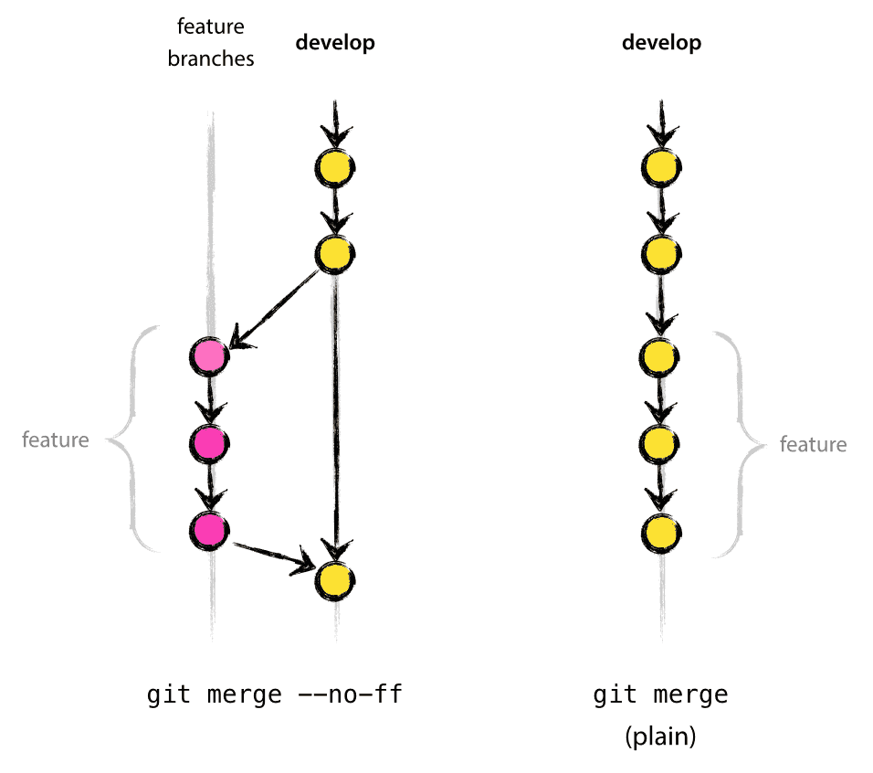
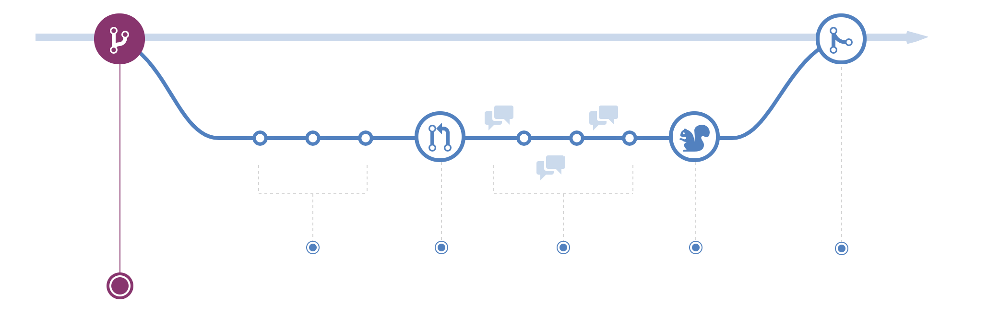

## 목차
- [git 브랜치 전략](#git-브랜치-전략)
  - [Git-flow](#git-flow)
    - [메인 브랜치(Main branch)](#메인-브랜치main-branch)
    - [보조 브랜치(Supporting branch)](#보조-브랜치supporting-branch)
  - [GitHub-flow](#github-flow)
  - [git-flow? github-flow?](#git-flow-github-flow)
  - [주절주절 깃 브랜치 전략](#주절주절-깃-브랜치-전략)
  - [참고 자료](#참고-자료)

# git 브랜치 전략

## Git-flow

Git-flow 전략은 위의 그림에서 볼 수 있듯이 5개의 브랜치가 존재한다.

- master 브랜치
- develop 브랜치
- feature 브랜치
- release 브랜치
- hotfix 브랜치

가장 중심이 되는 브랜치는 master와 develop 브랜치이며, merge된 feature, release, hotfix 브랜치는 삭제한다.

Git-flow 전략은 주기적으로 배포를 해야하는 프로젝트에는 적합하지만,
브랜치가 많아 복잡하고 어떤 프로젝트에 따라서는 몇몇 브랜치가 애매한 포지션을 가질 수 있다.

### 메인 브랜치(Main branch)

앞서 소개한 브랜치들 중 메인 브랜치에 속하는 브랜치는 __master__ 와 __develop__ 이다.

- master 브랜치
  - 배포 가능한 상태만을 관리하는 브랜치
  - 사용자가 직접 맞닿아 있기 때문에 매우 안정적인 버전이여야 한다.
- develop
  - 다음에 배포할 기능을 개발하는 브랜치
  - 주로 develop 브랜치를 기반으로 개발을 한다.

### 보조 브랜치(Supporting branch)

보조 브랜치에 속하는 브랜치는 __feature__, __release__, __hotfix__ 가 있다.

- feature 브랜치
- release 브랜치
- hotfix 브랜치

해당 브랜치는 main 브랜치와 다르게 제한된 수명을 가지고 있다. 따라서 해당 브랜치가 머지되면 삭제한다.

__feature 브랜치__

- 갈라져 나온 브랜치: develop
- 다시 merge 할 브랜치: develop

feature 브랜치는 기능을 개발하는 브랜치로 develop 브랜치로부터 분기한다.  
feature 브랜치는 해당 기능을 구현하면 develop에 merge하고 merge 되면 해당 브랜치는 삭제한다.

__release 브랜치__

- 갈라져 나온 브랜치:  develop
- 다시 merge할 브랜치: develop, master

develop 브랜치에 이번 버전에 포함되는 기능이 merge 되었다면 QA를 위해 develop 브랜치에서부터 release 브랜치를 생성한다.  
배포를 위한 최종적인 버그 수정 등의 개발을 수행한다.  
배포 가능한 상태가 되면 master 브랜치로 병합시키고, 출시된 master 브랜치에 버전 태그를 추가한다.  
release 브랜치에서 기능을 점검하며 발견한 버그 수정 사항은 __develop 브랜치에도 적용해 주어야함!__ 그러므로 배포 완료 후 develop 브랜치에 대해서도 merge 작업을 수행한다.

__hotfix 브랜치__

- 갈라져 나온 브랜치: master
- 다시 merge할 브랜치: develop, master

배포한 버전에서 __긴급하게__ 수정을 해야 할 필요가 있을 경우, master 브랜치에서 분기하는 브랜치  
버그를 잡는 사람이 일하는 동안에도 다른 사람들은 develop 브랜치에서 하던 일을 계속할 수 있다.  
이 때 만든 hotfix 브랜치에서의 변경 사항은 develop 브랜치에도 merge하여 문제가 되는 부분을 처리해 주어야한다.

 

## GitHub-flow

Git-flow가 Github에서 사용하기에 복잡하다고 나온 브랜치 전략이다. 이 브랜칭 전략은 수시로 배포가 일어나기 때문에, CI와 배포가 자동화되어있는 프로젝트에 유용하다.  
master 브랜치는 항상 배포가 되기 때문에 stable 해야하며 엄격한 role을 가지고 있다.

- 장점
  - 브랜치 전략이 단순하다.
  - Github 사이트에서 제공하는 기능을 모두 사용하여 작업을 진행한다.
  - 코드 리뷰를 자연스럽게 사용할 수 있다. (Pull Request 권장)
  - CI가 필수적이며, 배포는 자동으로 진행할 수 있다.
  - Github가 작업을 할 때 이렇게 작업하고 있다.
- 단점
  - CI와 배포 자동화가 되어있지 않은 시스템에서는 사람이 관련된 업무를 진행한다.

1. 브랜치 생성

- 새로운 기능을 위해 브랜치를 분기한다면, 해당 브랜치가 어떤 기능을 하는지 명확히 작성한다.
- git-flow와 다르게 feature나 develop 브랜치가 존재하지 않으므로 명확히 작성해 주어야 한다.

2. 커밋 추가

- 브랜치를 생성하고, 파일을 변경 및 추가, 삭제할 때마다 커밋을 작성한다.
- 해당 커밋들은 작업 기록으로 남길 수 있기 때문에, 커밋 메시지를 명확히 작성한다.
- git flow와 다르게 원격 브랜치로 항상 push 시켜 자신이 어떤 일을 하고 있는지 팀원들에게 확인할 수 있도록 한다.

3. Pull request 만들기

- 개발 프로세스 중 언제든디 pull request를 만들 수 있다.
- 기본 Git 리포지토리와 긴밀하게 통합되어 있으므로 요청을 수락하면 어떤 변경 사항이 병합되는지 누구나 정확히 볼 수 있다.
- pull request를 만들어 다른 팀원들에게 도움을 받거나, 아이디어를 공유하고, 팀원들에게 피드백을 요구할 수 있다.

4. 코드 토론 및 검토

- pull request가 열리면 해당 코드에 대해 질문이나 의견이 있을 수 있다.
- 커밋에 대한 토른과 피드백을 고려하여 해당 브랜치에 계속 푸쉬할 수 있다.

5. 배포 테스트

- 메인에 merge하기 전 최종 테스트를 위해 분기에서 배포하여 테스트를 진행한다.
- 만약 해당 브랜치에서 문제가 발생하면 다시 롤백을 진행한다.

6. 메인 merge

- 기능에 대한 모든 리뷰와 테스트가 끝난 후 master로 merge한다.
- master 브랜치는 stable 하고 엄격하게 관리되야하기 때문에 충분한 논의가 진행된 후 반영하도록 한다.
- master 브랜치는 CI/CD 자동화 배포를 통해 바로 배포가 될 수 있도록 설정해놓는다.

 

## git-flow? github-flow?

git-flow는 각 브랜치의 역할을 규정하기 때문에 계획적인 릴리즈를 스케줄링하는 대규모 프로젝트에 적합하다. 그렇기 때문에 일부 프로젝트에서는 불필요한 절차를 준수하도록하여, 오히려 생산성을 떨어뜨릴 수 있다.  
따라서 대규모가 아닌 가벼운 프로젝트라면 github-flow 전략을 취하는 것이 나아보인다!

 

## 주절주절 깃 브랜치 전략

주절주절의 깃 브랜치 전략에서는 git-flow 전략을 채택했다.  
조금 다른 점이 있다면, 프론트와 백엔드 두 가지의 기능을 구현하였기 때문에, feature 브랜치가 프론트와 백엔드 두 가지로 나눠져 있다는 점이다.  

또한 develop 브랜치를 깔끔하게 가져가기 위해 feature 브랜치를 develop 브랜치로 머지할 경우 squash merge를 사용하여 merge 하였다.

## 참고 자료
- https://nvie.com/posts/a-successful-git-branching-model/
- https://hellowoori.tistory.com/56
- https://guides.github.com/introduction/flow/
- https://www.notion.so/eaba3dd937f44842ac3949905c31afbe
