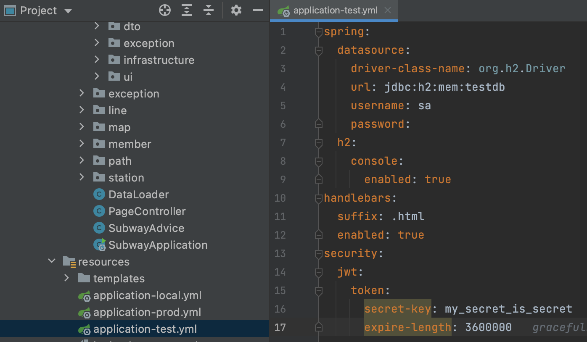
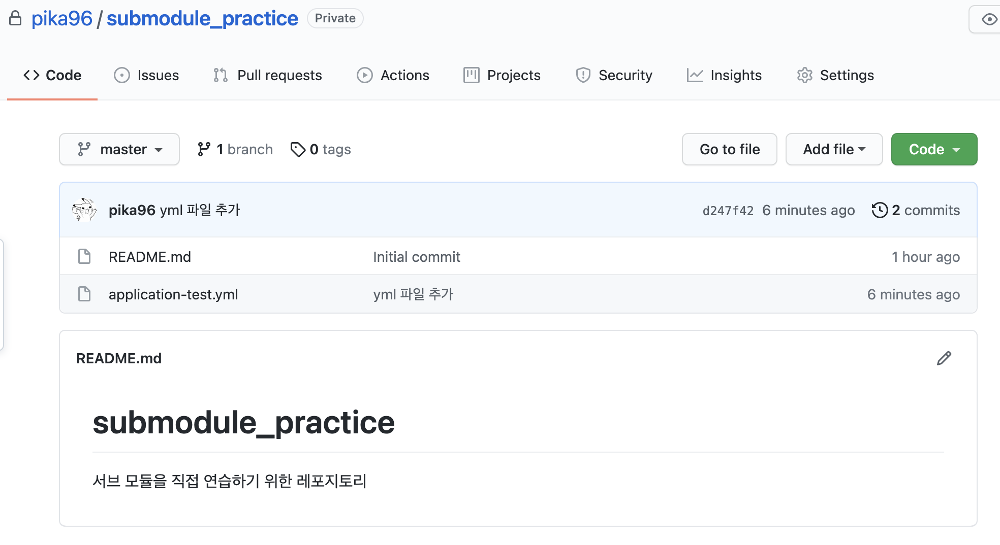
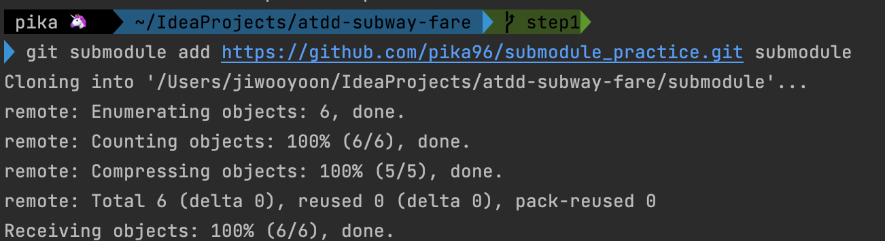
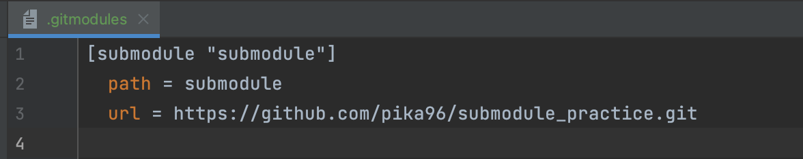
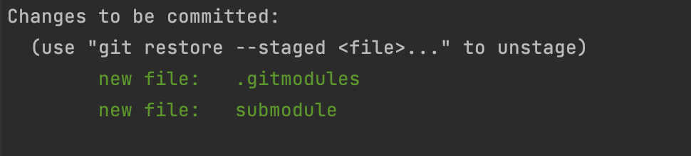
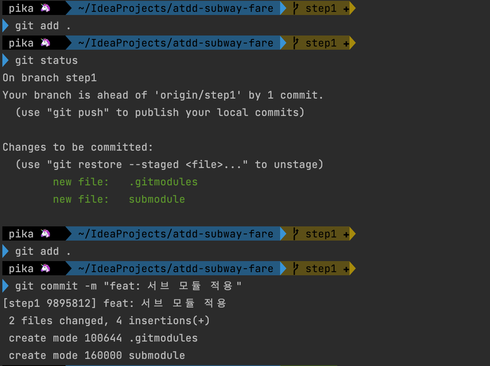
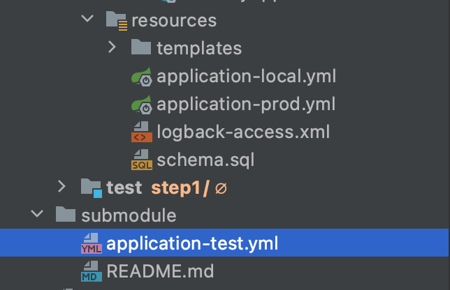
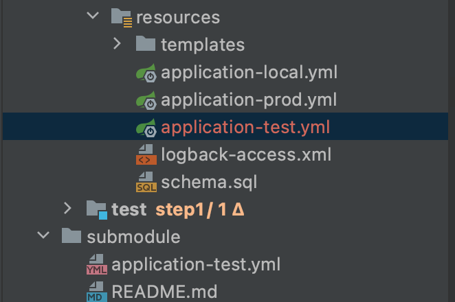
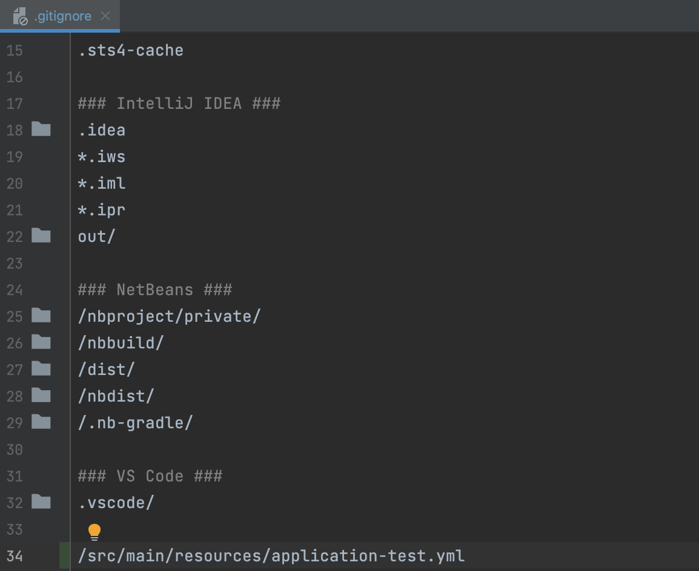

## 목차
- [서브 모듈](#서브-모듈)
  - [서브 모듈 실습](#서브-모듈-실습)
    - [목표](#목표)
    - [서브 모듈 적용기](#서브-모듈-적용기)
  - [서브 모듈 가져오기](#서브-모듈-가져오기)
  - [서브 모듈 수정](#서브-모듈-수정)
  - [참고 자료](#참고-자료)

# 서브 모듈
> 서브 모듈  
> Git 내부에서 다른 Git 저장소를 저장하는 방식

서브 모듈은 두 개의 프로젝트를 서로 별개로 다루면서도, 그 중 하나를 다른 하나 안에서 사용할 수 있도록 도와주는 방식이다. 외부 라이브러리나 다른 프로젝트를 내 레포지토리에 추가할 수 있다.  

이번 주절주절 팀에서는 외부로 노출하고 싶지 않은, DB 정보나 oauth 정보들을 private한 레포지토리에 관리하기 위해 서브모듈을 적용하였다.

주절주절 팀에서 다른 크루가 미리 적용했지만, 나 또한 기존 레포지토리에 새로운 레포지토리를 만들어 서브모듈을 실습해보겠다. 목표는 yml 파일을 private한 레포지토리에 옮겨 기존 레포지토리에서 가져올 수 있도록 하는 것이 목표이다.

## 서브 모듈 실습

### 목표



목표 : atdd-fare-subway에 test.yml 파일을 기존 레포에서 삭제하고 서브 모듈로 부터 가져와 설정해주는 것

### 서브 모듈 적용기

__서브 레포지토리 만들기__



서브 레포지토리를 만들고 master 브랜치의 루트 디렉토리에 test.yml 파일을 넣어준다.

__메인 프로젝트에 서브 모듈 추가__

```java
// -b main 생략 가능
// [디렉토리] 생략 가능
git submodule add -b main 서브_모듈_레포지토리.git [디렉토리]
```



메인 프로젝트에 해당 명령어를 입력하여 서브 모듈 프로젝트를 추가해준다.

__.gitmodules 파일__



위의 명령어 결과로 메인 프로젝트에는 .gitmodules 파일이 생기게 된다. 이 파일은 서브디렉토리와 하위 프로젝트 URL의 매핑 정보를 담은 설정파일이다.  

__하나의 커밋 단위인 서브모듈__



메인 프로젝트에서는 서브 모듈의 정보만 저장하고 서브 모듈이 가지고 있는 파일에 대해서는 커밋하지 않는다. 실제로 git status를 해보면 submodule 디렉토리가 통째로 커밋에 잡히는 것을 확인할 수 있다.



해당 파일들을 commit 해준다. 여기서 16000 이라는 의미는 이 디렉토리를 다른 디렉토리와 달리 특별하게 취급하겠다는 얘기다.

__yml파일 resource 추가__



현재 resources 디렉토리에 application-test.yml 파일이 없으므로 submodule 디렉토리에 있는 yml을 옮겨주어야 한다. 이는 gradle을 통해 옮겨주도록 하겠다.

__gradle 설정__

```java
processResources.dependsOn('copySecret')

task copySecret(type: Copy) {
	from 'submodule/application-test.yml' // submodule 디렉토리에 있는 test 설정파일을 복사한다.
	into 'src/main/resources'
}
```

gradle에 해당 명령어로 서브모듈에 있는 파일을 resource로 옮겨줄 수 있다. 여기서 processResources.dependsOn 명령어는 여타 태스크 실행 전에 미리 실행된다고 한다. (test를 하려면 미리 yml 설정 파일을 먼저 넣어줘야되니까 넣는게 맞지..!)



따라서 그 결과로 resource 폴더 내부에 application-test.yml 파일이 잘 들어가 있는 것을 확인할 수 있다.

__gitignore__

이번 서브 모듈의 목적은 private 레포지토리에 중요 설정 파일들을 넣어 감추는게 목적이다. 따라서 test파일을 메인 레포지토리에 그대로 커밋해버리면 의미가 없어진다. 따라서 .gitignore를 통해 해당 파일을 커밋하지 않도록 해야한다.



해당 파일을 gitignore에 넣어 커밋되지 않도록 한다.

완성!!


## 서브 모듈 가져오기

처음 메인 프로젝트를 가져올 때는 git submodule이 존재하지 않는다. .gitmodule 파일에 서브 모듈의 정보만 들어있을 뿐이다. 따라서 gitsubmodule을 가져와 줘야 한다.

```java
// 서브모듈 시작
git submodule init
// 이 과정에서 private repository의 경우 github ID, password를 물어볼 수 있다.

// clone submodules
git submodule update

// 모든 서브모듈에서 main(master)으로 checkout 한다
git submodule foreach git checkout main
```

## 서브 모듈 수정

서브 모듈은 그 자체로 하나의 git 프로젝트이기 때문에, 일반적인 git 사용법에 따라 관리할 수 있다. 그러나 메인 프로젝트에서 서브 모듈을 가져와 수정할 경우 주의점이 있다.  

메인 프로젝트에서 서브 모듈로 수정할 경우, 해당 서브모듈 디렉토리로 들어가 변경해야한다.  
여기서 중요한 점이 있는데, 서브 모듈 수정이 완료된 후 커밋 순서를
1. 서브 모듈
2. 메인 프로젝트

순서대로 해주어야한다.  

메인 프로젝트는 서브 모듈을 그대로 저장하는 게 아니라, 서브 모듈의 url, path, commit을 저장한다. 순서를 지키지 않을 경우 메인 프로젝트가 서브 모듈 프로젝트의 변경사항을 추적하기 어려워 의도치 않은 오류가 발생할 수 있다.


## 참고 자료
- https://git-scm.com/book/ko/v2/Git-%EB%8F%84%EA%B5%AC-%EC%84%9C%EB%B8%8C%EB%AA%A8%EB%93%88
- https://jujeol-jujeol.github.io/2021/07/12/git-submodule-%EC%A0%81%EC%9A%A9%ED%95%98%EA%B8%B0/
- https://pinedance.github.io/blog/2019/05/28/Git-Submodule