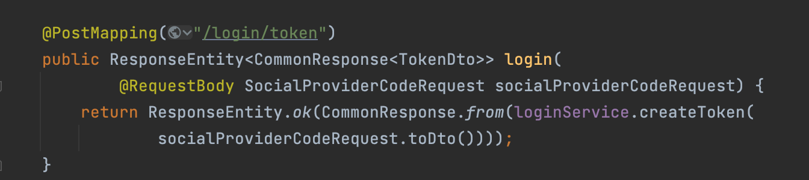
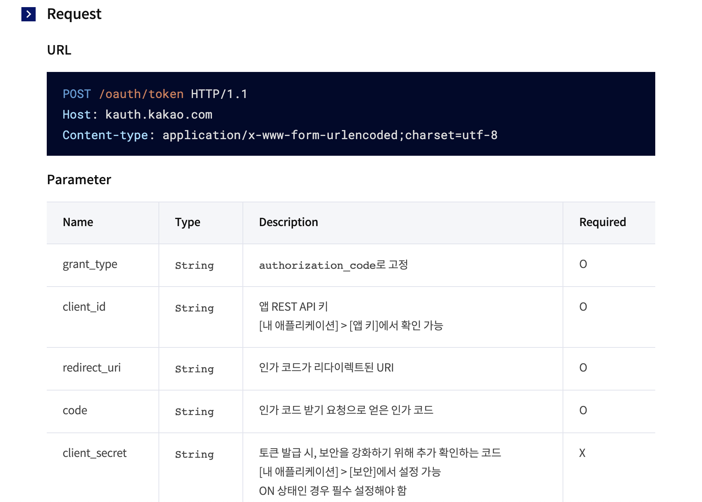
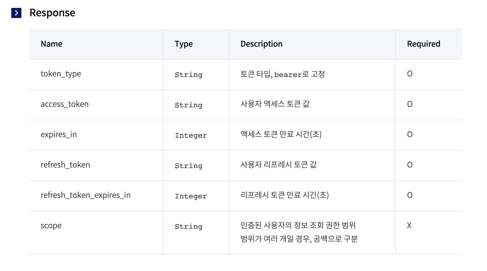
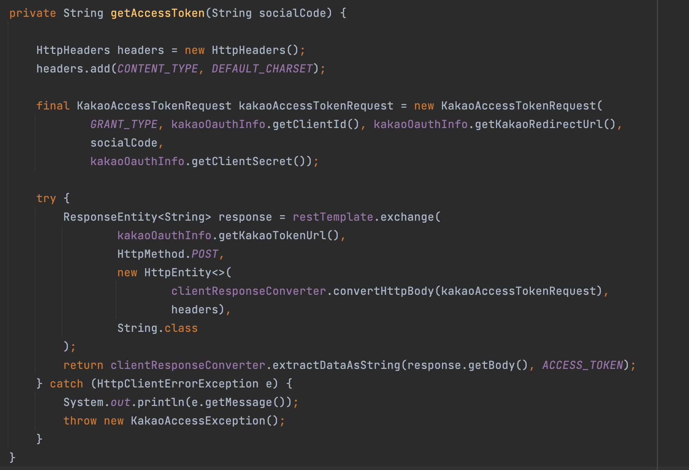

## 목차
- [소셜 로그인 인증 과정](#소셜-로그인-인증-과정)
  - [oauth 흐름도](#oauth-흐름도)
  - [카카오 디벨로퍼](#카카오-디벨로퍼)
  - [주절주절 oauth 적용 백엔드 코드](#주절주절-oauth-적용-백엔드-코드)
  - [추가 문서](#추가-문서)

# 소셜 로그인 인증 과정

## oauth 흐름도


1. 프론트가 깃허브에게 직접 로그인 요청을 한다. (ID와 비밀번호)
2. 깃허브는 프론트에게 code를 준다. (짧은 유효기간, 1회성)
3. 프론트는 이 code를 백엔드한테 준다.
4. 백엔드는 code를 다시 깃한테 줘서 토큰을 받는다. (해당 토큰으로 깃과 통신)
5. 백엔드는 받은 토큰을 이용하여 깃에게 필요한 정보를 받는다.
6. 백엔드는 깃에서 받은 정보(ID)를 이용하여 프론트와 통신할 accesstoken을 만든다.
7. accesstoken을 이용하여 백엔드와 프론트 사이의 요청을 처리한다.

## 카카오 디벨로퍼
- https://developers.kakao.com/docs/latest/ko/kakaologin/common

## 주절주절 oauth 적용 백엔드 코드



`3. 프론트는 이 code를 백엔드한테 준다.`   

프론트로 부터 code를 받는다. SocialProviderCodeRequest에는 플랫폼의 종류와 code가 들어있다.  

__카카오 토큰 받기 API__





__토큰 받기 코드__




`4. 백엔드는 code를 다시 깃한테 줘서 토큰을 받는다. (해당 토큰으로 깃과 통신)`  

카카오 디벨로퍼에서는 다양한 API를 제공한다. 그 중 토큰을 가져오는 API를 사용하여 토큰을 받았다.  

restTemplate를 이용하여 카카오 서버에 API 요청을 보내어 response를 받는다.  
우리가 필요한 것은 엑세스 토큰이므로 엑세스 토큰만 따로 추출하여 반환한다.

__토큰 만들기__

`6. 백엔드는 깃에서 받은 정보(ID)를 이용하여 프론트와 통신할 accesstoken을 만든다.`

```java
final String token = jwtTokenProvider.createToken(member.getId().toString());
```

주절주절에서는 accessToken으로 Member를 만들어 DB에 저장하고, 해당 Member ID로 jwtTokenProvider을 이용하여 token을 만들어준다.

__토큰 전달__

`7. accesstoken을 이용하여 백엔드와 프론트 사이의 요청을 처리한다.`


프론트에게 토큰을 전달해서 해당 토큰으로 백과 프론트간에 요청을 처리하면 된다!


## 추가 문서
- https://d2.naver.com/helloworld/24942
