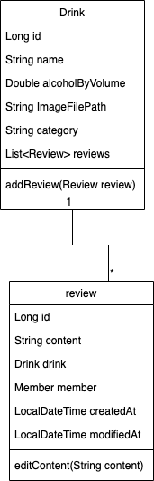
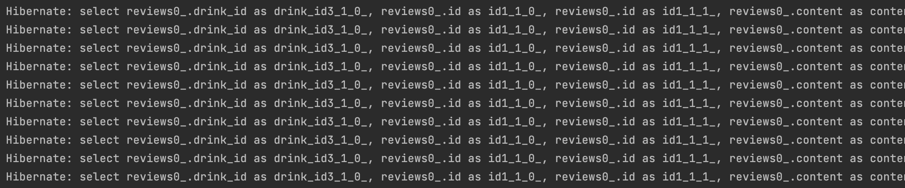
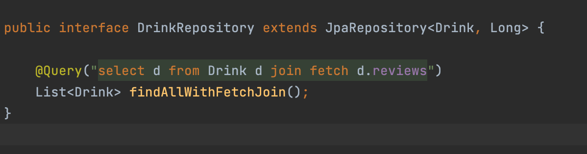
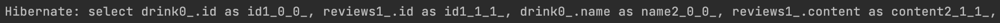
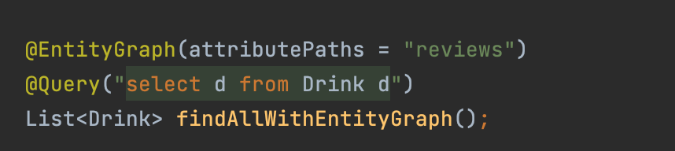
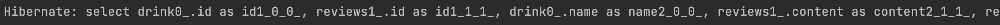
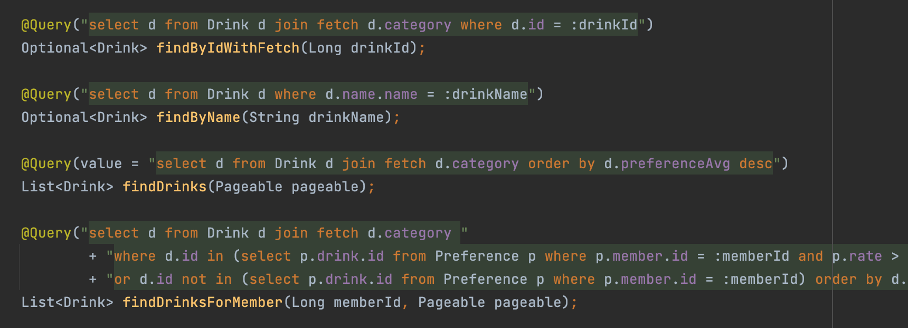
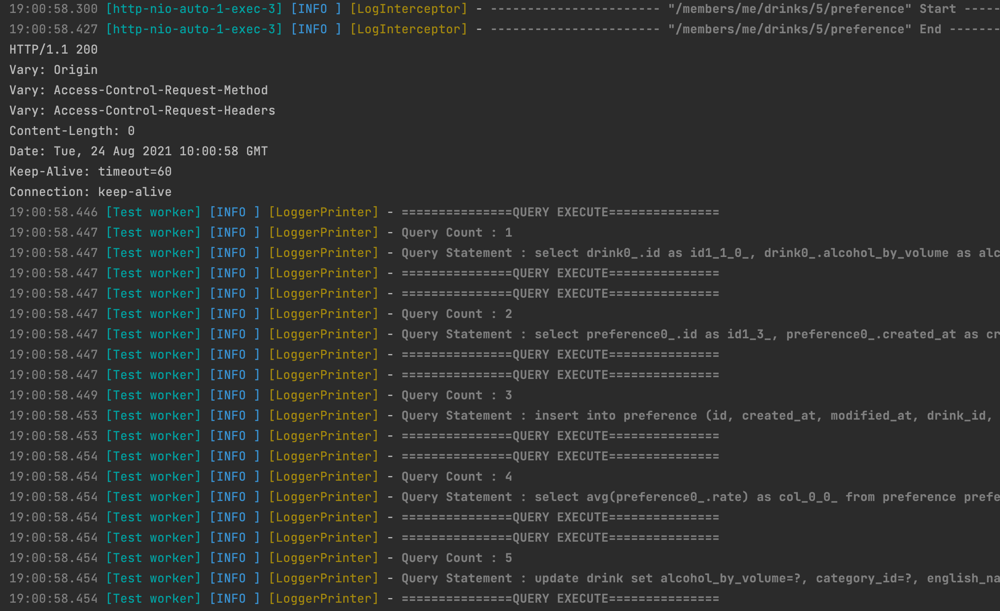

## 목차
- [JPA N+1](#jpa-n1)
  - [JPA N+1이란?](#jpa-n1이란)
  - [JPA N+1 해결 방안](#jpa-n1-해결-방안)
    - [Join fetch](#join-fetch)
    - [@EntityGraph](#entitygraph)
  - [주절주절 N+1 문제](#주절주절-n1-문제)
    - [Query Count](#query-count)
  - [참고 자료](#참고-자료)

# JPA N+1

이번에 주절주절 서비스를 배포하면서 갑작스레 서버가 다운되는 현상이 일어났다. 원인은 JPA를 사용하면서 말로만 듣던 N+1 문제가 발생하여 많은 쿼리들이 서버에 과부하를 주어 서버가 터져버린 것이였다. 이번 글에서는 JPA N+1에 대해 설명하고 해결한 방식에 대해 써보려고 한다.

## JPA N+1이란?

JPA N+1은 하위 엔티티들을 첫 쿼리 실행 시 한번에 가져오지 않고, Lazy Loading으로 필요한 곳에 사용되어 쿼리가 실행될 때 발생하는 문제이다.  



다음과 같이 Drink와 Review가 있다.

```java
// Drink Entity
@Entity
public class Drink {
    @Id
    @GeneratedValue(strategy = GenerationType.IDENTITY)
    private Long id;

    @Column
    private String name;

    @OneToMany(cascade = CascadeType.PERSIST, mappedBy = "drink")
    private List<Review> reviews = new ArrayList<>();

    public Drink() {
    }

    public Drink(String name) {
        this.name = name;
    }

    public void addReview(Review review) {
        this.reviews.add(review);
        review.updateDrink(this);
    }
}
```

```java
// Review Entity
@Entity
public class Review {

    @Id
    @GeneratedValue(strategy = GenerationType.IDENTITY)
    private Long id;

    @Column
    private String content;

    @ManyToOne(fetch = FetchType.LAZY)
    @JoinColumn(name = "drink_Id")
    private Drink drink;

    public Review() {
    }

    public Review (String content) {
        this.content = content;
    }
}
```

```java
// Jpa N+1 Test
    @Autowired
    DrinkRepository drinkRepository;
    @Autowired
    ReviewRepository reviewRepository;
    @Autowired
    EntityManager em;

    @DisplayName("Jpa N+1 Test")
    @Test
    void N1_Test() {

        List<Drink> drinks = new ArrayList<>();

        for (int i = 0; i < 10; i++) {
            Drink drink = new Drink("맥주" + i);

            Review review = new Review("맛있다!" + i);
            drink.addReview(review);
            drinks.add(drink);
        }

        drinkRepository.saveAll(drinks);

        em.flush();
        em.clear();

        List<Drink> all = drinkRepository.findAll();

        List<String> contents = all.stream()
                .map(Drink::getReviews)
                .map(reviews -> reviews.get(0).getContent())
                .collect(Collectors.toList());

        assertThat(contents).hasSize(10);
    }

```

테스트는 Drink들의 리뷰 내용을 가져오는 부분이 포함되어 있다.  

실제 쿼리를 보면 Drink를 불러오는 쿼리 하나, Drink 자신의 리뷰를 불러오는 쿼리 10개가 발생한 것을 확인할 수 있다.



이렇게 하위 엔티티들은 첫 쿼리 실행시 한번에 가져오지 않고, Lazy Loading으로 필요한 곳에서 사용될 때 쿼리가 실행된다. 첫 조회 (1) + 각 Drink의 리뷰 10번 조회(N) = 11 이기때문에 N+1 문제라고 한다.  
현재 데이터는 10개밖에 안되지만 만약 데이터가 10만개 100만개가 넘어가면 그 수는 기하급수적으로 많아져 DB에 부담을 주게 될 것이다.

<br>

## JPA N+1 해결 방안

방금처럼 N+1을 해결할 수 있는 방법은 두 가지 정도가 있다.
`Join fetch`와 `@EntityGraph`를 사용하는 방법이다.  

### Join fetch

첫 번째는 join fetch를 사용하여 하위 엔티티를 한번에 가져올 수 있다.



실제 테스트 코드의 쿼리를 보면 한 번에 가져온 것을 확인할 수 있다.



### @EntityGraph
두 번째 방법은 @EntityGraph를 사용하여 가져오는 방법이다.



다음과 같이 `@EntityGraph` 어노테이션을 이용하여 가져오고 싶은 필드명을 지정하면 Eager 조회로 가져오게 된다.

실제 쿼리를 보면 fetch join과 마찬가지로 쿼리가 한 번만 나가는 것을 확인할 수 있다.



다만 `fetch join`은 inner join을 `@EntityGraph`는 outer join을 사용한다.

<br>

## 주절주절 N+1 문제

주절주절에서 처음 개발 서버에 배포를 하여 기능들을 확인할 때, 서버가 갑자기 다운되는 현상이 발생하였다. 실제 log 파일을 확인한 결과 한 번 접속에 엄청나게 많은 쿼리가 나가는 것을 확인할 수 있었다. 따라서 우리 조는 리팩토링이 필요함을 느껴 fetch join으로 N+1 문제를 해결할 수 있었다.



실제로 DrinkRepository를 살펴보면, join fetch을 사용하여 N+1 문제를 해결한 것을 볼 수 있다.

### Query Count
주절주절 조에서는 API 마다 쿼리 수를 세기 위해 Test DataBase를 프록시를 사용하여 커스텀 하는 방식으로 Query Count를 구현하였다. 따라서 앞서 N+1과 같은 문제 또한 Query Count Test를 통해 쿼리의 수를 측정하여 성능을 높였다.

__Query Count__



예를 들어 선호도를 수정하는 쿼리는 쿼리가 5번 나가는 것을 확인할 수 있다.

## 참고 자료
- https://jojoldu.tistory.com/165
