## 목차
- [JPA 소개](#jpa-소개)
  - [SQL 중심적인 개발의 문제점](#sql-중심적인-개발의-문제점)
    - [객체와 관계형 데이터베이스의 차이](#객체와-관계형-데이터베이스의-차이)
  - [JPA 소개](#jpa-소개-1)
    - [ORM?](#orm)
    - [JPA 동작](#jpa-동작)
    - [JPA 표준 명세](#jpa-표준-명세)
    - [JPA를 왜 사용해야 하는가?](#jpa를-왜-사용해야-하는가)

# JPA 소개

## SQL 중심적인 개발의 문제점
- 객체 지향이라고 하지만 실제 코드를 보면 SQL 코드가 많음
  - CRUD ...
  - 자바 객체를 SQL로...
  - SQL을 자바 객체로...

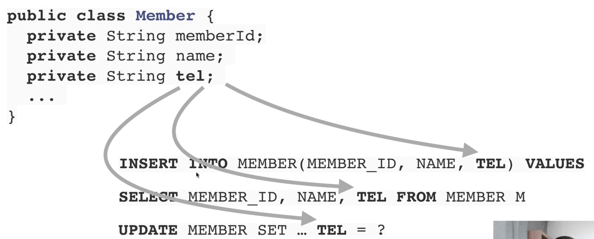
- 객체에 필드 추가 시 변경되어야 하는 부분이 너무 많음
  - __SQL에 의존적인__ 개발을 피하기 어렵다.
- 패러다임의 불일치
  - 객체 vs 관계형 데이터 베이스
  - 둘이 지향하는 부분이 너무 다르다!

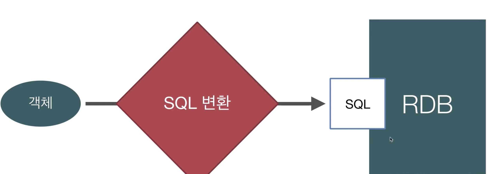

- 객체를 관계형 데이터베이스에 저장
  - 개발자가 SQL 매퍼일을 하고 있음

### 객체와 관계형 데이터베이스의 차이
- 상속
  - 객체는 상속 관계가 있지만, 관계형 DB에는 상속관계가 없다.
- 연관관계
  - 객체는 참조를 가지고 연관된 객체, 관계형 DB에는 PK, FK(외래 키)
  - 객체는 단방향으로 한쪽에서만 참조가 가능하지만, 테이블은 양방향으로 참조가 가능하다.
- 데이터 타입
- 데이터 식별 방법

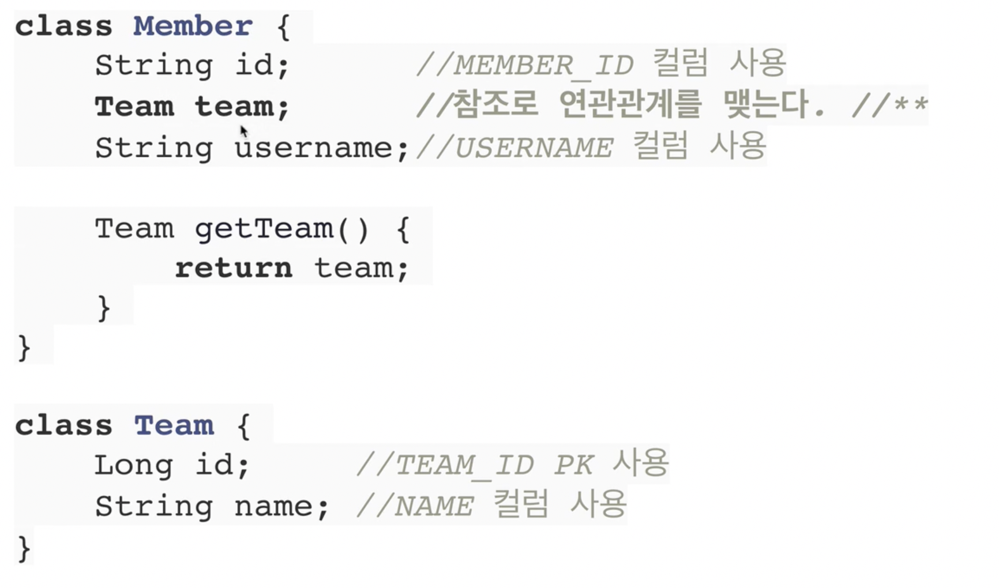

Member가 TeamId를 가지고 있는 것보다 Team 객체를 가지고 있는 것이 더욱 자연스러움

Member 객체가 Team 객체를 가지고 있을 시 save와 find

 

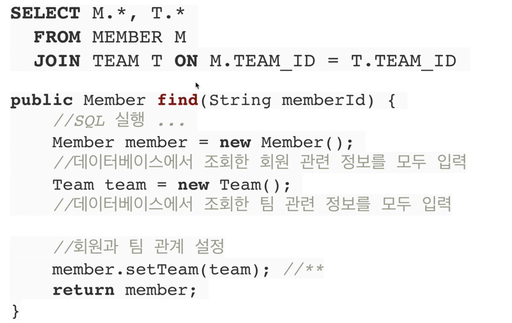

save 할 때 teamid를 가져와 insert into 해준다.  
find 할 때 member와 team을 만들어서 member.setTeam(team)을 하여 member를 리턴해준다.

 

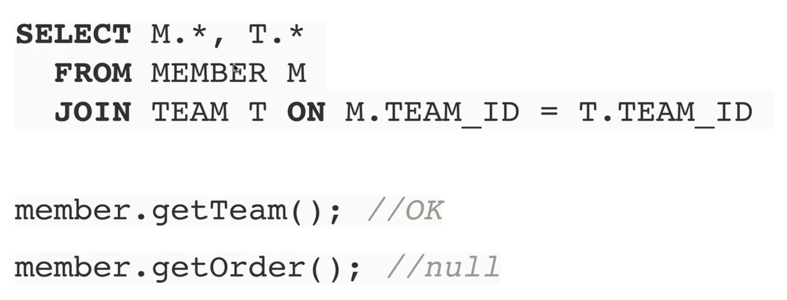

처음 실행하는 SQL에 따라 탐색 범위가 결정된다.  
member.getTeam()은 되지만, member.getOrder()은 불가

 

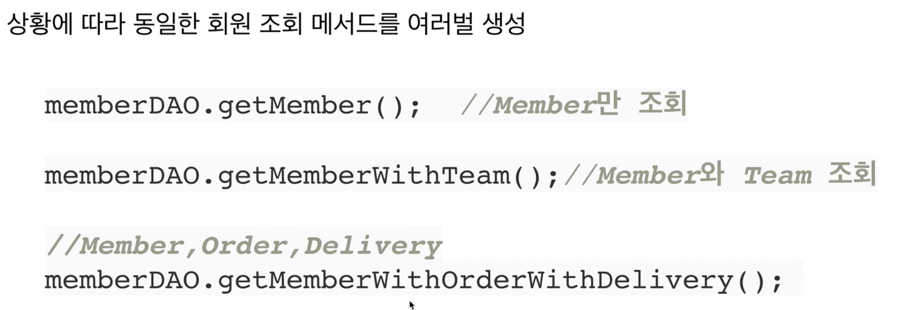

모든 객체를 미리 로딩할 수는 없다.

 

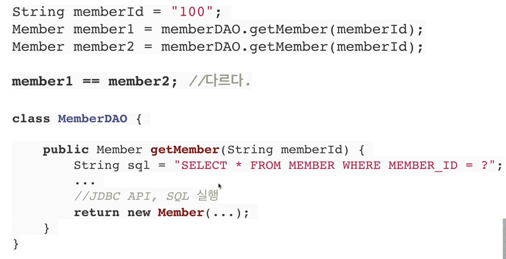
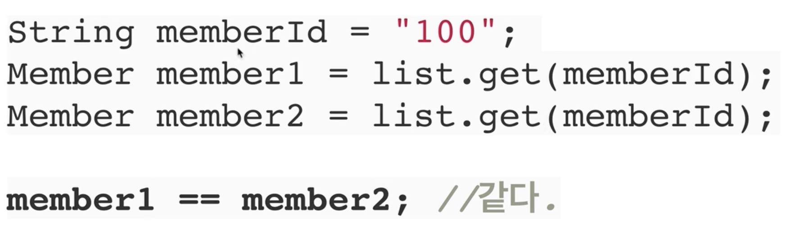

DAO에서는 두 번 쿼리를 날리기 때문에, 같은 Id 이라도 다르고, 자바 컬렉션에서는 같은 Id가 같은 곳을 참고하기 때문에 같다.

 

__객체답게 모델링을 할수록 매핑 작업만 늘어난다__  

__객체를 자바 컬렉션에 저장하듯이 DB에 저장할 수는 없을까???__

## JPA 소개
> JPA  
> JAVA Persistence API  
> 자바 진영의 ORM 기술 표준

### ORM?
- Object-relational mapping
- 객체는 객체대로 설계
- 관계형 데이터베이스는 관계형 데이터베이스대로 설계
- ORM 프레임워크가 중간에서 매핑
- 대중적인 언어에는 대부분 ORM 기술이 존재

### JPA 동작

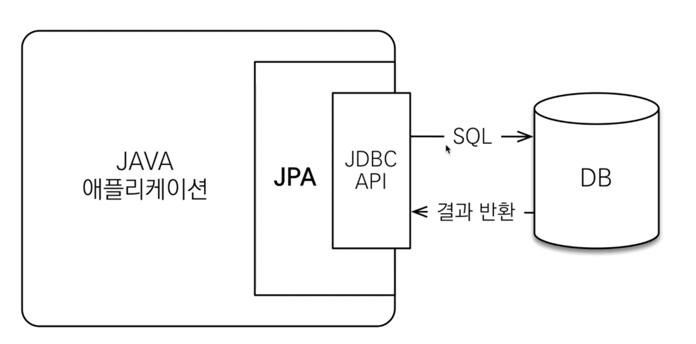

__JPA는 애플리케이션과 JDBC 사이에서 동작__

 

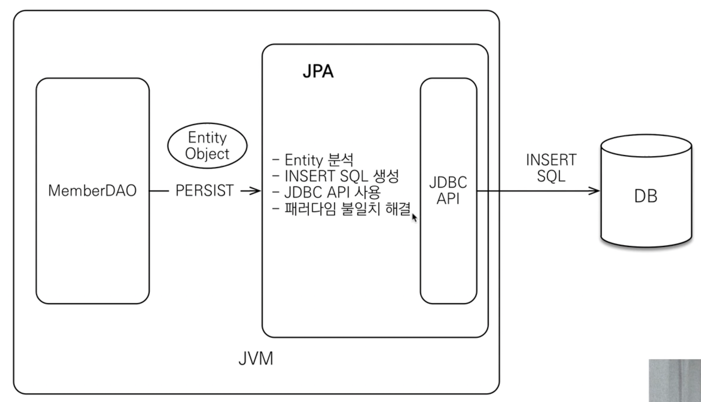

__JPA 동작 - 저장__
- JPA에게 멤버 객체를 보낸다.
- JPA가 적절한 SQL를 생성한다.
- DB에 보내고 결과를 받는다.
- __패러다임의 불일치를 해결한다__

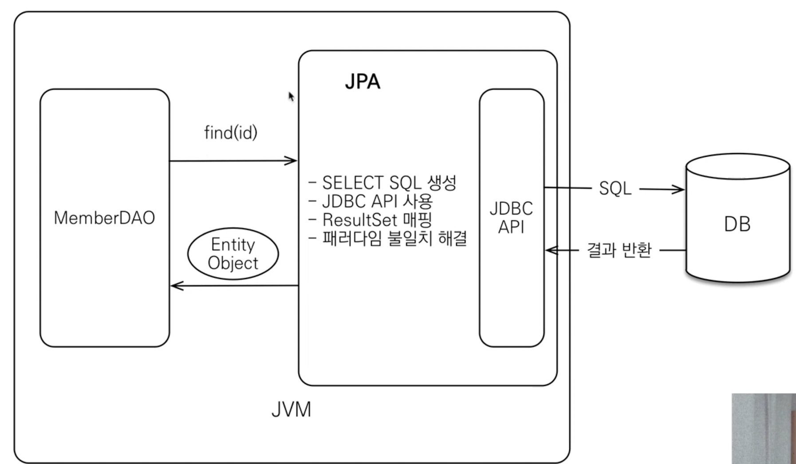

 

__JPA 동작 - 조회__
- SQL를 생성한다.
- 객체에게 매핑을 해준다.
- __패러다임의 불일치를 해결한다__

 

### JPA 표준 명세
- JPA는 인터페이스의 모음
- JPA 2.1 표준 명세를 구현한 3가지 구현체
- 하이버네이트, EclipseLink, DataNucleus

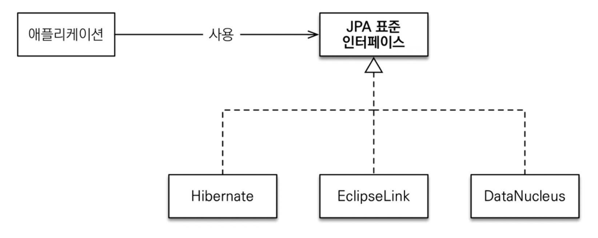

### JPA를 왜 사용해야 하는가?
- SQL 중심적인 개발에서 객체 중심으로 개발
- 생산성

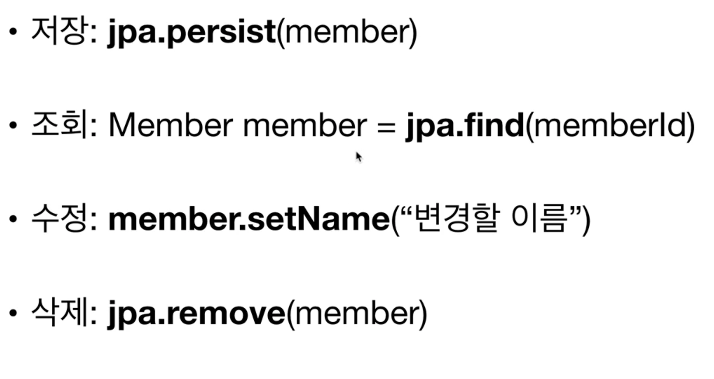
CRUD가 미리 만들어져 있다.

- 유지보수
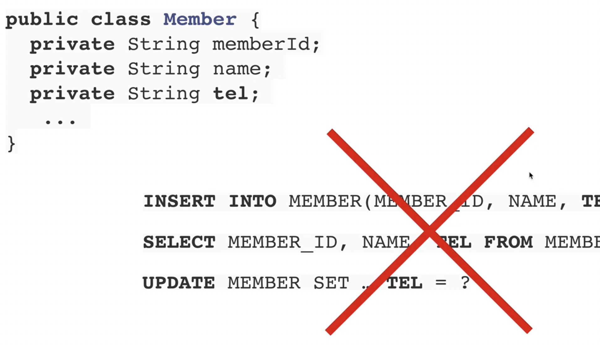

- 패러다임의 불일치 해결
  - JPA와 상속
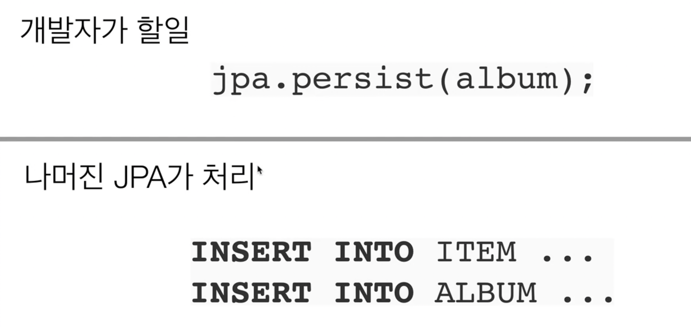
album을 DB에 넣게되면 부모인 ITEM과 자식인 ALBUM을 둘 다 쿼리를 날려 넣어준다.
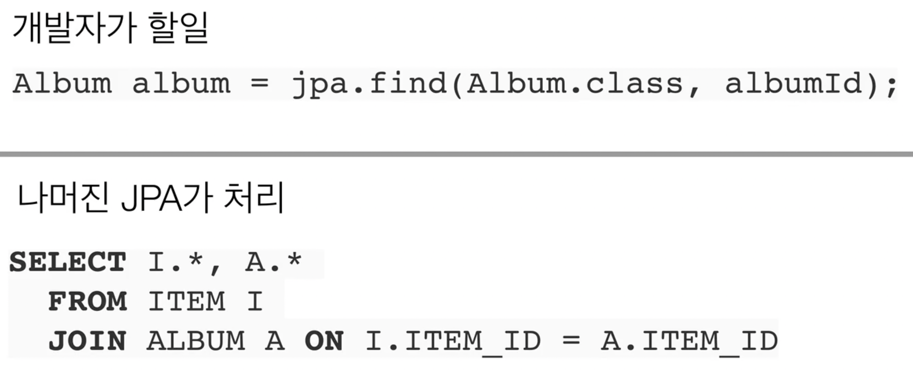
find도 마찬가지로 자동으로 JOIN해서 가져온다. 

  - JPA와 연관관계
  - JPA와 객체 그래프 탐색
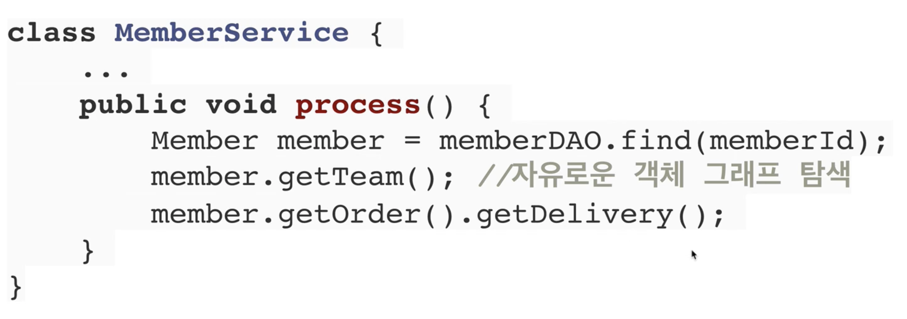
멤버 내부의 객체를 자유롭게 탐색할 수 있다(프록시 객체)
  - JPA와 비교하기
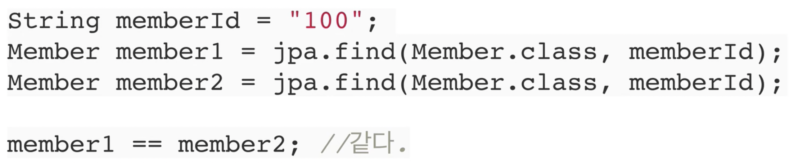
동일한 트랜잭션에서 조회한 엔티티는 같음을 보장
- 성능
  - 1차 캐시와 동일성 보장
    - 같은 트랜잭션 안에서는 같은 엔티티를 반환
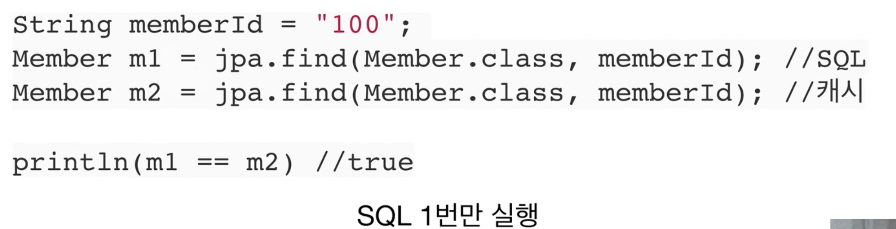
  - 트랜잭션을 지원하는 쓰기 지연
    - 트랜잭션을 커밋할 때까지 INSERT SQL을 모음
    - JDBC BATCH SQL 기능을 사용해서 한번에 SQL 전송
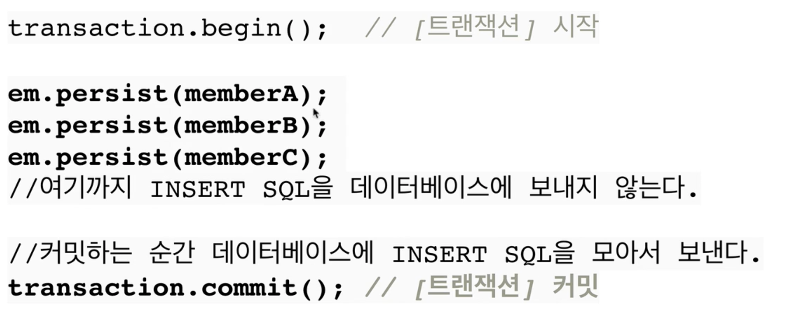
  - 지연 로딩
    - 지연 로딩 : 객체가 실제 사용될 때 로딩
    - 즉시 로딩 : JOIN SQL로 한번에 연관된 객체까지 미리 조회
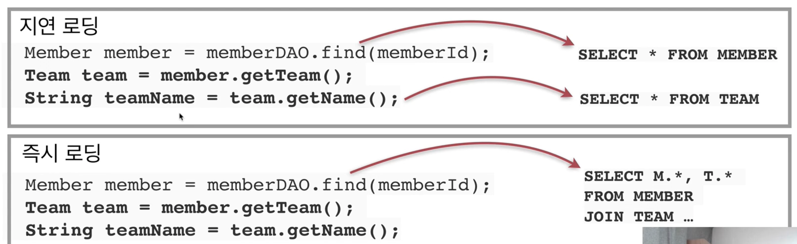
- 데이터 접근 추상화와 벤더 독립성
- 표준
