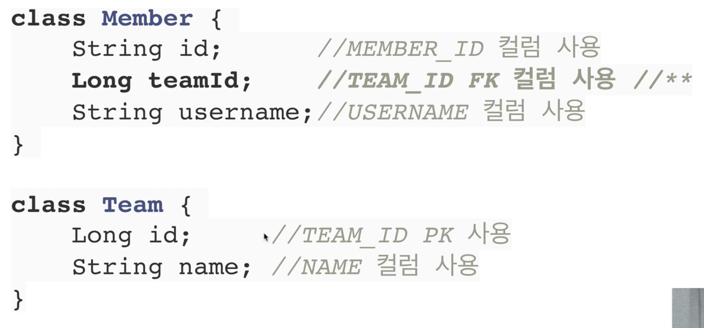
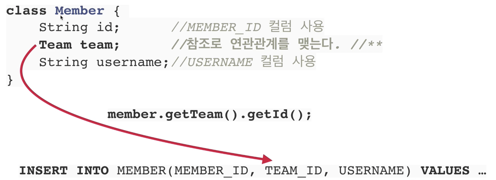

## 목차
- [JPA 소개](#jpa-소개)
  - [SQL 중심적인 개발의 문제점](#sql-중심적인-개발의-문제점)
    - [객체와 관계형 데이터베이스의 차이](#객체와-관계형-데이터베이스의-차이)
  - [JPA 소개](#jpa-소개-1)

# JPA 소개

## SQL 중심적인 개발의 문제점
- 객체 지향이라고 하지만 실제 코드를 보면 SQL 코드가 많음
  - CRUD ...
  - 자바 객체를 SQL로...
  - SQL을 자바 객체로...

- 객체에 필드 추가 시 변경되어야 하는 부분이 너무 많음
  - __SQL에 의존적인__ 개발을 피하기 어렵다.
- 패러다임의 불일치
  - 객체 vs 관계형 데이터 베이스
  - 둘이 지향하는 부분이 너무 다르다!

- 객체를 관계형 데이터베이스에 저장
  - 개발자가 SQL 매퍼일을 하고 있음

### 객체와 관계형 데이터베이스의 차이
- 상속
  - 객체는 상속 관계가 있지만, 관계형 DB에는 상속관계가 없다.
- 연관관계
  - 객체는 참조를 가지고 연관된 객체, 관계형 DB에는 PK, FK(외래 키)
  - 객체는 단방향으로 한쪽에서만 참조가 가능하지만, 테이블은 양방향으로 참조가 가능하다.
- 데이터 타입
- 데이터 식별 방법

Member가 TeamId를 가지고 있는 것보다 Team 객체를 가지고 있는 것이 더욱 자연스러움

Member 객체가 Team 객체를 가지고 있을 시 save와 find

save 할 때 teamid를 가져와 insert into 해준다.  
find 할 때 member와 team을 만들어서 member.setTeam(team)을 하여 member를 리턴해준다.

처음 실행하는 SQL에 따라 탐색 범위가 결정된다.  
member.getTeam()은 되지만, member.getOrder()은 불가

모든 객체를 미리 로딩할 수는 없다.

DAO에서는 두 번 쿼리를 날리기 때문에, 같은 Id 이라도 다르고, 자바 컬렉션에서는 같은 Id가 같은 곳을 참고하기 때문에 같다.

__객체답게 모델링을 할수록 매핑 작업만 늘어난다__  

__객체를 자바 컬렉션에 저장하듯이 DB에 저장할 수는 없을까???__

## JPA 소개
> JPA  
> JAVA Persistence API  
> 자바 진영의 ORM 기술 표준
