## 목차
- [값타입](#값타입)
  - [기본값 타입](#기본값-타입)
    - [JPA의 데이터 타입 분류](#jpa의-데이터-타입-분류)
    - [값 타입 분류](#값-타입-분류)
  - [임베디드 타입](#임베디드-타입)
    - [회원 엔티티](#회원-엔티티)
    - [임베디드 타입 사용법](#임베디드-타입-사용법)
    - [임베디드 타입 장점](#임베디드-타입-장점)
    - [임베디드 타입과 테이블 매핑](#임베디드-타입과-테이블-매핑)
    - [예제](#예제)
    - [임베디드 타입과 연관관계](#임베디드-타입과-연관관계)
    - [AttributeOverride: 속성 재정의](#attributeoverride-속성-재정의)
    - [임베디드 타입과 null](#임베디드-타입과-null)
  - [값 타입과 불변 객체](#값-타입과-불변-객체)
    - [값 타입 공유 참조](#값-타입-공유-참조)
    - [값 타입 복사](#값-타입-복사)
    - [객체 타입의 한계](#객체-타입의-한계)
    - [불변 객체](#불변-객체)
  - [값 타입의 비교](#값-타입의-비교)
  - [값 타입 컬렉션](#값-타입-컬렉션)
    - [값 타입 컬렉션 사용](#값-타입-컬렉션-사용)
    - [값 타입 컬렉션의 제약사항](#값-타입-컬렉션의-제약사항)
    - [값 타입 컬렉션 대안](#값-타입-컬렉션-대안)
    - [정리](#정리)

# 값타입

## 기본값 타입

### JPA의 데이터 타입 분류
- 엔티티 타입
  - `@Entity`로 정의하는 객체
  - 데이터가 변해도 식별자로 지속해서 추적 가능
  - 예) 회원 엔티티의 키나 나이 값을 변경해도 식별자로 인식 가능
- 값 타입
  - int, Integer, String처럼 단순히 값으로 사용하는 자바 기본 타입이나 객체
  - 식별자가 없고 값만 있으므로 변경시 추적 불가
  - 예) 숫자 100을 200으로 변경하면 완전히 다른 값으로 대체

### 값 타입 분류
- 기본 값타입
  - 자바 기본 타입(int, double)
  - 래퍼 클래스(Integer, Long)
  - String
- 임베디드 타입(embedded type, 복합 값 타입)
- 컬렉션 값 타입(collection value type)

__기본 값 타입__
- 예) String name, int age
- 생명주기를 엔티티에 의존
  - 예) 회원을 삭제하면 이름, 나이 필드도 함께 삭제
- 값 타입은 공유하면 X
  - 예) 회원 이름 변경시 다른 회원의 이름도 함께 변경되면 안됨

> 참고  
> 자바의 기본타입은 절대 공유 X
> - int, double 같은 기본 타입은 절대 공유 X
> 기본 타입은 항상 값을 복사함
> Integer 같은 래퍼 클래스나 String 같은 특수한 클래스는 공유 가능한 객체이지만 변경 X

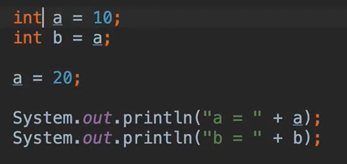

 

## 임베디드 타입
- 새로운 값 타입을 직접 정의할 수 있음
- JPA는 임베디드 타입이라 함
- 주로 기본 값 타입을 모아서 만들어서 복합 값 타입이라고도 함
- int, String과 같은 값 타입

### 회원 엔티티

- 회원 엔티티는 이름, 근무 시작일, 근무 종료일, 주소 도시, 주소 번지, 주소 우편번호를 가진다.

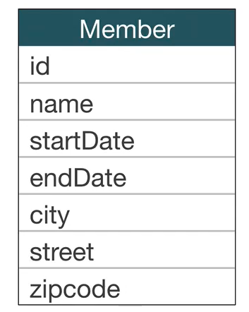

- 회원 엔티티는 이름, 근무 기간, 집 주소를 가진다.

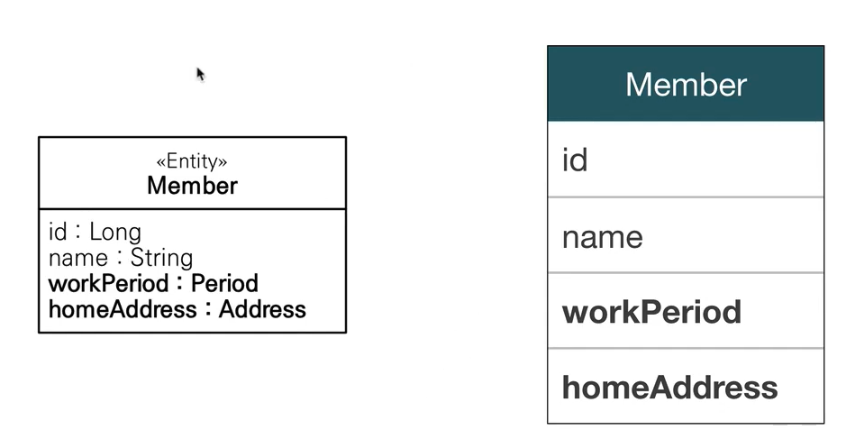

__여러 정보가 하나의 객체로 묶여있음__

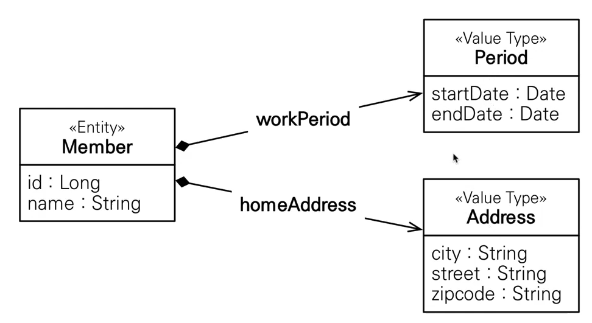

### 임베디드 타입 사용법
- `@Embeddable`: 값 타입을 정의하는 곳에 표시
- `@Embedded`: 값 타입을 사용하는 곳에 표시
- 기본 생성자 필수

### 임베디드 타입 장점
- 재사용
- 높은 응집도
- Period.isWork()처럼 해당 값 타입만 사용하는 의미 있는 메소드를 만들 수 있음
- 임베디드 타입을 포함한 모든 값 타입은, 값 타입을 소유한 엔티티에 생명주기를 의존함

### 임베디드 타입과 테이블 매핑

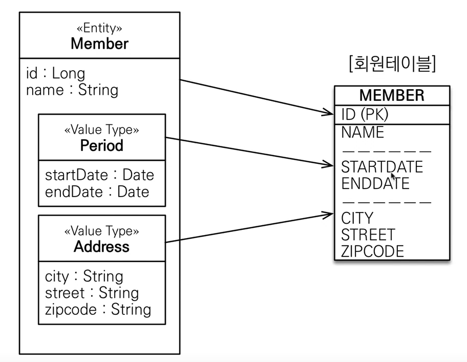

테이블은 기존과 똑같다. 객체를 매핑시킨다.

- 임베디드 타입은 엔티티의 값일 뿐이다.
- 임베디드 타입을 사용하기 전과 후에 매핑하는 테이블은 같다.
- 객체와 테이블을 아주 세밀하게 매핑하는 것이 가능
- 잘 설계한 ORM 애플리케이션은 매핑한 테이블의 수보다 클래스의 수가 더 많음

### 예제

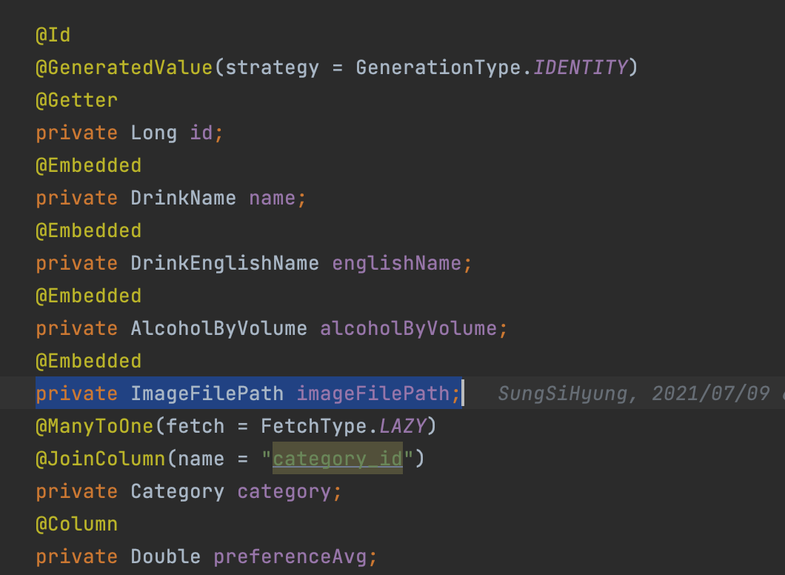

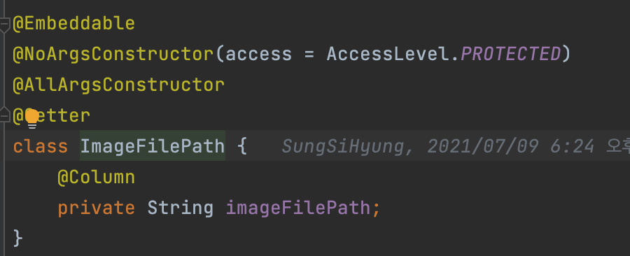

### 임베디드 타입과 연관관계

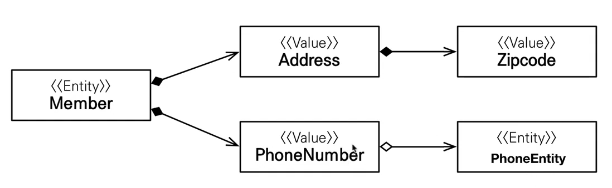

Member Entity에 임베디드 타입(PhoneNumber)이 들어 갈 수 있고 그 안에 엔티티가 들어갈 수 있다.

### AttributeOverride: 속성 재정의

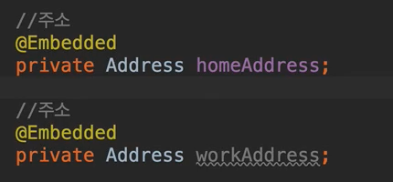

- 한 엔티티에서 같은 값 타입을 사용하면?
- 컬럼 명이 중복됨
- `@AttributeOverrides`, `@AttributeOverride`를 사용해서 컬러 명 속성을 재정의

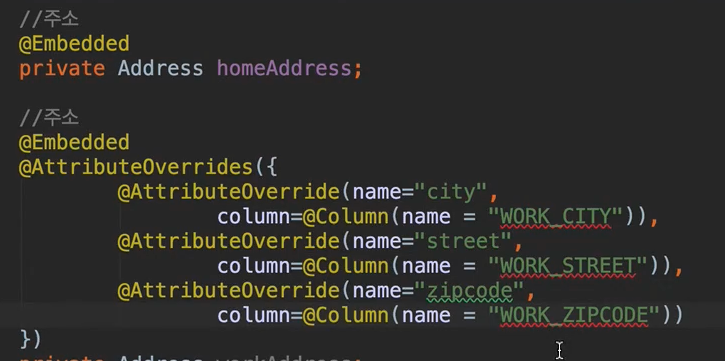

`@AttributeOverride`를 사용해서 중복된 칼럼 명을 재정의 해주어야함

### 임베디드 타입과 null
임베디드 타입의 값이 null이면 매핑한 컬럼 값은 모두 null이다.

 

## 값 타입과 불변 객체

> 값 타입은 복잡한 객체 세상을 조금이라도 단순화하려고 만든 개념이다. 따라서 값 타입은 단순하고 안전하게 다룰 수 있어야 한다.

### 값 타입 공유 참조
- 임베디드 타입 같은 값 타입을 여러 엔티티에서 공유하면 위험함
- 부작용 발생

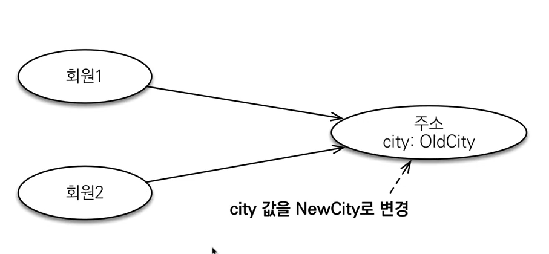

city를 바꾸게 되면 회원1과 회원2의 city가 바뀌어 버린다.

### 값 타입 복사
- 값 타입의 실제 인스턴스인 값을 공유하는 것은 위험
- 대신 값(인스턴스)를 복사해서 사용

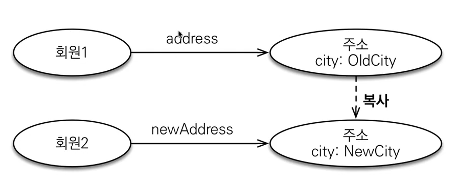

### 객체 타입의 한계
- 항상 값을 복사해서 사용하면 공유 참조로 인해 발생하는 부작용을 피할 수 있다.
- 문제는 임베디드 타입처럼 직접 정의한 값 타입은 자바의 기본 타입이 아니라 객체 타입이다.
- 자바 기본 타입에 값을 대입하면 값을 복사한다.
- 객체 타입은 참조 값을 직접 대입하는 것을 막을 방법이 없다.
- __객체의 공유 참조는 피할 수 없다.__

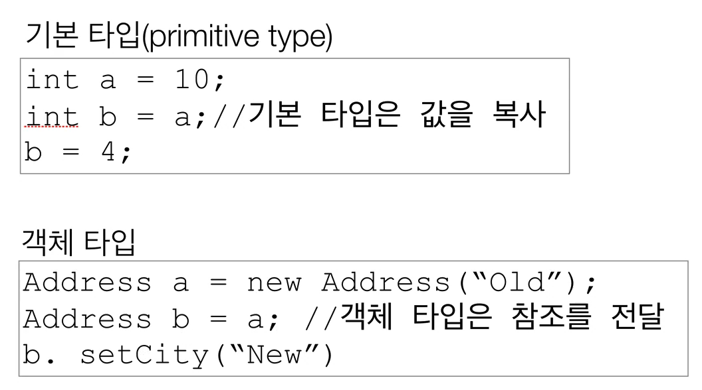

기본 타입은 값을 복사해서 넘김, 객체 타입은 참조를 전달하기 때문에 한 쪽이 변경되면 다른 한쪽도 변경됨.

### 불변 객체
- 객체 타입을 수정할 수 없게 만들면 부작용을 원천 차단
- 값 타입은 불변 객체로 설계해야함
- 불변 객체: 생성 시점 이후 절대 값을 변경할 수 없는 객체
- 생성자로만 값을 설정하고 수정자를 만들지 않으면 됨
- 참고: Integer과 String은 자바가 제공하는 대표적인 불변 객체

__불변이라는 작은 제약으로 부작용이라는 큰 재앙을 막을 수 있다.__

 

## 값 타입의 비교
- 값 타입: 인스턴스가 달라도 그 안에 값이 같으면 같은 것으로 봐야 함

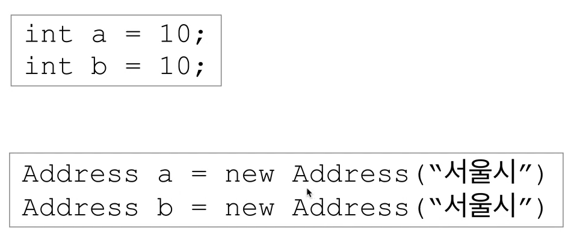

primitive 타입에서는 둘이 비교하면 같다고 나오지만 인스턴스는 주소가 다르므로 내부의 값이 같아도 다르다고 나옴

- 동일성 비교: 인스턴스의 참조 값을 비교, == 사용
- 동등성 비교: 인스턴스의 값을 비교, equals() 사용
- 값 타입은 a.equals(b)를 사용해서 동등성 비교를 해야 함
- 값 타입의 equals() 메소드를 적절하게 재정의(주로 모든 필드 사용)

 

## 값 타입 컬렉션

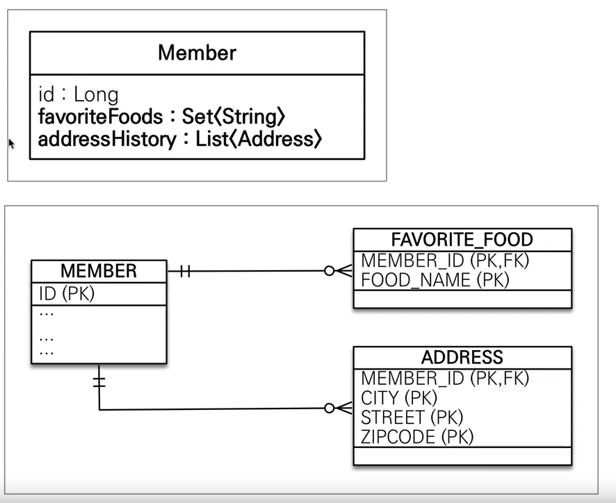

DB에서는 컬렉션(리스트)를 가질 수 없다. 따라서 테이블을 따로 만들어 관리해야한다.

- 값 타입을 하나 이상 저장할 때 사용
- `@ElementCollection`, `@CollectionTable` 사용
- 데이터베이스는 컬렉션을 같은 테이블에 저장할 수 없다.(일대다 개념이기 때문에)
- 컬렉션을 저장하기 위한 별도의 테이블이 필요함

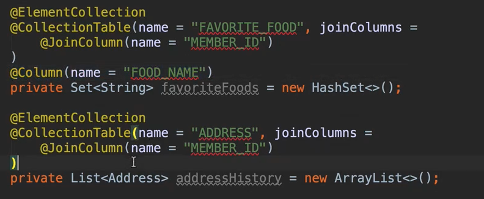

### 값 타입 컬렉션 사용
- 값 타입 저장 예제
  - 값 타입자체를 저장하지 않고 member만 저장했는데 컬렉션들이 저장됨
  - 컬렉션들은 member에 의존되어있음

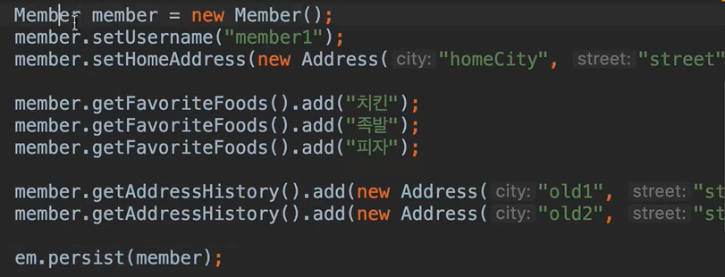

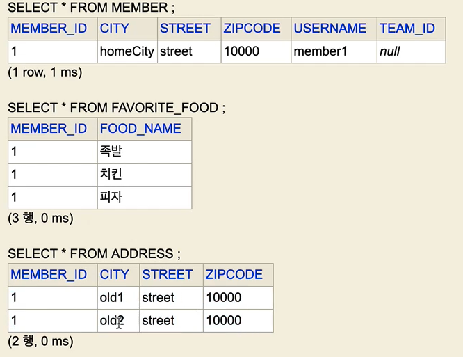

- 값 타입 조회 예제
  - 값 타입 컬렉션도 지연 로딩 전략 사용
  - member만 찾을 경우 컬렉션은 select 하지 않음
  - 컬렉션을 찾을 때 select 쿼리문을 날림

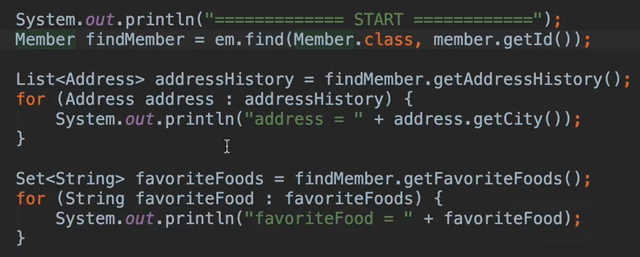

- 값 타입 수정 예제

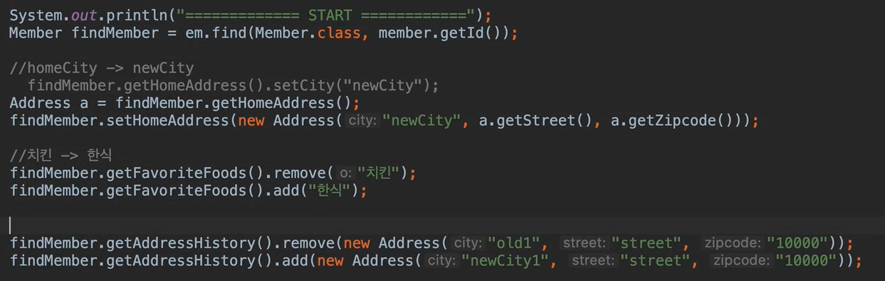

setter로 바꾸는 것이 아닌 새로운 Address를 넣어주어야함(불변 / 사이드 이펙트 방지)  
객체를 새로 넣어주는 경우 remove가 참조값을 통해 실행되기 때문에 equals를 잘 정의해주어야 한다.

- 참고: 값 타입 컬렉션은 영속성 전이(Cascade) + 고아 객체 제거 기능을 필수로 가진다고 볼 수 있다.

### 값 타입 컬렉션의 제약사항
- 값 타입은 엔티티와 다르게 식별자 개념이 없다.
- 값은 변경하면 추적이 어렵다.
- 값 타입 컬렉션에 변경 사항이 발생하면, 주인 엔티티와 연관된 모든 데이터를 삭제하고, 값 타입 컬렉션에 있는 현재 값을 모두 다시 저장한다.
- 값 타입 컬렉션을 매핑하는 테이블은 모든 컬럼을 묶어서 기본 키를 구성해야함: null 입력X, 중복 저장X

### 값 타입 컬렉션 대안
- 실무에서는 상황에 따라 값 타입 컬렉션 대신에 일대다 관계를 고려
- 일대다 관계를 위한 엔티티를 만들고, 여기에서 값 타입을 사용
- 영속성 전이(Cascade) + 고아 객체 제거를 사용해서 값 타입 컬렉션 처럼 사용

### 정리
- 엔티티 타입의 특징
  - 식별자 O
  - 생명 주기 관리
  - 공유
- 값 타입의 특징
  - 식별자 X
  - 생명 주기를 엔티티에 의존
  - 공유하지 않는 것이 안전(복사해서 사용)
  - 불변 객체로 만드는 것이 안전

값 타입은 정말 값 타입이라 판단될 때만 사용  
엔티티와 값 타입을 혼동해서 엔티티를 값 타입으로 만들면 안됨  
식별자가 필요하고, 지속해서 값을 추적, 변경해야 한다면 그것은 값 타입이 아닌 엔티티

