## 목차
- [객체지향 쿼리 언어](#객체지향-쿼리-언어)
  - [소개](#소개)
    - [JPA는 다양한 쿼리 방법을 지원](#jpa는-다양한-쿼리-방법을-지원)
    - [JPQL](#jpql)
    - [Criteria 소개](#criteria-소개)
    - [QueryDSL 소개](#querydsl-소개)
    - [네이티브 SQL 소개](#네이티브-sql-소개)
    - [JDBC 직접 사용, SpringJdbcTemplate 등...](#jdbc-직접-사용-springjdbctemplate-등)
  - [기본 문법과 쿼리 API](#기본-문법과-쿼리-api)
    - [JPQL 소개](#jpql-소개)
    - [JPQL 문법](#jpql-문법)
    - [집합과 정렬](#집합과-정렬)
    - [TypeQuery, Query](#typequery-query)
    - [결과 조회 API](#결과-조회-api)
    - [파라미터 바인딩 - 이름 기준, 위치 기준](#파라미터-바인딩---이름-기준-위치-기준)
  - [프로젝션](#프로젝션)
    - [프로젝션 - 여러 값 조회](#프로젝션---여러-값-조회)
  - [페이징 API](#페이징-api)
    - [페이징 예시](#페이징-예시)
  - [조인](#조인)
    - [조인 - ON 절](#조인---on-절)
    - [1. 조인 대상 필터링](#1-조인-대상-필터링)
    - [2. 연관관계 없는 엔티티 외부 조인](#2-연관관계-없는-엔티티-외부-조인)
  - [서브 쿼리](#서브-쿼리)
    - [서브 쿼리 지원 함수](#서브-쿼리-지원-함수)
    - [서브 쿼리 - 예제](#서브-쿼리---예제)
    - [JPA 서브 쿼리 한계](#jpa-서브-쿼리-한계)
  - [JPQL 타입 표현과 기타식](#jpql-타입-표현과-기타식)
  - [조건식](#조건식)
  - [JPQL 함수](#jpql-함수)
    - [사용자 정의 함수 호출](#사용자-정의-함수-호출)

# 객체지향 쿼리 언어

## 소개

### JPA는 다양한 쿼리 방법을 지원
- JPQL
- JPA Criteria
- QueryDSL
- 네이티브 SQL
- JDBC API 직접 사용, MyBatis, SpringJdbcTemplate 함께 사용

### JPQL
- JPA를 사용하면 엔티티 객체를 중심으로 개발
- 문제는 검색 쿼리
- 검색을 할 때도 테이블이 아닌 엔티티 객체를 대상으로 검색
- 모든 DB 데이터를 객체로 변환해서 검색하는 것은 불가능
- 애플리케이션이 필요한 데이터만 DB에서 불러오려면 결국 검색 조건이 포함된 SQL이 필요

__이러한 문제를 해결하기 위해...__

- 이런 문제를 해결하기 위해 JPA는 SQL을 추상화한 JPQL이라는 객체 지향 쿼리 언어 제공
- SQL과 문법 유사, SELECT, FROM, WHERE, GROUP BY, HAVING, JOIN 지원
- JPQL은 엔티티 객체를 대상을 쿼리
- SQL은 데이터베이스 테이블을 대상으로 쿼리

__정리 하자면__
- 테이블이 아닌 객체를 대상으로 검색하는 객체 지향 쿼리
- SQL을 추상화해서 특정 데이터 베이스 SQL에 의존 X
- JPQL을 한마디로 정의하면 객체 지향 SQL

### Criteria 소개

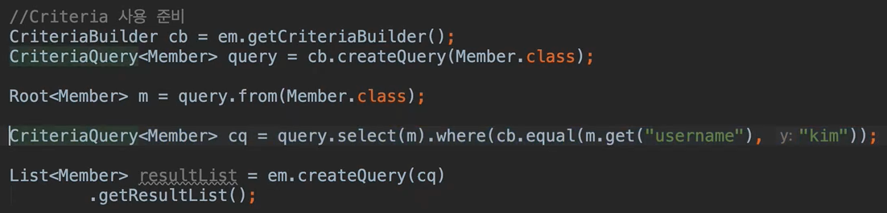

- 문자가 아닌 자바 코드로 JPQL을 작성할 수 있음
- JPQL 빌더 역할
- JPA 공식 기능
- 단점: 너무 복잡하고 실용성이 없다.
- Criteria 대신에 QueryDSL 사용 권장

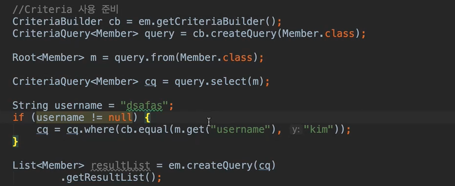

- 유저 이름이 null이 아닌 경우와 같이 where 절을 if문을 통해 처리 가능(동적 쿼리)
- SQL 문법과 다름!
- 김영한님은 실무에서 사용하지 않음.
- 이런게 있다 라고 생각하면 될듯!

### QueryDSL 소개

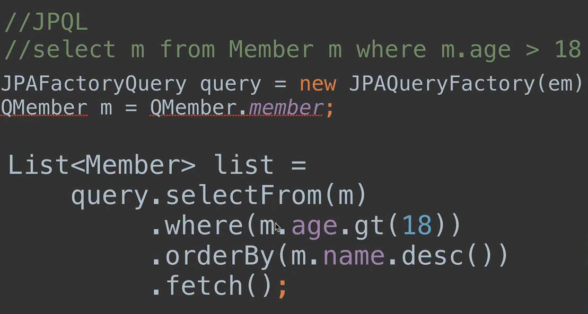

- 문자가 아닌 자바코드로 JPQL을 작성할 수 있음
- JPQL 빌더 역할
- 컴파일 시점에 문법 오류를 찾을 수 있음
- 동적 쿼리 작성 편리함
- 단순하고 쉬움
- 실무 사용 권장

### 네이티브 SQL 소개
- JPA가 제공하는 SQL을 직접 사용하는 기능
- JPQL로 해결할 수 없는 특정 데이터 베이스에 의존적인 기능
- 예) 오라클 CONNECT BY, 특정 DB만 사용하는 SQL 힌트

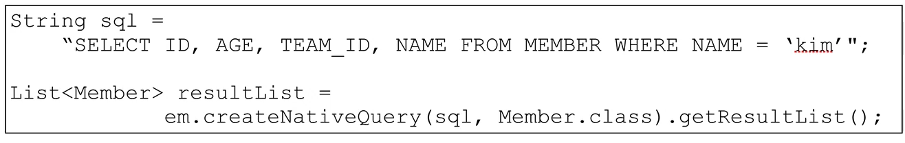

### JDBC 직접 사용, SpringJdbcTemplate 등...
- JPA를 사용하면서 JDBC 커넥션을 직접 사용하거나, 스프링 JdbcTemplate, 마이바티스 등을 함께 사용 가능
- 단 영속성 컨텍스트를 적절한 시점에 강제로 플러시 필요
  - JPA 기술이 아니기 때문에 쿼리를 실행하더라도 커밋이 안됨
  - 따라서 플러시가 강제로 필요
- 예) JPA를 우회해서 SQL을 실행하기 직전에 영속성 컨텍스트 수동 플러시

 

## 기본 문법과 쿼리 API

### JPQL 소개
- JPQL은 객체 지향 쿼리 언어다. 따라서 테이블을 대상으로 쿼리하는 것이 아니라 __엔티티 객체를 대상으로 쿼리__ 한다.(중요)
- JPQL은 SQL을 추상화해서 특정 데이터베이스 SQL에 의존하지 않는다.
- JPQL은 결국 SQL로 변환된다.

### JPQL 문법
- select m from Member as m where m.age > 18
- 엔티티와 속성은 대소문자 구분O (Member, age)
- JPQL 키워드는 대소문자 구분X (SELECT, FROM, where)
- 엔티티 이름 사용, 테이블 이름이 아님(Member)
- 별칭은 필수(m) (as는 생략 가능)

### 집합과 정렬

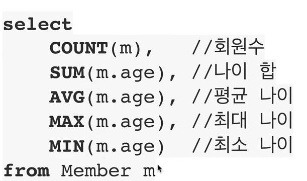

- GROUP BY, HAVING
- ORDER BY

모두 정의되어 있음

### TypeQuery, Query
- TypeQuery: 반환 타입이 명확할 때 사용
- Query: 반환 타입이 명확하지 않을 때 사용

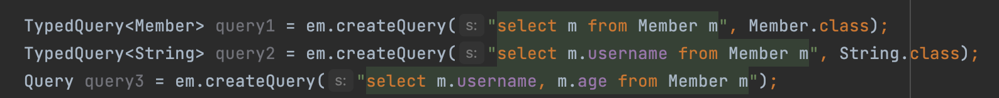

결과가 m.username, m.age 같은 경우 String, int 이기 때문에 타입이 명확하지 않아 Query를 사용

### 결과 조회 API
- query.getResultList(): 결과가 하나 이상일 때, 리스트 반환
  - 결과가 없으면 빈 리스트 반환
- query.getSingleResult(): 결과가 정확히 하나, 단일 객체 반환
  - 결과가 없으면 : javax.persistence.NoResultException
  - 둘 이상이면: javax.persistence.NonUniqueResultException

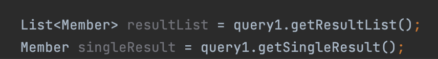

### 파라미터 바인딩 - 이름 기준, 위치 기준

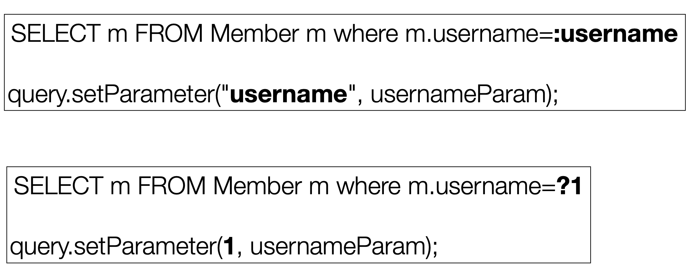

 

## 프로젝션
- select 절에 조회할 대상을 지정하는 것
- 프로젝션 대상: 엔티티, 임베디드 타입, 스칼라 타입(숫자, 문자등 기본 데이터 타입)
- SELECT __m__ FROM Member m -> 엔티티 프로젝션
- SELECT __m.team__ FROM Member m -> 엔티티 프로젝션
- SELECT __m.address__ FROM Member m -> 임베디드 타입 프로젝션
- SELECT __m.username, m,age__ FROM Member m -> 스칼라 타입 프로젝션
- distinct로 중복 제거

### 프로젝션 - 여러 값 조회
- SELECT m.username, m.age FROM Member m
- 1. Query 타입으로 조회
- 2. Object[] 타입으로 조회

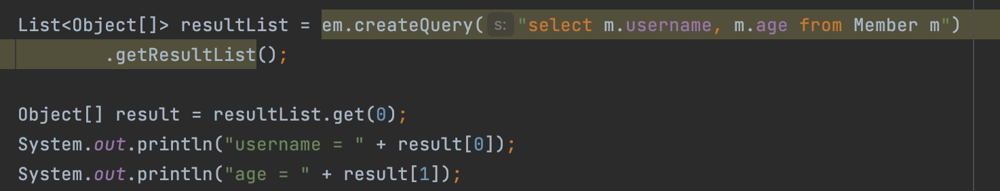

- 3. new 명령어로 조회
  - 단순 값을 DTO로 바로 조회
  - SELECT new jpabook.jpql.UserDTO(m.username, m.age) FROM Member m
  - 패키지 명을 포함한 전체 클래스 명 입력
  - 순서와 타입이 일치하는 생성자 필요

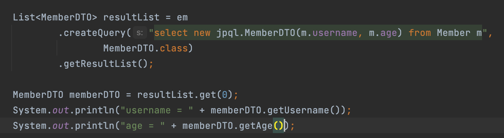

 

## 페이징 API
- JPA는 페이징을 다음 두 API로 추상화
- setFirstResult(int startPosition): 조회 시작 위치 (0부터 시작)
- setMaxResults(int maxResult): 조회할 데이터 수

### 페이징 예시
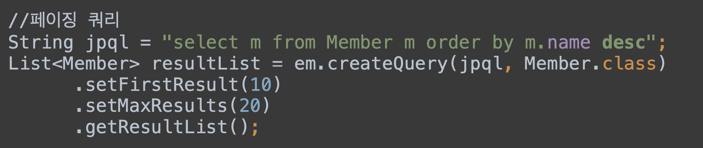

 

## 조인
- 내부 조인:
  - SELECT m FROM Member m [INNER] JOIN m.team t
- 외부 조인:
  - SELECT m FROM Member m LEFT [OUTER] JOIN m.team t
- 세타 조인:
  - SELECT count(m) FROM Member m, Team t WHERE m.username = t.name

### 조인 - ON 절
- ON절을 활용한 조인 (JPA2.1 부터 지원)
  - 1. 조인 대상 필터링
  - 2. 연관관계 없는 엔티티 외부 조인(하이버네이트 5.1부터)

### 1. 조인 대상 필터링
예) 회원과 팀을 조인하면서, 팀 이름이 A인 팀만 조인

JPQL:  
SELECT m t FROM Member m LEFT JOIN m.team t on t.name = 'A'  
SQL:  
SELECT m.*, t.* FROM Member m LEFT JOIN Team t ON m.TEAM_ID=t.id and t.name='A'

### 2. 연관관계 없는 엔티티 외부 조인
예) 회원의 이름과 팀의 이름이 같은 대상 외부 조인

JPQL:  
SELECT m,t FROM Member m LEFT JOIN Team t ON m.username = t.name  
SQL:  
SELECT m.*, t.* FROM Member m LEFT JOIN Team t ON m.username = t.name  

 

## 서브 쿼리
- 나이가 평균보다 많은 회원
  - SELECT m FROM Member m WHERE m.age > (select avg(m2.age) from Member m2)
- 한 건이라도 주문한 고객
  - SELECT m FROM Member m where (select count(o) from Order o where m = o.member) > 0

### 서브 쿼리 지원 함수
- [NOT] EXISTS (subquery): 서브쿼리에 결과가 존재하면 참
  - {ALL | ANY | SOME} (subquery)
  - ALL 모두 만족하면 참
  - ANY, SOME: 같은 의미, 조건을 하나라도 만족하면 참
- [NOT] IN (subquery): 서브쿼리의 결과 중 하나라도 같은 것이 있으면 참

### 서브 쿼리 - 예제
- 팀A 소속인 회원
  - select m from Member m where exists (select t from m.team t where t.name = '팀A')
- 전체 상품 각각의 재고보다 주문량이 많은 주문들
  - select o from Order o where o.orderAmount > ALL (select p.stockAmount from Product p)
- 어떤 팀이든 팀에 소속된 회원
  - select m from Member m where m.team = ANY (select t from Team t)

### JPA 서브 쿼리 한계
- JPA는 WHERE, HAVING 절에서만 서브 쿼리 사용 가능
- SELECT 절도 가능(하이버네이트에서 지원)
- FROM 절의 서브 쿼리는 현재 JPQL에서 불가능
  - 조인으로 풀 수 있으면 풀어서 해결

 

## JPQL 타입 표현과 기타식
- 문자: 'HELLO', 'She''s'
- 숫자: 10L(Long), 10D(Double), 10F(Float)
- Boolean: TRUE, FALSE
- ENUM: jpabook.MemberType.Admin (패키지명 포함)
  - 파라미터 바인딩하면 패키지명을 사용 안해도 된다.
- 엔티티 타입: TYPE(m) = Member (상속 관계에서 사용)

JPQL 타입 표현
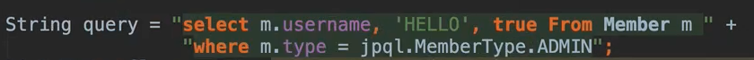

엔티티 타입
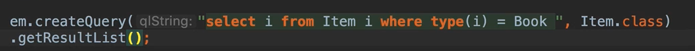

 

## 조건식

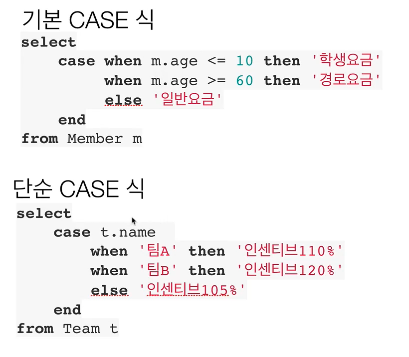

- COALESCE: 하나씩 조회해서 null이 아니면 반환
- NULLIF: 두 값이 같으면 null 반환, 다르면 첫번째 값 반환

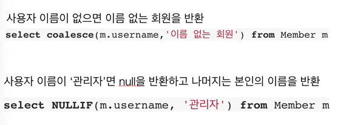

 

## JPQL 함수
- CONCAT
- SUBSTRING
- TRIM
- LOWER, UPPER
- LENGTH
- LOCATE
- ABS, SQRT, MOD
- SIZE, INDX(JPA 용도)

### 사용자 정의 함수 호출
- 하이버네이트는 사용전 방언에 추가해야 한다.
  - 사용하는 DB 방언을 상속받고, 사용자 정의 함수를 등록한다.
- select function('group_concat', i.name) from Item i

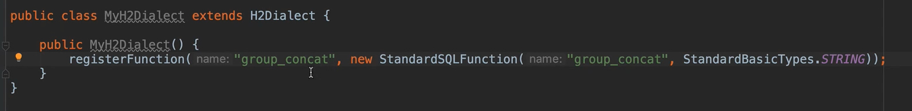

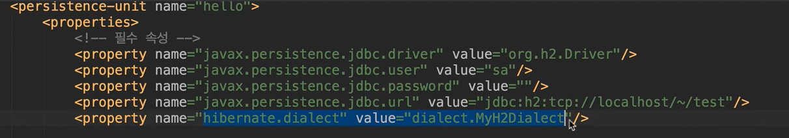

함수를 정의 하고 속성에 가서 해당 속성을 정의해주어야한다.