## 목차
- [객체지향 쿼리언어2 - 중급 문법](#객체지향-쿼리언어2---중급-문법)
  - [JPQL - 경로 표현식](#jpql---경로-표현식)
    - [경로 표현식 용어 정리](#경로-표현식-용어-정리)
    - [경로 표현식 특징](#경로-표현식-특징)
    - [상태 필드 경로 탐색](#상태-필드-경로-탐색)
    - [단일 값 연관 경로 탐색](#단일-값-연관-경로-탐색)
    - [명시적 조인, 묵시적 조인](#명시적-조인-묵시적-조인)
    - [경로 표현식 - 예제](#경로-표현식---예제)
    - [경로 탐색을 사용한 묵시적 조인 시 주의사항](#경로-탐색을-사용한-묵시적-조인-시-주의사항)
    - [실무 조언](#실무-조언)
  - [fetch join - 기본](#fetch-join---기본)
    - [엔티티 패치 조인](#엔티티-패치-조인)
    - [컬렉션 패치 조인](#컬렉션-패치-조인)
    - [패치 조인과 DISTINCT](#패치-조인과-distinct)
    - [패치 조인과 일반 조인의 차이](#패치-조인과-일반-조인의-차이)
  - [fetch join - 한계](#fetch-join---한계)
    - [패치 조인의 특징과 한계](#패치-조인의-특징과-한계)
    - [패치 조인 - 정리](#패치-조인---정리)
  - [다형성 쿼리](#다형성-쿼리)
    - [TYPE](#type)
    - [TREAT(JPA 2.1)](#treatjpa-21)
  - [엔티티 직접 사용](#엔티티-직접-사용)
    - [기본 키 값](#기본-키-값)
    - [외래 키 값](#외래-키-값)
  - [JPQL - Named 쿼리](#jpql---named-쿼리)
    - [어노테이션](#어노테이션)
    - [정적 쿼리](#정적-쿼리)
  - [벌크 연산](#벌크-연산)
    - [예제](#예제)
    - [주의](#주의)

# 객체지향 쿼리언어2 - 중급 문법

## JPQL - 경로 표현식

> 경로 표현식  
> .(점)을 찍어 객체 그래프를 탐색하는 것

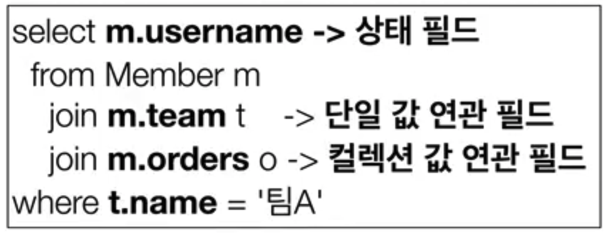

### 경로 표현식 용어 정리

- 상태 필드(state field): 단순히 값을 저장하기 위한 필드 (ex: m.username)
- 연관 필드(association field): 연관관계를 위한 필드
  - 단일 값 연관 필드: @ManyToOne, @OneToOne, 대상이 엔티티(ex: m.team)
  - 컬렉션 값 연관 필드: @OneToMany, @ManyToMany, 대상이 컬렉션(ex: m.orders)

### 경로 표현식 특징
- 상태 필드(state field): 경로 탐색의 끝, 탐색 X
- 단일 값 연관 경로: 묵시적 내부 조인(inner join) 발생, 탐색 O
- 컬렉션 값 연관 경로: 묵시적 내부 조인 발생, 탐색 X
  - FROM  절에서 명시적 조인을 통해 별칭을 얻으려면 별칭을 통해 탐색 가능

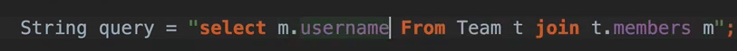

해당 쿼리처럼 별칭을 통해 `m.username` 으로 접근할 수 있다.

그러나 묵시적 내부 조인은 경계해야한다. (직관적이지도 않고 큰 운영에서는 join 쿼리가 어디서 나갔는지 알기 어려움)

무시적 내부 조인을 쓰지말자!!

### 상태 필드 경로 탐색
JPQL과 SQL 똑같다.

- JPQL: `select m.username, m.age from Member m`
- SQL: `select m.username, m.age from Member m`

### 단일 값 연관 경로 탐색

- JPQL: `select o.member from Order o`
- SQL:
  select m.*  
    from Orders O  
    inner join Member m on o.membrer_id = m.id

묵시적 조인이 발생한다.

### 명시적 조인, 묵시적 조인

- 명시적 조인: join 키워드 직접 사용
  - select m from Member m join m.team t
- 묵시적 조인: 경로 표현식에 의해 묵시적으로 SQL 조인 발생(내부 조인만 가능)
  - select m.team from Member m

### 경로 표현식 - 예제

- select o.member.team from Order o -> 성공
  - 내부 조인이 2번 일어난다. Order - member - team
- select t.members from Team -> 성공
  - 컬렉션은 t.members 까지만 가능 이후에 들어갈 수 없음
- select t.members.username from Team t -> 실패
  - 컬렉션은 더이상 탐색할 수 없음
- select m.username from Team t join t.members m -> 성공
  - 명시적 join을 통해 username으로 가져왔기 때문에 접근이 가능하다

### 경로 탐색을 사용한 묵시적 조인 시 주의사항
- 항상 내부조인
- 컬렉션은 경로 탐색의 끝, 명시적 조인을 통해 별칭을 얻어야함
- 경로 탐색은 주로 SELECT, WHERE 절에서 사용하지만 묵시적 조인으로 인해 SQL의 FROM (JOIN) 절에 영향을 줌

### 실무 조언
- 가급적 묵시적 조인 대신에 명시적 조인 사용
- 조인은 SQL 튜닝에 중요 포인트
- 묵시적 조인은 조인이 일어나는 상황을 한눈에 파악하기 어려움

<br>

## fetch join - 기본

- SQL 조인 종류 X
- JPQL에서 성능 최적화를 위해 제공하는 기능
- 연관된 엔티티나 컬렉션을 SQL 한 번에 함께 조회하는 기능
- join fetch 명령어 사용
- 패치조인 ::= [ LEFT [OUTER] | INNER] JOIN FETCH 조인 경로

### 엔티티 패치 조인
- 회원을 조회하면서 연관된 팀도 함께 조회(SQL 한 번에)
- SQL을 보면 회원 뿐만 아니라 팀(T.*)도 함께 SELECT
- [JPQL] select m from Member m join fetch m.team
- [SQL] SELECT M.* , T.* FROM MEMBER M INNER JOIN TEAM T ON M.TEAM_ID=T.ID
- 즉시 로딩과 비슷

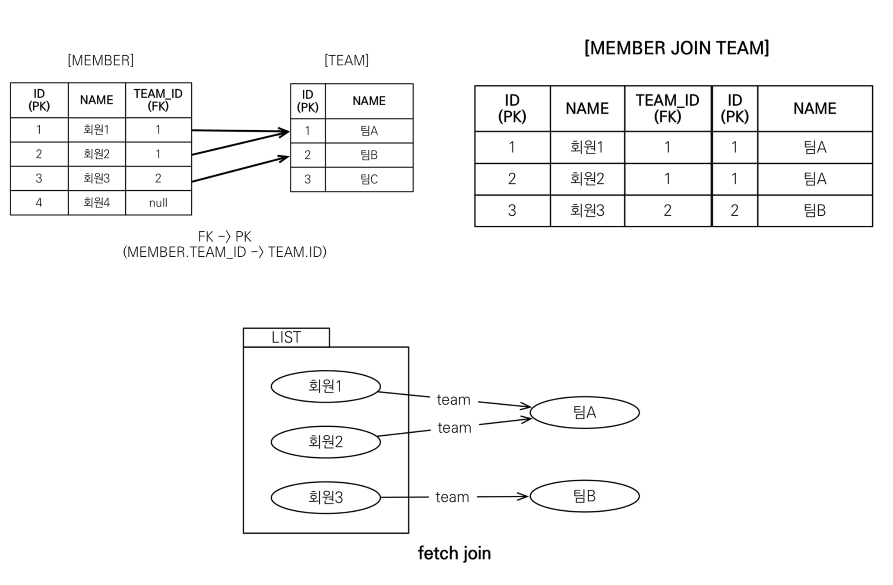

fetch join을 하게 되면 그림과 같이 한 번에 가져온다.

fetch join을 사용하게 되면 프록시가 아닌 모든 데이터를 한번에 가져온다.  
지연 로딩으로 설정하더라도 fetch join이 우선이 된다.

### 컬렉션 패치 조인

- 일대다 관계, 컬렉션 패치 조인
- [JPQL]  
  select t  
  from Team t join fetch t.members  
  where t.name = '팀A'
- [SQL]  
  SELECT T.* , M.*  
  FROM TEAM T  
  INNER JOIN MEMBER M ON T.ID=M.TEAM_ID  
  WHERE T.NAME = '팀A'

일대다 관계일 경우 데이터가 뻥튀기가 될 수 있음!


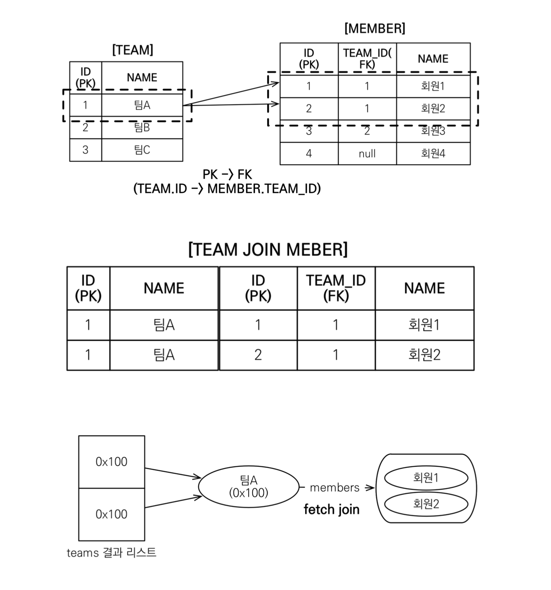

### 패치 조인과 DISTINCT
- SQL의 DISTINCT는 중복된 결과를 제거하는 명령
- JPQL의 DISTINCT 2가지 기능 제공
  - 1. SQL에 DISTINCT를 추가
  - 2. 애플리케이션에서 엔티티 중복 제거

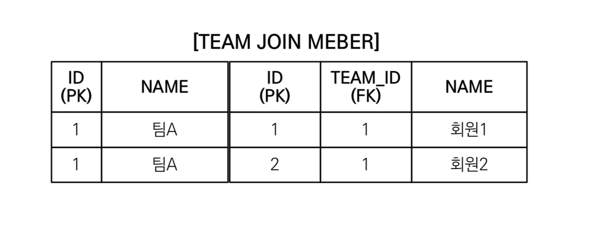

- select distinct t  
  from Team t join fetch t.members  
  where t.name = ‘팀A’
- SQL에 DISTINCT를 추가하지만 데이터가 다르므로 SQL 결과에서 중복제거 실패

- DISTINCT가 추가로 애플리케이션에서 중복 제거시도
- 같은 식별자를 가진 Team 엔티티 제거

### 패치 조인과 일반 조인의 차이
- 일반 조인 실행시 연관된 엔티티를 함께 조인하지 않음
- [JPQL]  
  select t  
  from Team t join t.members m  
  where t.name = '팀A'
- [SQL]  
  select T.*  
  from Team T  
  Inner join Member M on T.ID=M.TEAM_ID  
  where T.name = '팀A'

- JPQL은 결과를 반환할 때 연관관계 고려 X
- 단지 SELECT 절에 지정한 엔티티만 조회할 뿐
- 패치 조인을 사용할 때만 연관된 엔티티도 함께 조회(즉시 로딩)
- 패치 조인은 객체 그래프를 SQL 한번에 조회하는 개념

<br>


## fetch join - 한계

### 패치 조인의 특징과 한계
- 패치 조인 대상에는 별칭을 줄 수 없다.
  - 하이버 네이트는 가능, 가급적 사용 X

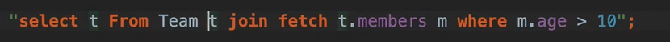

  - 패치 조인은 모두 가져오는 것인데 예를 들어 팀을 조회할 때 5명 중 3명만 조회해서 따로 조작하면 위험한 결과가 나올 수 있다.
  - 위의 그림과 같이 m.age > 10 같이 할 경우 5명 중 3명만 조회된다. 이는 JPA가 패치조인을 설계할 때 의도한 결과가 아니다.
  - 따라서 패치 조인 사용 시 해당 대상에 별칭을 주면 안된다.

- 둘 이상의 컬렉션은 패치 조인 할 수 없다.
  - 일대다대다가 되기 때문에 데이터가 엄청나게 뻥튀기 된다.
  - 컬렉션은 하나만 지정할 수 있다!

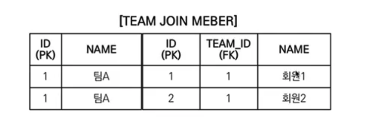

맨 처음 페이지 한 개만 가져오라고 명령을 내리면, 위의 그림에서 첫 번째 줄만 가져올 것이다. JPA는 팀A에 회원1만 있다고 생각하게 된다.

- 컬렉션을 패치 조인하면 페이징 API(setFirstResult, setMaxResults)를 사용할 수 없다.

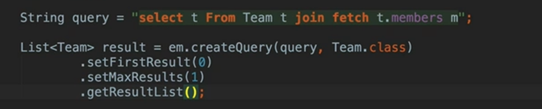

위와 같이 컬렉션을 패치 조인 할경우 페이지 API를 사용하면 안된다!


경고가 뜬다!

  - 일대일, 다대일 같은 단일 값 연관 필드들은 패치 조인해도 페이징 가능
  - 하이버네이트는 경고 로그를 남기고 메모리에서 페이징(매우 위험)

- 연관된 엔티티들을 SQL 한 번으로 조회 - 성능 최적화
- 엔티티에 직접 적용하는 글로벌 로딩 전략보다 우선함
  - `@OneToMany(fetch = FetchType.LAZY)` // 글로벌 로딩 전략
- 실무에서 글로벌 로딩 전략은 모두 지연 로딩
- 최적화가 필요한 곳은 패치 조인 적용

### 패치 조인 - 정리
- 모든 것을 패치 조인으로 해결할 수는 없음
- 패치 조인은 객체 그래프를 유지할 때 사용하면 효과적
  - m.username 같이 뭔가를 찾아갈 때(엔티티가 가지고 있는 모양)
- 여러 테이블을 조인해서 엔티티가 가진 모양이 아닌 전혀 다른 결과를 내야하면, 패치 조인 보다는 일반 조인을 사용하고 필요한 데이터들만 조회해서 DTO로 반환하는 것이 효과적

<br>

## 다형성 쿼리

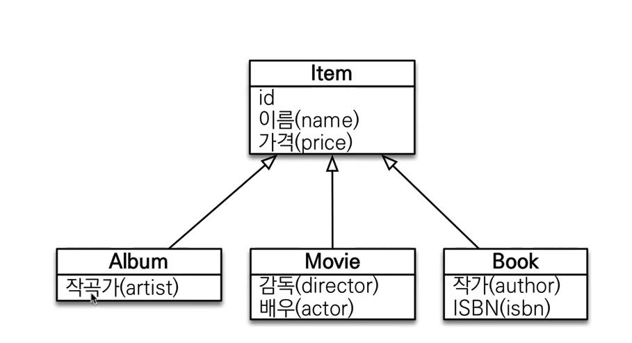

### TYPE

- 조회 대상을 특정 자식으로 한정
- ex) Item 중에 Book, Movie를 조회해라
- [JPQL]  
  select i from Item i  
  where type(i) IN (Book, Movie)
- [SQL]  
  select i from i  
  where i.DTYPE in ('B', 'M')

### TREAT(JPA 2.1)

- 자바의 타입 캐스팅과 유사
- 상속 구조에서 부모 타입을 특정 자식 타입으로 다룰 때 사용
- FROM, WHERE, SELECT(하이버네이트 지원) 사용

- ex) 부모인 Item과 자식 Book이 있다.
- [JPQL]  
  select i from Item i  
  where treat(i as Book).auther = 'kim'
- [SQL]
  select i.* from Item i  
  where i.DTYPE = 'B' and i.auther = 'kim'

<br>

## 엔티티 직접 사용

### 기본 키 값
- JPQL에서 엔티티를 직접 사용하면 SQL에서 해당 엔티티의 기본 키 값을 사용
- [JPQL]  
  select count(m.id) from Member m // 엔티티의 아이디를 사용  
  select count(m) from Member m // 엔티티를 직접 사용
- [SQL](JQPL 둘다 같은 다음 SQL 실행)  
  select count(m.id) as cnt from Member m

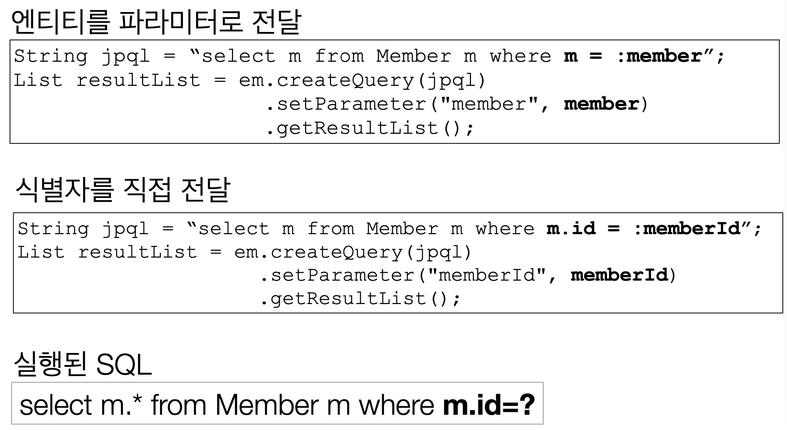

엔티티 자체를 파라미터로 넘길 수 있다!!

### 외래 키 값

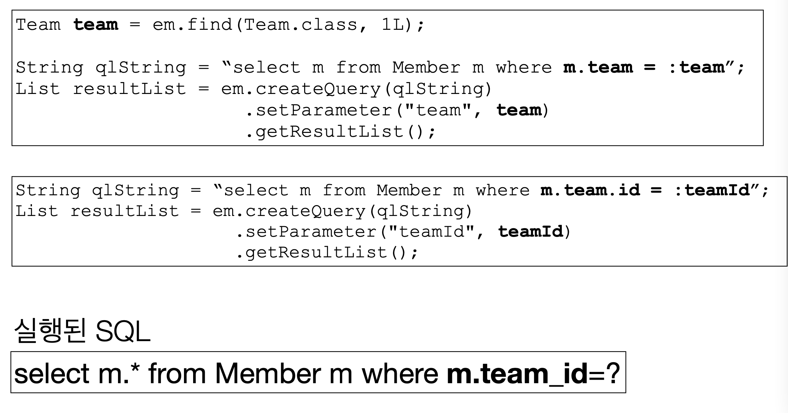

<br>

## JPQL - Named 쿼리

### 어노테이션

```java
@Entity
@NamedQuery(
    name = "Member.findByUsername",
    query = "select m from Member m where m.username = :username")
public class Member {
    ...
}

List<Member> resultList = 
    em.createNamedQuery("Member.findByUsername", Member.class)
    .setParameter("username", "회원1")
    .getResultList();
```

### 정적 쿼리
- 미리 정의해서 이름을 부여해두고 사용하는 JPQL
- 정적 쿼리
- 어노테이션, XML에 정의
- 애플리케이션 로딩 시점에 초기화 후 재사용
- __애플리케이션 로딩 시점에 쿼리를 검증__ - 중요!!
  - 만약 쿼리가 잘못되었을 경우(String 이지만) 애플리케이션 로딩 시점에 잡을 수 있다!!
  - 애플리케이션 로딩 시점에 오류를 잡을 수 있다!

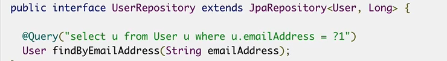

이런 느낌으로 사용한다!(spring data jpa)

<br>

## 벌크 연산

- 재고가 10개 미만인 모든 상품의 가격을 10% 상승하려면?
- JPA 변경 감지 기능으로 실행하려면 너무 많은 SQL 실행
  - 1. 재고가 10개 미만인 상품을 리스트로 조회한다.
  - 2. 상품 엔티티의 가격을 10% 증가한다.
  - 3. 트랜잭션 커밋 시점에 변경감지가 동작한다.
- 변경된 데이터가 100건이라면 100번의 update SQL 실행

### 예제

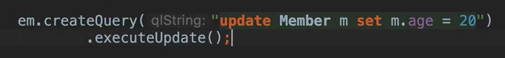

- 쿼리 한 번으로 여러 테이블 로우 변경(엔티티)
- executeUpdate()의 결과는 영향 받은 엔티티 수 반환
- UPDATE, DELETE 지원
- INSERT(insert into .. select, 하이버네이트 지원)

### 주의

- 벌크 연산은 영속성 컨텍스트를 무시하고 데이터베이스에 직접 쿼리
  - 벌크 연산을 먼저 실행
    - 영속성 컨텍스트에 아무것도 없을 때
  - 벌크 연산 수행 후 영속성 컨텍스트 초기화

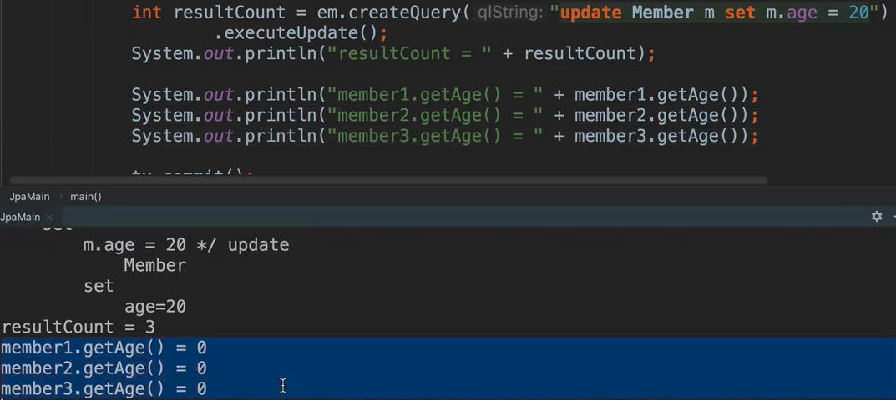

영속성 컨텍스트를 거치지 않고 DB에 바로 쿼리를 처리하기 때문에 실제 DB에는 20살이라고 되어있지만, 영속성 컨텍스트를 초기화하지 않고 member1.getAge()를 하면 영속성 컨텍스트에 있는 0값을 가져온다.


따라서 벌크 연산 후에는 영속성 컨텍스트를 초기화 해준 후, 다시 가져와야한다.
