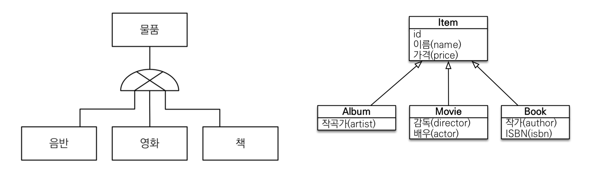
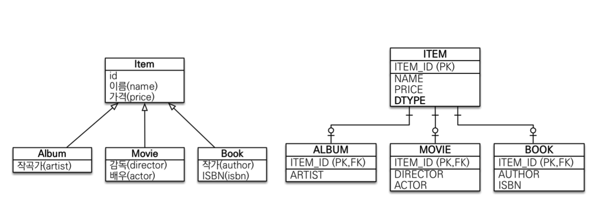
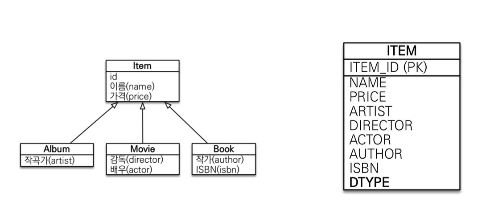
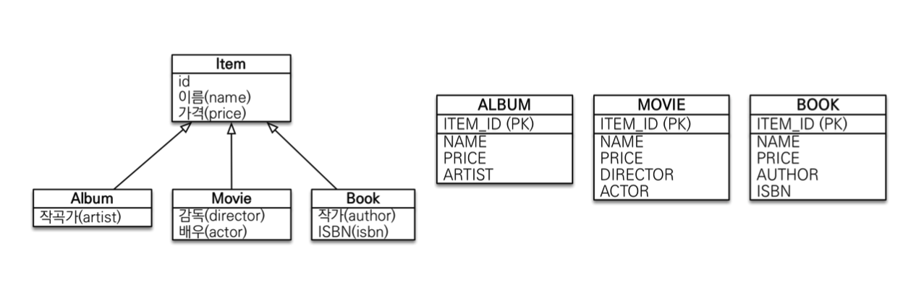
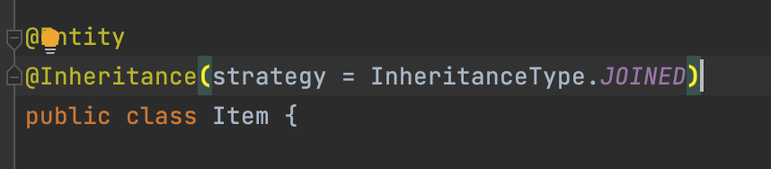
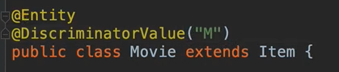
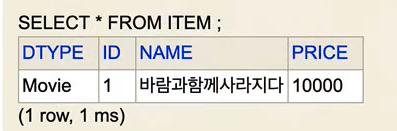
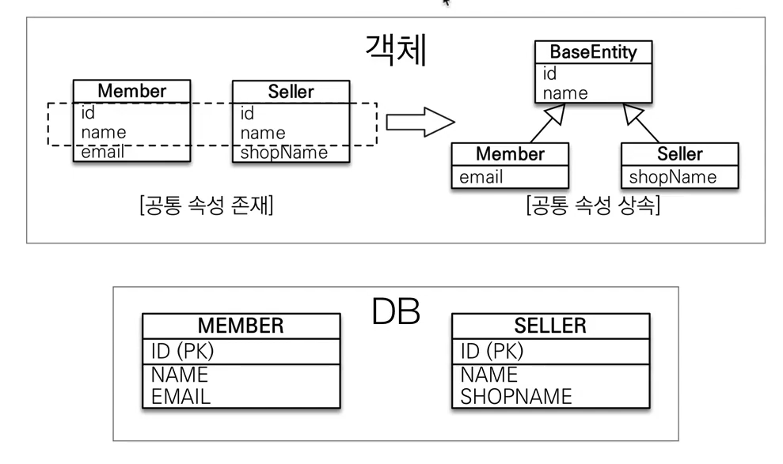
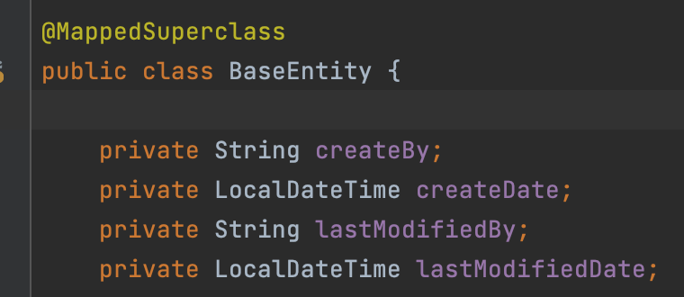

## 목차
- [고급매핑](#고급매핑)
  - [상속관계 매핑](#상속관계-매핑)
    - [조인 전략](#조인-전략)
    - [단일 테이블 전략](#단일-테이블-전략)
    - [구현 클래스마다 테이블 전략](#구현-클래스마다-테이블-전략)
    - [주요 어노테이션](#주요-어노테이션)
    - [각 전략 장단점](#각-전략-장단점)
  - [@MappedSuperclass](#mappedsuperclass)

# 고급매핑

## 상속관계 매핑

- 관계형 데이터베이스는 상속 관계X
- 슈퍼타입 서브타입 관계라는 모델링 기법이 객체 상속과 유사
- 상속관계 매핑: 객체의 상속 구조와 DB의 슈퍼타입 서브타입 관계를 매핑



__슈퍼타입 서브타입 논리 모델을 실제 물리 모델로 구현하는 방법__
- 각각 테이블로 변환 -> 조인 전략
- 통합 테이블로 변환 -> 단일 테이블 전략
- 서브타입 테이블로 변환 -> 구현 클래스마다 테이블 전략

### 조인 전략



- DTYPE으로 구분

### 단일 테이블 전략



- 모든 필드를 ITEM 테이블에 둔다.
- DTYPE으로 구분

### 구현 클래스마다 테이블 전략



- abstract가 아닌 실제 구현 클래스만 테이블로 구현된다.
- 만약 Item를 찾는 쿼리를 보내면 모든 테이블을 다 `union` 하여 찾는다.

### 주요 어노테이션
```java
@Inheritance(starategy=InheritanceType.XXX)
```
- JOINED: 조인 전략
- SINGLE_TALBE: 단일 테이블 전략
- TABLE_PER_CLASS: 구현 클래스마다 테이블 전략



<br>

```java
@DiscriminatorColumn(name="DTYPE")
```




- DTYPE의 이름을 변경  
- 단일 테이블 전략은 DTYPE이 무조건 들어간다.
- 구현 클래스마다 테이블 전략에서는 DTYPE이 들어가지 않는다.

### 각 전략 장단점

__조인 전략__
- 장점
  - 각 데이터가 정규화가 되어있음
  - 외래 키 참조 무결성 제약조건 활용 가능
    - ITEM_ID(PK)로만 처리할 수 있음
  - 저장공간 효율화
- 단점
  - 조회시 조인을 많이 사용, 성능 저하
  - 조회 쿼리가 복잡함
  - 데이터 저장시 INSERT SQL 2번 호출

__단일 테이블 전략__
- 장점
  - 조인이 필요 없으므로 일반적으로 조회 성능이 빠름
  - 조회 쿼리가 단순함
- 단점
  - 자식 엔티티가 매핑한 컬럼을 모두 null을 허용해야한다.
  - 단일 테이블에 모든 것을 저장하므로 테이블이 커질 수 있고 상황에 따라서 조회 성능이 오히려 느려질 수 있다.

__구현 클래스마다 테이블 전략__
- __쓰지말자!!__

<br>

## @MappedSuperclass
> 공통 매핑 정보가 필요할 때 사용(id, name)



- ex) 모든 DB에는 저장된 날짜가 존재해야한다!
  - 이런 공통 속성을 한번에 묶어 주는 것!



- 상속관계 매핑 X
- 엔티티X, 테이블과 매핑X
- 부모 클래스를 상속 받는 자식 클래스에 매핑 정보만 제공
- 조회, 검색 불가(em.find(baseEntity))불가
- 직접 생성해서 사용할 일이 없으므로 추상 클래스 권장

- 테이블과 관계 없고, 단순히 엔티티가 공통으로 사용하는 매핑 정보를 모으는 역할
- 주로 등록일, 수정일, 등록자, 수정자 같은 전체 엔티티에서 공통으로 적용하는 정보를 모을 때 사용
- 참고 : `@Entity` 클래스는 엔티티나 `@MappedSuperclass`로 지정한 클래스만 상속 가능

