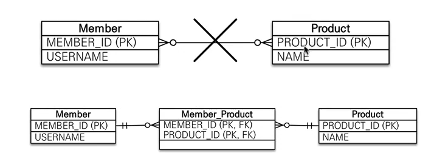

## 목차
- [다양한 연관관계 매핑](#다양한-연관관계-매핑)
  - [연관관계 매핑시 고려사항 3가지](#연관관계-매핑시-고려사항-3가지)
  - [다중성](#다중성)
  - [단방향, 양방향](#단방향-양방향)
  - [연관관계의 주인](#연관관계의-주인)
  - [다대일[N:1]](#다대일n1)
    - [다대일 단방형](#다대일-단방형)
    - [다대일 양방향](#다대일-양방향)
  - [일대다[1:N]](#일대다1n)
    - [일대다 단방향](#일대다-단방향)
    - [일대다 단방향 정리](#일대다-단방향-정리)
    - [일대다 양방향](#일대다-양방향)
  - [일대일[1:1]](#일대일11)
    - [주 테이블에 외래키 단방향](#주-테이블에-외래키-단방향)
    - [주 테이블에 외래키 양방향](#주-테이블에-외래키-양방향)
    - [대상 테이블에 외래키 단방향](#대상-테이블에-외래키-단방향)
    - [대상 테이블에 외래 키 양방향](#대상-테이블에-외래-키-양방향)
    - [일대일 정리](#일대일-정리)
  - [다대다[N:M]](#다대다nm)
    - [다대다 매핑의 한계](#다대다-매핑의-한계)
    - [다대다 한계 극복](#다대다-한계-극복)

# 다양한 연관관계 매핑

## 연관관계 매핑시 고려사항 3가지
- 다중성
- 단방향, 양방향
- 연관관계의 주인

## 다중성
- 다대일: @ManyToOne
- 일대다: @OneToMany
- 일대일: @OneToOne
- 다대다: @ManyToMany

## 단방향, 양방향
- 테이블
  - 외래 키 하나로 양쪽 조인 가능
  - 사실 방향이라는 개념이 없음
- 객체
  - 참조용 필드가 있는 쪽으로만 참조 가능
  - 한쪽만 참조하면 단방향
  - 양쪽이 서로 참조하면 양방향

## 연관관계의 주인
- 테이블은 외래 키 하나로 두 테이블이 연관관계를 맺음
- 객체 양방향 관계는 A->B, B->A처럼 참조가 2군데
- 객체 양방향 관계는 참조가 2군데 있음. 둘 중 테이블의 외래키를 관리할 곳을 지정해야함
- 연관관계의 주인: 외래키를 관리하는 참조
- 주인의 반대편 외래키에 영향을 주지 않음, 단순 조회만 가능

<br>

## 다대일[N:1]

### 다대일 단방형


- 관계형 DB에서는 다 쪽에 외래키가 들어가야한다.  
- 외래키 기준으로 참조값을 업데이트 해주면 된다!
  - Member에서 team을 넣어준다.

### 다대일 양방향


- 다(Member)에서 변경 가능
- 일(Team)에서는 조회만 가능

<br>

## 일대다[1:N]

### 일대다 단방향


__이 모델을 거의 가져가지 않음! - 김영한님 피셜__

```java
Member member = new Member();
member.setUsername("member1");

em.persist(member);

Team team = new Team();
team.setName("teamA");

team.getMembers().add(member);

em.persist(team);
```

insert member -> insert team -> update member

### 일대다 단방향 정리
- 일대다 단방향은 일대다(1:N)에서 일(1)이 연관관계의 주인
- 테이블 일대다 관계는 항상 다(N) 쪽에 외래 키가 있음
- 객체와 테이블의 차이 때문에 반대편 테이블의 외래 키를 관리하는 특이한 구조
- @JoinColumn을 꼭 사용해야함. 그렇지 않으면 조인 테이블 방식을 사용함(중간에 테이블을 하나 추가)
- 일대다 단방향 매핑의 단점
  - 엔티티가 관리하는 외래 키가 다른 테이블에 있음
  - 연관관계 관리를 위해 추가로 UPDATE SQL 실행
  - 일대다 단방향 매핑보다는 다대일 양방향 매핑을 사용하자

### 일대다 양방향


```java
public class Member {
    @ManyToOne
    @JoinColumn(name = "TEAM_ID", insertable = false, updatable = false)
    private Team team;
}
```

- 이런 매핑은 공식적으로 존재X
- @JoinColumn(insertable=false, updatable=false)
- 읽기 전용 필드를 사용해서 양방향 처럼 사용하는 방법
- 다대일 양방향을 사용하자
- Member에 @ManyToOne을 걸어주면 외래키 관리자가 두개가 된다.
  - 따라서 해당 Member는 읽기전용으로 만들어준다. ~~(살짝 야매)~~

<br>

## 일대일[1:1]
- 일대일 관계는 그 반대도 일대일
- 주 테이블이나 대상 테이블 중에 외래 키 선택 가능
  - 주 테이블에 외래 키
  - 대상 테이블에 외래 키
- 외래 키에 데이터베이스 유니크 제약 조건 추가

### 주 테이블에 외래키 단방향


### 주 테이블에 외래키 양방향


- 다대일 양방향 매핑처럼 외래 키가 있는 곳이 연관관계의 주인
- 반대편은 mappedBy 적용

### 대상 테이블에 외래키 단방향


- 이러한 관계는 지원 X
- 양방향 관계는 지원!

### 대상 테이블에 외래 키 양방향


- 주 테이블에 외래키 양방향과 비슷

### 일대일 정리
- 주 테이블에 외래 키
  - 주 객체가 대상 객체의 참조를 가지는 것처럼
  - 주 테이블에 외래 키를 두고 대상 테이블을 찾음
  - 객체지향 개발자 선호
  - JPA 매핑 편리
  - 장점: 주 테이블만 조회해도 대상 테이블에 데이터가 있는지 확인 가능
  - 단점: 값이 없으면 외래 키에 null 허용
- 대상 테이블에 외래 키
  - 대상 테이블에 외래 키가 존재
  - 전통적인 데이터베이스 개발자 선호
  - 장점: 주 테이블과 대상 테이블을 일대일에서 일대다 관계로 변경할 때 테이블 구조 유지
  - 단점: 프록시 기능의 한계로 지연 로딩으로 설정해도 항상 즉시 로딩됨
    - Member의 필드 Locker에 값이 있는지 확인하려면 Locker에게 쿼리를 보내야함
    - 따라서 어차피 쿼리를 보낼꺼 프록시 객체를 담을 필요가 없음!

<br>

## 다대다[N:M]

- 관계형 데이터베이스는 정규화된 테이블 2개로 다대다 관계를 표현할 수 없음
- 연결 테이블을 추가해서 일대다, 다대일 관계로 풀어내야함



- 반대로 객체는 컬렉션을 사용해서 객체 2개로 다대다 관계 가능


- @ManyToMany 사용
- @JoinTable로 연결 테이블 지정
- 다대다 매핑: 단방향, 양방향 가능

```java
@ManyToMany
@JoinTable(name = "MEMBER_PRODUCT")
private List<Product> products = new ArrayList<>();
```

### 다대다 매핑의 한계
- 편리해 보이지만 실무에서 사용 X
- 연결 테이블이 단순히 연결만 하고 끝나지 않음
- 주문시간, 수량 같은 데이터가 들어올 수 있음

### 다대다 한계 극복
- 연결 테이블용 엔티티 추가(연결 테이블을 엔티티로 승격)
- @ManyToMany -> @OneToMany, @ManyToOne


- 테이블의 N:M 관계는 중간 테이블을 이용해서 1:N, N:1
- 실전에서는 중간 테이블이 단순하지 않다.
- @ManyToMany는 제약: 필드 추가X, 엔티티 테이블 불일치
- 실전에서는 @ManyToMany 사용 X