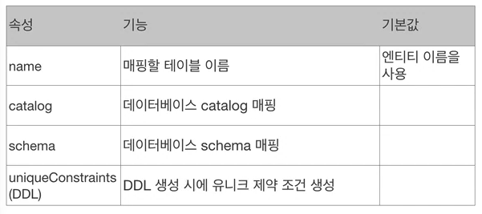
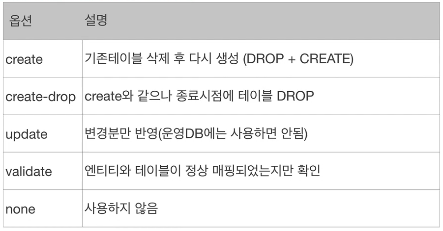
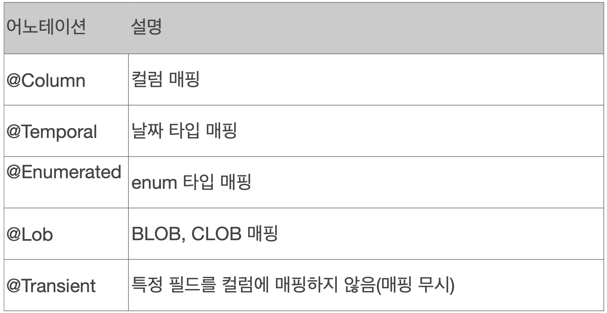
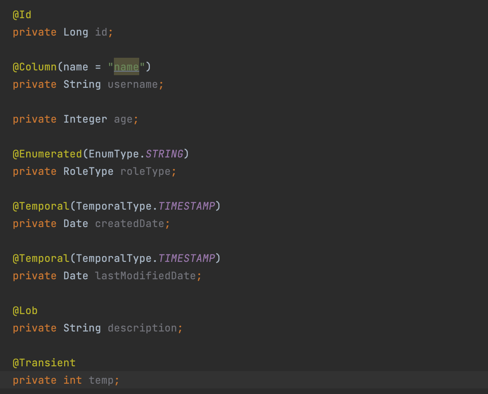
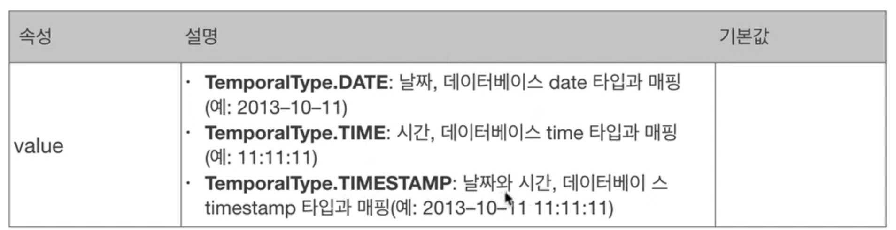
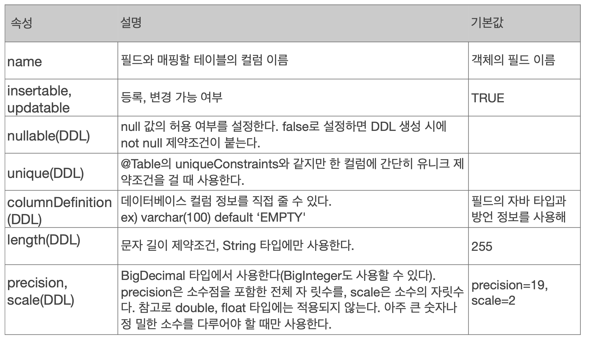
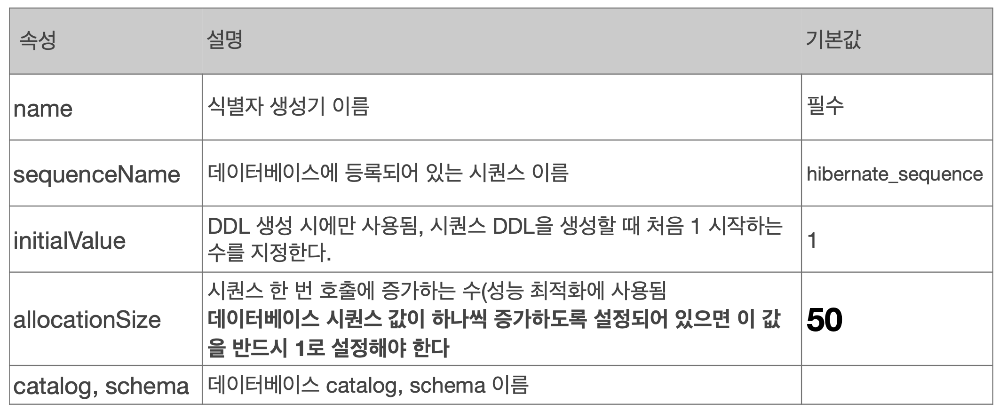
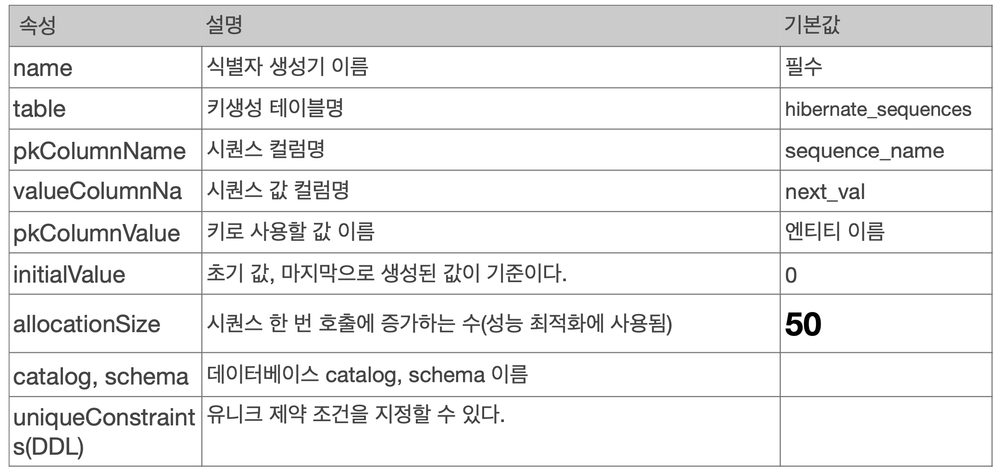

## 목차
- [엔티티 매핑](#엔티티-매핑)
  - [객체와 테이블 매핑](#객체와-테이블-매핑)
    - [엔티티 매핑 소개](#엔티티-매핑-소개)
    - [@Entity](#entity)
    - [@Table](#table)
  - [데이터 스키마 자동 생성](#데이터-스키마-자동-생성)
    - [속성](#속성)
    - [주의](#주의)
    - [DDL 생성 기능](#ddl-생성-기능)
  - [필드와 컬럼 매핑](#필드와-컬럼-매핑)
    - [필드](#필드)
    - [컬럼](#컬럼)
  - [기본 키 매핑](#기본-키-매핑)
    - [기본 키 매핑 방법](#기본-키-매핑-방법)
    - [IDENTITY와 SEQUENCE](#identity와-sequence)
    - [권장하는 식별자 전략](#권장하는-식별자-전략)
    - [데이터 중심 설계의 문제점](#데이터-중심-설계의-문제점)

# 엔티티 매핑

## 객체와 테이블 매핑

### 엔티티 매핑 소개
- 객체와 테이블 매핑: `@Entity`, `@Table`
- 필드와 칼럼 매핑: `@Column`
- 기본 키 매핑: `@Id`
- 연관관계 매핑: `@ManyToOne`, `@JoinColumn`

### @Entity
- `@Entity`가 붙은 클래스는 JPA가 관리하는 클래스, 엔티티라 한다.
- JPA를 사용해서 테이블과 매핑할 클래스는 `@Entity`는 필수
- 주의
  - 기본 생성자 필수(파라미터가 없는 public 또는 protected 생성자)
  - final 클래스, enum, interface, inner 클래스 사용 X
  - 저장할 필드에 final 사용 X

### @Table



- @Table은 엔티티와 매핑할 테이블 지정
- 속성 : name
  - JPA에서 사용할 엔티티 이름
  - 기본값: 클래스 이름을 그대로 사용(ex : Member)
  - 같은 클래스 이름이 없으면 가급적 기본값을 사용한다.

<br>

## 데이터 스키마 자동 생성

- DDL을 애플리케이션 실행 시점에 자동생성
- 테이블 중심 -> 객체 중심
- 데이터베이스 방언을 활용해서 데이터베이스에 맞는 적절한 DDL 생성
- 이렇게 생성된 DDL은 __개발 장비__ 에서만 사용
- 생성된 DDL은 운영서버에서는 사용하지 않거나, 적절히 다듬은 후 사용

### 속성
```xml
<property name="hibernate.hbm2ddk.auto" value="create" />
```



### 주의
- __운영 장비에는 절대 create, create-drop, update 사용하면 안된다.__
- 개발 초기 단계는 create 또는 update
- 테스트 서버는 update 또는 validate
- 스테이징과 운영 서버는 validate 또는 none

기존의 데이터를 다 없애기 때문에 운영서버는 절대 사용하면 안된다!

### DDL 생성 기능
- 제약조건 추가: 회원 이름은 필수, 10자 초과 X 할경우
  - `@Column(nullable = false, length = 10)`

DDL 생성 기능은 DDL을 자동 생성할 때만 사용되고 JPA의 실행 로직에는 영향을 주지 않는다.

<br>

## 필드와 컬럼 매핑

### 필드





- `@Transient`: DB에 매핑하지 않고 메모리에서만 사용하고 싶은 필드에 사용
  - DB에 저장 X, 조회 X
- `@Enumerated` : 자바 enum 타입을 매핑할 때 사용
  - 속성 : value
  - EnumType.ORDINAL: enum 순서를 데이터베이스에 저장(기본값)
  - EnumType.STRING: enum 이름을 데이터베이스에 저장
  - ORDINAL은 사용 X
    - ENUM이 저장될 때 순서대로 0, 1, 2... 으로 저장된다.
    - 만약 ENUM을 추가했을 때, 0번째로 새로 추가한 ENUM의 위치가 들어간다고 가정하자
    - 데이터베이스의 기존의 0번째 ENUM이 모두 새로 추가된 ENUM으로 읽히게 될 것이다.
    - 따라서 ORDINAL은 사용하지 말자!
- `@Temporal`: 날짜 타입(java.util.Date, java.util.Calendar)을 매핑할 때 사용
  - 참고: LocalDate, LocalDateTime을 사용할 때는 생략 가능



- `@Lob`: 데이터베이스 BLOB, CLOB 타입과 매핑
  - 속성은 딱히 없다.
  - 매핑하는 필드 타입이 문자면 CLOB 매핑, 나머지느 BLOB 매핑
    - CLOB: String, char[], java.sql.CLOB
    - BLOB: byte[], java.sql.BLOB


### 컬럼

> @Column(name = "name", nullable = true) ... 처럼 사용



- name : 필드와 매핑할 테이블 칼럼 이름
- insertable, updatable : 해당 컬럼을 수정했을 때 데이터베이스에 insert 할 것인가? update 할 것인가? (기본이 true)
- nullable : not null이 붙음, 데이터베이스에 null이 들어가지 않음 (기본이 true)
- unique : 잘 쓰이지 않고 `@Table(uniqueConstraints = )` 를 선호
- columnDefinition : `columnDefinition = "varchar(100) default ``EMPTY``"`  와 같이 직접 해줄 수 있음
- length : 문자 길이 제약 조건
- percision, scale(DDL) : BigDecimal 타입에서 사용

<br>

## 기본 키 매핑

### 기본 키 매핑 방법
- 직접 할당: `@Id`만 사용
- 자동 생성(`@GeneratedValue`)
  - IDENTITY: 데이터베이스에 위임, MYSQL
  - SEQUENCE: 데이터베이스 시퀸스 오브젝트 사용, ORACLE
    - `@SequenceGenerator` 필요
  - TABLE: 키 생성용 테이블 사용, 모든 DB에서 사용
    - `@TableGenerator` 필요
  - AUTO: 방언에 따라 자동 지정, 기본값

__IDENTITY__

- 기본 키 생성을 데이터베이스에 위임
- 주로 MySQL, PostgreSQL, SQL Server, DB2에서 사용 (MySQL의 AUTO_INCREMENT)
- JPA는 보통 트랜잭션 커밋 시점에 INSERT SQL 실행
- AUTO_INCREMENT는 데이터베이스에 INSERT SQL을 실행한 이후에 ID 값을 알 수 있음
- IDENTITY 전략은 em.persist() 시점에 즉시 INSERT SQL 실행하고 DB에서 식별자를 조회

__SEQUENCE__

- 데이터베이스 시퀀스는 유일한 값을 순서대로 생성하는 특별한 데이터베이스 오브젝트(예: 오라클 시퀀스)




시퀀스를 생성해서 사용할 수도 있음

__TABLE__

- 키 생성 전용 테이블을 하나 만들어서 데이터베이스 시퀀스를 흉내내는 전략
- 장점: 모든 데이터베이스에 적용 가능
- 단점: 성능

@TableGenerator - 속성



### IDENTITY와 SEQUENCE

IDENTITY는 엔티티를 저장할 때 ID를 알기 위해 해당 DB에 보내어 알아내야 한다.  
따라서 `em.persist(Entity)`를 날리는 시점에 쓰기지연 없이 바로 INSERT INTO를 날린다.  
그러나 SEQUENCE는 50번째(allocationSize 50이 기본값)까지 DB에서 아닌 애플리케이션 단에서 ID를 할당해주고 있다가, 50번째가 지나면 한번에 보낸다.  
따라서 SEQUENCE는 ID를 알기위해 DB에 보낼 필요 없이 바로 알 수 있다.  
그렇기 때문에 IDENTITY 전략에서는 모아서(쓰기 지연)이 불가능하다!

> __allocationSize__  
> DB에 미리 `call next value for SEQ`를 날려 미리 DB의 SEQ를 50(기본값)을 확보해두고 메모리 내부에서 ID를 할당한다.


### 권장하는 식별자 전략

- 기본키 제약 조건: null 아님, 유일, 변하면 안된다.
- 미래까지 이 조건을 만족하는 자연키는 찾기 어렵다. 대리키(대체키)를 사용하자.
- 예를 들어 주민등록번호도 기본 키로 적절하지 않다.
- 권장: Long형 + 대체키 + 키 생성전략 사용
- 비즈니스적인 부분을 키로 끌고 오는 것은 적절하지 않다

### 데이터 중심 설계의 문제점
- 현재 방식은 객체 설계를 테이블 설계에 맞춘 방식
- 테이블의 외래키를 객체에 그대로 가져옴
- 객체 그래프 탐색이 불가능
- 참조가 없으므로 UML도 잘못됨
- 식별자로 모든 객체가 이어져있으므로 문제가 생김!

```java
Order {
    private Long memberId;
    -> 
    private Member member;
}
```
이런 식으로 바뀌어야함!