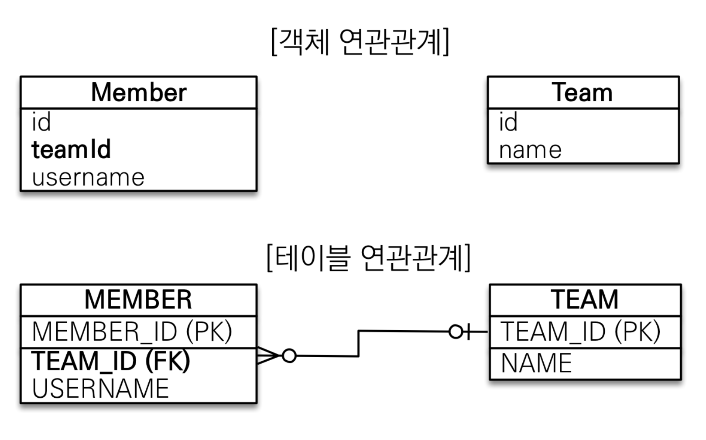
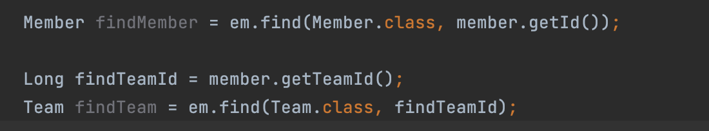
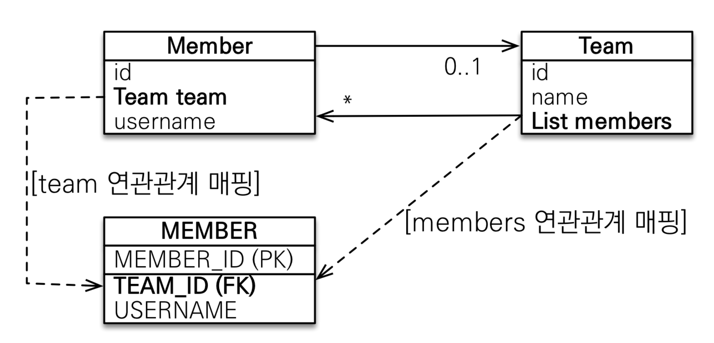
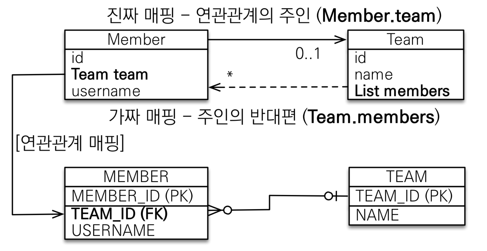
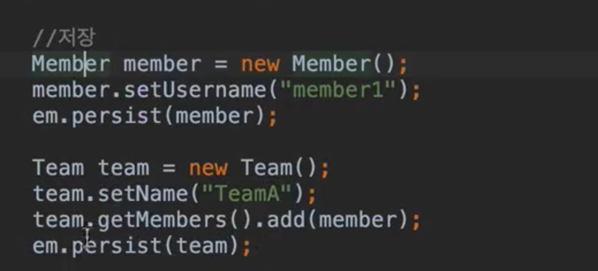
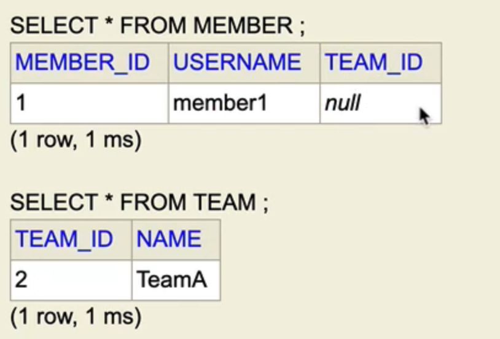
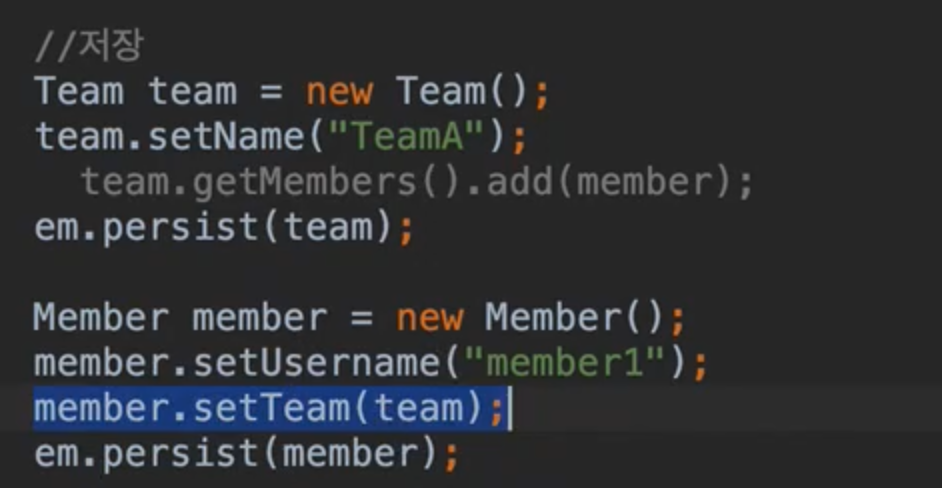
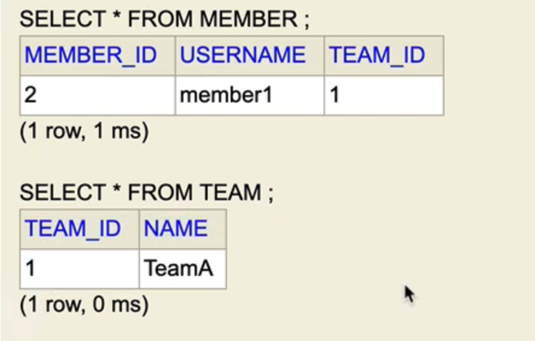

## 목차
- [연관관계 매핑 기초](#연관관계-매핑-기초)
  - [단방향 연관관계](#단방향-연관관계)
    - [연관관계가 필요한 이유](#연관관계가-필요한-이유)
    - [단방향 연관관계](#단방향-연관관계-1)
  - [양방향 연관관계와 연관관계의 주인](#양방향-연관관계와-연관관계의-주인)
    - [객체의 양방향 관계](#객체의-양방향-관계)
    - [테이블의 양방향 연관관계](#테이블의-양방향-연관관계)
    - [연관관계의 주인](#연관관계의-주인)
    - [양방향 매핑시 가장 많이 하는 실수](#양방향-매핑시-가장-많이-하는-실수)
    - [양방향 매핑 정리](#양방향-매핑-정리)

# 연관관계 매핑 기초

## 단방향 연관관계
- 객체와 테이블 연관관계의 차이를 이해
- 객체의 참조와 테이블의 외래 키를 매핑
- 용어 이해
  - 방향: 단방향, 양방향
  - 다중성: 다대일(N:1), 일대다(1:N), 일대일(1:1), 다대다(N:M) 이해
  - 연관관계의 주인(외래키 관리자): 객체 양방향 연관관계는 관리 주인이 필요

### 연관관계가 필요한 이유
> 객체지향 설계의 목표는 자율적인 객체들의 협력 공동체를 만드는 것이다. - 조영호(객체지향의 사실과 오해)

__객체를 테이블에 맞추어 데이터 중심으로 모델링하면, 협력 관계를 만들 수 없다.__  
- 테이블은 외래키 조인을 사용해서 연관된 테이블을 찾는다.
- 객체는 참조를 사용해서 연관된 객체를 찾는다.
- 테이블과 객체 사이에는 이런 큰 간격이 있다.
- 외래키 vs 참조 이런 큰 차이가 있음




### 단방향 연관관계

```java
@Entity
public class Member {

    @ManyToOne
    @JoinColumn(name = "TEAM_ID")
    private Team team;

```

<br>

## 양방향 연관관계와 연관관계의 주인


- 객체 연관관계는 2개
  - 회원 -> 팀 연관관계 1개(단방향)
  - 팀 -> 회원 연관관계 1개(단반향)
  - 객체는 참조를 통해 연결
  - 해당 클래스에 참조를 가지고 있으므로써 연관 관계가 성립된다.
  - 참조가 양쪽에 있어야함
- 테이블 연관관계 = 1개
  - 회원 <-> 팀의 연관관계 1개(양방향)
  - FK 값 하나로 양쪽 테이블이 연결 되어있음

### 객체의 양방향 관계
- 객체의 양방향 관계는 사실 양방향 관계가 아니라 서로 다른 단방향 관계 2개다.
- 객체를 양방향으로 참조하려면 단방향 연관관계를 2개 만들어야 한다.
- A -> B (a.getB())
- B -> A (b.getA())
```java
class A {
  B b;
}

class B {
  A a;
}
```

### 테이블의 양방향 연관관계
- 테이블은 외래 키 하나로 두 테이블의 연관관계를 관리
- MEMBER.TEAM_ID 외래 키 하나로 양방향 연관관계 가짐 (양쪽으로 조인할 수 있다.)
```sql
SELECT *
FROM MEMBER M
JOIN TEAM T ON M.TEAM_ID = T.TEAM_ID

SELECT *
FROM TEAM T
JOIN MEMBER M ON T.TEAM_ID = M.TEAM_ID
```




- Member team을 바꿔야할지, members를 바꿔야할지 모름
- 둘 중 하나로 외래키를 관리해야한다.
- Member에 있는 team 또는 Team의 members로 외래키를 관리해야할 지 정해야함

### 연관관계의 주인
- 객체의 두 관계 중 하나를 연관관계의 주인으로 지정
- 연관관계의 주인만이 외래 키를 관리(등록, 수정)
- 주인이 아닌쪽은 읽기만 가능
- 주인은 mappedBy 속성 사용 X
- 주인이 아니면 mappedBy 속성으로 주인 지정

___누구를 주인으로?__
- 외래 키(FK)가 있는 곳을 주인으로 정해라
- 여기서는 Member.team이 연관관계의 주인



### 양방향 매핑시 가장 많이 하는 실수

__연관관계의 주인에게 값을 입력해야한다!!__




TEAM_ID가 들어가지 않음




TEAM_ID가 들어감  

그러나 순수한 객체 관계를 고려하면 항상 양쪽 다 값을 입력해야 한다.  
하지만 무한 루프를 조심해야한다!!

### 양방향 매핑 정리
- 단방향 매핑만으로도 이미 연관관계 매핑은 완료
- 양방향 매핑은 반대 방향으로 조회(객체 그래프 탐색) 기능이 추가된 것 뿐
- JPQL에서 역방향으로 탐색할 일이 많음
- 단방향 매핑을 잘하고 양방향은 필요할 때 추가해도 됨

__연관관계의 주인을 정하는 기준__
- 비즈니스 로직을 기준으로 연관관계의 주인을 선택하면 안됨
- 연관관계의 주인은 __외래 키의 위치__ 를 기준으로 정해야함