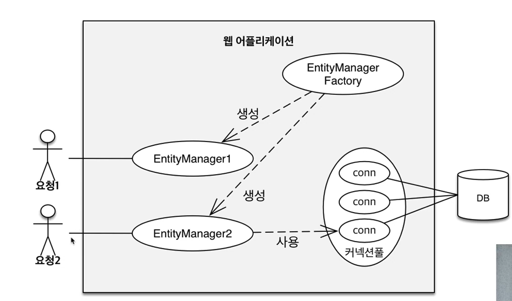
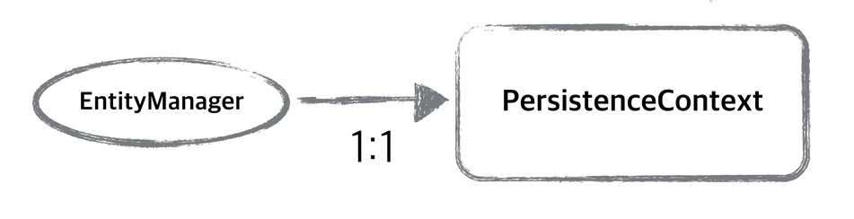
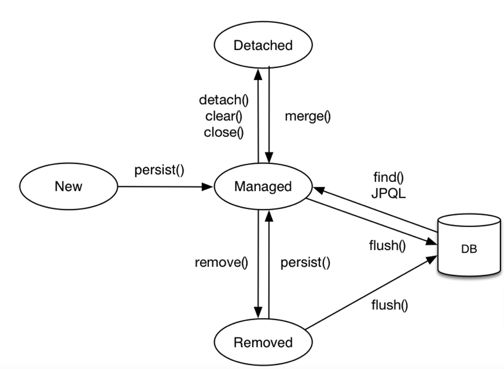
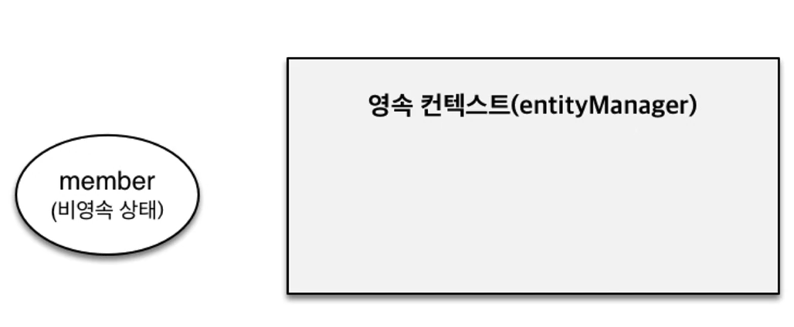
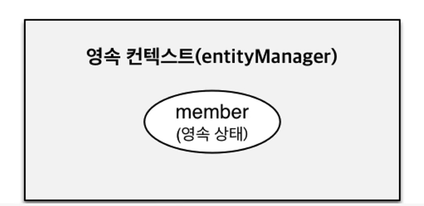
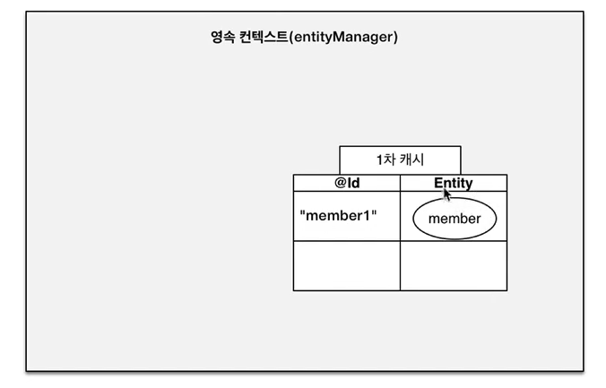
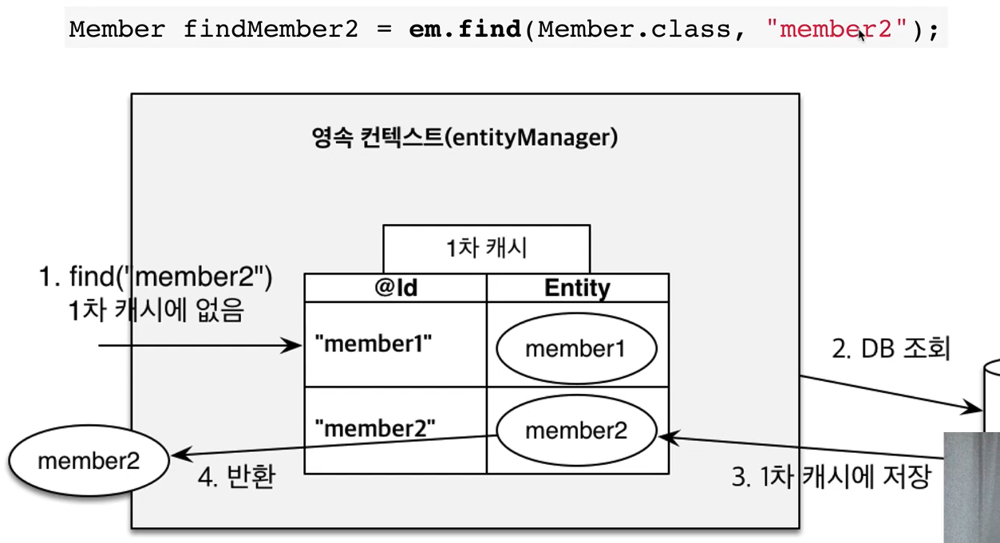
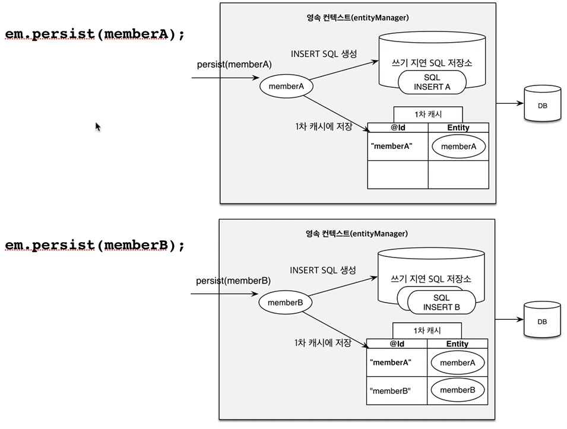
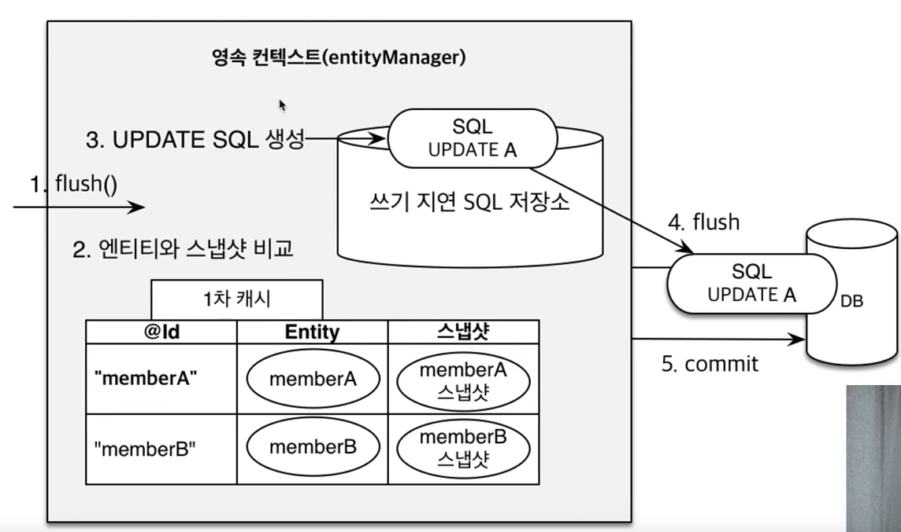

## 목차
- [영속성 관리](#영속성-관리)
  - [영속성 컨텍스트](#영속성-컨텍스트)
    - [엔티티 매니저 팩토리와 엔티티 매니저](#엔티티-매니저-팩토리와-엔티티-매니저)
    - [영속성 컨텍스트란?](#영속성-컨텍스트란)
    - [엔티티의 생명주기](#엔티티의-생명주기)
    - [비영속](#비영속)
    - [영속](#영속)
    - [준영속과 삭제](#준영속과-삭제)
    - [영속성 컨텍스트의 이점](#영속성-컨텍스트의-이점)
    - [1차 캐시와 엔티티 조회](#1차-캐시와-엔티티-조회)
    - [영속성 엔티티의 동일성 보장](#영속성-엔티티의-동일성-보장)
    - [트랜잭션을 지원하는 쓰기 지연](#트랜잭션을-지원하는-쓰기-지연)
    - [변경 감지(Dirty Checking)](#변경-감지dirty-checking)
    - [엔티티 삭제](#엔티티-삭제)
  - [플러시](#플러시)
    - [플러시 발생](#플러시-발생)
    - [영속성 컨텍스트를 플러시하는 방법](#영속성-컨텍스트를-플러시하는-방법)
    - [플러시 모드 옵션](#플러시-모드-옵션)
    - [플러시 정리](#플러시-정리)
  - [준영속 상태](#준영속-상태)
    - [준영속 상태로 만드는 방법](#준영속-상태로-만드는-방법)

# 영속성 관리

## 영속성 컨텍스트

### 엔티티 매니저 팩토리와 엔티티 매니저



1. EntitiyManagerFactory를 통해서 요청이 올때마다 EntityManager를 생성한다.
2. EntitiyManager는 내부적으로 커넥션을 사용해서 DB를 사용하게 된다.

### 영속성 컨텍스트란?
> 엔티티를 영구 저장하는 환경  
> EntitiyManager.persist(entity);

- 영속성 컨텍스트는 논리적인 개념
- 눈에 보이지 않는다.
- 엔티티 매니저를 통해서 영속성 컨텍스트에 접근한다.



엔티티 매니저와 영속성 컨텍스트가 1:1 (J2SE 환경)  
Spring 프레임워크나 J2EE 환경에서는 엔티티 매니저와 영속성 컨텍스트가 N:1 관계이다  

### 엔티티의 생명주기



- 비영속 (new/transient)
  - 영속성 컨텍스트와 전혀 관계없는 새로운 상태
- 영속 (managed)
  - 영속성 컨텍스트에 관리되는 상태
- 준영속 (detached)
  - 영속성 컨텍스트에 저장되었다가 분리된 상태
- 삭제 (removed)
  - 삭제된 상태

### 비영속



```java
Member member = new Member();
member.setId("member1");
member.setUsername("회원1");
```

객체를 생성한 상태 (JPA와 전혀 관계 없는 상태)

### 영속



```java
Member member = new Member();
member.setId("member1");
member.setUsername("회원1");

EntitiyManager em = emf.createEntitiyManager();
em.getTransaction().begin();

em.persist(member);
```

생성한 객체를 영속성 컨텍스트에 저장한 상태  
아직 DB에는 저장이 안된다. (해당 트랜잭션 커밋 이후에 저장)

### 준영속과 삭제

```java
// 회원 엔티티를 영속성 컨텍스트에서 분리, 준영속 상태
em.detach(member);

// 객체를 삭제한 상태 (삭제) 실제 DB에 삭제요청
em.remove(member);
```

### 영속성 컨텍스트의 이점

애플리케이션과 데이터베이스 사이에 중간계층이 있다.

- 1차 캐시
- 동일성 보장
- 트랜잭션을 지원하는 쓰기 지연(transactional write-behind)
- 변경 감지(Dirty Checking)
- 지연 로딩(Lazy Loading)

### 1차 캐시와 엔티티 조회
```java
Member member = new Member();
member.setId("member1");
member.setUsername("회원1");

em.persist(member);
```



```java
Member member = new Member();
member.setId("member1");
member.setUsername("회원1");

em.persist(member);

Member findMember = em.find(Member.class, "member1");
```

1. 멤버 객체를 영속성 컨텍스트에 저장한다.
2. 해당 멤버 객체를 찾으면 먼저 DB에 쿼리를 날려 조회하는 것이 아닌 1차 캐시를 조회한다.
3. 1차 캐시 Entity에 값이 있으면 바로 해당 값을 가져온다.



```java
Member findMember2 = em.find(Member.class, "member2");
```
__1차 캐시에 없는 `member2`를 조회할 경우__

1. 멤버2를 찾는데 만약 1차 캐시에 없다.
2. DB에 쿼리를 날려 Member2를 1차 캐시에 저장한다.
3. 그리고 Member2를 반환한다.
4. 그 이후 Member2를 찾게되면 1차 캐시에 있는 것을 반환한다.

그러나 영속성 컨텍스트는 트랜잭션 단위로 생성하고 삭제하기 때문에 매우 큰 성능 장점이 없다.

### 영속성 엔티티의 동일성 보장

```java
Member a = em.find(Member.class, "member1");
Member b = em.find(Member.class, "member1");

System.out.println(a == b); // 동일성 비교 true
```

1차 캐시로 반복 가능한 읽기 등급의 트랜잭션 격리수준을 데이터베이스가 아닌 애플리케이션 차원에서 제공  

1차 캐시에서 꺼내왔기 때문에 동일성을 보장한다.

### 트랜잭션을 지원하는 쓰기 지연

```java
EntityManager em = emf.createEntityManager();
EntityTrasaction transaction = em.getTransaction();
// 엔티티 매니저는 데이터 변경시 트랜잭션을 시작해야한다.
transaction.begin();

em.persist(memberA);
em.persist(memberB);
// 여기까지 InNSERT SQL을 데이터베이스에 보내지 않는다.

//커밋하는 순간 데이터베이스에 INSERT SQL을 보낸다.
transaction.commit();
```



1. memberA를 저장(persist)한다.
2. memberA가 1차 캐시에 저장된다.
3. JPA가 해당 엔티티를 분석하여 쓰기 지연 SQL 저장소에 INSERT 쿼리를 저장한다.
4. memberB 또한 memberA와 마찬가지로 이루어진다.
5. 쓰기 지연 SQL 저장소에는 MemberA, B의 INSERT 쿼리문이 2개 저장되어 있다.
6. trascation.commit()을 하게되면 쓰기 지연에 쌓여있던 INSERT 쿼리문들이 flush되고 commmit 된다.

### 변경 감지(Dirty Checking)

```java
EntityManager em = emf.createEntityManager();
EntityTransaction transaction = em.getTransaction();
transaction.begin();

// 영속 엔티티 조회
Member memberA = em.find(Member.class, "memberA");

// 영속 엔티티 데이터 수정
memberA.setUsername("hi");
memberA.setAge(10);

// em.update(member) 코드가 없어도 자동으로 변경 감지

transcation.commit();
```



1. 커밋을 하게 되면 flush를 호출한다.
2. 엔티티와 스냅샷을 비교한다.
   - 스냅샷이란 DB를 읽어온 최초 상태를 그대로 본떠 온 것
3. 비교했을 때 다른 점이 있다면 update문을 만들어 쓰기 지연 저장소에 저장한다.
4. update 쿼리를 반영하고 커밋한다.

### 엔티티 삭제

```java
Member memberA = em.find(Member.class, "memberA");

em.remove(memberA);
```

<br>

## 플러시
> 영속성 컨텍스트의 변경내용을 데이터베이스에 반영

### 플러시 발생
- 변경 감지
- 수정된 엔티티 쓰기 지연 SQL 저장소에 등록
- 쓰기 지연 SQL 저장소의 쿼리를 데이터베이스에 전송 (등록, 수정, 삭제 쿼리)

### 영속성 컨텍스트를 플러시하는 방법
- em.flush() - 직접 호출
- 트랜잭션 커밋 - 플러시 자동 호출
- JPQL 쿼리 실행 - 플러시 자동 호출

__JPQL 쿼리 실행시 플러시가 자동으로 호출되는 이유__
```java
em.persist(memberA);
em.persist(memberB);
em.persist(memberC);

// 중간에 JPQL 실행
query = em.createQuery("select m from Member m", Member.class);
List<Member> members = query.getResultList();
```

JPQL 실행 이전에 persist 만으로는 DB에 A,B,C 데이터를 읽을 수 없다.  
따라서 JPQL을 날리기전 플러시를 자동으로 호출해서 DB에 저장한 후 데이터를 읽는다.  

### 플러시 모드 옵션
```java
em.setFlushMode(FlushModeType.COMMIT)
```

`FlushModeType.AUTO`  
커밋이나 쿼리를 실행할 때 플러시 (기본값)  
`FlushModeType.COMMIT`  
커밋할 때만 플러시

### 플러시 정리
- 영속성 컨텍스트를 비우지 않음
- 영속성 컨텍스트의 변경 내용을 데이터베이스에 동기화
- 트랜잭션이라는 작업단위가 중요 -> 커밋 직전에만 동기화 하면 됨

<br>

## 준영속 상태

- 영속 -> 준영속
- 영속 상태의 엔티티가 영속성 컨텍스트에서 분리 (detached)
- 영속성 컨텍스트가 제공하는 기능을 사용 못함

### 준영속 상태로 만드는 방법
- em.detach(entity)
  - 특정 엔티티만 준영속 상태로 전환
- em.clear()
  - 영속성 컨텍스트를 완전히 초기화
- em.close()
  - 영속성 컨텍스트를 종료

```java
Member member = em.find(Member.class, 150L);
member.setName("AAAA");

em.detach(member);

System.out.println("================");

tx.commit();
```
member의 영속성 컨텍스트를 준영속으로 변환시켰으므로 update쿼리를 날리지 않음 (더티 체킹)