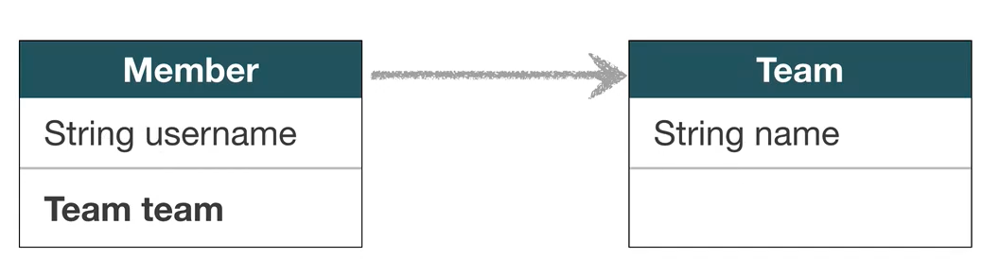
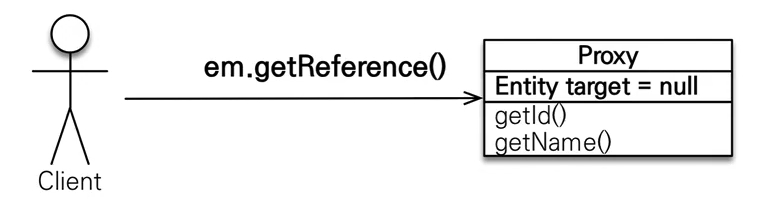
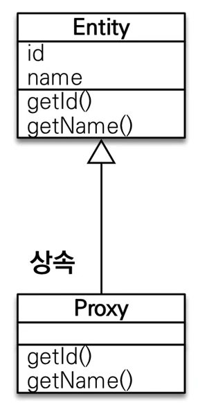
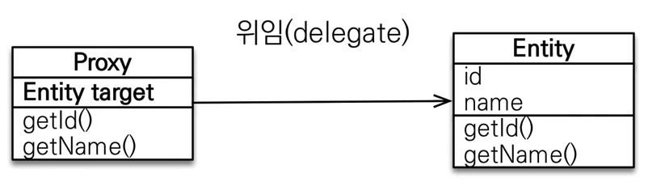
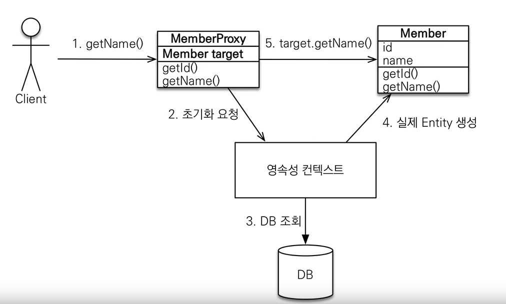
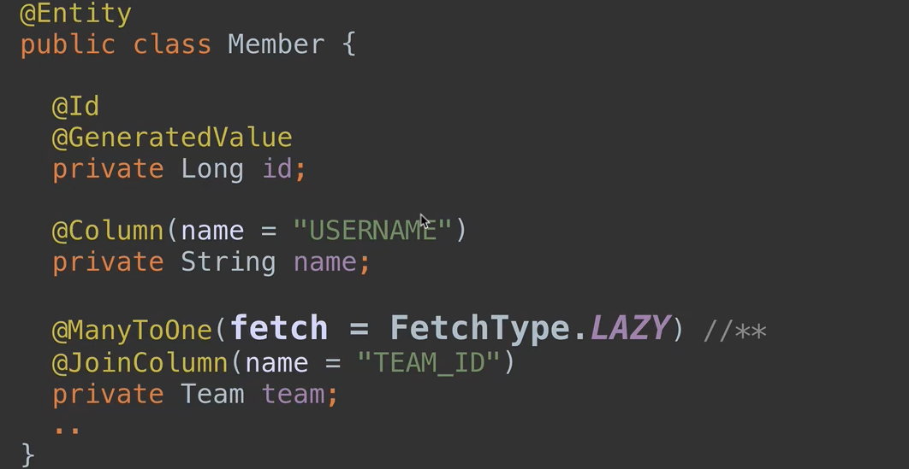
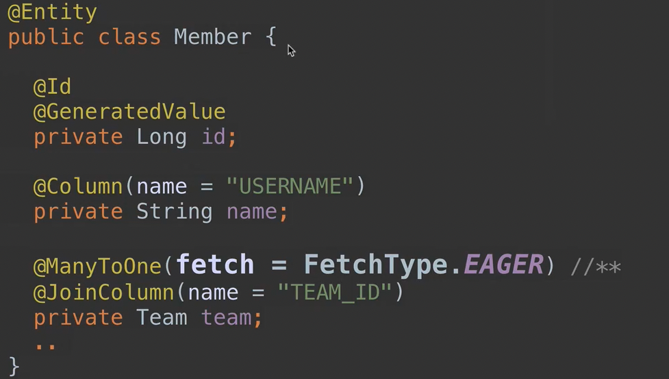
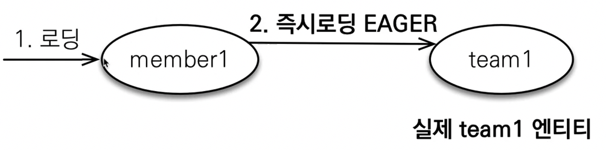
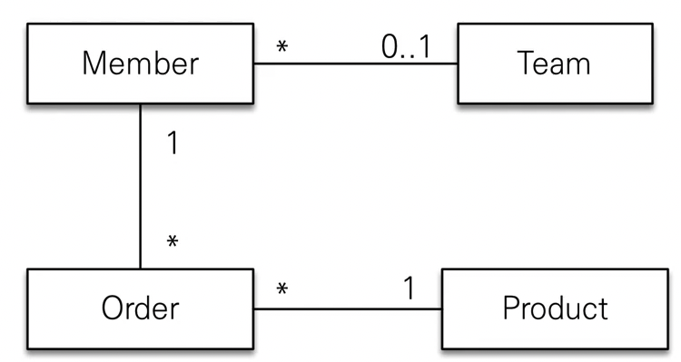
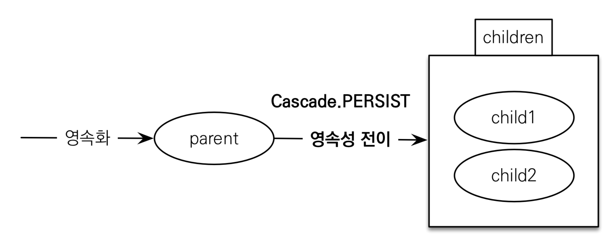

## 목차
- [프록시와 연관관계 관리](#프록시와-연관관계-관리)
  - [프록시](#프록시)
    - [프록시 기초](#프록시-기초)
    - [프록시 특징](#프록시-특징)
    - [프록시 객체의 초기화](#프록시-객체의-초기화)
    - [프록시 특징](#프록시-특징-1)
    - [프록시 확인](#프록시-확인)
  - [즉시 로딩과 지연 로딩](#즉시-로딩과-지연-로딩)
    - [프록시와 즉시로딩 주의](#프록시와-즉시로딩-주의)
    - [지연 로딩 활용](#지연-로딩-활용)
    - [지연 로딩 활용 - 실무](#지연-로딩-활용---실무)
  - [영속성 전이: CASCADE](#영속성-전이-cascade)
    - [영속성 전이: 저장](#영속성-전이-저장)
    - [CASCADE의 종류](#cascade의-종류)
    - [CASCADE는 언제 사용할까?](#cascade는-언제-사용할까)
  - [고아 객체](#고아-객체)
    - [고아 객체 - 주의](#고아-객체---주의)
  - [영속성 전이 + 고아객체, 생명주기](#영속성-전이--고아객체-생명주기)

# 프록시와 연관관계 관리

## 프록시

__Member 를 조회할 때 Team도 조회를 해야할까?__



### 프록시 기초

- em.find() vs em.getReference()
- em.find(): 데이터베이스를 통해서 실제 엔티티 객체 조회
- em.getReference(): 데이터베이스 조회를 미루는 가짜 엔티티 객체 조회



### 프록시 특징
- 실제 클래스를 상속 받아서 만들어짐
- 실제 클래스와 겉 모양이 같다
- 사용하는 입장에서는 진짜 객체인지 프록시 객체인지 구분하지 않고 사용하면 됨



- 프록시 객체는 실제 객체의 참조를 보관
- 프록시 객체를 호출하면 프록시 객체는 실제 객체의 메소드 호출



### 프록시 객체의 초기화

```java
Member member = em.getReference(Member.class, "id1");
member.getName();
```



1. getName을 하면 프록시 객체의 Member에는 값이 null이다.
2. JPA가 영속성 컨텍스트가 Member 조회를 요청한다.
3. 실제 Entity를 생성하고 프록시 객체는 해당 Entity를 참조한다.

### 프록시 특징
- 프록시 객체는 처음 사용할 때 한번만 초기화
- 프록시 객체를 초기화 할 때, 프록시 객체가 실제 엔티티로 바뀌는 것이 아닌ㄴ, 초기화 되면 프록시 객체를 통해서 실제 엔티티에 접근 가능
- 프록시 객체는 엔티티 원본을 상속받음, 따라서 타입 체크시 주의해야함(== 비교 실패, 대신 instance of 사용)
- 영속성 컨텍스트에 찾는 엔티티가 이미 있으면 em.getReference()를 호출해도 실제 엔티티 반환
- 영속성 컨텍스트의 도움을 받을 수 없는 준영속 상태일 때, 프록시를 초기화하면 문제 발생

### 프록시 확인
- 프록시 인스턴스의 초기화 여부 확인
  - emf.getPersistenceUnitUtil.isLoaded(Object entity)
- 프록시 클래스 확인 방법
  - entity.getClass().getName 출력
- 프록시 강제 초기화
  - org.hibernate.Hibernate.initialize(entity)
- 참고: JPA 표준은 강제 초기화 없음
  - 강제 호출: member.getName()

<br>

## 즉시 로딩과 지연 로딩

지연 로딩 LAZY를 사용해서 프록시로 조회



Member 클래스 안에 Team 변수를 LAZY 로딩하면 Member 테이블만 조회한다.  
실제 Member 내부의 Team 객체는 프록시 객체로 대체된다.  
만약 Team을 조회할 시 그제서야 Team 테이블을 조회하여 프록시 객체 내부에 있는 Team 객체를 채워준다.  

__만약 멤버와 팀을 자주 함께 사용한다면?__



- 즉시 로딩 EAGER를 사용해서 함께 조회
- 프록시가 아닌 실제 객체를 가져온다. (프록시를 가져올 필요 없음)


- 즉시 로딩은 멤버를 가져올 때 팀까지 같이 조인해서 가져온다.

### 프록시와 즉시로딩 주의
- 가급적 __지연 로딩__ 만 사용(특히 실무에서)
- 즉시 로딩을 적용하면 예상하지 못한 SQL이 발생
  - 연결되어있는 엔티티가 10개면 10개 다 조인하므로 성능 이슈
- 즉시 로딩은 JPQL에서 N+1 문제를 일으킨다.
  - `em.createQuery(select m from Memberm, Member.class).getResultList();`
  - 해당 JPQL는 SQL로 번역이 된다.
  - 먼저 멤버 테이블에서 모든 멤버를 가져온다.
  - 설정이 즉시 로딩이므로 현재 비어있는 Team을 가져온다
  - Member가 10개면 10번의 Team 테이블 호출이 이루어진다.
  - 쿼리가 너무 많이 나가 성능 문제가 발생
  - 처음 쿼리가 1, 그다음 추가로 나가는 쿼리를 N이기 때문에 N+1라고 불림
  - `fetch join`을 통해 한번에 가져올 수 있음
- `@ManyToOne`, `@OneToOne`은 기본이 즉시 로딩 -> LAZY로 설정
- `@OneToMany`, `@ManyToMany`는 기본이 지연 로딩

### 지연 로딩 활용
- Member와 Team은 자주 함꼐 사용 -> 즉시 로딩
- Member와 Order는 가끔 사용 -> 지연 로딩
- Order와 Product는 자주 함께 사용 -> 즉시로딩



### 지연 로딩 활용 - 실무
- 모든 연관관계에 지연 로딩을 사용해라!
- 실무에서 즉시 로딩을 사용하지 마라!
- JPQL fetch 조인이나, 엔티티 그래프 기능을 사용해라!
- 즉시 로딩은 상상하지 못한 쿼리가 나간다.

<br>

## 영속성 전이: CASCADE
> 특정 엔티티를 영속 상태로 만들 때 연관된 엔티티도 함께 영속 상태로 만들고 싶을 때  
> 예: 부모 엔티티를 저장할 때 자식 엔티티도 함께 저장

### 영속성 전이: 저장

```java
@OneToMany(mappedBy="parent", cascade=CascadeType.PERSIIST)
```


- 부모를 저장할 때, 얘와 연관되어있는 애를 저장할꺼야!
- __주의__
  - 영속성 전이는 연관관계를 매핑하는 것과 아무 관련이 없음
  - 엔티티를 영속화할 때 연관된 엔티티도 함께 영속화하는 편리함을 제공할 뿐

### CASCADE의 종류
- __ALL: 모두 적용__
- __PERSIST: 영속__
- __REMOVE: 삭제__
- MERGE: 병합
- REFRESH: REFRESH
- DETACH: DETACH

### CASCADE는 언제 사용할까?
- 하나의 부모가 자식들을 관리할 때(단일 소유자)
- ex)게시판이랑 첨부파일경로
  - 첨부파일경로는 한 게시판에서만 관리

- 파일을 여러군데에서 관리할 때 사용X
- ex) Parent와 Child 관계에서 Child가 다른 곳(Member)에서 사용되고 있을 때

<br>

## 고아 객체
> 고아 객체 제거: 부모 엔티티와 연관관계가 끊어진 자식 엔티티를 자동으로 삭제  
> orphanRemoval = true

```java
Parent parent = em.find(Parent.class, id);
parent1.getChildren().remove(0)
// 자식 엔티티를 컬렉션에서 제거

// 연관관계가 끊어지면 delete 쿼리가 나감
```

```java
@OneToMany(mappedBy = "parent", cascasde = CasCadeType.ALL, orphanRemoval = true)
private List<Child> childList = new ArrayLsti<>();
```

### 고아 객체 - 주의
- 참조가 제거된 엔티티는 다른 곳에서 참조하지 않는 고아 객체로 보고 삭제하는 기능
- 참조하는 곳이 하나일 때 사용해야함!
- __특정 엔티티가 개인 소유할 때 사용__
- `@OneToOne`, `@OneToMany`만 가능
- 참고: 개념적으로 부모를 제거하면 자식은 고아가 된다. 따라서 고아 객체 제거 기능을 활성화 하면 부모를 제거할 때 자식도 함께 제거된다. 이것은 `CascadeType.REMOVE`처럼 동작한다.

<br>

## 영속성 전이 + 고아객체, 생명주기
- CascadeType.ALL + orphanRemovel=true
- 스스로 생명주기를 관리하는 엔티티는 em.persist()로 영속화, em.remove()로 제거
- 두 옵션을 모두 활성화하면 부모 엔티티를 통해서 자식의 생명 주기를 관리할 수 있음
