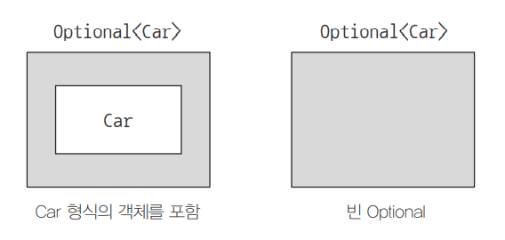
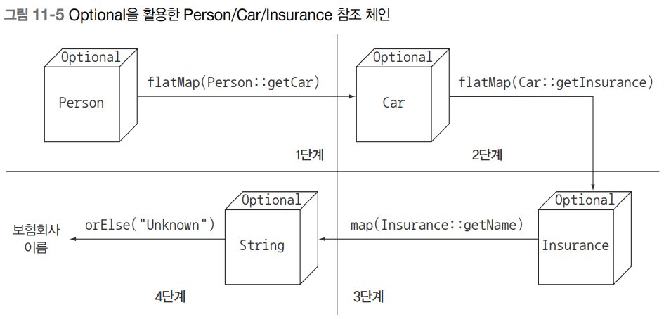
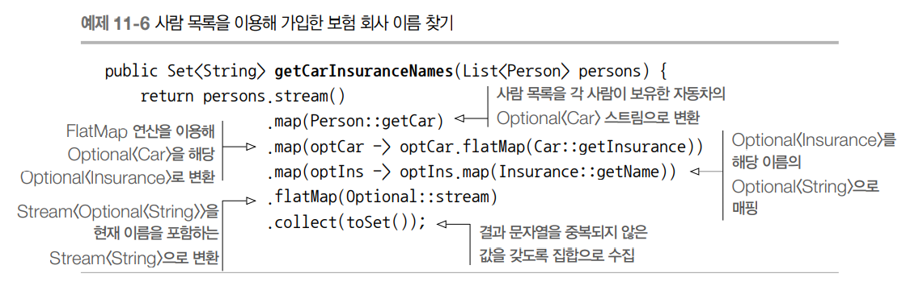
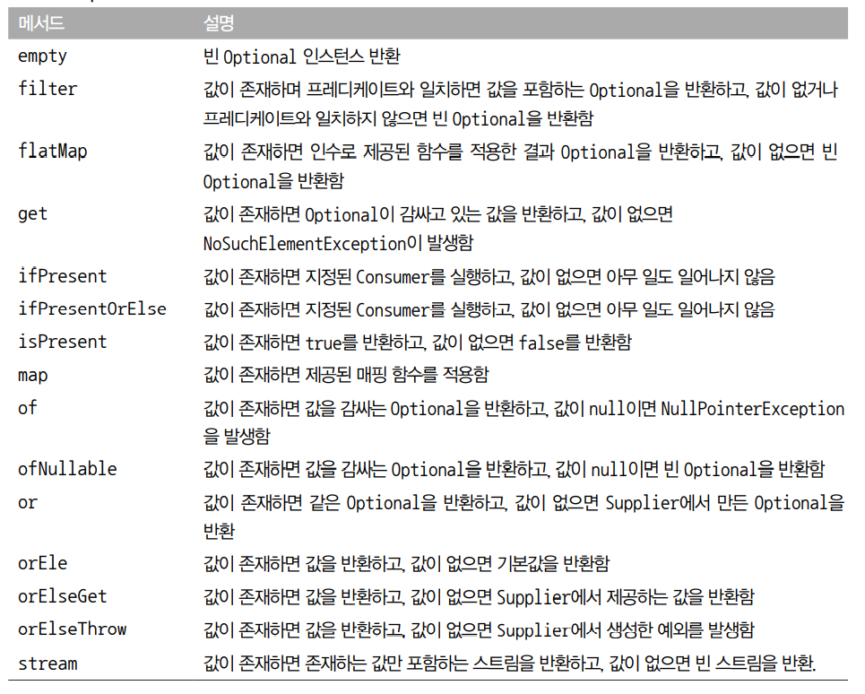
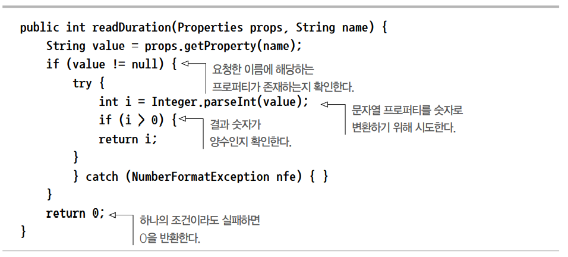
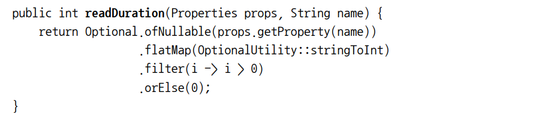

# null 대신 Optional 클래스

## 목차
- [null 대신 Optional 클래스](#null-대신-optional-클래스)
  - [목차](#목차)
  - [Null?](#null)
    - [값이 없는 상황을 어떻게 처리할까?](#값이-없는-상황을-어떻게-처리할까)
    - [보수적인 자세로 NULLPointerException 줄이기](#보수적인-자세로-nullpointerexception-줄이기)
    - [null 때문에 발생하는 문제](#null-때문에-발생하는-문제)
    - [다른 언어는 null 대신 무얼 사용하나?](#다른-언어는-null-대신-무얼-사용하나)
  - [Optional 클래스 소개](#optional-클래스-소개)
  - [Optional 적용 패턴](#optional-적용-패턴)
    - [Optional 객체 만들기](#optional-객체-만들기)
    - [맵으로 Optional의 값을 추출하고 변환하기](#맵으로-optional의-값을-추출하고-변환하기)
    - [flatMap으로 Optional 객체 연결](#flatmap으로-optional-객체-연결)
    - [Optional로 자동차의 보험회사 이름 찾기](#optional로-자동차의-보험회사-이름-찾기)
    - [Optional을 이용한 Person/Car/Insurance 참조 체인](#optional을-이용한-personcarinsurance-참조-체인)
    - [Optional 스트림 조작](#optional-스트림-조작)
    - [디폴트 액션과 Optional 언랩](#디폴트-액션과-optional-언랩)
    - [두 Optional 합치기](#두-optional-합치기)
    - [필터로 특정값 거르기](#필터로-특정값-거르기)
  - [Optional을 사용한 실용 예제](#optional을-사용한-실용-예제)
    - [잠재적으로 null이 될 수 있는 대상을 Optional로 감싸기](#잠재적으로-null이-될-수-있는-대상을-optional로-감싸기)
    - [예외와 Optional 클래스](#예외와-optional-클래스)
    - [기본형 Optional을 사용하지 말아야 하는 이유](#기본형-optional을-사용하지-말아야-하는-이유)
    - [응용](#응용)
  - [마치며](#마치며)

<br>

## Null?
자바로 프로그램을 개발하면서 `NullPointerException`을 겪어본 적이 있을 것이다. null을 사용하면서 당연한 소리라고 생각할 수 있지만, 거시적인 프로그래밍 관점에서는 null문제에 대해 조금 다르게 접근한다.
1965년 토니 호어라는 영국 컴퓨터과학자가 최초의 프로그래밍 언어 중 하나인 알골을 설계하면서 처음 null 참조가 등장했다. 그는 '구현하기 쉬웠기 때문에 null을 도입했다'라고 그 당시를 회상했다. '컴파일러의 자동 확인 기능으로 모든 참조를 안전하게 사용할 수 있을 것'을 목표로 정했다. 그 당시에는 null 참조 및 예외로 값이 없는 상황을 가장 단순하게 구현할 수 있다고 판단했고 결과적으로 null 및 관련 예외가 탄생했다. 여러 해가 지난 후 호어는 null을 만든 것을 '십억 달러짜리 실수'라고 표현했다. 모든 객체가 null일 수 있기 때문에, `NullPointerException`이라는 귀찮은 예외가 발생하는 상황을 몸소 겪었을 것이다.
먼저 null 때문에 어떤 문제가 발생할 수 있는지 간단한 예제로 살펴보자.

### 값이 없는 상황을 어떻게 처리할까?

```java
public class Person {
        private Car car;
        public Car getCar() {
            return car;
        }
    }

    public class Car {
        private Insurance insurance;
        public Insurance getInsurance() {
            return insurance;
        }
    }

    public class Insurance {
        private String name;
        public String getName() {
            return name;
        }
    }
```

다음 코드에서는 어떤 문제가 발생할까? 코드에는 아무 문제가 없는 것처럼 보이지만 차를 소유하지 않은 사람도 많다. 이때 getCar를 호출하면 어떤일이 일어날까? 대부분의 프로그래머는 null 참조를 반환하는 방식으로 자동차를 소유하고 있지 않음을 표현할 것이다. 그러면 getInsurance는 null 참조의 보험 정보를 반환하려 할 것이고 런타임에 NullPointerException이 발생하면서 프로그램 실행이 중단된다.
Car 이외에도 Person이 null이라면? getInsurance가 null을 반환하면 어떻게 될까?

### 보수적인 자세로 NULLPointerException 줄이기
예기치 않은 NullPointerException을 피하려면 어떻게 해야 할까? 대부분의 프로그래머는 null 확인 코드를 추가해서 null 예외 문제를 해결하려 할 것이다. 다음은 null 확인 코드를 추가해서 NullPointerException을 줄이려는 코드다.

```java
public String getCarInsuranceName(Person person) {
        if(person != null) {
            Car car = person.getCar();
            if(car != null) {
                Insurance insurance = car.getInsurance();
                if(insurance != null) {
                    return insurance.getName();
                }
            }
        }
        return "Unknown";
    }
```
위 코드에서는 변수를 참조할 때마다 null을 확인하며 중간 과정에 하나라도 null 참조가 있으면 "Unknown"이라는 문자열을 반환한다. 상식적으로 모든 회사에는 이름이 있으므로 보험회사의 이름이 null인지는 확인하지 않았다. 우리가 확실히 알고 있는 영역을 모델링할 때는 null을 생략할 수 있지만, 데이터를 자바 클래스로 모델링할 때는 이와 같이 생략하기 어렵다.
또한 위의 코드는 모든 변수가 null인지 의심하므로 변수를 접근할 때마다 중첩된 if가 추가되면서 코드 들여쓰기 수준이 증가한다. 따라서 이와 같이 짜게되면 코드의 구조가 엉망이 되고 가독성도 떨어진다.
다음 예제는 다른 방법으로 이 문제를 해결하는 코드다.

```java
public String getCarInsuranceName(Person person) {
        if(person == null) {
            return "Unknown";
        }
        Car car = person.getCar();
        if(car == null) {
            return "Unknown";
        }
        Insurance insurance = car.getInsurance();
        if(insurance == null) {
            return "Unknown";
        }
        return insurance.getName();
    }
```
위 코드는 조금 다른 방법으로 중첩 if 블록을 없앴다. 즉 null 변수가 있으면 즉시 'Unknown'을 반환한다. 하지만 이 예제도 좋은 코드는 아니다. 메서드에 네 개의 출구가 생겼기 때문이다. 이 때문에 유지보수가 어려워진다.

### null 때문에 발생하는 문제
자바에서 null 참조를 사용하면서 발생할 수 있는 이론적, 실용적 문제를 확인해보자.
- 에러의 근원이다 : NullPointerException은 자바에서 가장 흔히 발생하는 에러다.
- 코드를 어지럽힌다 : 때로는 중첩된 null 확인 코드를 추가해야 하므로 null 때문에 코드 가독성이 떨어진다.
- 아무 의미가 없다 null은 아무 의미도 표현하지 않는다. 특히 정적 형식 언어에서 값이 없음을 표현하는 방법으로는 적절하지 않다.
- 자바 철학에 위배된다 : 자바는 개발자로부터 모든 포인터를 숨겼다. 하지만 null은 예외다.
- 형식 시스템에 구멍을 만든다. null은 무형식이며 정보를 포함하고 있지 않으므로 모든 참조 형식에 null을 할당할 수 있다. 이런 식으로 null이 할당되기 시작하면서 시스템의 다른 부분으로 null이 퍼졌을 때 애초에 null이 어떤 의미로 사용되었는지 알 수 없다.

다른 프로그래밍 언어에서는 null 참조를 어떻게 해결할까?

### 다른 언어는 null 대신 무얼 사용하나?
최근 그루비 같은 언어에서는 안전 내비게이션 연산자 (?.)를 도입해서 null 문제를 해결했다. 다음은 그루비에서 자동차에 적용한 보험회사의 이름을 가져오는 그루비 코드 예제다.
```groovy
def carInsuranceName = person?.car?.insurance?.name
```
그루비를 모르는 독자라도 위 코드를 쉽게 이해할 수 있을 것이다.
하스칼, 스칼라 등의 함수형 언어는 아예 다른 과넘에서 null 문제를 접근한다. 하스켈은 선택형 값을 저장할 수 있는 Maybe라는 형식을 제공한다. Maybe는 주어진 형식의 값을 갖거나 아니면 아무 값도 갖지 않을 수 있다. 따라서 null 참조 개념은 자연스럽게 사라진다. 스칼라도 T 형식의 값을 갖거나 아무 값도 갖지 않을 수 있는 Option[T]라는 구조를 제공한다.

그렇다면 자바 8에서는 어떤 기능을 제공할까? 자바 8은 '선택형값' 개념의 영향을 받아서 java.util.Optional<T> 라는 새로운 클래스를 제공한다. 이 장에서는 java.util.Optional<T>를 이용해서 값이 없는 상황을 모델링하는 방법을 설명한다.

<br>

## Optional 클래스 소개
자바 8은 하스켈과 스칼라의 영향을 받아서 java util.Optional<T>라는 새로운 클래스를 제공한다. Optional은 선택형값을 캡슐화하는 클래스다. 예를 들어 어떤 사람이 차를 소유하고 있지 않다면 Person 클래스의 car 변수는 null을 가져야 할 것이다. 하지만 새로운 Optional을 이용할 수 있으므로 null을 할당하는 것이 아니라 아래 그림처럼 변수형을 Optional<Car>로 설정할 수 있다.


<p align="center"></p>

<br>

값이 있으면 Optional 클래스는 값을 감싼다. 반면 값이 없으면 Optional.empty 메서드로 Optional을 반환한다. null 참조와 Optional.empty()는 서로 무엇이 다른지 궁금할 것이다. 의미상으론 둘이 비슷하지만 실제로는 차이점이 많다. null을 참조하려 하면 NullPointerException이 발생하지만 Optional.empty()는 Optional 객체이므로 이를 다양한 방식으로 활용할 수 있다.
null 대신 Optional을 사용하면서 Car 형식이 Optional<Car>로 바뀌었다. 이는 값이 없을 수 있음을 명시적으로 보여준다. 반면 Car 형식을 사용했을 때는 Car에 null 참조가 할당될 수 있는데 이것이 올바른 값인지 아니면 잘못된 값인지 판단할 아무 정보도 없다.

Optional을 이용하여 앞에 예제 코드를 다음과 같이 고칠 수 있다.
```java
public class Person {
        private Optional<Car> car;
        // 사람이 차를 소유했을 수도 않을 수도 있으므로 Optional로 정의한다.

        public Optional<Car> getCar() {
            return car;
        }
    }

    public class Car {
        private Optional<Insurance> insurance;
        // 자동차가 보험에 가입되어 있을 수도 않을 수 도있으므로 Optional로 정의한다.

        public Optional<Insurance> getInsurance() {
            return insurance;
        }
    }

    public class Insurance {
        private String name;
        // 보험회사에는 반드시 이름이 있다.

        public String getName() {
            return name;
        }
    }
```

Optional 클래스를 사용하면서 모델의 의미가 더 명확해졌음을 확인할 수 있다. 사람은 Optional<Car>를 참조하며 자동차는 Optional<Insurance>를 참조하는데, 이는 사람이 자동차를 소유했을 수도 아닐 수도 있으며, 자동차는 보험에 가입되어 있을 수도 아닐 수 도 있음을 명확히 설명한다.
또한 보험회사 이름은 Optional<String>이 아니라 String 형식으로 선언되어 있는데, 이는 보험회사는 반드시 이름을 가져야 함을 보여준다.

<br>

## Optional 적용 패턴
Optional 형식을 이용해서 도메인 모델의 의미를 더 명확하게 만들 수 있었으며, null 참조 대신 값이 없는 상황을 표현할 수 있음을 확인했다. 실제로는 Optional을 사용하는 방법에 대해 알아볼 것이다.

### Optional 객체 만들기

__빈 Optional__
정적 팩토리 메서드 Optional.empty로 빈 Optional 객체를 얻을 수 있다.
```java
Optional<Car> optCar = Optional.empty();
```
__null이 아닌 값으로 Optional 만들기__
정적 팩토리 메서드 Optional.of로 null이 아닌 값을 포함하는 Optional을 만들 수 있다.
```java
Optional<Car> optCar = Optional.of(car);
```
이제 car가 null이라면 즉시 NullPointerException이 발생한다.(Optional을 사용하지 않았다면 car의 프로퍼티에 접근하려할 때 에러가 발생했을 것이다.)

__null값으로 Optional 만들기__
마지막으로 정적 팩토리 메서드 Optional.ofNullable로 null값을 저장할 수 있는 Optional을 만들 수 있다.
```java
Optional<Car> optCar = Optional.ofNullable(car);
```
car가 null이면 빈 Optional 객체가 반환된다.

Optional을 만드는 방법은 총 3가지로 정리할 수 있다.
- Optional.empty();
- Optional.of(Instance);
- Optional.ofNullable(Instance);

Optional을 만드는 방법을 살펴 보았다. 하지만 Optional에서 어떻게 값을 가져오는지는 아직 살펴보지 않았다. get 메서드를 이요해서 Optional의 값을 가져올 수 있는데, 이는 곧 살펴볼 것이다. 그런데 Optional이 비어있으면 get을 호출했을 때 예외가 발생한다. 즉, Optional을 잘못 사용하면 결국 null을 사용했을 때와 같은 문제를 겪을 수 있다. 따라서 먼저 Optional로 명시적인 검사를 제거할 수 있는 방법을 살펴본다.

### 맵으로 Optional의 값을 추출하고 변환하기
예를 들어 보험회사의 이름을 추출한다고 가정하자. 다음 코드처럼 이름 정보에 접근하기 전에 insurance가 null인지 확인해야 한다.
```java
String name = null;
if(insurance != null) {
    name = insurance.getName();
}
```
이런 유형의 패턴에 사용할 수 있도록 Optional은 map 메서드를 지원한다.
```java
Optional<Insurance> optInsurance = Optional.ofNullable(insurance);
Optional<String> name = optInsurance.map(Insurance::getName);
```
Optional의 map 메서드는 스트림의 map 메서드와 개념적으로 비슷하다. Optional이 값을 포함하면 map의 인수로 제공된 함수가 값을 바꾼다. Optional이 비어있으면 아무일도 일어나지 않는다.

### flatMap으로 Optional 객체 연결
앞선 map을 활용하여 다음처럼 코드를 재구현 할 수 있다.

```java
Optional<Person> optPerson = Optional.of(person);
        Optional<String> name =
                optPerson.map(Person::getCar)
                         .map(Car::getInsurance)
                         .map(Insurance::getName);
```
하지만 안타깝게도 위 코드는 컴파일 되지 않는다. 변수 optPerson의 형식은 Optional<Person>이므로 map 메서드를 호출할 수 있다. 하지만 getCar는 Optional<Car> 형식의 객체를 반환한다. 즉, map 연산의 결과는 Optional<Optional<Car>> 형식의 객체다. getInsurance는 또 다른 Optional 객체를 반환하므로 getInsurance 메서드를 지원하지 않는다.
이 문제는 스트림의 flatMap과 비슷한 Optional의 flatMap으로 해결할 수 있다. flatMap은 인수로 받은 함수를 적용해서 생성된 각각의 스트림에서 콘텐츠만 남긴다. 즉, 함수를 적용해서 생성된 모든 스트림이 하나의 스트림으로 병합되어 평준화된다.

### Optional로 자동차의 보험회사 이름 찾기
Optional로 자동차의 보험회사 이름 찾기
```java
public String getCarInsuranceName(Optional<Person> person) {
        return person.flatMap(Person::getCar)
                .flatMap(Car::getInsurance)
                .map(Insurance::getName)
                .orElse("Unknown");
    }
```
위 코드는 Optional을 사용하지 않은 예제와 비교해서, null을 확인하느라 if문을 추가하지 않아 복잡하지 않은 코드가 되었다.
Optional을 사용하므로 도메인 모델과 관련한 암묵적인 지식에 의존하지 않고 명시적으로 형식 시스템을 정의할 수 있다. 정확한 정보 전달은 언어의 가장 큰 목표 중 하나다. Optional을 인수로 받거나 Optional을 반환하는 메서드를 정의한다면 결과적으로 이 메서드를 사용하는 모든 사람에게 이 메서드가 빈 값을 받거나 빈 결과를 반환할 수 있음을 잘 문서화해서 제공하는 것과 같다.

### Optional을 이용한 Person/Car/Insurance 참조 체인
지금까지 Optional<Person>으로 시작해서 Person의 Car, Car의 Insurance, Insurance의 이름 문자열을 참조(map, flatMap을 이용)하는 방법을 살펴보았다.
밑의 그림은 파이프라인 연산을 보여준다.

<p align="center"></p>

호출 체인 중 어떤 메서드가 빈 Optional을 반환한다면 전체 결과로 빈 Optional을 반환하고 아니면 관련 보험회사의 이름을 포함하는 Optional을 반환한다. 이제 반환된 Optional의 값을 어떻게 읽을 수 있을까? 호출 체인의 결과로 Optional<String>이 반환되는데 여기에 회사 이름이 저장되어 있을 수도 있고 없을 수도 있다. 이번 코드에서는 Optional이 비어있을 때 기본값을 제공하는 orElse라는 메서드를 사용했다.

<br>

### Optional 스트림 조작
자바 9에서는 Optional을 포함하는 스트림을 쉽게 처리할 수 있도록 Optional에 stream() 메서드를 추가했다. Optional 스트림을 값을 가진 스트림으로 변환할 때 이 기능을 유용하게 활용할 수 있다.

 <p align="center"></p>

 예제에서 getCar() 메서드가 단순히 Car가 아니라 Optional<Car>를 반환하므로 사람이 자동차를 가지지 않을 수도 있는 상황임을 기억하자.
세 번의 변환 과정을 거친 결과 Stream<Optional<String>>을 얻는데 사람이 차를 갖고 있지 않거나 또는 차가 보험에 가입되어 있지 않아 결과가 비어있을 수도 있다. Optional 덕분에 이런 종류의 연산을 널 걱정없이 안전하게 처리할 수 있지만 마지막 결과를 얻으려면 빈 Optional을 제거하고 값을 언랩해야한다.

```java
Stream<Optional<String>> stream = ...
Set<String> result = stream.filter(Optional::isPresent)
                           .map(Optional::get)
                           .collect(toSet());
```
하지만 [예제 11-6]에서 확인 했듯이 Optional 클래스의 stream() 메서드를 이용하면 한 번의 연산으로 같은 결과를 얻을 수 있다. 이 메서드는 각 Optional이 비어있는지 아닌지에 따라 Optional을 0개 이상의 항목을 포함하는 스트림으로 변환한다. 따라서 이 메서드의 참조를 스트림의 한 요소에서 다른 스트림으로 적용하는 함수로 볼 수 있으며 이를 원래 스트림에 호출하는 flatMap 메서드로 전달할 수 있다. 이 기법을 이용하면 한 단계의 연산으로 값을 포함하는 Optional을 언랩하고 비어있는 Optional은 건너뛸 수 있다.

<br>

### 디폴트 액션과 Optional 언랩
앞선 상황에서는 빈 Optional 상황에서 기본값을 반환하도록 orElse로 Optional을 읽었다. Optional 클래스는 이 외에도 Optional 인스턴스에 포함된 값을 읽는 다양한 방법을 제공한다.
- get()은 값을 읽는 가장 간단한 메서드면서 동시에 가장 안전하지 않은 메서드다. 메서드 get은 래핑된 값이 있으면 해당 값을 반환하고 값이 없으면 NoSuchElementException을 발생시킨다. 따라서 Optional에 값이 반드시 있다고 가정할 수 있는 상황이 아니면 get 메서드를 사용하지 않는 것이 바람직하다. 결국 이 상황은 중첩된 null 확인 코드를 넣는 상황과 크게 다르지 않다.
- orElse 메서드를 이용하면 Optional이 값을 포함하지 않을 때 기본값을 제공할 수 있다.
- orElseGet(Supplier<? extends T> other)는 orElse 메서드에 대응하는 게으른 버전의 메서드다. Optional에 값이 없을 때만 Supplier가 실행되기 때문이다. 디폴트 메서드를 만드는 데 시간이 걸리거나(효율성 때문에) Optional이 비어있을 때만 기본값을 생성하고 싶다면(기본값이 반드시 필요한 상황) orElseGet Supplier<? extends T> other)를 사용해야 한다.
- orElseThrow(Supplier<? extends X> exceptionSupplier)는 Optional이 비어있을 때 예외를 발생시킨다는 점에서 get 메서드와 비슷하다. 하지만 이 메서드는 발생시킬 예외의 종류를 선택할 수 있다.
- ifPresent(Consumer<? super T> consumer)를 이용하면 값이 존재할 때 인수로 넘겨준 동작을 실행할 수 있다. 값이 없으면 아무 일도 일어나지 않는다.

자바 9에서는 다음의 인스턴스 메서드가 추가되었다.
- ifPresentOrElse(Consumer<? super T> action, Runnable emptyAction). 이 메서드는 Optional이 비었을 때 실행할 수 있는 Runnable을 인수로 받는다는 점만 ifPresent와 다르다.

<br>

### 두 Optional 합치기
Person과 Car 정보를 이용해서 가장 저렴한 보험료를 제공하는 보험회사를 찾는 로직을 구현한다고 가정하자.
만약 Person과 Car 둘 중 하나라도 비어있으면 빈 Optional<Insurance>를 반환한다. Optional은 isPresent라는 메서드도 제공하는데 이를 이용하여 다음과 같이 구현할 수 있다.
```java
    public Insurance nullSafeFindCheapestInsurance
    (Optional<Person> person, Optional<Car> car) {
        if(person.isPresent() && car.isPresent()) {
            return Optional.of(findCheapestInsurance(person.get(), car.get()));
        }
        else {
            return Optional.empty();
        }
   }
```
이 메서드의 장점은 person과 car의 시그니처만으로 둘 다 아무 값도 반환하지 않을 수 있다는 정보를 명시적으로 보여준다는 것이다. 하지만 이보다 더 자연스럽게 개선할 수 있는 방법이 있다.
```java
public Insurance nullSafeFindCheapestInsurance
(Optional<Person> person, Optional<Car> car) {
        return person.flatMap(p -> car.map(c -> findCheapestInsurance(p, c)));
    }
```
다음처럼 어떤 조건문도 사용하지 않고 한 줄의 코드로 재구현할 수 있다.

### 필터로 특정값 거르기
예를 들어 보험회사 이름이 'CambridgeInsurance'인지 확인해야 한다고 가정하자. 이 작업을 안전하게 수행하려면 Insurance 객체가 null인지 여부를 확인한 다음 getName 메서드를 호출해야 한다.
```java
Insurance insurance = ...;
if(insurance != null && "CambridgeInsurance".equals(insurance.getName())) {
    System.out.print("ok");
}
```
Optional 객체의 filter 메서드를 이용해서 다음과 같이 코드를 재구현할 수 있다.
```java
Optional<Insurance> optInsurance = ...;
optInsurance.filter(insurance ->
 "CambridgeInsurance".equals(insurance.getName()))
 .ifPresent(x -> System.out.println("ok"));
 ```

 __Optional 클래스의 메서드__
 <p align="center"></p>

<br>

 ## Optional을 사용한 실용 예제
 Optional 클래스를 효과적으로 이용하려면 잠재적으로 존재하지 않는 값의 처리 방법을 바꿔야 한다. 즉, 코드 구현만 바꾸는 것이 아니라 네이티브 자바 API와 상호작용하는 방식도 바꿔야 한다.

<br>

### 잠재적으로 null이 될 수 있는 대상을 Optional로 감싸기
기존의 자바 API에서는 null을 반환하면서 요청한 값이 없거나 어떤 문제로 계산에 실패했음을 알린다. Map의 get 메서드는 요청한 키에 대응하는 값을 찾지 못했을 때 null을 반환한다. 지금까지 살펴본 것처럼 null을 반환하는 것보다는 Optional을 반환하는 것이 더 바람직하다.

```java
Object value = map.get("key");
```

문자열 'key'에 해당하는 값이 없으면 null이 반환될 것이다. map에서 반환하는 을 Optional로 감싸서 이를 개선할 수 있다.
```java
Optional<Object> value = Optional.ofNullable(map.get("key"));
```
이와 같이 null일 수 있는 값을 Optional로 안전하게 변환할 수 있다.

<br>

### 예외와 Optional 클래스
자바 API는 값을 제공할 수 없을 때 null을 반환하는 대신 예외를 발생시킬 때도 있다.
이 때 try/catch를 사용해서 Optional 클래스로 감쌀 수 있다.

```java
public static Optional<Integer> stringToInt(String s) {
    try {
        return Optional.of(Integer.parseInt(s));
    } catch (NumberFormatException e) {
        return Optional.empty();
    }
}
```

<br>

### 기본형 Optional을 사용하지 말아야 하는 이유
스트림처럼 Optional도 기본형으로 특화된 OptionalInt, OptionalLong, OptionalDouble 등의 클래스를 제공한다. 예를 들어 Optional<Integer> 대신 OptionalInt를 반환할 수 있다. Optional은 스트림과 달리 기본형 특화 Optional을 이용해서 성능을 향상 시킬 수 없다. 또한 기본형 특화 Optional은 유용한 메서드들을 지원하지 않으므로 권장하지 않는다.

<br>

### 응용
다음은 Optional을 사용하지 않는 프로퍼티에서 지속 시간을 읽는 메서드이다.
 <p align="center"></p>

 이 메서드를 Optional로 사용하여 다음과 같이 바꿀 수 있다.

  <p align="center"></p>
훨씬 더 간단하게 바뀐 것을 확인할 수 있다.

  <br>

## 마치며
- 역사적으로 프로그래밍 언어에서는 null 참조로 값이 없는 상황을 표현해왔다.
- 자바 8에서는 값이 있거나 없음을 표현할 수 있는 클래스 java.util.Optional<T>를 제공한다.
- 팩토리 메서드 Optional.empty, Optional.of, Optional.ofNullable 등을 이용해서 Optional 객체를 만들 수 있다.
- Optional 클래스는 스트림과 비슷한 연산을 수행하는 map, flatMap, filter 등의 메서드를 제공한다.
- Optional로 값이 없는 상황을 적절하게 처리하도록 강제할 수 있다. 즉, Optional로 예상치 못한 null 예외를 방지할 수 있다.
- Optional을 활용하면 더 좋은 API를 설계할 수 있다. 즉, 사용자는 메서드의 시그니처만 보고도 Optional값이 사용되거나 반환되는지 예측할 수 있다.