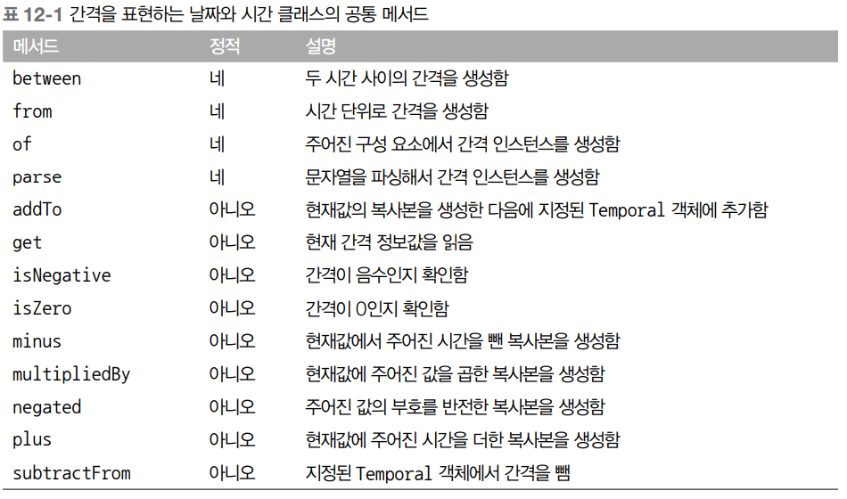
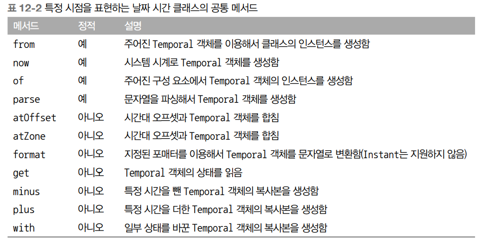

# 새로운 날짜와 시간 API

## 목차
- [새로운 날짜와 시간 API](#새로운-날짜와-시간-api)
  - [목차](#목차)
  - [LocalDate, LocalTime, Instant, Duration, Period 클래스](#localdate-localtime-instant-duration-period-클래스)
    - [LocalDate와 LocalTime 사용](#localdate와-localtime-사용)
    - [날짜와 시간 조합](#날짜와-시간-조합)
    - [Instant 클래스 : 기계의 날짜와 시간](#instant-클래스--기계의-날짜와-시간)
    - [Duration과 Period 정의](#duration과-period-정의)
  - [날짜 조정, 파싱, 포매팅](#날짜-조정-파싱-포매팅)
    - [TemporalAdjusters 사용하기](#temporaladjusters-사용하기)
    - [날짜와 시간 객체 출력과 파싱](#날짜와-시간-객체-출력과-파싱)
  - [다양한 시간대와 캘린더 활용 방법](#다양한-시간대와-캘린더-활용-방법)
  - [마치며](#마치며)

<br>

기존 자바 API에서는 개발자가 만족할만한 날짜와 시간 기능을 제공하지 못하였다. 하지만 자바 8에서는 지금까지의 날짜와 시간 문제를 개선하는 새로운 날짜와 시간 API를 제공한다.
자바 1.0에서는 java.util.Date 클래스 하나로 날짜와 시간 관련 기능을 제공했다. Date라는 이름과 달리 날짜가 아닌 밀리초 단위로 표현한다. 게다가 1900년을 기준으로 하는 오프셋, 0에서 시작하는 달 인덱스 등 모호한 설계로 유용성이 떨어졌다.
이러한 문제를 해결하기 위해서 자바 1.1에서는 Calendar라는 클래스를 대안으로 제공하였지만 이또한 많은 문제가 있었다.
이번 장에서는 새로운 날짜와 시간 API가 제공하는 새로운 기능을 살펴보겠다.

## LocalDate, LocalTime, Instant, Duration, Period 클래스

<br>

### LocalDate와 LocalTime 사용
새로운 날짜와 시간 API를 사용할 때 처음 접하게 되는 것이 LocalDate다. LocalDate 인스턴스는 시간을 제외한 날짜를 표현하는 불변 객체다.
정적 팩토리 메서드 of로 LocalDate 인스턴스를 만들 수 있다.
```java
LocalDate date = LocalDate.of(2017, 9, 21); // 2017-09-21
int year = date.getYear(); // 2017
Month month = date.getMonth(); // SEPTEMBER
int day = date.getDayOfMonth(); // 21
DayOfWeek ow = date.getDayOfWeek(); // THURSDAY
int len = date.lengthOfMonth(); // 31
boolean leap = date.isLeapYear(); // false (윤년이 아님)
LocalDate today = LocalDate.now(); // 현재 날짜 정보
```

<br>

get 메서드에 TemporalField를 전달해서 정보를 얻는 방법도 있다. TemporalField는 시간 관련 객체에서 어떤 필드의 값에 접근할지 정의하는 인터페이스다. 열거자 ChronoField는 TemporalField 인터페이스를 정의하므로 다음 코드에서 보여주는 것처럼 ChronoField의 열거자 요소를 이용해서 원하는 정보를 쉽게 얻을 수 있다.

```java
// TemporalField를 이용해서 LocalDate값 읽기
int year = date.get(ChronoField.YEAR);
int month = date.get(ChronoField.MONTH_OF_YEAR);
int day = date.get(ChronoField.DAY_OF_MONTH);

// 내장 메서드를 이용해 가독성을 높일 수도 있다.
int year = date.getYear();
int month = date.getMonthValue();
int day = date.getDayOfMonth();
```

시간은 LocalTime 클래스로 표현할 수 있다. 오버로드 버전의 두 가지 정적 메서드 of로 LocalTime 인스턴스를 만들 수 있다. 즉, 시간과 분을 인수로 받는 of 메서드와 시간과 분, 초를 인수로 받는 of 메서드가 있다. getter 메서드를 사용하여 시간을 가져올 수도 있다.

```java
LocalTime time = LocalTime.of(13, 45, 20); // 13:45:20
int hour = time.getHour(); // 13
int minute = time.getMinute(); // 45
int second = time.getSecond(); // 20
```

parse 정적 메서드를 사용하여 LocalDate와 LocalTime의 인스턴스를 만드는 방법도 있다.

```java
LocalDate date = LocalDate.parse("2017-09-21");
LocalTime time = LocalTime.parse("13:45:20");
```
문자열을 파싱할 수 없을 경우 DateTimeParseException (RuntimeException을 상속받은 예외)을 일으킨다.

<br>

### 날짜와 시간 조합
LocalDateTime은 LocalDate와 LocalTime을 쌍으로 갖는 복합 클래스다. 즉, LocalDateTime은 날짜와 시간을 모두 표현할 수 있으며 다음 코드에서 보여주는 것처럼 직접 LocalDateTime을 만드는 방법도 있고 날짜와 시간을 조합하는 방법도 있다.

```java
// LocalDateTime을 직접 만드는 방법과 날짜와 시간을 조합하는 방법
// 2017-09-21T13:45:20
LocalDateTime dt1 = LocalDateTime.of(2017, Month.SEPTEMBER, 21, 13, 45, 20);
LocalDateTime dt2 = LocalDateTime.of(date, time);
LocalDateTime dt3 = date.atTime(13, 45, 20);
LocalDateTime dt4 = date.atTime(time);
LocalDateTime dt5 = time.atDate(date);
```

반대로 LocalDateTime의 내장 메서드를 이용하여 LocalDate나 LocalTime 인스턴스를 추출할 수 있다.

```java
LocalDate date1 = dt1.toLocalDate(); 2017-09-21
LocalTime time1 = dt1.toLocalTime(); 13:45:20
```

<br>

### Instant 클래스 : 기계의 날짜와 시간
기계는 시간을 사람의 단위로 표현하기 어렵다. 새로운 java.time.Instant 클래스에서는 기계적인 관점에서 시간을 표현한다.
팩토리 메서드 ofEpochSecond에 초를 넘겨줘서 Instant 클래스 인스턴스를 만들 수 있다. Instant 클래스는 나노초의 정밀도를 제공한다. 또한 오버로드된 버전에서는 두 번째 인수를 이용해서 나노초 단위로 시간을 보정할 수 있다.

```java
Instant.ofEpochSecond(3);
Instant.ofEpochSecond(3, 0);
Instant.ofEpochSecond(2, 1_000_000_000); // 2초 이후의 1억 나노초(1초)
Instant.ofEpochSecond(4, -1_000_000_000); // 4초 이전의 1억 나노초(1초)
```
LocalDate 등을 포함하여 사람이 읽을 수 있는 날짜 시간 클래스에서 그랬던 것처럼 Instant클래스도 사람이 확인할 수 있도록 시간을 표시해주는 정적 팩토리 메서드 now를 제공한다. 하지만 Instant는 기계 전용의 유틸리티라는 점을 기억하자. 즉, Instant는 초와 나노초 정보를 포함한다. 따라서 Instant는 사람이 읽을 수 있는 시간 정보를 제공하지 않는다.

<br>

### Duration과 Period 정의
두 시간 객체 사이의 지속시간은 duration을 사용하여 만들 수 있다. 다음 코드처럼 Duration 클래스의 정적 팩토리 메서드 between을 이용하여 두 개의 LocalTime, LocalDateTime 또는 Instant로 Duration을 만들 수 있다.
```java
Duration d1 = Duration.between(time1, time2);
Duration d1 = Duration.between(dateTime1, dateTime2);
Duration d2 = Duration.between(instant1, instant2);
```
이 떄 Duration은 초와 나노초로 시간 단위를 표현하므로 between 메서드에 LocalDate를 전달할 수 없다. 대신 Period 클래스를 사용하여 년, 월, 일로 표현할 수 있다.
```java
Period tenDays = Period.between(LocalDate.of(2017, 9, 11), LocalDate.of(2017, 9, 21));
```
이 외에도 Duration과 Period 클래스는 다양한 팩토리 메서드를 제공한다.
```java
Duration threeMinutes = Duration.ofMinutes(3);
Duration threeMinutes = Duration.of(3, ChronoUnit.MINUTES);
Period tenDays = Period.ofDays(10);
Period threeWeeks = Period.ofWeeks(3);
Period twoYearsSixMonthsOneDay = Period.of(2, 6, 1);
```

다음 표는 Duration과 Period 클래스가 공통으로 제공하는 메서드를 보여준다.

  <p align="center"></p>

지금까지 살펴본 모든 클래스는 불변이다.

<br>

## 날짜 조정, 파싱, 포매팅
withAttribute 메서드로 기존의 LocalDate를 바꾼 버전을 직접 간단하게 만들 수 있다.
```java
LocalDate date1 = LocalDate.of(2017, 9, 21); 2017-09-21
LocalDate date2 = date1.withYear(2011); 2011-09-21
LocalDate date3 = date2.withDayOfMonth(25); 2011-09-25
LocalDate date4 = date3.with(ChronoField.MONTH_OF_YEAR, 2); 2011-02-25
```
또한 지정된 시간을 추가하거나 뺄 수 있다.
```java
LocalDate date1 = LocalDate.of(2017, 9, 21); 2017-09-21
LocalDate date2 = date1.plusWeeks(1); 2017-09-28
LocalDate date3 = date2.minusYears(6); 2011-09-28
LocalDate date4 = date3.plus(6, ChronoUnit.MONTHS); 2012-03-28
```

LocalDate, LocalTime, LocalDateTime, Instant 등 날짜와 시간을 표현하는 모든 클래스는 서
로 비슷한 메서드를 제공한다. 다음 표는 이들 공통 메서드를 설명한다.

  <p align="center"></p>

<br>

### TemporalAdjusters 사용하기
TemporalAdjusters를 활용하여 더 복잡하게 날짜 조정 기능을 사용할 수 있다.
```java
import static java.time.temporal.TemporalAdjusters.*;
LocalDate date1 = LocalDate.of(2014, 3, 18); 2014-03-18
LocalDate date2 = date1.with(nextOrSame(DayOfWeek.SUNDAY)); 2014-03-23
LocalDate date3 = date2.with(lastDayOfMonth()); 2014-03-31
```
다음 표는 다양한 TemporalAdjusters의 팩토리 메서드로 만들 수 있는 TemporalAdjuster 리스트를 보여준다.

  <p align="center"></p>


<br>

### 날짜와 시간 객체 출력과 파싱
날짜와 시간 관련 작업에서 포매팅과 파싱은 서로 떨어질 수 없는 관계다. 심지어 포매팅과 파싱 전용 패키지인 java.time.format이 새로 추가되었다. 이 패키지에서 가장 중요한 클래스는 DateTimeFormatter다. 정적 팩토리 메서드와 상수를 이용해서 손쉽게 포매터를 만들 수 있다. DateTimeFormatter 클래스는 BASIC_ISO_DATE와 ISO_LOCAL_DATE 등의 상수를 미리 정의하고 있다. DateTimeFormatter를 이용해서 날짜나 시간을 특정 형식의 문자열로 만들 수 있다. 다음은 두 개의 서로 다른 포매터로 문자열을 만드는 예제다.
```java
LocalDate date = LocalDate.of(2014, 3, 18);
String s1 = date.format(DateTimeFormatter.BASIC_ISO_DATE); 20140318
String s2 = date.format(DateTimeFormatter.ISO_LOCAL_DATE); 2014-03-18
```
반대의 경우도 가능하다.
```java
LocalDate date1 = LocalDate.parse("20140318", DateTimeFormatter.BASIC_ISO_DATE);
LocalDate date2 = LocalDate.parse("2014-03-18", DateTimeFormatter.ISO_LOCAL_DATE);
```

모든 DateTimeFormatter는 스레드에서 안전하게 사용할 수 있는 클래스다. 또한 특정 패턴으로 포매터를 만들 수 있는 정적 팩토리 메서드도 제공한다.
```java
DateTimeFormatter formatter = DateTimeFormatter.ofPattern("dd/MM/yyyy");
LocalDate date1 = LocalDate.of(2014, 3, 18);
String formattedDate = date1.format(formatter);
LocalDate date2 = LocalDate.parse(formattedDate, formatter);
```

<br>

## 다양한 시간대와 캘린더 활용 방법
java.time.ZoneId 클래스를 이용하여 시간대를 간단하게 처리할 수 있다.

<br>

## 마치며
- 자바 8 이전 버전에서 제공하는 기존의 java.util.Date 클래스와 관련 클래스에서는 여러 불일치점들과 가변성, 어설픈 오프셋, 기본값, 잘못된 이름 결정 등의 설계 결함이 존재했다.
- 새로운 날짜와 시간 API에서 날짜와 시간 객체는 모두 불변이다.
- 새로운 API는 각각 사람과 기계가 편리하게 날짜와 시간 정보를 관리할 수 있도록 두 가지 표현 방식을 제공한다.
- 날짜와 시간 객체를 절대적인 방법과 상대적인 방법으로 처리할 수 있으며 기존 인스턴스를 변환하지 않도록 처리 결과로 새로운 인스턴스가 생성된다.
- TemporalAdjuster를 이용하면 단순히 값을 바꾸는 것 이상의 복잡한 동작을 수행할 수 있으며 자신만의 커스텀 날짜 변환 기능을 정의할 수 있다.
- 날짜와 시간 객체를 특정 포맷으로 출력하고 파싱하는 포매터를 정의할 수 있다. 패턴을 이용하거나 프로그램으로 포매터를 만들 수 있으며 포매터는 스레드 안정성을 보장한다.
- 특정 지역/장소에 상대적인 시간대 또는 UTC/GMT 기준의 오프셋을 이용해서 시간대를 정의할 수 있으며 이 시간대를 날짜와 시간 객체에 적용해서 지역화할 수 있다.
- ISO-8601 표준 시스템을 준수하지 않는 캘린더 시스템도 사용할 수 있다.
