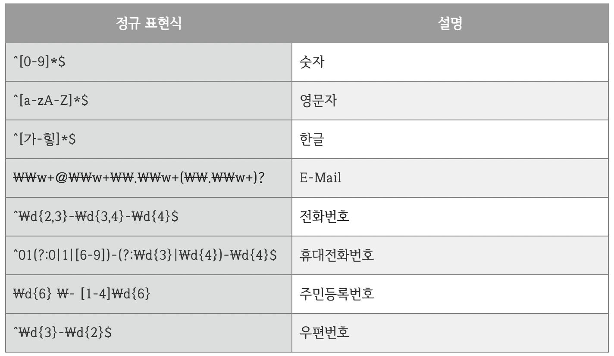

## 목차
- [Pattern & Matcher](#pattern--matcher)
  - [정규 표현식](#정규-표현식)
    - [자주 사용하는 정규 표현식](#자주-사용하는-정규-표현식)
  - [Pattern과 Matcher 클래스](#pattern과-matcher-클래스)
  - [참고 자료](#참고-자료)

# Pattern & Matcher

## 정규 표현식
> 특정한 규칙을 가진 문자열의 집합을 표현하는데 사용하는 형식 언어

### 자주 사용하는 정규 표현식


## Pattern과 Matcher 클래스

```java
    Pattern PATTERN = Pattern.compile("^[_a-z0-9-]+(.[_a-z0-9-]+)*@(?:\\w+\\.)+\\w+$");

    Matcher m = PATTERN.matcher("abc@gmail.com");

    m.matches(); // -> true or false로 해당 문자열을 판단
```

1. `Pattern.compile()`과 정규 표현식을 사용하여 Pattern을 생성한다.
2. `Pattern.matcher()`과 비교할 문자열을 넣어 Matcher을 생성한다.
3. `Matcher.matches()`는 해당 정규 표현식과 문자열을 비교하여 맞는지 boolean으로 확인한다.

<br>

## 참고 자료
- https://coding-factory.tistory.com/529