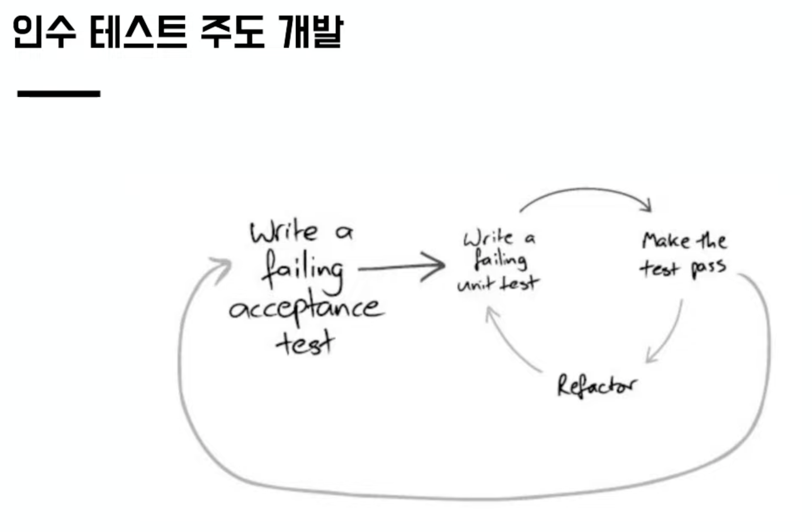
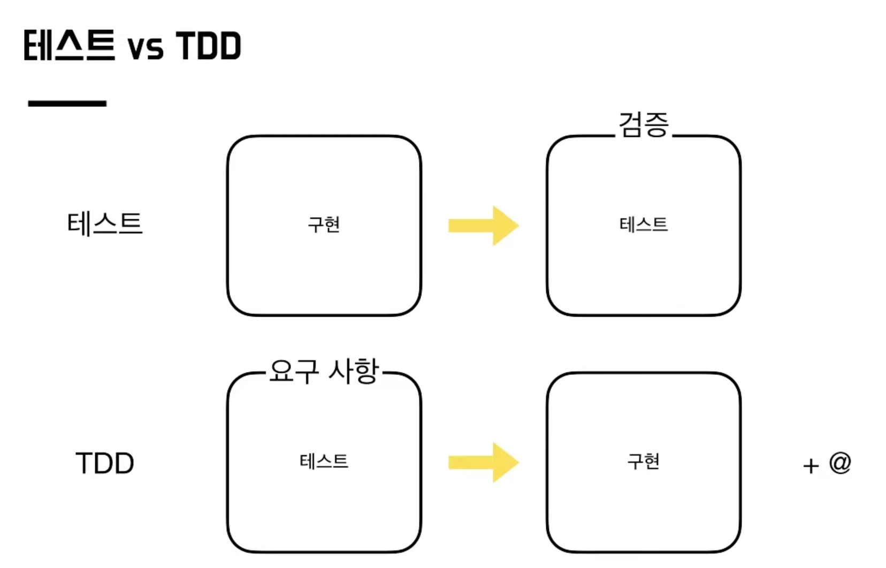
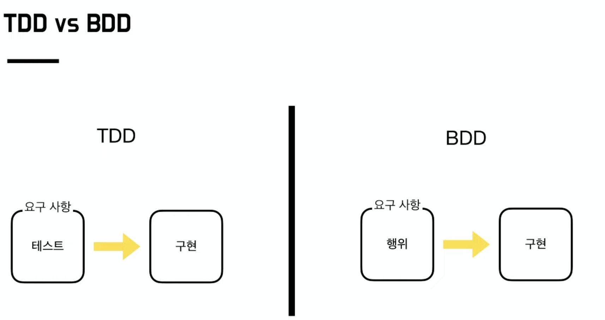
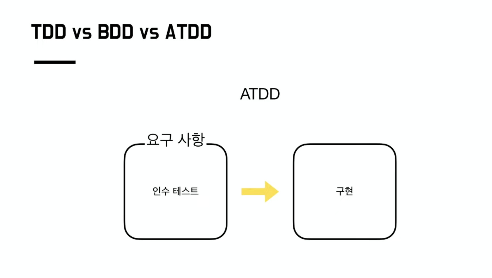
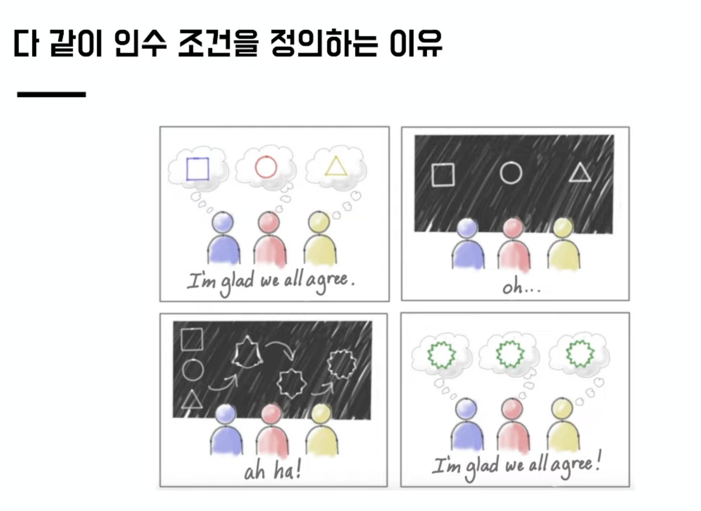

## 목차
- [Acceptance Test (인수 테스트)](#acceptance-test-인수-테스트)
  - [인수 테스트란?](#인수-테스트란)
  - [LineAcceptanceTest 예제](#lineacceptancetest-예제)
  - [vs 통합테스트](#vs-통합테스트)
  - [우테코 크루의 말씀](#우테코-크루의-말씀)
  - [브라운 ATDD 세미나](#브라운-atdd-세미나)


# Acceptance Test (인수 테스트)

## 인수 테스트란?
인수(Acceptance) 즉, 무엇인가를 받아서 테스트하는 것
무엇을 받을까?? -> __시나리오(요구사항 명세서)!!__

개발자, 기획자, 사장 등... 이 주는 시나리오를 잘 통과하는지 테스트
이 때 환경은 실제 사용자 환경에서 테스트
제품의 __결함__ 을 찾기 보다는 제품의 기능을 테스트하며 완성도를 확인하는 것이 목적 -> 단위 테스트와는 다르다

## LineAcceptanceTest 예제

```java
public class LineAcceptanceTest extends AcceptanceTest {

    private final LineRequest line2Request;
    private final LineRequest line3Request;
    private final StationRequest gangnamStationRequest;
    private final StationRequest yeoksamStationRequest;

    public LineAcceptanceTest() {
        this.line2Request = new LineRequest("2호선", "bg-red-600", 1L, 2L, 4);
        this.line3Request = new LineRequest("3호선", "bg-red-600", 1L, 2L, 5);
        this.gangnamStationRequest = new StationRequest("강남역");
        this.yeoksamStationRequest = new StationRequest("역삼역");
    }

    @Test
    @DisplayName("지하철 노선 목록을 보여준다.")
    void showLines() {
        // given
        ExtractableResponse<Response> createResponse1 = createStation(gangnamStationRequest);
        ExtractableResponse<Response> createResponse2 = createStation(yeoksamStationRequest);
        ExtractableResponse<Response> createResponse3 = createLine(line2Request);

        // when
        ExtractableResponse<Response> response = RestAssured.given().log().all()
                .when()
                .get("/lines")
                .then().log().all()
                .extract();

        // then
        assertThat(response.statusCode()).isEqualTo(HttpStatus.OK.value());
        List<Long> expectedLineIds = Stream.of(createResponse1)
                .map(it -> Long.parseLong(it.header("Location").split("/")[2]))
                .collect(Collectors.toList());
        List<Long> resultLineIds = response.jsonPath().getList(".", LineResponse.class).stream()
                .map(LineResponse::getId)
                .collect(Collectors.toList());
        assertThat(resultLineIds).containsAll(expectedLineIds);
    }

    private ExtractableResponse<Response> createLine(LineRequest lineRequest) {
        return RestAssured.given().log().all()
                .body(lineRequest)
                .contentType(MediaType.APPLICATION_JSON_VALUE)
                .when()
                .post("/lines")
                .then().log().all()
                .extract();
    }

    private ExtractableResponse<Response> createStation(StationRequest stationRequest) {
        return RestAssured.given().log().all()
                .body(stationRequest)
                .contentType(MediaType.APPLICATION_JSON_VALUE)
                .when()
                .post("/stations")
                .then().log().all()
                .extract();
    }
}

```

__지하철 노선 목록을 보여주는 예제__
> 참고: 프론트는 포함하지 않아 RestAssured로 직접 요청을 보내고 있다.

현재 테스트는 역 2개와 노선 1개가 있을 때 노선 목록을 불러오는 시나리오를 테스트하고 있다. 이처럼 기능을 테스트하며 완성도를 테스트하는 것이 인수 테스트이다.

## vs 통합테스트
인수 테스트를 정리하면서 Controller 테스트 또는 통합테스트와 비슷하다는 것을 느꼈다.
결론부터 말하자면 인수 테스트와 통합 테스트에서 테스트 내용은 비슷해질 수 있다.
그러나 통합 테스트는 각 모듈을 합쳐서 잘 작동하는 지 테스트하는 것이다.
즉, 단위 테스트 이후 각 모듈들의 상호 작용이 제대로 이루어지는 지 검증하고, 모듈을 통합하는 과정에서 발생할 수 있는 오류를 찾는 테스트이다.

그러나 인수 테스트는 앞서 말했듯이 __시나리오(요구사항)__ 을 테스트하기 위해 만들어졌기 때문에 __결함__ 보다는 __완성도__ 가 목적이다. 따라서 목적이 다르다고 할 수 있다.

사실 인수 테스트 의미만 보면 제일 큰 범위인 것 같다.
(극단적으로 보면 단위 테스트 또한 시나리오니 인수테스트 일까..? -> 완성도가 목적이니 아닌 듯함!)

<br>

## 우테코 크루의 말씀
학습로그 정리하다가... 인수테스트와 통합테스트가 뭐가 다르냐는 질문에 대해 썼던 글입니당! 나름 잘 적은거 같아서 들고왔습니다
레퍼런스는 브라운의 ATDD 세미나 입니다 https://www.youtube.com/watch?v=ITVpmjM4mUE&t=5737s

[인수테스트 vs 통합테스트]

사용자 스토리에 맞추어서 테스트를 작성하는 걸 인수테스트라고 부름!
개발자가 직접 시나리오를 만들수도 있지만 시나리오를 받아서(Acceptance, 인수) 거기에 맞춰 개발한다는 의미에서 인수테스트라고 부름
애자일 개발방법론에서 파생한거고, 

__통합/e2e 등이 개발자 관점에서 각 기능이 유기적으로 연결되었는가?__
를 테스트하기 위한 목적이라고 한다면
__ATDD는 시나리오가 정상적으로 작동하는가?__
를 테스트하므로 분류가 다르다고 볼 수 있음

기획자, 클라이언트 대표, 개발자 등 프로젝트에 참여하는 사람들이 토의해서 시나리오를 만들고 개발자는 거기에 의거해서 코드를 작성하는 방식
통합테스트/e2e 테스트가 만약 시나리오에 의거해 작성되었다면 (ex 사용자는 노선을 확인하기 위해 지하철 목록을 볼 수 있다) 통합테스트임과 동시에 인수테스트라고 볼 수 있을 듯

시나리오에서 요구하는 건 [누가, 어떤 목적으로, 무엇을 하는가] 이기 때문에 개발하다 보면 결국 이 기능은 api를 통해 드러나는거고, 인수테스트(시나리오 테스트)는 대개 이 api를 테스트 해보는 방식으로 수행하게 되기 때문에 통합테스트와 유사해보이는 거 같음

개인적으로 시나리오 테스트라고 부르면 한방에 와닿았을거 같은데!
"받는다"는 이름을 지은건 개발자랑 별개의 의사결정집단과 의사소통하는 것에 의의를 둔 거 같음

결론 : 통합테스트와 인수테스트는 테스트의 목적이 다르다. 그런데 인수 테스트와 통합 테스트가 겹칠 일이 많을 것 같다
틀린 내용이 있다면 @브라운(류성현) 이 피드백해주시겠졍~~

<br>

## 브라운 ATDD 세미나
인수 테스트
- 시나리오(사용자스토리) 기반으로 기능 테스트

인수 테스트의 도움
- 베포 없이 받는 빠른 피드백
- 새로운 팀의 도메인과 서비스 흐름에 파악에 큰 도움이 됨
- 도메인 이해에 예상보다는 짧은 시간이 소요
- 배포 없이 테스트로 대부분 검증 가능
- 인수 테스트로 스펙 표현 가능

인수 테스트가 없다면?
- 구현한 기능을 로컬이라던지 배포를 해서 테스트를 해야함(화면을 만들던지, 수동으로 등등..)
- 배포해서 기능 동작 확인
- 페이지에서 테스트 해야함
- 수동으로 변경 사항을 확인

> 배포 없이 기능을 테스트하는 것이 가장 큰 도움인 것 같았다!

피드백을 받는 방법
- 페어 프로그래밍
- 테스트 / 인수테스트
- 코드 리뷰
- 배포
- 출시

개발적인 관점에서는 즉각적인 빠른 피드백을 받기위해 테스트가 중요

TDD를 하면서 검증뿐만아닌 설계 또한 가능

인수 테스트 주도 개발

- 기존 인수테스트 장점
  - 빠른 피드백을 받을 수 있음
  - 회귀 오류를 잡아줄 꾸준한 테스트를 만들 수 있음
  - 기존 기능을 망가뜨리지 않고 새 기능을 추가할 수 있음
- 인수 테스트를 작성하면서 구현할 대상에 대한 이해도 증진
- 작업의 시작과 끝이 명확해져서 심리적인 안정감에 도움

ATDD란?

기존에는 테스트는 검증의 용도로 사용 - 하루가 끝나고 회고하는 느낌
TDD에서는 구현할 내용을 명세하기 위해서 테스트를 활용 - 하루를 시작하기전 Todo list를 적는 느낌



BDD는 TDD를 조금 더 잘 설명하기 위해
기존 TDD는 테스트가 검증의 의미가 강하게 느껴짐
그러나 BDD는 행위에 초점이 맞추어져 명세의 의미가 느껴진다.
BDD
given when then



ATDD는 
인수 조건 -> 인수 테스트 -> 구현



다른 직군과 공통의 이해를 갖기 위해

기획자, QA팀, 개발팀의 구상한 계획이 다를 수 있다!
이 부분을 처음부터 잡고 가자!

ATDD 개발 프로세스
- 인수 조건 정의
- 인수 테스트 작성
- 기능 구현