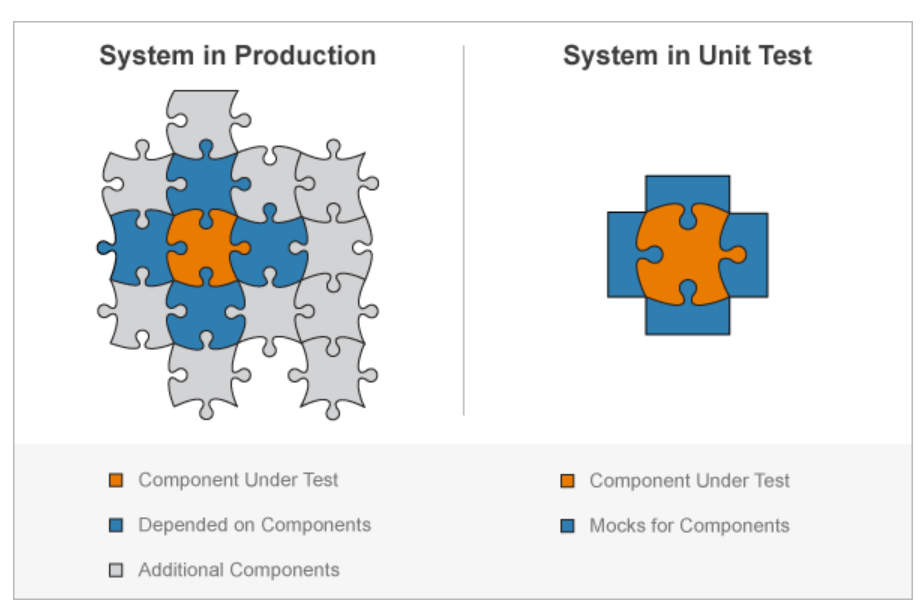

## 목차
- [Mock](#mock)
  - [들어가기 전](#들어가기-전)
  - [Mock 이란?](#mock-이란)
  - [Mock 객체는 언제 필요한가?](#mock-객체는-언제-필요한가)
  - [참고 자료](#참고-자료)

 

# Mock

## 들어가기 전
단위 테스트를 하기 위해서는 한 번에 메서드 하나만을 실행해 보는 것인데 이러한 메서드가 다른 네트워크, 데이터 베이스 등 제어하기 어려운 것들에 의존하고 있다면 어떻게 단위 테스트를 해야할까?

테스트할 코드가 다른 부분에 많이 얽혀 있고 의존해있다면 단위 테스트를 하기에는 매우 어려울 것이다.

따라서 이러한 것을 돕기위해 Mock이라는 것이 나타났다.

 

## Mock 이란?
> 사전적 의미 : 거짓된, 가짜의

실제 객체를 만들어 사용하기에 시간, 비용 등의 Cost가 높거나 혹은 객체가 서로 간의 의존성이 강해 구현하기 힘들 경우 가짜 객체를 만들어 사용하는 방법이다.
사용자 인터페이스(UI)나 데이터베이스 테스트 등과 같이 자동화된 테스트를 수행하기 어려운 때 널리 사용된다.

 

 

## Mock 객체는 언제 필요한가?
- 테스트 작성을 위한 환경 구축이 어려운 경우
- 테스트가 특정 경우나 순간에 의존적인 경우
- 테스트 시간이 오래 걸리는 경우
- 개인 PC의 성능이나 서버의 성능 문제로 오래 걸릴수 있는 경우 시간을 단축하기 위해 사용한다.

## 참고 자료
- https://www.crocus.co.kr/1555
- https://github.com/binghe819/TIL/blob/master/Test/Mockito/Mockito.md