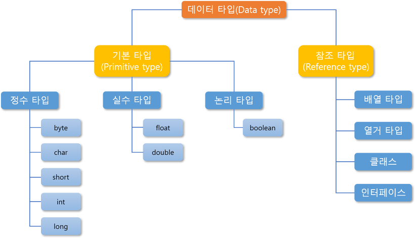
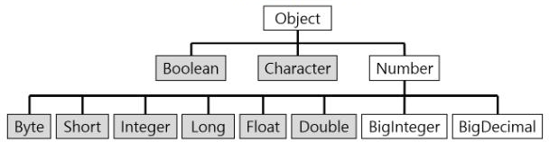

## 목차
- [Wrapper vs Primitive](#wrapper-vs-primitive)
  - [기본 타입 vs 참조 타입](#기본-타입-vs-참조-타입)
  - [Wrapper 클래스](#wrapper-클래스)
  - [Primitive? Wrapper?](#primitive-wrapper)
    - [Primitive만 사용?](#primitive만-사용)
    - [Wrapper 클래스만 사용?](#wrapper-클래스만-사용)
  - [참고 자료](#참고-자료)

# Wrapper vs Primitive

## 기본 타입 vs 참조 타입

자바의 자료형은 크게 기본 타입과 참조 타입으로 나뉜다.  

__기본 타입__  
- 기본 데이터 타입이란 정수, 실수, 문자, 논리 리터럴을 직접 저장하는 타입을 말한다.
- 기본 타입 종류에는 `byte`, `char`, `short`, `int`, `long`, `float`, `double`, `boolean`이 있다.  

__참조 타입__
- 주소를 통해 객체를 참조하여 사용
- 참조 타입 종류에는 배열, 열거, 클래스, 인터페이스가 있다.

## Wrapper 클래스

자바는 기본적으로 객체 지향 언어이다. 하지만 기본 타입은 매우 특별한 성격이라 객체로 분류되지 않는다. 따라서 이러한 기본 타입을 객체화 시킨 것이 래퍼 클래스이다. 때문에 기본형 타입을 객체처럼 사용할 수 있다.

## Primitive? Wrapper?
그렇다면 자바는 왜 기본형과 래퍼 클래스을 굳이 나누었을까?

### Primitive만 사용?
만약 기본형 타입만 사용하게 되면 안될까?  
우선 기본 타입만 사용하게 되면 해당 타입을 객체처럼 사용할 수 없게 된다.  
예를 들어 `int a = null`도 불가능하고 `a.doubleValue()`, `toString()`과 같은 메서드도 사용하지 못할 것이다.  
또한 자바의 객체 지향 관점에서 봤을 때 이에 어긋난다.

### Wrapper 클래스만 사용?
그렇다면 기본형 타입을 객체화 시킨 Wrapper 클래스만 사용하면 안될까?  
일단 Wrapper 클래스 자체가 객체이기 때문에 기본형 타입에 비해 많은 비용이 필요하다.  
또한 Primitive 타입은 스택에 존재한다.  
반면, Wrapper 클래스는 하나의 인스턴스이기 때문에 스택에는 참조값만 있고 실제 값은 힙 메모리에 저장된다.  
따라서 접근 속도에서도 차이가 난다.

결국 적절하게 사용하는 것이 옳아 보인다!

## 참고 자료
- https://coding-factory.tistory.com/547
- https://kingpodo.tistory.com/54