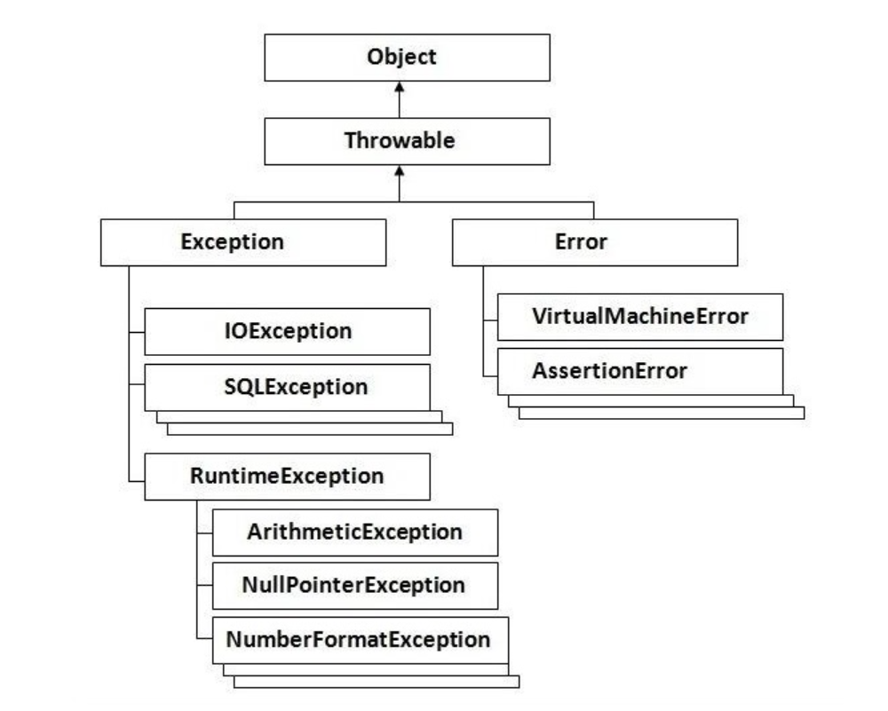
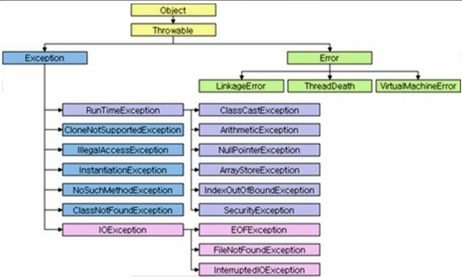
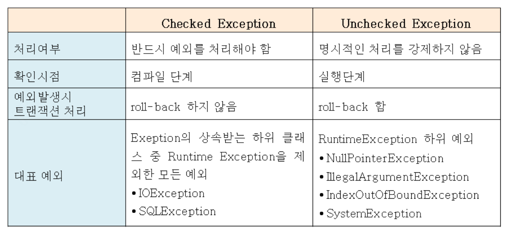

## 목차
- [예외처리](#예외처리)
  - [Error vs Exception?](#error-vs-exception)
    - [Error](#error)
    - [Exception](#exception)
  - [checkedException vs uncheckedException?](#checkedexception-vs-uncheckedexception)
    - [checkedException](#checkedexception)
    - [uncheckedException](#uncheckedexception)
  - [의문점](#의문점)
  - [참고 자료](#참고-자료)

# 예외처리
여러 블로그에 잘 정리되어 있지만, 공부를 하면서 내 글로 쓰기 위해 정리를 해본다.

## Error vs Exception?

- 출처 : https://www.tutorialspoint.com/clojure/clojure_exception_handling.htm

Error와 Exception은 다르다.

### Error
- java.lang.Error 클래스의 서브 클래스들이다.
- Error는 시스템에 뭔가 비정상적인 상황이 발생했을 경우에 사용된다.
- 주로 자바 VM에서 발생시키는 것이다.
- 따라서 애플리케이션 레벨이 아닌 시스템 레벨에서 발생한다.
- 애플리케이션 코드에서 잡을 수 없다.
- 예시
  - OutOfMemoryError
  - ThreadDeath
  - StackOverflowError
- 우리가 잡을 수 없으므로 신경쓸 필요가 없다!

### Exception
- java.lang.Exception 클래스와 그 서브클래스로 정의되는 예외이다.
- 개발자들이 구현한 로직에 의해 발생한다.
  - 따라서 미리 예측하고 처리할 수 있다.
- checkedException과 uncheckedException으로 구분된다.
  - 뒤에서 다룰 예정
- 우리는 이 Exception을 처리해야한다!

## checkedException vs uncheckedException?

기본적으로 둘다 Exception 클래스를 상속받고 있다.
따라서 개발자들의 실수에 의해 발생하는 에러이다.

### checkedException
- Exception 클래스 중 RuntimeException을 상속하지 않은 클래스
- 반드시 예외를 처리하는 코드를 함께 작성해야한다.
- 예외를 처리하지 않으면 컴파일 에러가 발생한다.
- 예시
  - IOException
  - SQLException

### uncheckedException
- Exception 클래스 중 RuntimeException을 상속한 클래스
- RuntimeException은 조금 특별하게 다루어진다.
- 런타임, 즉 실행 단계에서 발생하는 예외를 다룬다.
- 예외를 처리하지 않아도 컴파일 에러를 발생시키지 않는다.
- 예시
  - NullPointerException
  - IllegalArgumentException

## 의문점
사실 내가 생각하기에 uncheckedException과 checkedException을 구분지어 놓은 이유를 정확히 모르겠다. 요즘에는 checkedException보다 uncheckedException를 더 선호한다고 하는데, 사실 checkedException가 할 수 있는 일을 uncheckedException가 다 할 수 있다고 생각한다.
그럼에도 (내가생각하기에) checkedException을 따로 만든 이유는 컴파일 타임 때 예외를 잡아줌으로써 개발자에게 __여기서는 이 예외를 꼭 처리해야해!__ 라고 말해주는 것 같다. 그 이외에는 checkedException을 사용할 이유가 없어보인다.

왜냐하면 checkedException은 예외를 처리하기위해 try-catch로 잡거나 상위 메소드로 예외를 던져야하는데, 이는 결합도를 깨뜨리기 때문이다.
모든 예외를 상위 메소드로 던져버리면 상위 메소드는 하위의 메소드의 예외를 모두 알아야 할 것이다. 이렇게 되었을 때, 만약 하위 메소드의 예외가 바뀌게 되면 상위 메소드 또한 영향을 받는다. 이는 OCP를 위반한다고 볼 수 있다.

또한 checkedException 예외를 사용해서 상위 메소드에 계속 해서 던지게 되면 3depth만 멀어져도 이 예외의 발생 근원지를 추측하기가 쉽지 않다. 각 객체의 책임과 역할을 중요시하는 객체지향 입장에서는 내가 발생시킨 예외도 아닌데 처리해야한다는 점이 매우 불편하였다.

하지만 과거의 api 개발자들이 의도가 있어서 이러한 구조를 짜놓았다고 생각하기 때문에 checkedException 또한 필요할 수 있다고 생각한다!
하지만 나는 uncheckedException을 애용할 것 같다..!

## 참고 자료
- 토비의 스프링