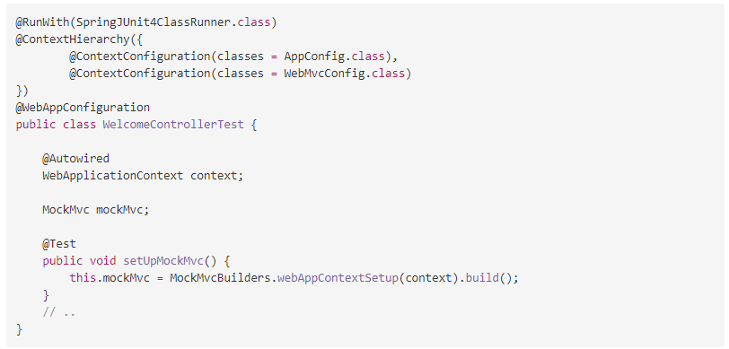
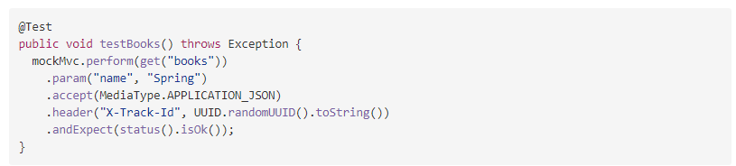
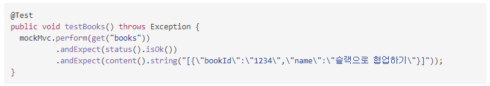

# 목차
- [목차](#목차)
  - [MockMvc란](#mockmvc란)
    - [흐름](#흐름)
  - [MockMvc 설정](#mockmvc-설정)
  - [테스트 실행](#테스트-실행)
    - [요청 데이터 설정](#요청-데이터-설정)
    - [실행 결과 검증](#실행-결과-검증)
    - [실행 결과 출력](#실행-결과-출력)
  - [참고 자료](#참고-자료)


## MockMvc란
웹 어플리케이션을 어플리케이션 서버에 배포하지 않고도 스프링 MVC의 동작을 재현할 수 있는 클래스

### 흐름
1. 테스트 케이스의 메서드는 DispathcherServlet에 요청할 데이터를 설정한다.
2. MockMvc는 DispathcherServlet에 요청을 보낸다. (DispathcherServlet은 테스트용으로 확장된 TestDispathcherServlet)
3. DispathcherServlet은 요청을 받아 매핑정보를 보고 그에 맞는 핸들러(컨트롤러) 메서드 호출
4. 테스트 케이스 메서드는 MockMvc가 반환하는 실행 결과를 받아 실행 결과가 맞는지 검증

## MockMvc 설정
스플이 MVC의 설정을 적용한 DI 컨테이너를 만들어 이 DI 컨테이너를 사용해 스프링 MVC 동작 재현
애플리케이션 서버에 배포한 것과 같은 것처럼 테스트 가능


설명

@ContextHierarchy
- 테스트용 DI 컨테이너 만들 때 빈 정의 파일을 지정
  - AppConfig.class
  - WebMvcConfig.class
@ContextConfiguration
- 계층 관계가 필요 없다면 사용
@WebApplicationContext
- 테스트할 DI 컨테이너를 웹 애플리케이션 전용 DI 컨테이너로 처리
WebApplicationContext
- 테스트할 Application Context를 인젝션
MockMvc
- 테스트할 컨테스트를 지정한 MockMvc를 생성

## 테스트 실행
컨트롤러를 호출할 때 필요한 요청 데이터를 설정
MockMvc에 요청을 의뢰

> 컨트롤러 핸들러 메소드
```java
@RequestMapping(value = "/", method = RequestMethod.GET)
public String home() {
    return "index";
}
```
> 테스트 메소드
```java
@Test
public void testHome() throws Exception {
    mockMvc.perform(get("/"))
            .andExpect(status().isOK())
            .andExpect(forwardedUrl("/WEB-INF/index.jsp"));
}
```
__perform()__
DispathcherServelt에 요청을 의뢰
MockMvcRequestBuilders를 사용해 설정한 요청 데이터를 perform()의 인수로 전달
get / post / fileUpload 와 같은 메서드 제공
perform()에서 반환된 ResultActions() 호출
실행 결과 검증

### 요청 데이터 설정
__MockHttpServletRequestBuilder__
__MockMultipartHttpServletRequestBuilderd의 팩토리 메서드__

> MockHttpServletRequestBuilder 주요 메서드
- param / params
    - 요청 파라미터 설정
- header / headers
    - 요청 해더 설정
    - contentType & accept와 같은 특정 해더를 설정하는 메서드도 제공
- cookie
    - 쿠키 설정
- content
    - 요청 본문 설정
- requestAttr
    - 요청 스코프에 객체를 설정
- flashAttr
    - 플래시 스코프에 객체를 설정
- sessionAttr
    - 세션 스코프에 객체를 설정

> MockMultipartHttpServletRequestBuilderd의 주요 메서드
- file
  - 업로드할 파일 지정


예시 테스트 코드

### 실행 결과 검증
__ResultActions의 andExpect()__
인수에 실행 결과를 검증하는 ResultMatcher 지정
> MockMvcResultMatchers 주요 메서드
- status
    - HTTP 상태 코드 검증
- header
  - 응답 헤더의 상태 검증
- cookie
  - 쿠키 상태 검증
- content
  - 응답 본문 내용 검증
  - jsonPath나 xpath와 같은 특정 콘텐츠를 위한 메서드도 제공
- view
  - 컨트롤러가 반환한 뷰 이름 검증
- forwardedUrl
  - 이동대상의 경로를 검증
  - 패턴으로 검증할때는 forwardedUrlPattern 메서드를 사용
- model
  - 스프링 MVC 모델 상태 검증
- flash
  - 플래시 스코프의 상태 검증
- request
  - 서블릿 3.0부터 지원되는 비동기 처리의 상태나 요청 스코프의 상태, 세션 스코프의 상태 검증

__주의__
MockMvc의 뷰나 HttpMessageConverter가 생성한 응답 본문을 검증할 수 있음
JSP를 뷰로 사용할 때는 응답 본문이 언제나 비어 있어 그 결과를 검증할 수 없음

__예시 코드__


### 실행 결과 출력
__ResultActions의 andDo()__
인수에 실행 결과를 처리할 수 있는 ResultHandler 지정
스프링 테스트는 MockMvc ResultHandler의 팩토리 클래스를 통해 다양한 ResultHandler 제공

> MockMvcResultHandlers
- log
  - 실행 결과를 디버깅 레벨에서 로그로 출력
- print
  - 실행 결과를 임의의 출력대상에 출력
  - 출력 대상을 지정하지 않으면 기본으로 System.out 출력

__예시 코드__
```java
@Test
public void testBooks() throws Exception {
    mockMvc.perform(get("books"))
            .andExpect(status().isOk())
            .andDo(log());
}
```

## 참고 자료
- https://itmore.tistory.com/entry/MockMvc-%EC%83%81%EC%84%B8%EC%84%A4%EB%AA%85