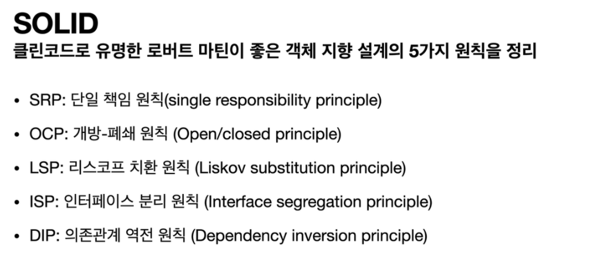
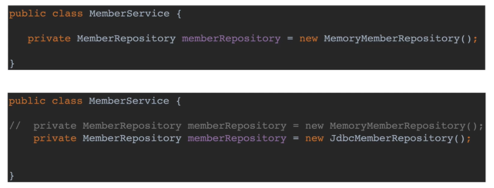

## 목차
- [좋은 객체 지향 설계의 5가지 원칙(SOLID)](#좋은-객체-지향-설계의-5가지-원칙solid)
  - [SOLID](#solid)
  - [SRP 단일 책임 원칙](#srp-단일-책임-원칙)
  - [OCP 개방-폐쇄 원칙](#ocp-개방-폐쇄-원칙)
  - [LSP 리스코프 치환 원칙](#lsp-리스코프-치환-원칙)
  - [ISP 인터페이스 분리 원칙](#isp-인터페이스-분리-원칙)
  - [DIP 의존관계 역전 원칙](#dip-의존관계-역전-원칙)

# 좋은 객체 지향 설계의 5가지 원칙(SOLID)

## SOLID

## SRP 단일 책임 원칙
__Single responsibility principle__
- 한 클래스는 하나의 책임만 가져야 한다.
- 하나의 책임이라는 것은 모호하다.
  - 클 수 있고, 작을 수 있다.
  - 문맥과 상황에 따라 다르다.
- __중요한 기준은 변경__ 이다. 변경이 있을 때 파급 효과가 적으면 단일 책임 원칙을 잘 따른 것
- 예) UI 변경, 객체의 생성과 사용을 분리

## OCP 개방-폐쇄 원칙
__Open/closed principle__
- 소프트웨어 요소는 확장에는 열려 있으나 변경에는 닫혀 있어야 한다.
- 확장을 하려면 당연히 기존 코드를 변경해야하지 않을까?
- __다형성__ 을 활용해보자
- 인터페이스를 구현한 새로운 클래스를 하나 만들어서 새로운 기능을 구현
- 지금까지 배운 역할과 구현의 분리를 생각해보자
  
- 분명 다형성을 사용했지만 OCP 원칙을 지킬 수 없다.
- 이 문제를 해결하려면??
- 객체를 생성하고, 연관관계를 맺어주는 별도의 조립, 설정자가 필요하다.

## LSP 리스코프 치환 원칙
__Liskov substitution principle__
- 프로그램의 객체는 프로그램의 정확성을 깨뜨리지 않으면서 하위 타입의 인스턴스로 바꿀 수 있어야 한다
- 다형성에서 하위 클래스는 인터페이스 규약을 다 지켜야 한다는 것, 다형성을 지원하기 위한 원칙, 인터페이스를 구현한 구현체를 믿고 사용하려면, 이 원칙이 필요하다
- 단순히 컴파일에 성공하는 것을 넘어서는 이야기
- 에) 자동차 인터페이스의 엑셀은 앞으로 가라는 기능, 뒤로 가게 구현하면 LSP 위반, 느리더라도 앞으로 가야함

## ISP 인터페이스 분리 원칙
__Interface segregation principle__
- 특정 클라이언트를 위한 인터페이스 여러 개가 범용 인터페이스 하나보다 낫다
- 자동차 인터페이스 -> 운전 인터페이스, 정비 인터페이스로 분리
- 사용자 클라이언트 -> 운전자 클라이언트, 정비사 클라이언트로 분리
- 분리하면 정비 인터페이스 자체가 변해도 운전자 클라이언트에 영향을 주지 않음
- 인터페이스가 명확해지고, 대체 가능성이 높아진다.

## DIP 의존관계 역전 원칙
__Dependency inversion principle__
- 프로그래머는 "추상화에 의존해야지, 구체화에 의존하면 안된다." 의존성 주입은 이 원칙을 따르는 방법 중 하나다
- 쉽게 이야기해서 구현 클래스에 의존하지 말고, 인터페이스에 의존하라는 뜻
- 앞에서 이야기한 __역할(Role)에 의존하게 해야한다는 것과 같다__
- 객체 생성도 클라이언트가 인터페이스에 의존해야 유연하게 구현체를 변경할 수 있다! 구현체에 의존하게 되면 변경이 아주 어려워진다.
- 예) 로미오와 줄리엣 역할에서 로미오 역할을 맡은 원빈이 줄리엣과 호흡을 맞춰야지 줄리엣의 역할을 맡은 김태희와만 호흡을 맞추게 되면 안된다.

- MemberService는 인터페이스에 의존하지만, 구현 클래스도 동시에 의존한다.
- MemberService 클라이언트가 구현 클래스를 직접 선택(의존)
  - MemberRepository m = new MemoryMemberRepository();
- MemoryMemberRepository에도 의존! -> DIP 위반
- MemberService는 MemberRepository에만 의존해야한다!