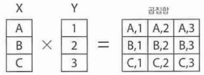

# SQL

## 목차
- [SQL](#sql)
  - [목차](#목차)
  - [SQL 조회](#sql-조회)
    - [예약어](#예약어)
    - [테이블](#테이블)
    - [값이 없는 데이터 NULL](#값이-없는-데이터-null)
  - [테이블 구조 참조하기](#테이블-구조-참조하기)
    - [자료형](#자료형)
  - [검색 조건 지정하기](#검색-조건-지정하기)
    - [SELECT 구와 WHERE 구](#select-구와-where-구)
    - [SELECT 구에서 열 지정하기](#select-구에서-열-지정하기)
    - [WHERE 구에서 행 지정하기](#where-구에서-행-지정하기)
    - [NULL값 검색](#null값-검색)
  - [조건 조합하기](#조건-조합하기)
    - [AND로 조합하기](#and로-조합하기)
    - [OR로 조합하기](#or로-조합하기)
    - [연산자 우선 순위](#연산자-우선-순위)
    - [NOT으로 조합](#not으로-조합)
  - [패턴 매칭에 의한 검색](#패턴-매칭에-의한-검색)
    - [LIKE로 패턴 매칭하기](#like로-패턴-매칭하기)
  - [정렬 - ORDER BY](#정렬---order-by)
    - [대소 관계](#대소-관계)
  - [복수의 열을 지정해 정렬하기](#복수의-열을-지정해-정렬하기)
    - [복수 열로 정렬 지정](#복수-열로-정렬-지정)
    - [정렬방법 지정하기](#정렬방법-지정하기)
    - [NULL 값의 정렬 순서](#null-값의-정렬-순서)
  - [결과 행 제한하기 - LIMIT](#결과-행-제한하기---limit)
    - [행수 제한](#행수-제한)
    - [오프셋 지정](#오프셋-지정)
  - [수치연산](#수치연산)
    - [SELECT 구로 연산하기](#select-구로-연산하기)
    - [열의 별명](#열의-별명)
    - [WHERE 구에서 연산하기](#where-구에서-연산하기)
    - [WHERE 구와 SELECT 구의 내부처리 순서](#where-구와-select-구의-내부처리-순서)
    - [NULL 값의 연산](#null-값의-연산)
    - [ORDER BY 구에서 연산하기](#order-by-구에서-연산하기)
    - [함수](#함수)
    - [ROUND 함수](#round-함수)
  - [문자열 연산](#문자열-연산)
    - [문자열 결합](#문자열-결합)
    - [SUBSTRING 함수](#substring-함수)
    - [TRIM 함수](#trim-함수)
    - [CHARACTER_LENGTH 함수](#character_length-함수)
  - [행 개수 구하기](#행-개수-구하기)
    - [COUNT](#count)
    - [WHERE 구 지정하기](#where-구-지정하기)
    - [집계함수와 NULL 값](#집계함수와-null-값)
    - [DISTINCT로 중복 제거](#distinct로-중복-제거)
    - [집계함수에서 DISTINCT](#집계함수에서-distinct)
    - [그 이외의 집계함수 사용법](#그-이외의-집계함수-사용법)
  - [그룹화 - GROUP BY](#그룹화---group-by)
    - [HAVING 구로 조건 지정](#having-구로-조건-지정)
  - [테이블 결합](#테이블-결합)
    - [곱집합과 교차결합](#곱집합과-교차결합)

## SQL 조회
```SQL
select * FROM 테이블명
```

### 예약어
SELECT와 FROM이 구를 결정하는 키워드이자 예약어이다.
통상적으로 데이터베이스 객체명에는 예약어와 동일한 이름을 사용할 수 없습니다. 예를 들면 'SELECT'라는 이름의 테이블은 만들 수 없습니다. 이것이 예약어의 유래입니다.

### 테이블
SELECT 명령을 실행하면 표 형식의 데이터가 출력됩니다. 표 형식의 데이터는 행과 열로 구성됩니다. 행은 모두 동일한 형태로 되어 있으며 옆으로는 열이 나열되는데, 열마다 이름이 지정되어 있습니다. 각각의 행과 열이 만나는 부분을 '셀'이라고 부릅니다.

데이터는 자료형으로 분류할 수 있습니다.
열은 하나의 자료형만 가질 수 있습니다. ex) 수치형, 문자열형, 날짜시간형

### 값이 없는 데이터 NULL
NULL은 특별한 데이터 값으로 아무것도 저장되어 있지 않은 상태를 의미합니다.
NULL은 데이터가 들어있지 않은 것을 의미하는 특별한 값입니다.

<br>

## 테이블 구조 참조하기

### 자료형
- INTEGER 형
  INTEGER 형은 수치형의 하나로 정수값을 저장할 수 있는 자료형입니다. 소수점은 포함할 수 없습니다.
- CHAR 형
  CHAR형은 문자열형의 하나로 문자열을 저장할 수 있는 자료형입니다. 문자열형에서는 열의 최대 길이를 지정해야합니다. CHAR(10)으로 자료형을 지정했을 경우 최대 10문자로 된 문자열을 저장할 수 있습니다.
- VARCHAR 형
  CHAR과 같이 문자열을 저장할 수 있는 자료형입니다. 그러나 CHAR 형과는 달리 데이터 크기에 맞춰 저장공간의 크기도 변경됩니다.
- DATE 형
  날짜값을 저장할 수 있는 자료형입니다.
- TIME 형
  시간을 저장할 수 있는 자료형입니다.

## 검색 조건 지정하기

### SELECT 구와 WHERE 구
```SQL
SELECT 열1, 열2 FROM 테이블명 WHERE 조건식
```
행을 선택할 때는 WHERE 구를 사용하며, 열을 선택할 때는 SELECT 구를 사용합니다.

### SELECT 구에서 열 지정하기
```SQL
SELECT name, address FROM sample21;
```
위와 같은 방식으로 입력하면 name과 address의 행을 가져오게 됩니다.

열을 전혀 지정하지 않으면 구문에러가 발생합니다.
테이블에 존재하지 않는 열을 지정해도 에러가 발생합니다.
열 지정 순서는 임의로 정할 수 있습니다.
동일한 열을 중복해서 지정해도 무관합니다.

### WHERE 구에서 행 지정하기
WHERE 은 많은 행 속에서 필요한 데이터만 검색하기 위해서는 WHERE 구를 사용합니다.
WHERE 구는 FROM 구의 뒤에 표기합니다.
```SQL
SELECT 열 FROM 테이블명 WHERE 조건식
```
`SELECT 구 -> WHERE구 -> FROM 구` 의 순으로 적으면 에러가 발생합니다.
WHERE 구는 생략이 가능하며 테이블 내의 모든 행이 검색 대상이 됩니다.

ex) WHERE 구로 no 열 값이 2인 행만 추출
```SQL
SELECT * FROM sample21 WHERE no = 2;
```
ex) WHERE 구로 name 열 값이 '박준용'인 행만 추출
```SQL
SELECT * FROM sample21 WHERE name = '박준용';
```

수치형 조건식의 경우 비교할 숫자를 그대로 조건식에 표기합니다. 하지만 문자열형을 비교할 경우는 '박준용'처럼 싱글쿼트(' ')로 둘러싸 표기해야합니다.
날짜시간형의 경우에도 싱글쿼트로 둘러싸 표기합니다. 이때 연월일은 하이픈(-)으로 구분합니다. 시각은 시분초를 콜론(:)으로 구분하여 표기합니다.

### NULL값 검색

NULL은 특수한 경우이기 때문에 ``WHERE name == NULL`` 이라고 표기하지 않고 ``name IS NULL`` 을 사용합니다.
반대로 NULL 값이 아닌 행을 검색하고 싶다면 ``IS NOT NULL`` 을 사용하면 됩니다.

<br>

## 조건 조합하기

AND, OR, NOT에 관해 설명하겠습니다.
```SQL
조건식1 AND 조건식2
조건식1 OR 조건식2
NOT 조건식
```

### AND로 조합하기
ex) sample24 테이블에서 a열과 b열이 모두 0이 아닌 행을 검색
```SQL
SELECT * FROM sample24 WHERE a <> 0 AND b <> 0;
```

### OR로 조합하기
ex) a열이 0이 아니거나 b열이 0이 아닌 행을 검색
```SQL
SELECT * FROM sample24 WHERE a <> 0 OR b <> 0;
```

### 연산자 우선 순위
OR 보다 AND 쪽이 우선 순위가 높습니다.
이 때문에 괄호로 묶어 지정하는 습관을 붙이는 것이 좋습니다.

### NOT으로 조합
ex) a열이 0이 아니거나 b열이 0이 아닌 행을 제외한 나머지 행을 검색
```SQL
SELECT * FROM sample24 WHERE NOT(a <> 0 OR b <> 0)
```

<br>

## 패턴 매칭에 의한 검색
```SQL
열 LIKE 패턴
```

만약 특정 문자나 문자열이 포함되어 있는지를 검색하고 싶은 경우, 부분 검색을 사용하면 됩니다.

### LIKE로 패턴 매칭하기
`=` 연산자의 경우 열 값이 완전히 일치할 때 참이 되지만, LIKE를 사용하면 열 값이 부분적으로 일치하는 경우에도 참이 됩니다.

LIKE를 사용할 경우 패턴을 정의해야하는데 이 때 메타문자를 사용할 수 있습니다.

퍼센트(%)는 임의의 문자열을 의미하며, 언더스코어(_)는 임의의 문자 하나를 의미합니다.
```SQL
SELECT * FROM sample25 WHERE text LIKE '%SQL%'
```
다음과 같이 정의 했을 때 SQL이 포함된 text를 찾게 됩니다. 이 때 메타문자 %는 빈 문자열과도 매치됩니다.

만약 %를 검색하고 싶다면 `\`를 붙여 ``Where text LIKE '%\%%'`` 와 같이 검색하면 됩니다.

<br>

## 정렬 - ORDER BY
SELECT 명령의 ORDER BY 구를 사용하여 검색결과의 행 순서를 바꿀 수 있습니다.
```SQL
SELECT 열명 FROM 테이블명 WHERE 조건식 ORDER BY 열명
```
```SQL
ex) age열의 값을 오름차순으로 정렬하기
SELECT * FROM sample31 ORDER BY age;
```

ORDER BY DESC을 사용하여 내림차순으로 정렬할 수 있습니다.
```SQL
SELECT 열명 FROM 테이블명 WHERE 조건식 ORDER BY 열명 DESC
```
앞선 예제에서 오름차순으로 정렬할 때 ASC를 생략할 수 있습니다.
```SQL
SELECT 열명 FROM 테이블명 WHERE 조건식 ORDER BY 열명 ASC
```

### 대소 관계
ORDER BY로 관계를 정리할 때는 값의 대소 관계가 중요합니다.
수치형 데이터 : 숫자의 크기로 판별
날짜시간형 데이터 : 숫자의 크기로 판별
문자열형 데이터 : 알파벳, 한글 순서로 판별

<br>

## 복수의 열을 지정해 정렬하기
```SQL
SELECT 열명 FROM 테이블명 WHERE 조건식
ORDER BY 열명1[ASC|DESC], 열명2[ASC|DESC]....
```

### 복수 열로 정렬 지정
ex) sample32를 a열과 b열로 정렬하기
```SQL
SELECT * FROM sample32 ORDER BY a, b;
```
a열 먼저 정렬된 후 b열이 정렬된다.

### 정렬방법 지정하기
ex) sample32를 a열 ASC로, b열 DESC로 정렬하기
```SQL
SELECT * FROM sample32 ORDER BY a ASC, b DESC;
```

### NULL 값의 정렬 순서
NULL 은 별도의 방법으로 취급합니다. 간단히 말해 NULL 값을 가지는 행은 가장 먼저 표시되거나 가장 나중에 표시됩니다. MYSQL의 경우는 NULL 값을 가장 작은 값으로 취급해 ASC(오름차순)에서는 가장 먼저, DESC(내림차순)에서는 가장 나중에 표시합니다.

<br>

## 결과 행 제한하기 - LIMIT
SELECT 명령에서는 결괏값이으로 반환되는 행을 제한할 수 있습니다.
```SQL
SELECT 열명 FROM 테이블명 LIMIT 행수 [OFFSET 시작행]
```

### 행수 제한
LIMIT 구는 표준 SQL은 아닙니다. MySQL과 PostgreSQL에서 사용할 수 있는 문법입니다. LIMIT 구는 SELECT 명령의 마지막에 지정하는 것으로 WHERE 구나 ORDER BY 구의 뒤에 지정합니다.

LIMIT 다음에는 최대 행수를 수치로 지정합니다. 만약 LIMIT 10으로 지정하면 최대 10개의 행이 클라이언트로 반환됩니다.

ex) sample33에 LIMIT 3으로 상위 3건만 취득하기
```SQL
SELECT * FROM sample33 LIMIT 3;
```

### 오프셋 지정
오프셋은 일반적으로 커뮤니티 사이트 등에서 게시판 하단 부분에 '1 2 3 4 5 다음' 등으로 표시된 것이 그 예입니다.
이 페이지 나누기 기능은 LIMIT 구에 OFFSET으로 지정할 수 있습니다.

```SQL
SELECT 열명 FORM 테이블명 LIMIT 행수 OFFSET 위치
```
ex) sample33에서 LIMIT 3 OFFSET 0으로 첫 번째 페이지 표시
```SQL
SELECT * FROM sample33 LIMIT 3 OFFSET 0;
```
OFFSET에 의한 시작 위치 지정은 LIMIT 뒤에 기술합니다.
두 번째 페이지를 표시해보겠습니다.
ex) sample33에서 LIMIT 3 OFFSET 3으로 두 번째 페이지 표시
```SQL
SELECT * FROM sample33 LIMIT 3 OFFSET 3;
```

<br>

## 수치연산
```SQL
+ - * / % MOD
```

### SELECT 구로 연산하기
ex) 가격 x 수량으로 금액 계산하기
```SQL
SELECT *, price * quantity FROM sample34;
```

<br>

### 열의 별명
앞서 살펴본 예제에서 price * quantity와 같이 알아보기 힘들 때 별명을 붙여 열명을 재지정할 수 있습니다.
별명은 AS 를 사용해 지정합니다.

<br>

### WHERE 구에서 연산하기
ex) sample34 테이블을 사용해 '가격X수량'으로 금액을 계산하여 2000원 이상에 해당하는 행을 검색

```SQL
SELECT *, price * quantity AS amount FROM sample34
WHERE price * quantity >= 2000;
```
이 때 SELECT 구문에서 price * quantity를 amount 별명을 붙였으므로 WHERE 구에도 amount로 지정하면 되지 않을까 라고 생각할 수도 있습니다. 하지만 이는 에러가 발생합니다.

<br>

### WHERE 구와 SELECT 구의 내부처리 순서
WHERE 구에서의 행 선택, SELECT 구에서의 열 선택은 데이터베이스 서버 내부에서 WHERE 구 -> SELECT 구의 순서로 처리됩니다. 그렇기 때문에 앞선 에러는 별명은 SELECT 구에서 먼저 처리되기 때문에, WHERE에서 별명을 사용할 수 없어 발생합니다.
즉, SELECT 구에서 지정한 별명은 WHERE 구 안에서 사용할 수 없습니다.

<br>

### NULL 값의 연산
NULL로 연산하게되면 결과는 무조건 NULL이 됩니다.

<br>

### ORDER BY 구에서 연산하기
ex) ORDER BY 구에서 금액을 계산하고 내림차순으로 정렬하기
```SQL
SELECT *, price * quantity AS amount FROM sample34
ORDER BY amount DESC;
```
이 때 ORDER BY는 서버에서 내부적으로 가장 나중에 처리됩니다. 따라서 SELECT에서 지정한 별명을 ORDER BY에서도 사용할 수 있습니다.

<br>

### 함수
```SQL
함수명(인수1, 인수2... )
```
사실 연산자, 함수 둘 다 같은 것이라고 할 수 있습니다. 대부분의 함수는 1개 이상의 인수를 가지며 결과값을 반환합니다.

### ROUND 함수
반올림하기 위해 사용하는 함수
```SQL
SELECT amount, ROUN(amount) FROM sample341;
```

ROUND 함수는 기본적으로 소수점 첫째 자리를 기준으로 반올림한 값을 반환합니다. 이 때 ROUND 함수는 두 번째 인수로 반올림할 자릿수를 지정할 수 있습니다. 해당 인수를 생략하는 경우에는 0으로 간주됩니다. 만약 1을 지정하면 소수점 둘째 자리를 반올림합니다.

ex) ROUND 함수의 두 번째 인수를 지정해, 소수점 둘째 자리를 반올림
```SQL
SELECT amount, ROUND(amount, 1) FROM sample341;
```
만약 음수를 지정하면 정수부의 반올림할 자릿수도 지정할 수 있습니다.

ROUND 이외에도 SIN, COS, SQRT, LOG 등 다양한 함수가 제공됩니다.

<br>

## 문자열 연산
```SQL
CONCAT SUBSTRING TRIM CHARACTER_LENGTH
```

### 문자열 결합
문자열을 결합 해줍니다. 그러나 언어에 따라 조금씩 다릅니다.
SQL Server : +
Oracle, DB2, PostgreSQL : ||
MySQL : CONCAT

### SUBSTRING 함수
SUBSTRING 함수는 문자열의 일부분을 계산해서 반환해주는 함수입니다.

### TRIM 함수
TRIM 함수는 문자열의 앞뒤로 여분의 스페이스가 있을 경우 이를 제거해주는 함수로 문자열 도중에 존재하는 스페이스는 제거되지 않습니다.

### CHARACTER_LENGTH 함수
CHARACTER_LENGTH 함수는 문자열의 길이를 계산해 돌려주는 함수입니다.

<br>

## 행 개수 구하기
```SQL
COUNT(집합)
SUM(집합)
AVG(집합)
MIN(집합)
MAX(집합)
```

### COUNT
ex) COUNT로 행 개수 계산
```SQL
SELECT COUNT(*) FROM sample51;
```

### WHERE 구 지정하기
ex) 이름이 A인 개수 구하기
```SQL
SELECT * FROM sample51 WHERE name = 'A';
```

### 집계함수와 NULL 값
NULL 값은 무시됩니다.

### DISTINCT로 중복 제거
```SQL
SELECT DISTINCT name FROM sample51;
```
SELECT 구에서 DISTINCT를 지정하면 중복된 데이터를 제외한 결과를 클라이언트로 반환합니다.

### 집계함수에서 DISTINCT
중복하지 않은 데이터의 개수를 구하려면?
```SQL
SELECT DISTINCT COUNT(name) FROM sample51; // X
SELECT COUNT(DISTINCT name) FROM sample51; // O
```

### 그 이외의 집계함수 사용법
```SQL
SELECT SUM(quantity) FROM sample51;
SELECT AVG(quantity) FROM sample51;
SELECT MIN(quantity), MAX(quantity) FROM sample51;
```

<br>

## 그룹화 - GROUP BY
```SQL
SELECT * FROM 테이블명 GROUP BY 열1, 열2, ...
```

현재 sample51 테이블에는 name 열에 A인 행은 두개, B와 C인 행은 각각 한 개씩 있습니다. name 열에서 같은 값을 가진 행끼리 한데 묶어 그룹화한 집합을 집계함수로 넘겨줄 수 있습니다.

ex) GROUP BY 구에 name열을 지정해 그룹화하기
```SQL
SELECT name FROM sample51 GROUP BY name;
```
GROUP BY 구에 열을 지정하여 그룹화하면 지정된 열의 값과 같은 행이 하나의 그룹으로 묶입니다.

SELECT 구에서 name 열을 지정하였으므로 그룹화된 name 열의 데이터가 클라이언트로 반환됩니다.

### HAVING 구로 조건 지정
```SQL
SELECT name, COUNT(name) FROM sample51
WHERE COUNT(name)=1 GROUP BY name; // X

SELECT name, COUNT(name) FROM sample51
GROUP BY name Having Count(name) = 1; // O
```
name 열을 그룹화하여 행 개수가 하나만 존재하는 그룹을 검색하고 싶었지만 에러가 발생한다.
에러가 발생한 이유는 GROUP BY와 WHERE 구의 내부처리 순서와 고나계가 있습니다. 즉, WHERE 구로 행을 검색하는 처리가 GROUP BY로 그룹화하는 처리보다 순서상 앞서기 때문입니다.
```
내부 처리 순서
WHERE 구 -> GROUP BY 구 -> SELECT 구 -> ORDER BY 구
```
그렇다면 집계한 결과에서 조건에 맞는 값을 따로 걸러낼 수 있는 방법은 없는 걸까요?
HAVING 구를 사용하면 집계함수를 사용해서 조건식을 지정할 수 있습니다.
HAVING 구는 GROUP BY 구의 뒤에 기술하며 WHERE 구와 동일하게 조건식을 지정할 수 있습니다.

## 테이블 결합

### 곱집합과 교차결합

<p align="center"><br>곱집합</p>

