## 목차
- [API 문서화](#api-문서화)
  - [Spring Rest Docs와 Swagger](#spring-rest-docs와-swagger)
    - [Rest Docs와 Swagger 차이점](#rest-docs와-swagger-차이점)
  - [주절주절 API 문서화](#주절주절-api-문서화)
    - [주절주절 API 문서화 흐름](#주절주절-api-문서화-흐름)
    - [주절주절 API 문서화 코드](#주절주절-api-문서화-코드)
  - [참고 자료](#참고-자료)

# API 문서화

## Spring Rest Docs와 Swagger

Spring Rest Docs와 Swagger는 API 문서화 할 때 많이 쓰이는 도구다.

__Spring Rest Docs 적용 화면__

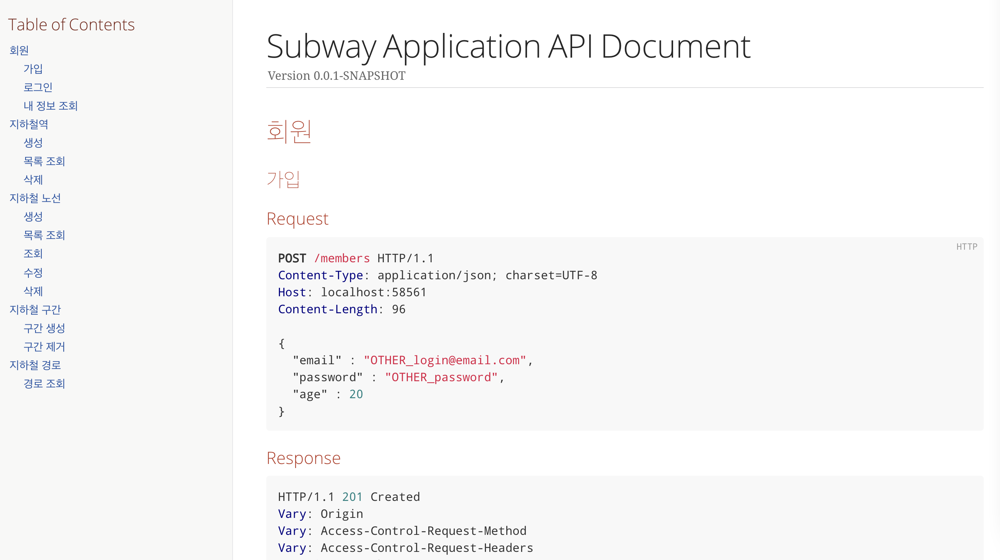

__Swagger 적용 화면__

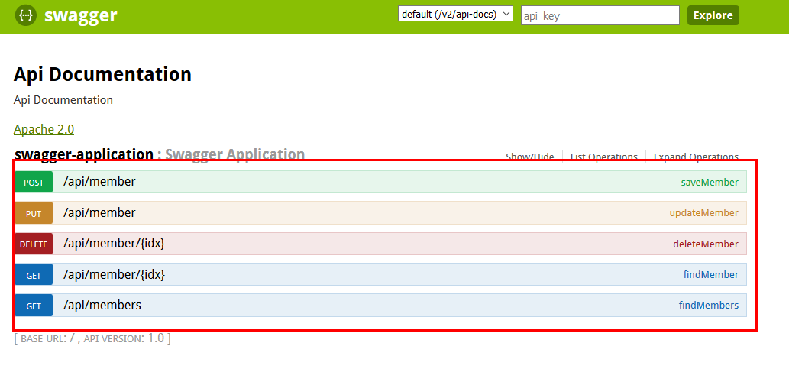

### Rest Docs와 Swagger 차이점

||Rest Docs|Swagger|
|-|---|---|
|장점|Prod 코드에 영향이 없다|API를 테스트 해볼 수 있는 화면을 제공한다.|
||테스트가 성공해야 문서작성된다.|적용하기 쉽다.|
|단점|적용하기 어렵다|제품코드에 어노테이션 추가해야한다.|
|||제품코드와 동기화가 안될 수 있다.|

RestDocs는 테스트를 기반으로 adoc을 만들어 문서화하기 때문에 테스트가 성공해야 만들어진다는 장점이 있다.  

Swagger는 API를 테스트 해볼 수 있다. 아래 그림처럼 값을 직접 넣어 테스트 할 수 있다는 장점이 있다.

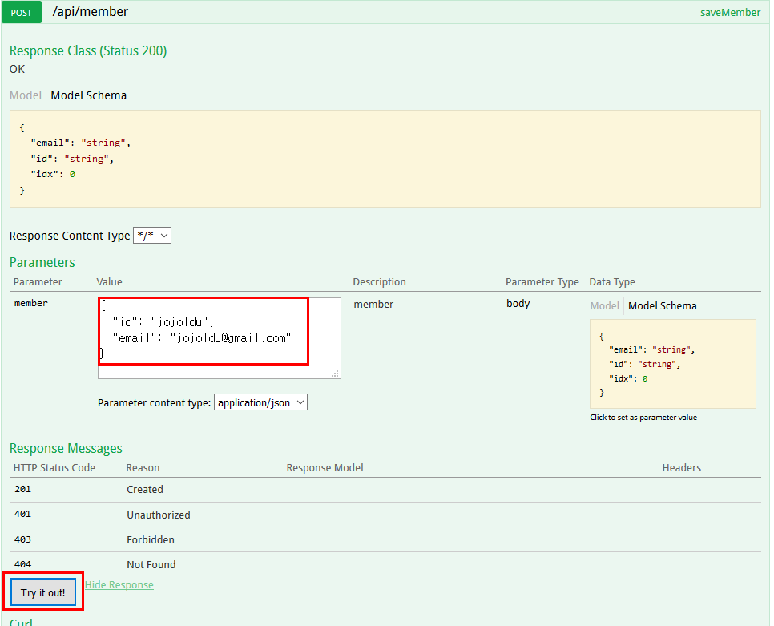

그러나 Swagger는 prod코드에 애노테이션으로 직접 정의를 해주어야하기 때문에 prod 코드가 더러워진다는 장점이 있다.

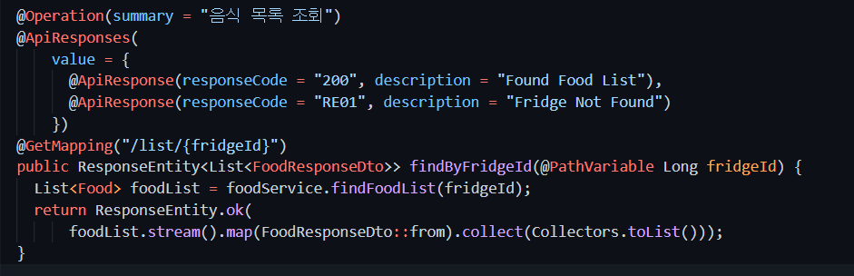


API 문서의 목적은 개발하는 스팩을 정의하는 것이다. 실제로 프로젝트를 시작할 때 프론트와 백엔드 둘다 API의 문서를 보고 하기 때문에 API 문서에 공을 들일 필요가 있다.  
Swagger는 API 문서의 기능도 담당하지만 API 동작을 테스트하는 용도에 더 특화되어있어 실제 프로젝트에서는 RestDocs를 사용하였다.

Swagger 적용 방법은 [링크](https://jojoldu.tistory.com/31)에 잘 나와있다.

<br>

## 주절주절 API 문서화

### 주절주절 API 문서화 흐름

주절주절 API 문서화 흐름은 다음과 같다.

1. RestAssured를 통해 통합테스트를 진행한다.
2. RestAssured Document를 통해 스니펫을 생성한다.
3. 생성된 스니펫으로 문서화 adoc 파일을 만들어준다.
4. gradle을 빌드하여 html 문서를 생성한다.

### 주절주절 API 문서화 코드

1. RestAssured를 통해 통합테스트를 진행한다.
2. RestAssured Document를 통해 스니펫을 생성한다.

주절주절에서는 Builder 패턴을 사용해서 내부적으로 RestAssured를 사용하여 테스트를 진행하였다.

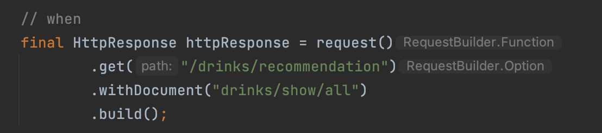

request()를 사용하여 `withDocument("adoc 경로")` 를 통해 adoc을 생성하였다.

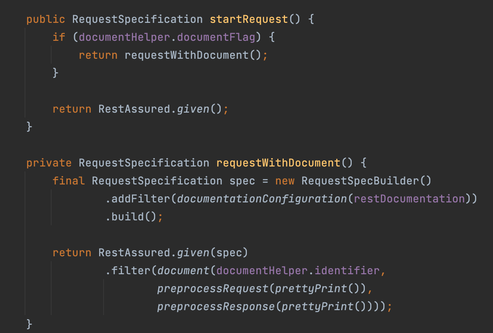

따라서 내부 코드를 보게되면 RestAssured를 사용하여 document를 설정해주는 모습을 볼 수 있다.

3. 생성된 스니펫으로 문서화 adoc 파일을 만들어준다.

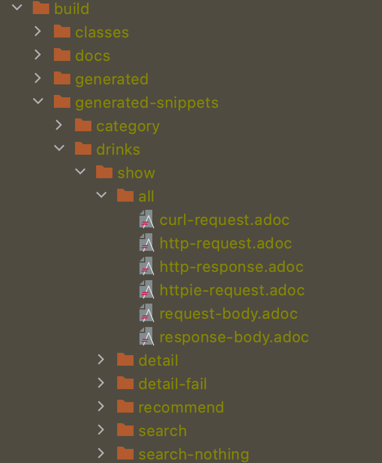

generated-snippets 하위 폴더에 6개의 adoc 파일이 생성된 것을 확인할 수 있다.

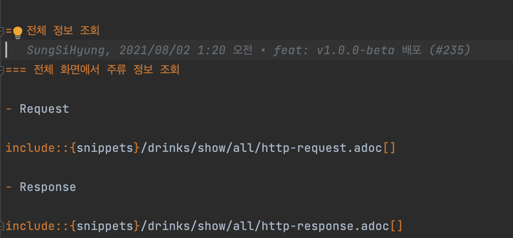

생성된 스니펫으로 adoc 파일을 만들어 준다.

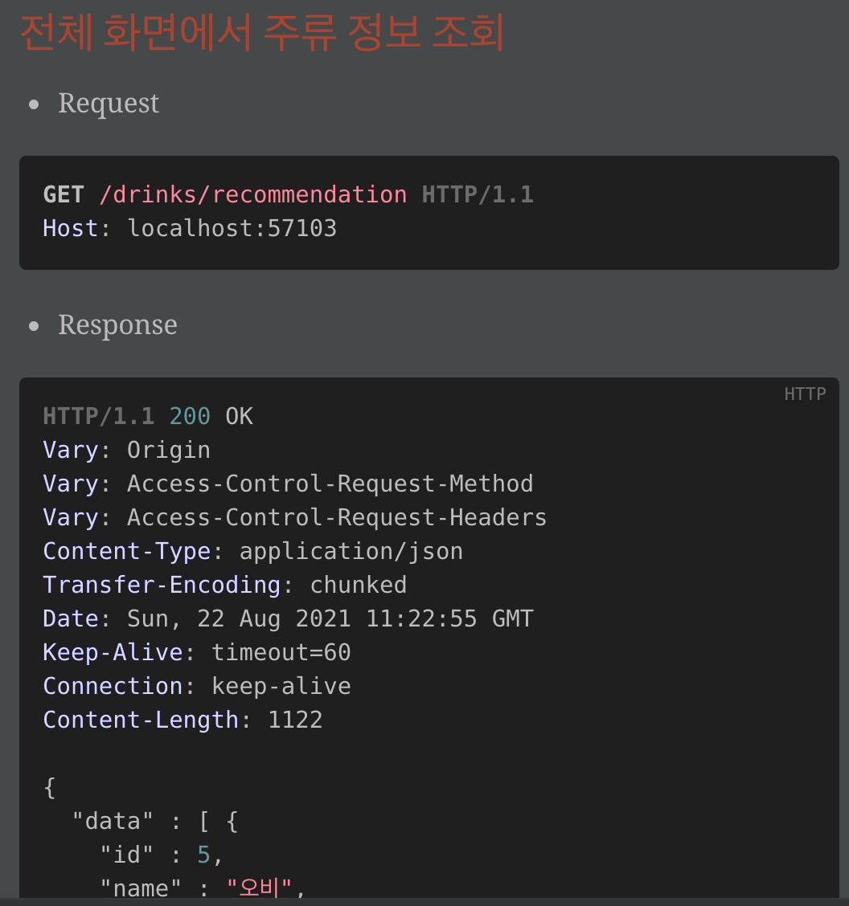

미리보기로 다음과 같이 확인할 수 있다.

4. gradle을 빌드하여 html 문서를 생성한다.

__build.gradle 파일__

```java
plugins {
    id "org.asciidoctor.jvm.convert" version "3.3.2"
}

dependencies {
    testImplementation 'org.springframework.restdocs:spring-restdocs-restassured'
    testImplementation 'io.rest-assured:rest-assured:3.3.0'
}

ext {
    snippetsDir = file('build/generated-snippets')
}

test {
    finalizedBy 'jacocoTestReport'
}

asciidoctor {
    dependsOn test
    inputs.dir snippetsDir
}

task createDocument(type: Copy) {
    dependsOn asciidoctor
    delete file('src/main/resources/static/index.html')
    from file("build/docs/asciidoc/index.html")
    into file("src/main/resources/static")
}

build {
    dependsOn createDocument
}

bootJar {
    dependsOn createDocument
    from("${asciidoctor.outputDir}") {
        into 'static'
    }
}
```

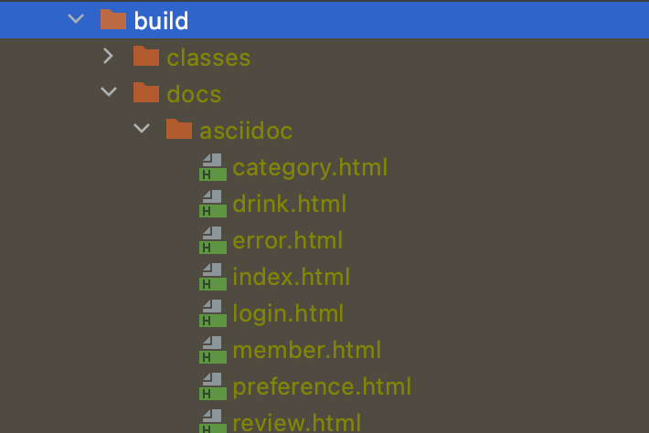

생선된 html 파일을 확인할 수 있다.

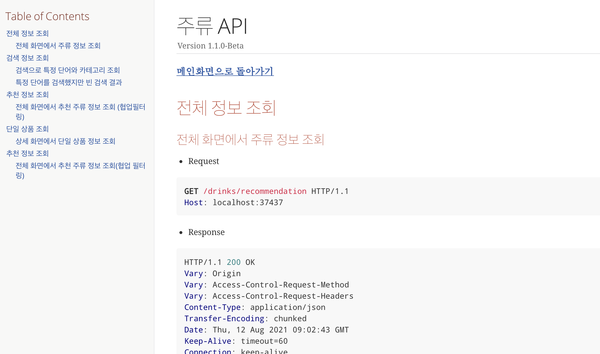

실제 서버에 들어가보면 API 문서화가 잘 되어있는 것을 확인할 수 있다.

## 참고 자료
- https://techblog.woowahan.com/2597/
- https://smujihoon.tistory.com/218
- https://jojoldu.tistory.com/31
