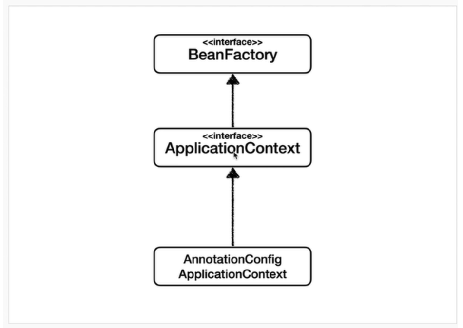

## 목차
- [ApplicationContext](#applicationcontext)
  - [Bean Factory와 ApplicationContext의 관계](#bean-factory와-applicationcontext의-관계)
  - [애플리케이션 컨텍스트 설정 진화 과정](#애플리케이션-컨텍스트-설정-진화-과정)
  - [빈을 등록방식](#빈을-등록방식)
    - [XML 이용](#xml-이용)
    - [@Configuration](#configuration)
    - [@ComponentScan](#componentscan)
    - [SpringBoot](#springboot)
  - [dirtysContext](#dirtyscontext)
  - [참고 자료](#참고-자료)

# ApplicationContext

## Bean Factory와 ApplicationContext의 관계
애플리케이션 컨텍스트가 조금 더 넓은 개념이다.


그림으로 보자면 다음과 같다.

빈 팩토리는 빈을 조회하고 관리하는 기능을 담당한다.
애플리케이션 컨텍스트는 빈 팩토리의 기능을 포함하여, 수 많은 기능을 포함한다.
사실 빈 팩토리를 직접 사용하는 일은 거의 없으며, 애플리케이션 컨텍스트를 주로 사용한다.

<br>

## 애플리케이션 컨텍스트 설정 진화 과정
- 초기에는 XML 설정 파일을 통해 Bean을 등록했다.
- 이후 XML 설정 파일에는 Component Scan을 적용할 패키지를 명시하고, `@Component` 애너테이션을 단 클래스를 스캔에 자동으로 Bean으로 등록했다.
- XML을 사용하지 않고, `@Configuration` 애너테이션을 단 클래스 파일에서 `@Bean`을 등록하는 `AnnotationConfigApplicationContext` 방식을 사용하였다.

<br>

## 빈을 등록방식

### XML 이용

```XML
<?xml version="1.0" encoding="UTF-8"?>
<beans xmlns="http://www.springframework.org/schema/beans"
       xmlns:xsi="http://www.w3.org/2001/XMLSchema-instance"
       xsi:schemaLocation="http://www.springframework.org/schema/beans http://www.springframework.org/schema/beans/spring-beans.xsd">
 
    <bean id="bookService"
          class="me.wordbe.springgoahead.BookService">
        <property name="bookRepository" ref="bookRepository" />
    </bean>
 
    <bean id="bookRepository"
          class="me.wordbe.springgoahead.BookRepository" />
</beans>
```

```java
public class SpringApplication {
 
    public static void main(String[] args) {
        // bookService 와 bookRepository 가 IoC 컨테이너 (ApplicationContext) 에 빈으로 등록되었는지 확인한다.
        ApplicationContext context = new ClassPathXmlApplicationContext("application.xml");
        String[] beanDefinitionNames = context.getBeanDefinitionNames();
        System.out.println(Arrays.toString(beanDefinitionNames)); // bookService, bookRepository
 
        // bookService 에 bookRepository가 주입되었는지 확인해본다.
        BookService bookService = (BookService) context.getBean("bookService");
        System.out.println(bookService.bookRepository != null); // true
    }
 
}
```
- 먼저 빈을 등록하는 XML 파일을 만든다.
- `ClassPathXmlApplicationContext`을 통해 ApplicationContext를 생성
- 등록된 빈을 사용한다.

### @Configuration
```java
@Configuration
public class AppConfig {

    @Bean
    public UserRepo userRepo() {
        return new UserRepo();
    }
}
```
```java
    @Test
    void userRepo() {
        AnnotationConfigApplicationContext ac = new AnnotationConfigApplicationContext(AppConfig.class);
        UserRepoWithConfig userRepoWithConfig = ac.getBean(UserRepoWithConfig.class);
        assertThat(userRepoWithConfig).isNotNull();
    }
```
- 설정 파일 클래스를 만들어 `@Configuration`을 붙여준다.
- ApplicationContext에 `AnnotationConfigApplicationContext`을 통해 빈을 넣어준다.

### @ComponentScan
```java
@Configuration
@ComponentScan
public class AppConfigCompScan {
}
```
- `@ComponentScan`을 이용해서 빈 등록을 할 수 있다.
- 각 클래스 위에 `@Component` 애노테이션을 붙여 빈 등록을 할 수 있다.
- 설정을 통해 클래스 스캔 범위를 지정할 수 있다.
  - basePackages 등..
  - 만약 붙이지 않으면 설정 정보 클래스의 패키지가 시작 위치가 된다.
- [참고](https://github.com/pika96/TIL/blob/master/Spring/%EC%8A%A4%ED%94%84%EB%A7%81%20%EA%B8%B0%EB%B3%B8%ED%8E%B8%20-%20%EA%B9%80%EC%98%81%ED%95%9C%EB%8B%98/%EC%BB%B4%ED%8F%AC%EB%84%8C%ED%8A%B8%20%EC%8A%A4%EC%BA%94.md)

### SpringBoot
~~마법의 단어 스프링 부트~~
```java
@SpringBootApplication
public class ApplicationContextApplication {

	public static void main(String[] args) {
		SpringApplication.run(ApplicationContextApplication.class, args);
	}
```
- `@SPinrgBootApplication` 내부에는 `@SpringBootConfiguration`와 `@EnableAutoConfiguration`가 내포되어 있다. 이를 통해 빈 등록을 자동으로 해준다.
- 내부적으로 `@ComponentScan`과 `@Configuration`을 통해 `@Component` 애노테이션이 들어간 빈을 자동으로 등록해준다.
- 우리가 흔히 사용하는 `@Controller`, `@Service`, `@Repository` 등에 `@Component`가 포함되어 있기 때문에 자동으로 등록되는 것이다.

<br>

## dirtysContext
스프링 테스트에서 성능상의 이유로 애플리케이션 컨텍스트는 딱 한개만 만들어지고 모든 테스트에서 공유해서 사용한다.
하지만 가끔씩 테스트를 통해 애플리케이션 컨텍스트가 변경될 경우가 있다.(이를 Dirty, 더럽혀졌다고 한다) 이 때, 변경 전 애플리케이션 컨텍스트로 테스트해야할 이 후의 테스트에 영향을 받게 된다.
이를 방지하기 위해  `@dirtysContext`를 이용하여 애플리케이션 컨텍스트를 새로 만들어 테스트를 진행할 수 있다.

```java
@DirtiesContext
public class UserRepo {
 // 테스트 케이스들이 새로운 context에서 실행됨
}
```
기본적인 `@DirtiesContext` 사용
이외에도 테스트 이전, 이후 등 여러가지 설정을 해줄 수 있다.
자세한 건 이곳 [참조](https://shortstories.gitbooks.io/studybook/content/dirtiescontext.html)

<br>

## 참고 자료
- https://wordbe.tistory.com/entry/Spring-IoC-%EB%B9%88-%EB%93%B1%EB%A1%9D-%EB%B0%A9%EB%B2%95-5%EA%B0%80%EC%A7%80
- https://shortstories.gitbooks.io/studybook/content/dirtiescontext.html