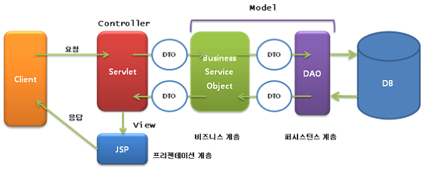

## 목차
- [DTO의 사용 범위](#dto의-사용-범위)
  - [DTO란?](#dto란)
  - [DTO를 어디까지?](#dto를-어디까지)
  - [Repository?](#repository)
  - [Controller vs Service?](#controller-vs-service)
    - [Controller에서 변환](#controller에서-변환)
    - [Service에서 반환](#service에서-반환)
  - [정리](#정리)
  - [참고 자료](#참고-자료)

# DTO의 사용 범위

## DTO란?



DTO(Data Transefer Object)는 데이터 전송 객체 즉, 이름 그대로 계층간 데이터 교환을 위해 만들어진 객체 입니다.

위 그림을 보면 Controller 레이어와 Service, Business 레이어 사이, DAO 사이 간에 데이터를 전달할 때 DTO를 사용하는 것을 볼 수 있습니다.

서로 다른 계층에 데이터를 전달할 때 도메인을 직접 전달하는 것보다 DTO를 사용하므로써 계층간의 의존성을 낮출 수 있습니다. 이는 독립적인 개발을 가능하게 합니다.

## DTO를 어디까지?
앞서 도메인을 직접 전달하는 것이 문제가 있다는 것을 알았습니다.
그렇다면 DTO와 도메인 간의 변환은 어디서 이루어져야할까요?
__Controller? Service? Repository?__

## Repository?
Repository 레이어는 영속성을 관장하는 계층입니다. Presentation 계층에서 사용하는 DTO를 여기서 변환하기에는 각 계층을 침범하는 것이 됩니다. 따라서 Repository는 아니라고 생각이 됩니다.

## Controller vs Service?
사실 이 부분을 많이 고민했습니다. 저는 미션을 진행하면서 항상 Controller 와 Service 중 어떤 부분에서 DTO를 변환해주어야하는지 항상 헷갈렸습니다. Controller에서 DTO를 변환한 적도 있었고, 반대로 Service에서 변환을 해준 적도 있습니다.  
이번 기회에 Controller와 Service 어떤 곳에서 변환해줘야하는지 정리해보고자 합니다.


### Controller에서 변환

```java
@PostMapping
    public ResponseEntity<StationResponse> createStation(@RequestBody StationRequest stationRequest) {
        Station station = new Station(stationRequest.getName());
        StationResponse stationResponse = StationResponse.from(stationService.save(station));
        return ResponseEntity.created(URI.create("/stations/" + stationResponse.getId())).body(stationResponse);
    }
```
이번 지하철 미션에서 역을 만들 때 쓰인 Controller 코드 중 일부입니다.
Controller 에서 Station 도메인을 만들어주고, 이를 Service에게 넘기고 있습니다.
다시 Service는 도메인을 반환하여 다시 Controller에서 DTO로 변환해주는 모습입니다.

이 때 예상되는 문제점은 무엇이 있을까요?
- Presentation 계층이 알 필요 없는 데이터가 Domain 객체에 포함되어 넘어오게 됩니다.
- Controller가 여러 개의 도메인을 가져야하기 때문에 Service의 개수가 많아집니다.

하지만 일반적으로 Controller에서 많이 DTO를 조합하고 사용한다고 하는데요!
이번엔 반대로 Service에서 DTO를 반환할 때를 살펴보겠습니다!
### Service에서 반환
```java
// Controller
@PostMapping(value = "/move")
    @ResponseBody
    public ResponseEntity<ResponseDTO> move(@RequestBody PositionDTO positionDTO, @SessionAttribute String roomName) {
        return ResponseEntity.ok().body(springChessService.move(positionDTO, roomName));
    }

// Service
 public ResponseDTO move(PositionDTO positionDTO, String roomName) {
        Board board = springBoardDao.findBoard(roomName).orElseThrow(NotExistRoomException::new);
        return moveExecute(positionDTO, board, roomName);
    }
```
이번에는 Service에서 Dto를 사용하고 반환하는 코드입니다.

Controller에서 Service에게 DTO를 직접 넘겨주어 Service에서 도메인을 만들어주는 모습입니다.

이렇게 되면 어떤 단점이 있을까요?
- Service 레이어에서 DTO를 사용하게 되면 여러 종류의 컨트롤러에서 해당 Service에 접근하기 어렵습니다.
  - 예를 들어, Service에서 DTO를 받게 된다면 다른 Controller에서는 DTO를 만들어주어 해당 Service에 접근해야할 것 입니다.


> 아직 많은 프로젝트를 접하진 못했지만 가벼운 Controller를 선호하는 저로써는 Service에서 DTO를 변환시켜주는 것을 선호합니다. (개인적인 의견!)

__2021.06.17 추가 내용__  
최근 프로젝트를 하면서 Service - Controller DTO와 Controller - View DTO, 즉 DTO를 2개 만들어 주었다.  
Service에서는 Controller에게 도메인 대신 도메인에 맵핑되는 DTO를 반환하고, Controller에서는 View(클라이언트)가 필요한 정보만 가지고 있는 DTO를 만들어 Service가 반환하는 DTO와 맵핑시키는 방식으로 사용했다.   

예를 들어 Service가 반환하는 DTO의 필드 a,b,c,d 중 클라이언트가 필요한 정보가 a, b뿐 이라면, 컨트롤러 - 뷰 DTO를 통해 필요한 정보만 맵핑시켜줄 수 있다.  
하지만 "컨트롤러와 뷰는 Presetation 계층으로 같은 계층 아닌가요? 같은 계층인데 왜 DTO가 필요한 것이죠?" 라고 물어볼 수 도 있다. 내 생각으로는 여기서 컨트롤러와 뷰는 인터넷을 가운데 두고 통신하기때문에 엄밀히 같은 계층이 아니라고 생각한다.(~~맞나?~~)

또한 여러 개의 Controller가 있다면 서비스를 재사용할 때 DTO를 통해 재가공해서 보내야할 것이다. 예를 들어, Service에서 a,b,c,d를 가지는 DTO를 반환한다고 가정하자. AController에서는 해당 서비스에서 a,b만 필요하고, BController에서 c,d만 필요하다고 하자. 이 때 Controller - View 간의 DTO를 활용해서 필요한 정보만 View에게 보내줄 수 있다!

따라서 Service, Controller 둘 다 DTO를 사용해도 괜찮다고 생각한다!  
~~뇌피셜이라.. 아닐수도..~~

## 정리
결국 도메인 객체가 어느 계층(Presentation 또는 Application)까지 표현되야 하느냐가 중점인 것 같습니다.
[DTO 사용범위](https://woowacourse.github.io/javable/post/2021-04-25-dto-layer-scope/) 끝맺음에서의 데이브의 의견처럼 엄격하게 제한되어야할 이유는 없어보입니다.
사실 이에 대해 정답은 없는 것 같습니다. 제 짧은 식견으로는 이 부분에 대해 확답을 내기 이르다고 생각합니다.

또한 프로젝트의 규모에 따라서 달라질 수 도 있을 것 같습니다.

## 참고 자료
- https://woowacourse.github.io/javable/post/2021-04-25-dto-layer-scope/
- https://os94.tistory.com/157