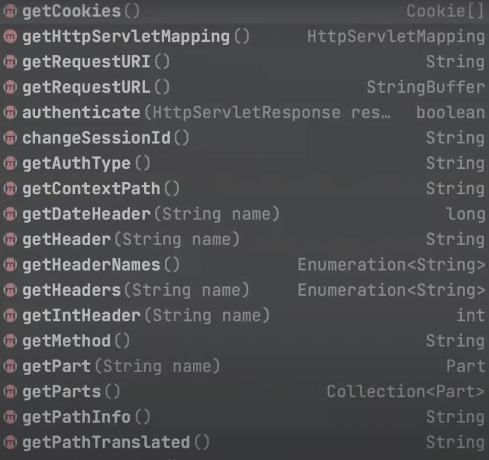
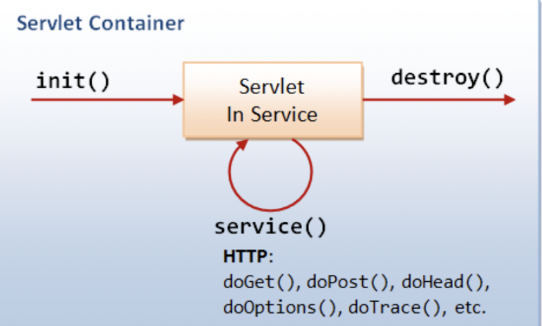
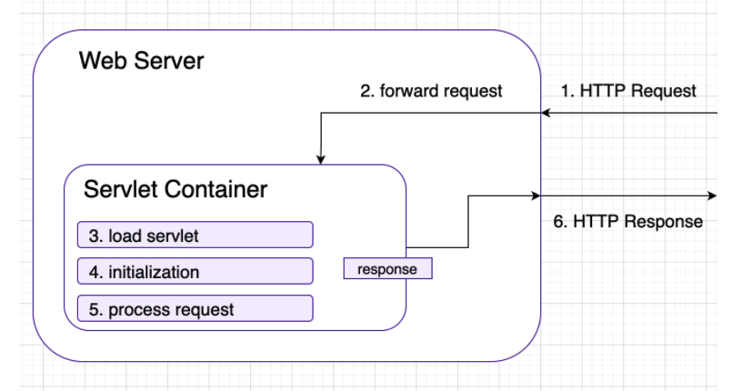
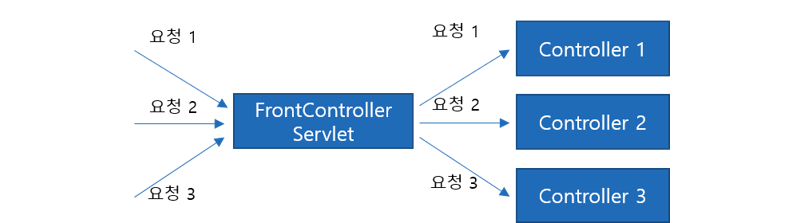
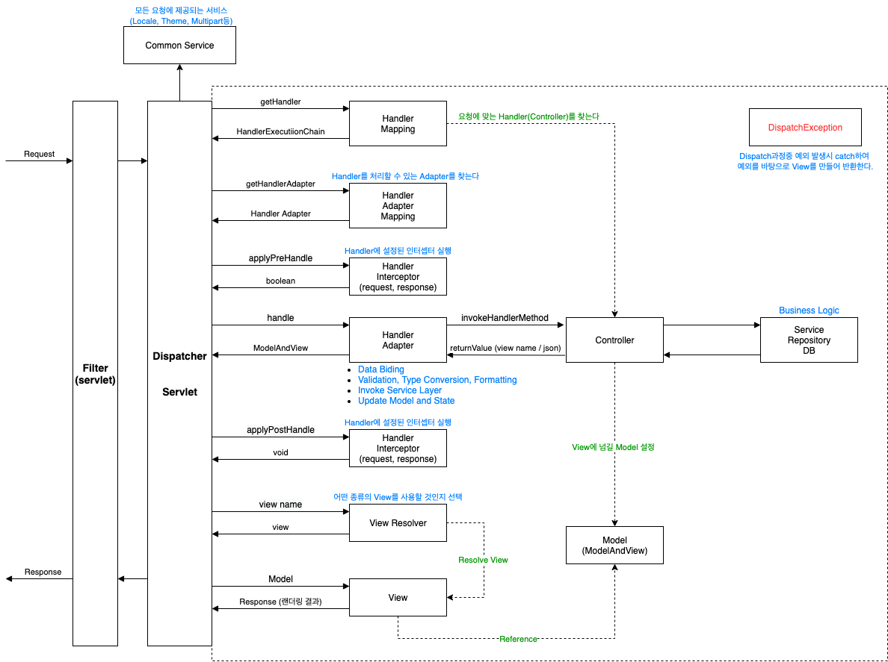

## 목차
- [Dispatcher Servlet](#dispatcher-servlet)
  - [Servlet](#servlet)
  - [Servlet Container](#servlet-container)
    - [역할](#역할)
    - [웹 서버와 서블릿 컨테이너 요청 처리 방식](#웹-서버와-서블릿-컨테이너-요청-처리-방식)
  - [Dispatcher Servlet](#dispatcher-servlet-1)
    - [기존의 servlet](#기존의-servlet)
    - [Front Controller 적용](#front-controller-적용)
    - [web.xml](#webxml)
  - [dispatcher Servlet 동작 방식](#dispatcher-servlet-동작-방식)
  - [참고자료](#참고자료)

# Dispatcher Servlet

## Servlet
> 서블릿  
> 웹 클라이언트로부터 요청을 받아 응답을 처리해서 결과를 반환하는 자바 프로그램

```java
public interface Servlet {
    public void init(ServletConfig config) throws ServletException;

    public ServletConfig getServletConfig();

    public void service(ServletRequest req, ServletResponse res)
            throws ServletException, IOException;

    public String getServletInfo();

    public void destroy();
}
```

__init()__  
- 서블릿 컨테이너가 서블릿을 생성한 후 초기화 작업을 수행하기 위해 호출하는 메서드

__service()__  
- 실질적으로 서비스 작업을 수행하는 메서드

__destory()__  
- 서블릿 컨테이너가 종료되거나 웹 애플리케이션이 멈출 때, 또는 해당 서블릿을 비활성화 시킬 때 호출하는 메서드  
- ex) 자원의 해제, 데이터 저장, 마무리 작업

__getServletConfig()__
- 서블릿 init()메서드가 성공적으로 완료된 후 호출된다.
- 서블릿 설정 정보를 다루는 ServletConfig 객체를 반환
- ex) 서블릿 이름, 내용, 초기 파라미터, 초기 파라미터 이름

__getServletInfo()__
- 작성자, 버전, 저작관과 같은 정보를 반환

서블릿은 인터페이스로 이루어져 있으며, 메서드를 통해 서블릿을 초기화하고, 서비스를 요청하고, 할 일을 다한 서블릿을 삭제한다.  

```java
Servlet -> GenericServlet -> HttpServlet
public interface Servlet
public abstract class GenericServlet implements Servlet, ServletConfig,
        java.io.Serializable
public abstract class HttpServlet extends GenericServlet
```
```java
protected void service(HttpServletRequest req, HttpServletResponse resp)
        throws ServletException, IOException {

        String method = req.getMethod();

        if (method.equals(METHOD_GET)) {                    
            doGet(req, resp);

        } else if (method.equals(METHOD_HEAD)) {
            doHead(req, resp);

        } else if (method.equals(METHOD_POST)) {
            doPost(req, resp);

        } else if (method.equals(METHOD_PUT)) {
            doPut(req, resp);

        } else if (method.equals(METHOD_DELETE)) {
            doDelete(req, resp);

        } else if (method.equals(METHOD_OPTIONS)) {
            doOptions(req,resp);

        } else if (method.equals(METHOD_TRACE)) {
            doTrace(req,resp);

        } else {
            resp.sendError(HttpServletResponse.SC_NOT_IMPLEMENTED, errMsg);
        }
    }
```
위 코드는 HttpServlet에 정의되어 있는 간략하게 바꾼 service() 메서드이다.  
request 요청으로부터 getMethod() 메서드를 사용하여 간편하게 해당 메서드를 파싱받고 해당 메서드의 종류에 따라 메서드를 실행시켜주고 있다.  
```java
public class MyServlet extends HttpServlet {
    @Override
    protected void doGet(HttpServletRequest req, HttpServletResponse resp) throws IOException {
        // 할 일
    }
}
```
우리가 할 일은 다음과 같이 doGet, doPost ... 등 메서드를 재정의해주는 일만 하면 된다!

```
// 요청
GET /api/products HTTP/1.1
Content-Type: application/json
User-Agent: PostmanRuntime/7.28.0
Accept: */*
Postman-Token: abfcbcf8-9317-430c-86b9-c00020eb736e
Host: localhost:8080
Accept-Encoding: gzip, deflate, br
Connection: keep-alive

// 응답
Location: http://localhost:8080/api/products/6
Content-Length: 202
Content-Type: application/json
Date: Sun, 02 May 2021 14:56:41 GMT
Keep-Alive: timeout=60
```
위 코드는 HTTP 요청과 응답이다. 개발자들이 이 텍스트를 분석하고 파싱하여, 위의 요청 코드를 아래의 응답코드로 만들어 주려면 매우 힘든 개발이 될 것이다.  


서블릿은 위와 같은 메서드들을 통해 필요한 http 요청 정보를 간단하게 가져올 수 있다. 이는 개발자들의 일거리를 줄여준다!~~편리하구만~~ 따라서 개발자는 비즈니스 로직에 집중할 수 있다.  

<br>

## Servlet Container
> 서블릿 컨테이너  
> 서블릿들의 생성, 실행, 파괴를 담당하고 관리한다.  
> HTTP 요청을 받아서 Servlet을 실행시키고 결과를 사용자 브라우저에게 전달해주는 기능을 가진 컴포넌트



톰캣과 같이 클라이언트의 요청을 받아서 정의된 서블릿을 수행하고, 응답을 할 수 있도록 웹 서버와 소켓 통신을 관리한다.  
기존에 클라이언트와 웹 서버만 통신했을 경우, 정적 페이지만 전송할 수 있기 때문에 비효율적이다. 따라서 동적으로 웹 페이지를 서버에 만들어서 전송할 수 있도록 하는 것이 servlet container이다.


### 역할
1. 웹 서버와의 통신 지원  
서블릿 컨테이너는 웹서버가 손쉽게 통신할 수 있게 도와준다. 일반적으로 통신을 하기 위해서는 소켓을 만들고, listen, accept 등 많은 과정을 거쳐야한다. 서블릿 컨테이너는 이를 API로 제공하여 복잡한 과정을 생략할 수 있게 도와준다. 따라서 개발자는 이러한 부분을 구현하지 않고 비즈니스 로직에만 집중할 수 있다.
2. 서블릿 생명주기 관리  
서블릿 컨테이너는 서블릿의 탄생과 죽음을 관리한다.   
서블릿 클래스를 로딩하여 인스턴스화(HttpServletRequest, HttpServletResponse 생성)한다. 요청이 들어오면 적절한 서블릿 메소드를 호출한다. 또한 GC(가비지 컬렉션)을 통해 서블릿이 생명을 다하면 처리해준다.
3. 멀티 스레드 지원 및 관리
하나의 서블릿 요청 당 하나의 자바 스레드가 생성된다. 서비스 메서드를 실행한 후 스레드는 소멸된다. 서버에서 다중 스레드를 관리해준다.
4. 선언적 보안 관리  
서블릿 컨테이너를 사용하면 개발자는 보안에 관련된 내용을 서블릿 또는 자바 클래스에 구현해 놓지 않아도 된다. 일반적으로 보안관리는 XML 배포 서술자에 기록하므로, 보안에 대해 수정할 일이 생겨도 자바 소스 코드를 수정하여 다시 컴파일 하지 않아도 보안관리가 가능하다.

### 웹 서버와 서블릿 컨테이너 요청 처리 방식

- 웹 서버가 HTTP 요청을 받는다.
- 웹 서버는 요청을 서블릿 컨테이너로 전달한다.
- 서블릿이 컨테이너에 없다면, 서블릿을 동적으로 검색하여 컨테이너의 주소 공간에 로드한다.
- 컨테이너가 서블릿의 init() 메소드를 호출하면, 서블릿이 초기화된다.   
- 컨테이너가 서블릿의 service() 메소드를 호출하여 HTTP 요청을 처리한다.
- 웹서버는 동적으로 생성된 결과를 받아 반환한다.

> 첫 A요청이 오면 서블릿 컨테이너에 내부에서는 해당 A 서블릿이 만들어진다. 이 때 init() -> service() 과정을 거친다. 이 때 자원 낭비의 이유로 해당 서블릿을 바로 destory() 하지 않고 해당 A 요청이 올 때마다 생성된 서블릿을 사용한다. 톰캣을 종료하기 전까지 destory 하지 않다가 종료하게 되면 destroy를 하여 모든 서블릿을 삭제한다.  
> 또한 해당 서블릿은 여러 개의 쓰레드가 접근하여 사용할 수 있으므로(멀티 쓰레드) 서블릿에 공유 변수를 선언하게 되면 문제가 생길 수 있다.


## Dispatcher Servlet
> FrontController라고도 불리는 이 서블릿은 매우 특별한 서블릿이다.  
> FrontController는 다양한 요청을 한 곳(컨트롤러 앞 단 front)에 집중시켜, 각 요청에 맞게 분기하여 처리해주는 컨트롤러이다.

### 기존의 servlet

기존의 방식은 url 요청 하나당 하나의 Servlet을 생성하고 그에 맞는 Controller에게 요청을 보내주는 코드를 각각 따로 작성해야 했다.

### Front Controller 적용

Front Controller를 적용하게 되면, 하나의 Servlet에서 모든 요청을 받아들여 적절한 Controller로 요청을 위임해줍니다.

### web.xml
dispatcherServlet이 등장하기 전, 우리는 요청 하나마다 서블릿 객체를 생성하고 그에 맞는 Controller에 요청을 보내주었다. 또한 서블릿들을 web.xml에 일일히 다 등록해주어야했다.
```xml
<!-- 서블릿1 등록 -->
<servlet>
    <servlet-name>서블릿1</servlet-name>
    ...
</servlet>
<servlet-mapping>
    <servlet-name>서블릿1</servlet-name>
    ...
</servlet-mapping>

<!-- 서블릿2 등록 -->
<servlet>
    <servlet-name>서블릿2</servlet-name>
    ...
</servlet>
<servlet-mapping>
    <servlet-name>서블릿2</servlet-name>
    ...
</servlet-mapping>

<!-- 서블릿3 등록 -->
<servlet>
    <servlet-name>서블릿3</servlet-name>
    ...
</servlet>
<servlet-mapping>
    <servlet-name>서블릿3</servlet-name>
    ...
</servlet-mapping>
```

dispatcherServlet을 통해 우리는 아래 코드처럼 dispatcherServlet에 모든 요청을 받도록 xml에 등록해주고, dispatcherServlet 내부에서 모든 요청을 처리해주는 방식으로 바뀌었다.

```xml
     <servlet>
        <servlet-name>action</servlet-name>
        <servlet-class>org.springframework.web.servlet.DispatcherServlet</servlet-class>
        <load-on-startup>1</load-on-startup>
    </servlet>
    <servlet-mapping>
        <servlet-name>action</servlet-name>
        <url-pattern>*.do</url-pattern>
    </servlet-mapping>
```

<br>

## dispatcher Servlet 동작 방식

dispatcher Servlet은 `org.springframework.web.servlet` 패키지에 선언되어있으며 스프링 프레임워크 기술이다.

Dispatcher 서블릿의 흐름은 다음과 같다.
1. `doService()` 메서드가 `doDispatch()` 메서드를 호출한다. 해당 메서드들은 `HttpServletRequest, HttpServletResponse`를 파라미터로 갖고 있다.
```java
protected void doService(HttpServletRequest request, HttpServletResponse response) throws Exception {
    
    ...
    
    try {
			doDispatch(request, response);
		}
		finally {
            ...
        }

    ...

}

protected void doDispatch(HttpServletRequest request, HttpServletResponse response) throws Exception {
}
```
2. getHandler를 통해 요청에 맞는 Handler를 찾는다.
```java
protected void doDispatch(HttpServletRequest request, HttpServletResponse response) throws Exception {

HttpServletRequest processedRequest = request;
		HandlerExecutionChain mappedHandler = null;
		boolean multipartRequestParsed = false;

		WebAsyncManager asyncManager = WebAsyncUtils.getAsyncManager(request);

		try {
			ModelAndView mv = null;
			Exception dispatchException = null;

			try {
				processedRequest = checkMultipart(request);
				multipartRequestParsed = (processedRequest != request);

				// Determine handler for the current request.
				mappedHandler = getHandler(processedRequest); // -> 해당 request에 맞는 Handler를 찾는다.
    ...

}
```
3. 맵핑된 mappedHandler를 가지고 `getHandlerAdapter()`를 통해 HandlerAdapter를 가져온다
```java
protected void doDispatch(HttpServletRequest request, HttpServletResponse response) throws Exception {

    ...

    HandlerAdapter ha = getHandlerAdapter(mappedHandler.getHandler()); // -> mappedHandler(맵핑된 핸들러) HandlerAdapter를 가져온다.

    ...

}
```
4. `applyPreHandle()`를 통해 설정된 인터셉터를 실행한다.
```java
protected void doDispatch(HttpServletRequest request, HttpServletResponse response) throws Exception {\

    ...

    if (!mappedHandler.applyPreHandle(processedRequest, response)) { // -> applyPreHandle은 boolean값을 반환하는데 false가 나오면 바로 return
        return;
    }

    ...

}
```
5. `handle()`을 통해 Controller에게 요청을 전달하고 처리 결과를 받는다.
```java
protected void doDispatch(HttpServletRequest request, HttpServletResponse response) throws Exception {

    ...

    mv = ha.handle(processedRequest, response, mappedHandler.getHandler()); // -> HandlerAdapter ha를 통해 Controller에게 요청을 전달하고 mv(ModelAndView)에 처리결과를 받는다.

    ...

}
```
6. `applyPostHandle()`를 통해 설정된 인터셉터를 실행한다.
```java
protected void doDispatch(HttpServletRequest request, HttpServletResponse response) throws Exception {

    ...

    mappedHandler.applyPostHandle(processedRequest, response, mv); // -> Controller 요청 처리 이후에 applyPostHandle()로 인터셉터 처리

    ...

}
```
7. viewResolver로 view를 랜더링한다.
8. 뷰 랜더링 이후로 호출되는 인터셉터인 afterCompletion를 통해 설정된 인터셉터를 실행한다.
9. 처리 결과를 클라이언트에게 전달한다.


<br>

## 참고자료
- https://mangkyu.tistory.com/14
- https://velog.io/@y_dragonrise/Servlet-Servlet-%EC%9D%B8%ED%84%B0%ED%8E%98%EC%9D%B4%EC%8A%A4
- https://velog.io/@han_been/%EC%84%9C%EB%B8%94%EB%A6%BF-%EC%BB%A8%ED%85%8C%EC%9D%B4%EB%84%88Servlet-Container-%EB%9E%80
- https://galid1.tistory.com/525
- https://github.com/binghe819/TIL/blob/master/Spring/MVC/image/mvc-flow.png
- https://www.youtube.com/watch?v=calGCwG_B4Y&list=PLgXGHBqgT2TvpJ_p9L_yZKPifgdBOzdVH&index=9