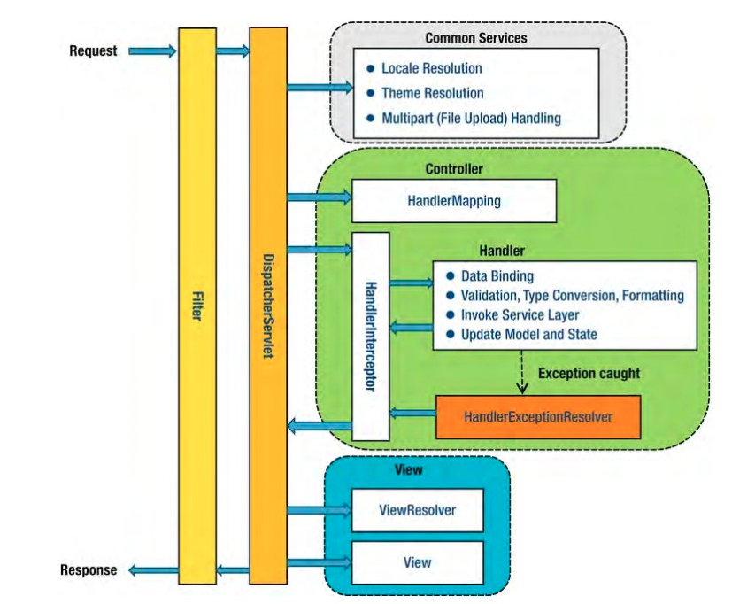
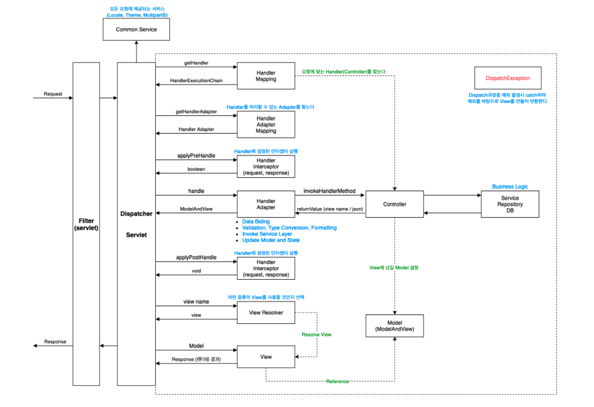

## 목차
- [HandlerInterceptor](#handlerinterceptor)
  - [HandlerInterceptor 메소드](#handlerinterceptor-메소드)
    - [preHandle](#prehandle)
    - [postHandle](#posthandle)
    - [afterCompletion](#aftercompletion)
  - [참고 자료](#참고-자료)

# HandlerInterceptor




핸들러 인터셉터, 말 그대로 중간에 가로채는 역할을 한다.  
가로채는 대상은 URL이며, 이를 이용하여 기존 컨트롤러 로직에 들어가기 전, 후에 임의로 제어가 가능하다.  
또한 특성 상 중복되는 부분을 한꺼번에 처리해줄 수 있다.(ex. 로그인 검증)  
Servlet Filter 이후 DispatcherServlet의 Interceptor에서 작동한다.

> 참고  
> Servlet Filter는 Spring이 아닌 J2EE 스팩  
> DispatcherServlet은 Spring 스팩

## HandlerInterceptor 메소드
HandlerInterceptor 인터페이스에는 3가지의 메서드가 정의되어 있다.
preHandle, postHandle, afterCompletion이다.

### preHandle
```jav
default boolean preHandle(HttpServletRequest request, HttpServletResponse response, Object handler)
			throws Exception {

		return true;
	}
```
Handler Mapping 이후, 지정된 컨트롤러 동작 이전에 실행되는 메소드이다.  
반환 값은 boolean이며, true일 경우 지정된 컨트롤러, false일 경우 컨트롤러를 실행하지 않고 return한다.  

__preHandle 사용 예시__

```java
@Override
    public boolean preHandle(HttpServletRequest request, HttpServletResponse response, Object handler) {

        if (request.getMethod().equals(HttpMethod.OPTIONS.name())) {
            return true;
        }

        String accessToken = request.getHeader("Authorization");

        if (accessToken == null) {
            throw new AuthorizationException("유효하지 않은 토큰입니다.");
        }

        String extractor = AuthorizationExtractor.extract(request);
        if (!jwtTokenProvider.validateToken(extractor)) {
            throw new AuthorizationException("유효하지 않은 토큰입니다.");
        }

        return true;
    }
```

### postHandle
```java
default void postHandle(HttpServletRequest request, HttpServletResponse response, Object handler,
			@Nullable ModelAndView modelAndView) throws Exception {
	}
```

컨트롤러가 동작한 후, HandlerAdapter에 의해 처리된 직후, 뷰를 생성하기 전 호출된다.

### afterCompletion
```java
default void afterCompletion(HttpServletRequest request, HttpServletResponse response, Object handler,
			@Nullable Exception ex) throws Exception {
	}
```
뷰 랜더링 후 호출되는 메소드  
컨트롤러 진입 후 뷰가 정상적으로 랜더링 된 후 제일 마지막에 실행되는 메소드

## 참고 자료
- https://github.com/binghe819/TIL/blob/master/Spring/MVC/Spring%20MVC%20flow.md
- https://www.baeldung.com/spring-mvc-handlerinterceptor