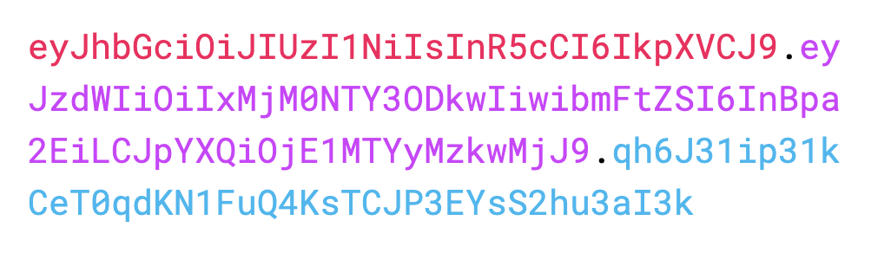
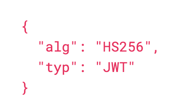
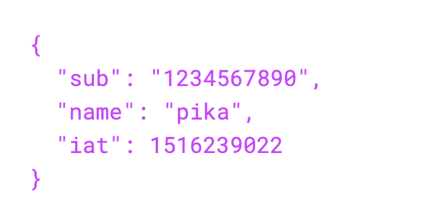
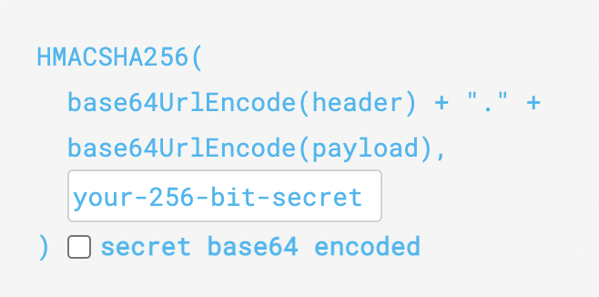

## 목차
- [JWT](#jwt)
  - [JWT란?](#jwt란)
  - [JWT의 모양](#jwt의-모양)
    - [Header](#header)
    - [Payload](#payload)
      - [클레임 종류](#클레임-종류)
    - [Signature](#signature)
    - [최종 토큰](#최종-토큰)
  - [참고 자료](#참고-자료)


# JWT

## JWT란?
JWT는 JSON Web Token의 약자로 [웹표준](https://datatracker.ietf.org/doc/html/rfc7519)으로서 두 개체에서 JSON 객체를 사용하여 정보를 안정성 있게 전달해줍니다.

## JWT의 모양


> JWT 토큰을 만들 때는 JWT를 담당하는 라이브러리가 자동으로 인코딩 및 해싱 작업을 해줍니다.

### Header

- Header는 두가지 정보를 지니고 있습니다.
- alg : 해싱 알고리즘을 지정합니다. 위의 그림에서는 HS256(HMAC SHA256)을 사용하고 있습니다. 일반적으로 HS256 또는 RSA를 사용합니다. 이 알고리즘은 토큰을 검증할 때 사용되는 signature 부분에서 사용됩니다.
- type : 토큰의 타입을 지정합니다. 여기서는 `JWT` 입니다.
- 위의 그림에 보이는 것처럼 Json 형태로 되어있는 Header를 `base64`로 인코딩하면 1번 파란색 문자열이 나옵니다.
- 이렇게 JWT 파트 중 첫 번째 파트가 완성이 됩니다.

### Payload

- Payload 부분에는 토큰에 담을 정보가 들어있습니다.
- 그림에서는 3가지 정보가 들어있는데 이 정보 하나를 클레임(claim)이라고 부르고 이는 name/ value의 한쌍으로 이루어져있습니다.
- 토큰에는 여러 개의 클레임을 넣을 수 있습니다.

#### 클레임 종류
클레임의 종류는 총 3가지로 분류됩니다.  

__Registered 클레임__  
이미 등록되어있는 클레임이며, 필요한 것을 선택해서 사용할 수 있다.
- iss: 토큰 발급자 (issuer)
- sub: 토큰 제목 (subject)
- aud: 토큰 대상자 (audience)
- exp: 토큰의 만료시간 (expiraton), 시간은 NumericDate 형식으로 되어있어야 하며 (예: 1480849147370) 언제나 현재 시간보다 이후로 설정되어있어야합니다.
- nbf: Not Before 를 의미하며, 토큰의 활성 날짜와 비슷한 개념입니다. 여기에도 NumericDate 형식으로 날짜를 지정하며, 이 날짜가 지나기 전까지는 토큰이 처리되지 않습니다.
- iat: 토큰이 발급된 시간 (issued at), 이 값을 사용하여 토큰의 age 가 얼마나 되었는지 판단 할 수 있습니다.
- jti: JWT의 고유 식별자로서, 주로 중복적인 처리를 방지하기 위하여 사용됩니다. 일회용 토큰에 사용하면 유용합니다.

__public 클레임__  
공개 클레임들은 충돌이 방지된 (collision-resistant) 이름을 가지고 있어야 합니다. 충돌을 방지하기 위해서는, 클레임 이름을 URI 형식으로 짓습니다.
```java
  "https://github.com/pika96/TIL": true
```
__private 클레임__  
Registered, public 클레임에 속하지 않는 클레임입니다. 일반적으로 클라이언트와 서버간에 서로 협의하여 사용되는 클레임입니다. 이는 공개 클레임과는 달리 이름이 중복되어 충돌이 날 수 있으니 주의해서 사용해야합니다.
```java
{
  "username": "pika"
}
```
- [출처](https://velopert.com/2389)

### Signature

- JWT의 마지막 파트인 signature는 헤더의 인코딩 값과, Payload의 인코딩 값을 합쳐 주어진 비밀키로 해쉬하여 생성합니다.
- 주어진 header와 payload를 base64로 인코딩한 값을 비밀키를 이용하여 해쉬합니다.

### 최종 토큰

이 세 부분을 합치면 JWT 토큰이 나오게 됩니다. 각각 파트는 `.`으로 구분합니다.

## 참고 자료
- https://jwt.io/
- https://velopert.com/2389