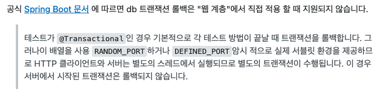

## 목차
- [Transaction](#transaction)
  - [Transaction](#transaction-1)
    - [Transaction 예시](#transaction-예시)
  - [ACID](#acid)
  - [다수의 트랜잭션 실행 시 발생 가능한 문제 상황](#다수의-트랜잭션-실행-시-발생-가능한-문제-상황)
    - [Dirty Read](#dirty-read)
    - [Non-Repeatable Read](#non-repeatable-read)
    - [Phantom Read](#phantom-read)
  - [격리 수준](#격리-수준)
  - [Transaction 전파 속성(Propagation)](#transaction-전파-속성propagation)
  - [@Transactional](#transactional)
    - [@Transactional 의미](#transactional-의미)
    - [@Transactional 예제](#transactional-예제)
    - [@Transactional 동작 원리](#transactional-동작-원리)
    - [테스트 코드에서 @Transactional](#테스트-코드에서-transactional)
  - [미션을 진행하면서 나온 문제점](#미션을-진행하면서-나온-문제점)
  - [참고 자료](#참고-자료)


# Transaction
미션을 진행하면서 Transaction과 @Transactional 애노테이션에 관해 궁금해졌다.
먼저 Transaction은 DB에서 사용되는 개념이고 @Transactional 또한 DB에 관련된 내용이긴하지만 Spring 애노테이션이다.
두 가지 키워드들이 다르다는 건 아니지만 개념이 애매모호하여 한번 짚고 넘어가보고자 한다.

## Transaction
> 트랜잭션이란?  
> 하나의 수행 단위  
> DB 상태를 변환시키는 하나의 논리적인 기능을 수행하기 위한 작업의 단위이며, 더 이상 나눌 수 없는 단위이다.  
> 수행 단위를 하나로 묶어 한꺼번에 수행되어야한다. 만약 중간에 오류가 발생하면 RollBack을 수행하고, 오류없이 실행을 마치면 commit을 한다.

### Transaction 예시
제일 유명한 은행 예시
- A가 B에게 10000원을 송금하는 상황
- A 계좌에서 10000원이 차감되고 B 계좌에 10000원이 증가해야한다.
- A 계좌에서 10000원이 차감되고 B 계좌에서 10000원이 증가하기 전에 오류가 발생하여 10000원이 증가하지 않는다면 10000원이 증발되는 문제가 발생할 것이다.
- 그렇기 때문에 A 계좌에서 10000원이 차감되고 B 계좌에서 10000원이 증가하는 일련의 과정을 트랜잭션(하나의 수행 단위)로 묶어 실행한다.
- 만약 중간에 오류가 발생했을 경우 이전에 실행했던 과정들을 모두 rollback하고 오류가 없다면 정상적으로 commit을 한다.

<br>

## ACID
> 트랜잭션의 4가지 특성

간단하게 정리해보자

- Atomictiy(원자성)
  - 한 트랜잭션 내에서 실행한 작업들은 하나로 간주한다.
  - 모두 성공하거나 모두 실패해야한다.
  - ex) 업데이트 시 절반만 성공하고 절반은 실패하면 안된다.
- Consistency(일관성)
  - 트랜잭션의 실행이 성공적으로 완료되면 데이터베이스를 항상 일관성 있는 상태로 유지해야한다.
  - 데이터 모델의 모든 제약조건(기본키, 외래키, 도메인, 도메인 제약조건 등)을 만족해야한다.
  - ex1) varchar(10)이 long으로 변하면 안된다.
  - ex2) A 테이블의 PK가 B 테이블의 FK로 존재할 때 A 테이블에서 PK가 변경되면 B 테이블의 FK 또한 변경되어야 한다.
- Isolation(격리성)
  - 동시에 실행되는 트랜잭션들은 서로 영향을 미치지 않도록 격리해야 한다.
  - 데이터에 동시에 접근해서 읽기, 쓰기할 때 주의해야한다.
  - 해당 데이터에 접근하지 못하도록 Lock & unLock을 사용한다.
  - shared_lock은 읽기만 허용
  - deadLock 조심
- Durability(지속성)
  - 트랜잭션을 성공적으로 마치면 결과가 항상 저장되어야 한다.

<br>

## 다수의 트랜잭션 실행 시 발생 가능한 문제 상황
### Dirty Read
- A가 변경 후 커밋하지 않은 상태에서 B가 조회를 한다.
- A가 중간에 문제가 생겨서 롤백되었으면 B는 잘못된 값을 조회한 상황이 된다.
- ex) `insert into A`를 하고 아직 A가 커밋되지 않은 상태에서 B가 `select * from` 으로 조회할 수 있다.

### Non-Repeatable Read
- A가 반복적으로 쿼리를 사용하는 사이에 B가 값을 변경하고 커밋을 해서, A의 쿼리 중간에 결과가 달라지는 상황이 된다.
- 한 트랜잭션 안에서 같은 쿼리를 두번 실행했을 때, 데이터 불일치 문제 발생.
- ex) A가 중간에 두 번 `select * from` 을 했을 때, B로 중간에 값을 바꾸어 두 `select * from`이 다른 결과가 나올 때

### Phantom Read
- A가 특정 범위를 조회하는 쿼리를 두번 이상 실행할 때, B가 중간에 값을 추가해서 이후 실행된 A의 쿼리에 이전에 없던 유령 데이터가 생기는 문제가 발생한다.
- ex) A가 `where money = 0 ~ 10000`을 두 번 조회할 때, B가 `insert into money = 500`을 추가해서 A의 첫 번째 결과는 100개 두 번째 결과는 101개 결국 row가 달라졌을 경우

<br>

## 격리 수준
> 사용 방법  
> `@Transactional(isolation = Isolation.DEFAULT)`

__DEFAULT__

- 기본 격리 수준이며 DB의 격리수준을 따른다.
- MySql → Repeatable-read, Oracle → Read committed

__READ_UNCOMMITED(level 0)__

- 커밋되지 않은 데이터에 대한 읽기를 허용
- Dirty Read 발생 가능
- 실제 DB에는 이러한 수준을 허용하지 않는다.

__READ_COMMITTED(level 1)__

- 커밋 확정된 데이터에 대해서만 읽기를 허용
- Dirty Read 방지

__REPEATABLE_READ(level 2)__

- 트랜잭션이 완료될 때까지 `SELECT` 하는 데이터에 대해서 shared-lock이 걸리므로 해당 데이터는 수정이 불가하다.

__SERIALIZABLE(level 3)__

- 트랜잭션이 완료될 때까지 `SELECT` 하는 데이터에 대해서 shared-lock이 걸리므로 해당 데이터는 수정과 입력이 불가하다.

하지만 격리수준이 올라갈 수록 성능 저하의 우려가 있다는 것을 명심하자.

## Transaction 전파 속성(Propagation)
> 사용법  
> `@Transactional(propagation=Propagation.REQUIRES_NEW)`

- REQUIRED (default) : 이미 시작된 트랜잭션이 있으면 참여하고 없으면 새로 시작한다. 

- REQUIRES_NEW : 항상 새로운 트랜잭션을 시작한다. 이미 진행 중인 트랜잭션이 있으면 트랜잭션을 잠시 보류시킨다.

- SUPPORTS : 이미 시작된 트랜잭션이 있으면 참여하고, 없으면 트랜잭션없이 진행한다.

- NESTED : 중첩된 트랜잭션은 먼저 시작된 부모 트랜잭션의 커밋과 롤백에는 영향을 받지만 자신의 커밋과 롤백은 부모 트랜잭션에게 영향을 주지 않는다. 메인 트랜잭션이 롤백되면 중첩된 로그 트랜잭션도 같이 롤백되지만, 반대로 중첩된 로그 트랜잭션이 롤백돼도 메인 작업에 이상이 없다면 메인 트랜잭션은 정상적으로 커밋된다.

- MANDATORY : REQUIRED와 비슷하게 이미 시작된 트랜잭션이 있으면 참여한다. 반면에 트랜잭션이 시작된 것이 없으면 새로 시작하는 대신 예외를 발생시킨다. 혼자서는 독립적으로 트랜잭션을 진행하면 안 되는 경우에 사용한다.

- NOT_SUPPORTED : 트랜잭션을 사용하지 않게 한다. 이미 진행 중인 트랜잭션이 있으면 보류시킨다.

- NEVER : 트랜잭션을 사용하지 않도록 강제한다. 이미 진행 중인 트랜잭션도 존재하면 안된다 있다면 예외를 발생시킨다.

이중 프로젝트 수행중에 많이 쓰이는 녀석들은 REQUIRED, REQUIRES_NEW, NESTED, SUPPORTS 이다.

<br>

## @Transactional
트랜잭션을 공부하기전에는 @Transactional을 테스트에서 사용할 때 DB에 저장하기 전에 commit만 하고 push를 하지 않게 해주는, 그러니까 테스트마다 항상 깨끗한 DB를 만들어주는 애노테이션이라고 생각을 했다. 공부를 해보니 전혀 다른 활용의 애노테이션인 것을 알았다.

### @Transactional 의미
- @Transactional는 클래스나 메소드 등에 선언할 수 있다.
- @Transactional가 선언된 클래스나 메소드는 하나의 트랜잭션으로 만들어준다는 의미이다.
- DB에서는 기본적으로 트랜잭션이 적용되어 있으므로 단일 쿼리문 또는 쓰기 작업이 없는 경우, @Transactional 애노테이션은 의미가 없다.

### @Transactional 예제
```java
create table A ( value varchar(500));
create table B ( value varchar(10));
```

```java
@Test
@Transactional // -> 트랜잭션
public void insert() {
    String value = "abcdeabcdeabcdeabcdeabcdeabcde";

    ADao.insert(value); // -> 1번

    BDao.insert(value); // -> 2번
}
```
- 테이블 A는 500byte, 테이블 B는 10byte를 저장할 수 있는 문자열을 갖고있다.
- 해당 테이블에 10byte가 넘는 문자열을 넣게 되면 A테이블은 저장되지만 B테이블에는 오류가 발생할 것이다.
- 이 때 @Transactional을 붙여주지 않으면 A테이블에는 저장되고 B테이블은 저장되지 않을 것이다.
- 만약 @Transactional을 붙여주면 중간에 오류가 발생했기 때문에 rollback이 될 것이다.
- 즉, 현재 insert() 메서드 자체가 하나의 트랜잭션으로 묶여 하나의 수행 단위가 된 것이다.


### @Transactional 동작 원리
- 클래스나 메서드에 @Transactional이 추가되면, 해당 클래스에 트랜잭션이 기능이 적용된 프록시 객체가 생성된다.
- 해당 프록시 객체는 @Transactional이 포함된 메서드가 호출될 경우, PlatformTransactionManager를 사용하여 트랜잭션을 시작한다.

<br>

### 테스트 코드에서 @Transactional
DB 테스트를 돌릴 경우 @Test와 함께 @Transactional을 붙여주면 롤백된다.

만약 롤백하고 싶지 않다면 아래와 같이 @Rollback 애노테이션을 붙이면 된다.

```java
@Test
@Rollback(false)
public void insert() {

}
```
하지만 나는 그동안 DB 롤백을 시키기 위해 @Rollback을 사용하지 않고 @Transactional을 사용했는가?
@Transactional은 하나의 트랜잭션을 만들어주는 것인데, 왜 헷갈리게 Test 클래스에서 사용하게 되면 Rollback을 해주는 부가적인 기능을 붙여주었을까?

@Rollback을 붙여주게 되면 하나의 쿼리당 연결과 끊음을 반복하면서 테스트를 진행하게 된다. 반면 @Transactional을 붙여주면 여러 개의 작업을 묶어 처리하기 때문에 한 번의 연결과 종료만 있으면 된다. 그렇기 때문에 성능이 좋아지는 결과를 얻을 수 있다.

<br>

## 미션을 진행하면서 나온 문제점
webEnvironment(웹 계층에 직접 적용할 때)에서 @Transcational을 사용하면 롤백이 적용되지 않는다.
```java
@SpringBootTest(webEnvironment = SpringBootTest.WebEnvironment.RANDOM_PORT)
```


이해가 완벽하게 되지는 않지만 웹 계층에서 직접 적용할 경우 별도의 스레드에서 실행되어 안된다는 것 같다!
- 참고 문서 : https://stackoverflow.com/questions/46729849/transactions-in-spring-boot-testing-not-rolled-back

<br>

## 참고 자료
- 토비의 스프링
- https://github.com/woowacourse-tobi-spring-study/tobi-vol1/pull/56
- https://sas-study.tistory.com/233
- https://www.notion.so/Transactional-86117c751391481e84d8b90711327622
- https://oingdaddy.tistory.com/m/28