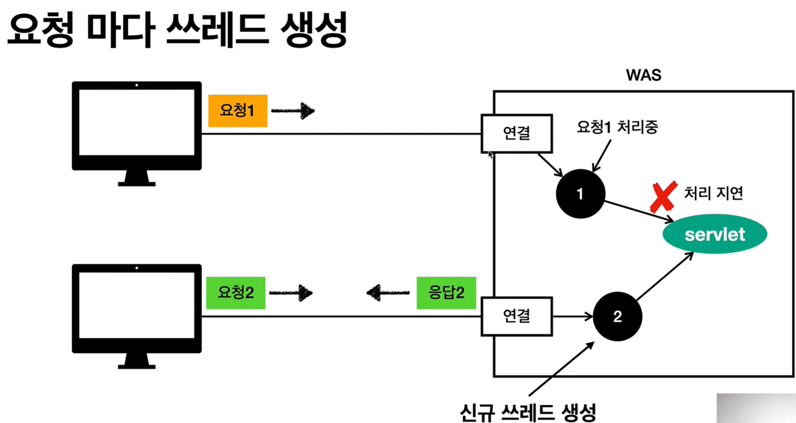
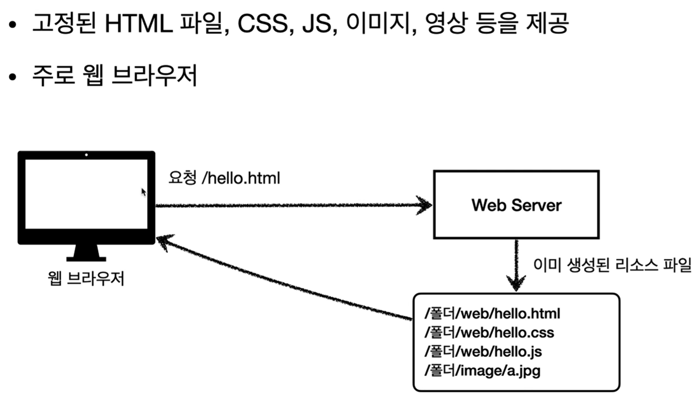

## 목차
- [웹 애플리케이션 이해](#웹-애플리케이션-이해)
  - [웹 서버, 웹 애플리케이션 서버](#웹-서버-웹-애플리케이션-서버)
    - [웹서버](#웹서버)
    - [웹 애플리케이션 서버(WAS - Web Application Server)](#웹-애플리케이션-서버was---web-application-server)
    - [웹 서버 vs 웹 애플리케이션 서버 차이](#웹-서버-vs-웹-애플리케이션-서버-차이)
  - [서블릿](#서블릿)
    - [서블릿을 지원하는 WAS 사용](#서블릿을-지원하는-was-사용)
    - [서블릿 특징](#서블릿-특징)
    - [그림으로 보는 서블릿 과정](#그림으로-보는-서블릿-과정)
    - [서블릿 컨테이너](#서블릿-컨테이너)
  - [동시 요청 - 멀티 쓰레드](#동시-요청---멀티-쓰레드)
    - [쓰레드](#쓰레드)
    - [요청마다 쓰레드 생성할 시 장단점](#요청마다-쓰레드-생성할-시-장단점)
    - [쓰레드 풀](#쓰레드-풀)
    - [쓰레드 풀의 적정 숫자](#쓰레드-풀의-적정-숫자)
    - [WAS의 멀티 쓰레드 지원](#was의-멀티-쓰레드-지원)
  - [HTML, HTTP API, CSR, SSR](#html-http-api-csr-ssr)
    - [정적 리소스](#정적-리소스)
    - [HTML 페이지](#html-페이지)
    - [HTTP API](#http-api)
    - [서버사이드 렌더링, 클라이언트 사이드 렌더링](#서버사이드-렌더링-클라이언트-사이드-렌더링)
  - [자바 백엔드 웹 기술 역사](#자바-백엔드-웹-기술-역사)
    - [과거](#과거)
    - [현재](#현재)
    - [최신 기술 - 스프링 웹 기술의 분화](#최신-기술---스프링-웹-기술의-분화)
    - [자바 뷰 템플릿 역사](#자바-뷰-템플릿-역사)

# 웹 애플리케이션 이해

## 웹 서버, 웹 애플리케이션 서버

__HTTP 메서지에 모든 것을 전송__

- HTML, TEXT
- IMAGE, 음성, 영상, 파일
- JSON, XML (API)
- 거의 모든 형태의 데이터 전송 가능
- 서버간에 데이터를 주고 받을 때도 대부분 HTTP 사용

HTTP 프로토콜을 기반으로 데이터를 주고 받는다.
서버 간에도 HTML이 아닌 HTTP로 주고 받는다.

### 웹서버
- HTTP 기반으로 동작
- 정적 리소스 제공, 기타 부가기능
- 정적 HTML, CSS, JS, 이미지, 영상
- ex) NGINX, APACHE

### 웹 애플리케이션 서버(WAS - Web Application Server)
- HTTP 기반으로 동작
- 웹 서버 기능 포함 + (정적 리소스 제공 가능)
- 프로그램 코드를 실행해서 애플리케이션 로직 수행
  - 동적 HTML, HTTP API(JSON)
  - 서블릿, JSP, 스프링 MVC
- ex) 톰캣(Tomcat) Jetty, Undertow

### 웹 서버 vs 웹 애플리케이션 서버 차이
- 웹 서버 정적 리소스, WAS는 애플리케이션 로직
- 사실 둘의 용어도 경계도 모호함
  - 웹 서버도 프로그램을 실행하는 기능을 포함하기도 함
  - 웹 애플리케이션 서버도 웹 서버의 기능을 제공함
- 자바는 서블릿 컨테이너 기능을 제공하면 WAS
  - 서블릿 없이 자바 코드를 실행하는 서버 프레임워크도 있음
- WAS는 애플리케이션 코드를 실행하는데 더 특화

__웹 시스템 구성 - WAS, DB__
- WAS, DB 만으로 시스템 구성 가능
- WAS는 정적 리소스, 애플리케이션 로직 모두 제공 가능

- WAS가 너무 많은 역할을 담당, 서버 과부하 우려
  - 애플리케이션 로직 실행
  - 정적인 컨텐츠 제공
- 가장 비싼 애플리케이션 로직이 정적 리소스 때문에 수행이 어려움
  - HTML, CSS, JS, 이미지 등은 값싼 연산
  - 애플리케이션 로직은 값비싸다
- WAS 장애시 오류 화면도 노출 불가능

__웹 시스템 구성 - WEB, WAS, DB__

- 정적 리소스는 웹 서버가 처리
- 웹 서버 애플리케이션 로직같은 동적인 처리가 필요하면 WAS에 요청을 위임
- WAS는 중요한 애플리케이션 로직 처리 전담
- WAS와 WEB Server를 분리해서 사용
- WAS는 중요한 애플리케이션 로직을 담당
- Web Server은 정적인 리소스 호출, WAS 호출

구조를 이렇게 바꾸게 되면 효율적으로 자원을 관리할 수 있다.
- 정적 리소스가 많이 사용되면 Web 서버 증설
- 애플리케이션 리소스가 많이 사용되면 WAS 증설

- 정적 리소스만 제공하는 웹 서버는 잘 죽지 않음
  - 단순하게 파일을 읽어서 제공하면 끝이기 때문
  - 계산하는 로직 같은 부분이 없어 잘 죽지 않음
- 애플리케이션 로직이 동작하는 WAS 서버는 잘 죽음
  - DB가 죽거나 코드가 실행하다 죽거나 등등..
- WAS, DB 장애 시 WEB 서버가 오류 화면 제공 가능
  - Web Server가 WAS에게 요청시 응답이 없으면 오류 출력

 

## 서블릿

우리가 필요한건 초록색 칸인 비즈니스 로직인데, 소켓을 연결하고 파싱하고.. 응답메시지 생성하고 전달.. 소켓 종료 등.. 너무 할일이 많다!!

### 서블릿을 지원하는 WAS 사용

서블릿의 초록색 칸을 제외한 부분을 모두 해준다!

### 서블릿 특징

- urlPatterns(/hello)의 URL이 호출되면 서블릿 코드가 실행
- HTTP 요청 정보를 편리하게 사용할 수 있는 HttpServletRequest
- HTTP 응답 정보를 편리하게 사용할 수 있는 HttpServletResponse
  - 서블릿이 요청, 응답 정보를 알아서 파싱 해준다! ~~편리하네~~
- 개발자는 HTTP 스펙을 매우 편라히게 사용

### 그림으로 보는 서블릿 과정

1. 웹 브라우저에서 localhost:8080/hello를 요청
2. HTTP 요청 메시지를 기반으로 request, response를 새로 만든다.
3. 생성한 request, response을 helloSerlet 파라미터로 넘겨 실행한다.
4. response를 기반으로 응답 객체를 만든다.

- HTTP 요청시
  - WAS는 Request, Response 객체를 새로 만들어서 서블릿 객체 호출
  - 개발자는 Request 객체에서 HTTP 요청 정보를 편리하게 꺼내서 사용
  - 개발자는 Response 객체에 HTTP 응답 정보를 편리하게 입력
  - WAS는 Response 객체에 담겨있는 내용으로 HTTP 응답 정보를 생성

### 서블릿 컨테이너

- 톰캣처럼 서블릿을 지원하는 WAS를 서블릿 컨테이너라고 함
- 서블릿 컨테이너는 서블릿 객체를 생성, 초기화, 호출, 종료하는 생명주기 관리
- 서블릿 객체는 싱글톤으로 관리
  - 고객의 요청이 올 때마다 계속 객체를 생성하는 것은 비효율
  - 최초 로딩 시점에서 서블릿 객체를 미리 만들어두고 재활용
  - 모든 고객 요청은 동일한 서블릿 객체 인스턴스에 접근
  - 공유 변수 사용 주의
  - 서블릿 컨테이너 종료시 함께 종료
- JSP도 서블릿으로 변환 되어서 사용
- 동시 요청을 위한 멀티 쓰레드 처리 지원

 

## 동시 요청 - 멀티 쓰레드

> 클라이언트에서 서버에 요청을 보내면, 해당 서블릿 객체는 누가 호출할까?

### 쓰레드
- 애플리케이션 코드를 하나하나 순차적으로 실행하는 것은 쓰레드
- 자바 메인 메서드를 처음 실행하면 main이라는 이름의 쓰레드가 실행
- 쓰레드가 없다면 자바 애플리케이션 실행이 불가능
- 쓰레드는 한번에 하나의 코드 라인만 수행
- 동시 처리가 필요하면 쓰레드를 추가로 생성

단일 요청 시 쓰레드를 하나만 사용한다!
- 기존의 휴식을 하고 있던 쓰레드를 연결한다.
- 할당된 쓰레드가 servlet 객체를 호출한다.
- servlet 객체를 통해 응답을 한다.

1. 첫 번째 요청을 하나의 쓰레드가 처리하고 있다.
2. 처리하는 도중 두 번째 요청이 들어오게 되면 쓰레드는 하나의 일밖에 처리하지 못하기 때문에 오류가 발생한다.

간단하게 요청마다 쓰레드를 생성해준다.

### 요청마다 쓰레드 생성할 시 장단점
- 장점
  - 동시 요청을 처리할 수 있다.
  - 리소스(CPU, 메모리)가 허용할 때까지 처리 가능
  - 하나의 쓰레드가 지연 되어도, 나머지 쓰레드는 정상 동작한다.
- 단 점
  - 쓰레드는 생성 비용은 매우 비싸다.
    - 고객의 요청이 올 때마다 쓰레드를 생성하면, 응답 속도가 늦어진다.
  - 쓰레드는 컨텍스트 스위칭 비용이 발생한다.
    - 코어 하나가 쓰레드를 2개 실행할 때 사실 쓰레드를 전환하면서 처리를 한다.
    - 우리 눈에는 동시에 처리되는 것처럼 보이지만 사실 빠르게 전환하면서 처리한다
    - 이렇게 쓰레드를 전환할 때 드는 비용을 컨텍스트 스위칭 비용이라고 한다.
  - 쓰레드 생성에 제한이 없다.
    - 고객 요청이 너무 많이 오면, cpu, 메모리 임계점을 넘어서 서버가 죽을 수 있다.

요청이 오면 쓰레드 풀에서 쉬고 있는 쓰레드을 연결한다.
다 쓰면 풀에 반납한다.
쓰레드 풀에 쓰레드가 200개 일 때, 사용하고 있는 쓰레드가 200개라면 쓰레드 대기 및 거절할 수 있다.

### 쓰레드 풀
요청마다 쓰레드 생성의 단점 보완
- 특징
  - 필요한 쓰레드를 쓰레드 풀에 보관하고 관리한다.
  - 쓰레드 풀에 생성 가능한 쓰레드의 최대치를 관리한다. 톰캣은 최대 200개 기본 설정
- 사용
  - 쓰레드가 필요하면, 이미 생성되어 있는 쓰레드를 쓰레드 풀에서 꺼내서 사용한다.
  - 사용을 종료하면 쓰레드 풀에 해당 쓰레드를 반납한다.
  - 최대 쓰레드가 모두 사용중이어서 쓰레드 풀에 쓰레드가 없으면?
    - 기다리는 요청은 거절하거나 특정 숫자만큼 대기하도록 설정할 수 있다.
- 장점
  - 쓰레드가 미리 생성되어 있으므로, 쓰레드를 생성하고 종료하는 비용(CPU)이 절약되고, 응답 시간이 빠르다.
  - 생성 가능한 쓰레드의 최대치가 있으므로 너무 많은 요청이 들어와도 기존 요청은 안전하게 처리할 수 있다.

__실무 팁__
- WAS의 주요 튜닝 포인트는 최대 쓰레드(max thread) 수이다.
- 이 값을 너무 낮게 설정하면?
  - 동시 요청이 너무 많으면, 서버 리소스는 여유롭지만, 클라이언트는 금방 응답 지연
- 이 값을 너무 높게 설정하면?
  - 동시 요청이 많으면, CPU, 메모리 리소스 임계점 초과로 서버 다운
- 장애 발생 시?
  - 클라우드면 일단 서버부터 늘리고, 이후에 튜닝
  - 클라우드가 아니면 열심히 튜닝

__적정 값을 찾아야함!__

### 쓰레드 풀의 적정 숫자
- 적정 숫자는 어떻게 찾나요?
- 애플리케이션 로직의 복잡도(DB 몇번 조회?), CPU, 메모리, IO 리소스 상황에 따라 모두 다름
- 성능 테스트
  - 최대한 실제 서비스와 유사하게 성능 테스트 시도
  - 툴: 아파치ab, 제이미터, nGrinder

### WAS의 멀티 쓰레드 지원
- 멀티 쓰레드에 대한 부분은 WAS가 처리
- 개발자가 멀티 쓰레드 관련 코드를 신경쓰지 않아도 됨
- 개발자는 마치 싱글 쓰레드 프로그래밍을 하듯이 편리하게 소스 코드를 개발
- 멀티 쓰레드 환경이므로 싱글톤 객체(서블릿, 스프링 빈)는 주의해서 사용

 

## HTML, HTTP API, CSR, SSR

### 정적 리소스

### HTML 페이지

- 웹이 요청을 함
- WAS에서 DB에 주문 정보 조회를 함
- 동적으로 HTML 생성
- 웹 브라우저 : HTML 해석

### HTTP API
- HTML이 아니라 데이터를 전달
- 주로 JSON 형식 사용
- 다양한 시스템에서 호출

- 주로 JSON 형태로 데이터 통신
- UI 클라이언트 접점
  - 앱 클라이언트(아이폰, 안드로이드, PC 앱)
  - 웹 브라우저에서 자바 스크립트를 통한 HTTP API 호출
  - React, Vue,js 같은 웹 클라이언트
- 서버 to 서버
  - 주문 서버 -> 결제 서버
  - 기업간 데이터 통신

### 서버사이드 렌더링, 클라이언트 사이드 렌더링
__SSR - 서버 사이드 랜더링__
- 서버에서 최종 HTMl을 생성해서 클라이언트에 전달

- HTML 최종 결과를 서버에서 만들어서 웹 브라우저에 전달
- 주로 정적인 화면에 사용
- 관련 기술 : JSP, 타임리프 -> 백엔드 개발자

__CRS - 클라이언트 사이드 렌더링__

- HTML 요청 /orders.html을 요청한다.
- 해당 html에는 내용이 없는 빈 html과 자바 스크립트 링크를 응답한다.
- 자바 스크립트를 서버에 요청한다.
- Javascript에는 클라이언트 로직과 HTML 렌더링 코드가 있고, 이를 응답한다.
- 웹 브라우저가 HTTP API로 데이터를 요청한다.
- 받은 JSON 데이터를 가지고 클라이언트에서 동적으로 HTML 코드를 생성한다.

 

 

- HTML 결과를 자바 스크립트를 사용해 웹 브라우저에서 동적으로 생성해서 적용
- 주로 동적인 화면에 사용, 웹 환경을 마치 앱처럼 필요한 부분부분 변경할 수 있음
- ex) 구글 지도, Gmail, 구글 캘린더
- 관련기술: React, Vue.js -> 웹 프론트엔드 개발자

 

## 자바 백엔드 웹 기술 역사
### 과거
- 서블릿 - 1997
  - 소켓을 연결하고 파싱하고.. 응답메시지 생성하고 전달.. 소켓 종료 등.. 너무 할일이 많다!!
  - 서블릿이 등장
  - But..! HTML 생성이 어려움
- JSP - 1999
  - HTML 생성은 편리하지만, 비즈니스 로직까지 너무 많은 역할 담당
- 서블릿, JSP 조합 MVC 패턴 사용
  - 모델, 뷰, 컨트롤러로 역할을 나누어 개발
- MVC 프레임워크
  - MVC 패턴 자동화, 복잡한 웹 기술을 편리하게 사용할 수 있는 다양한 기능 지원
  - 스트럿츠, 웹워크, 스프링 MVC(과거 버전)

### 현재
- 애노테이션 기반의 스프링 MVC 등장
  - @Controller
  - 많은 MVC 프레임워크 중 Spring MVC이 기준이 됨
- 스프링 부트의 등장
  - 스프링 부트는 서버를 내장
  - 과거에는 서버에 WAS를 직접 설치하고, 소스는 War 파일을 만들어서 설치한 WAS에 배포
  - 스프링 부트는 빌드 결과(Jar)에 WAS 서버 포함 -> 빌드 배포 단순화

### 최신 기술 - 스프링 웹 기술의 분화
- Web Servlet - Spring MVC
- Web Reactive - Spring WebFlux

__Spring WebFlux__
- 특징
  - 비동기 non-blocking 처리
  - 최소 쓰레드로 최대 성능 - 쓰레드 컨텍스트 스위칭 비용 효율화
    - 쓰레드를 코어에 개수에 비슷하게 맞추어 컨텍스트 스위칭 비용을 최소로 한다.
  - 함수형 스타일로 개발 - 동시처리 코드 효율화
  - 서블릿 기술 사용 X
- But..!
  - 웹 플럭스는 기술적 난이도 매우 높음
  - 아직은 RDB(관계형 데이터베이스) 지원 부족
  - 일반 MVC 의 쓰레드 모델도 충분히 빠르다.
  - 실무에서 아직 많이 사용하지는 않음 (전체 1% 이하)

### 자바 뷰 템플릿 역사
HTML을 편리하게 생성하는 뷰 기능
- JSP
  - 속도 느림, 기능 부족
- 프리마커, Velocity
  - 속도 문제 해결, 다양한 기능
- 타임리프
  - 내추럴 템플릿: HTML의 모양을 유지하면서 뷰 템플릿 적용 가능
  - 스프링 MVC와 강력한 기능 통합
  - 최선의 선택, 단 성능은 프리마커, 벨로시티가 더 빠름