## 목차
- [객체 지향 설계와 스프링](#객체-지향-설계와-스프링)
  - [스프링이란?](#스프링이란)
    - [스프링 단어?](#스프링-단어)
    - [스프링을 왜 만들었나?](#스프링을-왜-만들었나)
  - [좋은 객체 지향 프로그래밍?](#좋은-객체-지향-프로그래밍)
    - [객체 지향 프로그래밍](#객체-지향-프로그래밍)
    - [유연하고, 변경이 용이?](#유연하고-변경이-용이)
    - [다형성](#다형성)
    - [역할과 구현을 분리](#역할과-구현을-분리)
    - [다형성의 본질](#다형성의-본질)
      - [정리](#정리)
      - [한계](#한계)
    - [스프링과 객체 지향](#스프링과-객체-지향)
  - [좋은 객체 지향 설계의 5가지 원칙(SOLID)](#좋은-객체-지향-설계의-5가지-원칙solid)
    - [SOLID](#solid)
    - [SRP 단일 책임 원칙](#srp-단일-책임-원칙)
    - [OCP 개방-폐쇄 원칙](#ocp-개방-폐쇄-원칙)
    - [LSP 리스코프 치환 원칙](#lsp-리스코프-치환-원칙)
    - [ISP 인터페이스 분리 원칙](#isp-인터페이스-분리-원칙)
    - [DIP 의존관계 역전 원칙](#dip-의존관계-역전-원칙)
    - [정리](#정리-1)
  - [객체 지향 설계와 스프링](#객체-지향-설계와-스프링-1)
    - [스프링 이야기에 왜 객체 지향 이야기가 나오는가?](#스프링-이야기에-왜-객체-지향-이야기가-나오는가)
  - [정리](#정리-2)
    - [실무 고민](#실무-고민)

# 객체 지향 설계와 스프링

## 스프링이란?

필수
- 스프링 프레임워크
- 스프링 부트

선택
- 스프링 데이터 : DB
- 스프링 세션 : 세션
- 스프링 시큐리티 : 보안
- 스프링 Rest Docs : API 문서 테스트를 편리하게
- 스프링 배치 : 데이터를 나누어서 처리
- 스프링 클라우드 : 클라우드

 

__스프링 프레임 워크__
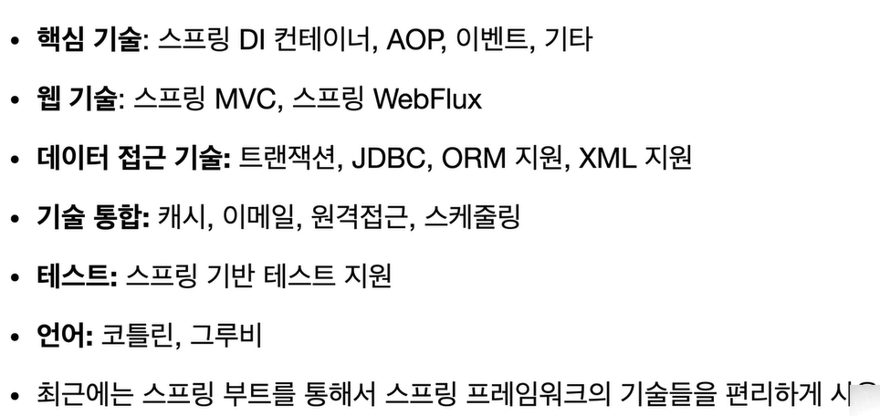

본 강의에서는 핵심 기술에 집중

 

__스프링 부트__
- 스프링을 편리하게 사용할 수 있도록 지원, 최근에는 기본으로 사용
- Tomcat 같은 웹 서버를 내장해서 별도의 웹 서버를 설치하지 않아도됨
- 손쉬운 빌드 구성을 위한 starter 종속성 제공
- 스프링과 3rd parth(외부) 라이브러리 자동 구성(스프링 버전에 맞는 외부 라이브러리)
- 메트릭, 상태 확인, 외부 구성 같은 프로덕션 준비 기능 제공
- 관례에 의한 간결한 설정(복잡한 설정을 대신 해줌, 필요하면 커스텀 가능)

스프링부트는 스프링 프레임 워크 없이 사용할 수 없음.

 

### 스프링 단어?
스프링이라는 단어는 문맥에 따라 다르게 사용된다.
- 스프링 DI 컨테이너 기술
- 스프링 프레임워크
- 스프링 부트, 스프링 프레임워크 등을 모두 포함한 스프링 생태계

 

### 스프링을 왜 만들었나?

__핵심 개념__
- 이 기술을 왜 만들었는가?
- 이 기술의 핵심 컨셉은?

__스프링의 진짜 핵심__
- 스프링은 자바 언어 기반의 프레임워크
- 자바의 언어의 가장 특징 - 객체 지향 언어
- 스프링은 객체 지향 언어가 가진 강력한 특징을 살려내는 프레임워크
- 스프링은 __좋은 객체 지향__ 애플리케이션을 개발할 수 있게 도와주는 프레임워크

 

 

## 좋은 객체 지향 프로그래밍?

### 객체 지향 프로그래밍

__객체 지향 특징__
- 추상황
- 캡슐화
- 상속
- 다형성

"객체"들의 모임
객체는 메시지를 주고받고, 데이터를 처리할 수 있다.(협력)
프로그램을 유연하고 변경 용이하게 한다.

### 유연하고, 변경이 용이?
- 레고 블럭 조립하듯이
- 키보드, 마우스 갈아 끼우듯이
- ...

### 다형성

__다형성의 실세계 비유__
- 실세계와 객체 지향을 1:1로 매칭하면 안되지만 이해하기에는 좋음
- 역할과 구현으로 세상을 구분

__예제__
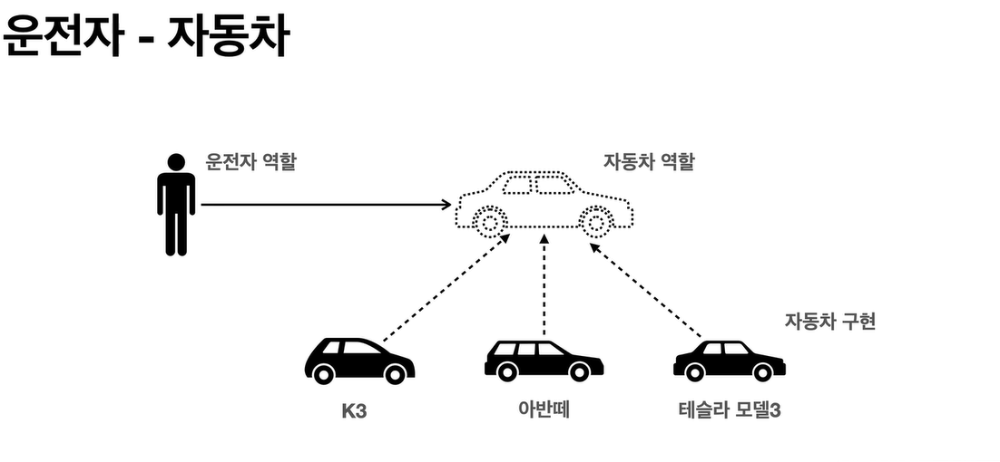

자동차 역할의 인터페이스를 따라 자동차를 구현했기 때문에
운전자는 자동차의 운전 인터페이스에만 의존하여 어떤 자동차가 와도 운전할 수 있음

자동차 내부가 바뀌어도 운전자에게 영향을 주지 않는다!

자동차 구현을 확장할 수 있음(연료 -> 전기 자동차로 변경)

새로운 자동차가 나와도 클라이언트를 변경하지 않아도 됨.

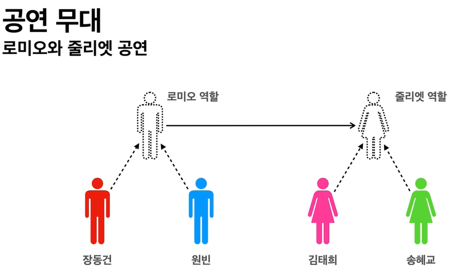

로미오와 줄리엣 역할은 배우가 대체가 가능해야함

줄리엣 역할이 바뀌더라도 로미오 역할에게 영향을 주지 않음

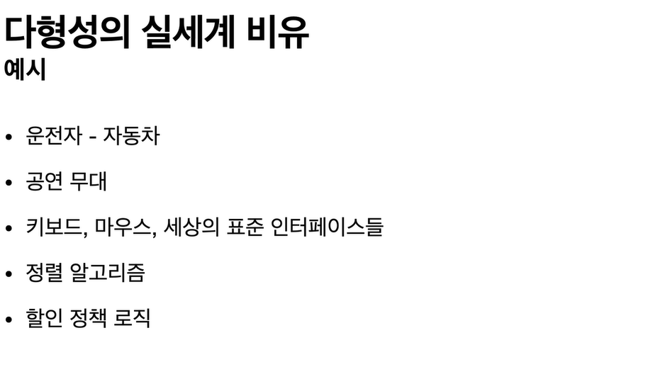

### 역할과 구현을 분리
- 역할과 구현으로 구분하면 세상이 단순해지고, 유연해지며 변경도 편리해진다.
- 장점
  - 클라이언트는 대상의 역할(인터페이스)만 알면 된다.
  - 클라이언트는 구현 대상의 __내부 구조를 몰라도__ 된다.
  - 클라이언트는 구현 대상의 __내부 구조가 변경__ 되어도 영향을 받지 않는다.
  - 클라이언트는 구현 __대상 자체를 변경__ 해도 영향을 받지 않는다.

__자바 언어__
- 자바 언어의 다형성을 활용
  - 역할 = 인터페이스
  - 구현 = 인터페이스를 구현한 클래스, 구현 객체
- 객체를 설계할 때 __역할__ 과 __구현__ 을 명확히 분리
- 객체 설계시 역할(인터페이스)을 먼저 부여하고, 그 역할을 수행하는 구현 객체 만들기

 

__객체의 협력이라는 관계부터 생각__

### 다형성의 본질
- 인터페이스를 구현한 객체 인스턴스를 __실행 시점__ 에 유연하게 변경할 수 있다.
- 다형성의 본질을 이해하려면 협력이라는 객체 사이의 관계에서 시작해야함
- __클라이언트를 변경하지 않고, 서버의 구현 기능을 유연하게 변경할 수 있다.__

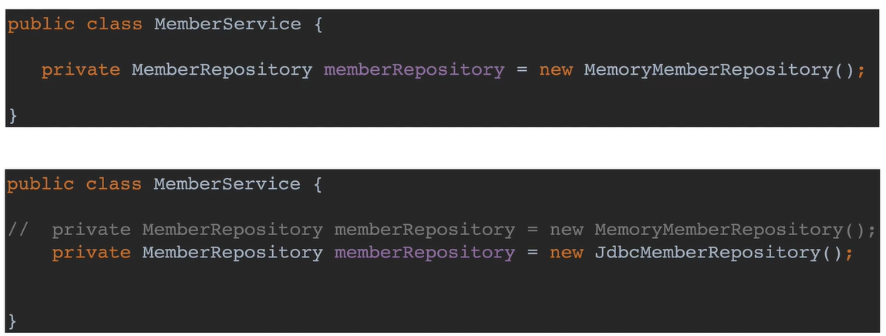

MemberRepository에 인스턴스를 갈아 끼워 바꿔줄 수 있음

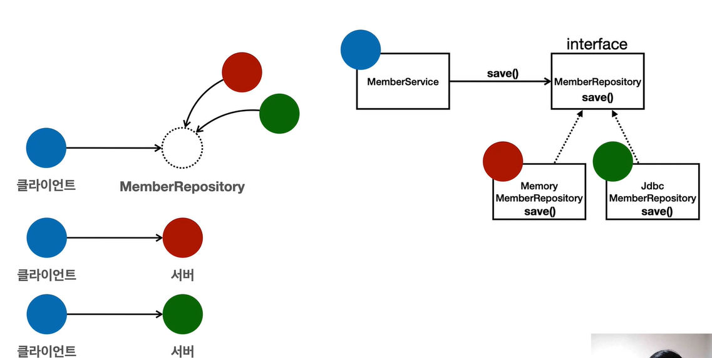

MemberRepository에 빨간색 초록색을 갈아 끼워 의존성을 바꾸어 줄 수 있음

#### 정리
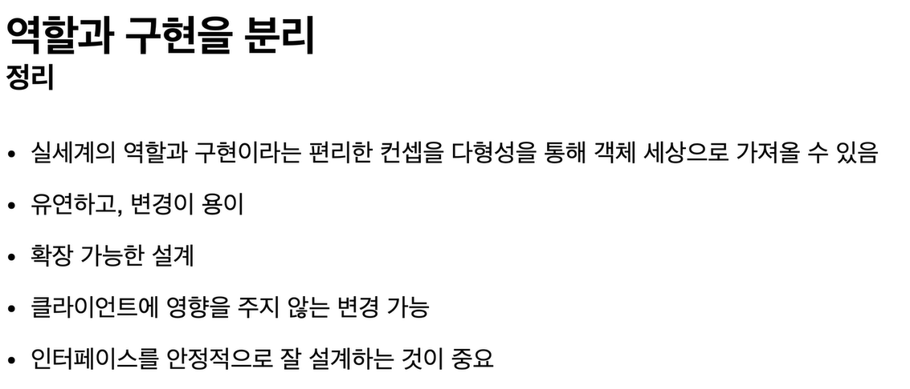

#### 한계
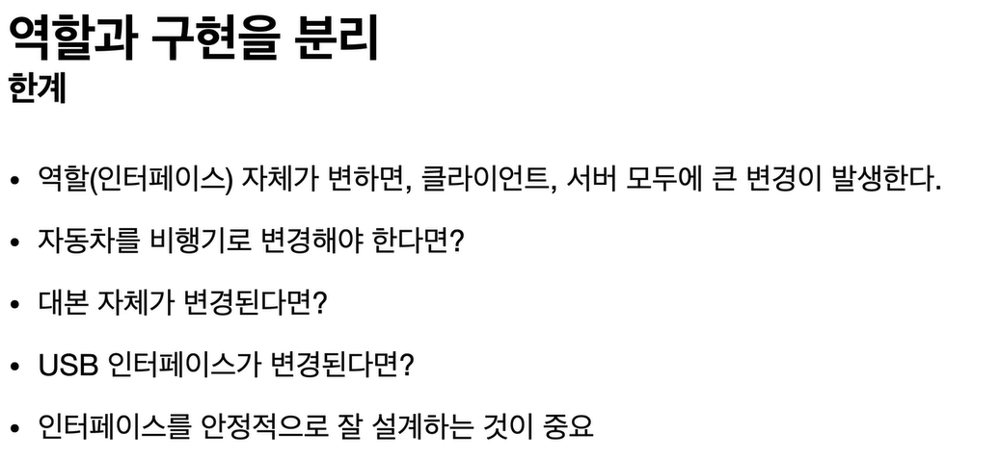

__인터페이스가 변경이 없도록 설계하는 것이 가장 중요__

### 스프링과 객체 지향

- 다형성이 가장 중요하다!
- 스프링은 다형성을 극대화해서 이용할 수 있게 도와준다.
- 스프링에서 이야기하는 제어의 역전(IoC), 의존관계 주입(DI)은 다형성을 활용해서 역할과 구현을 편리하게 다룰 수 있도록 지원한다.
- 스프링을 사용하면 마치 레고 블럭 조립하듯이! 공연 무대의 배우를 선택하듯이! 구현을 편리하게 변경할 수 있다.

 

 

## 좋은 객체 지향 설계의 5가지 원칙(SOLID)

### SOLID
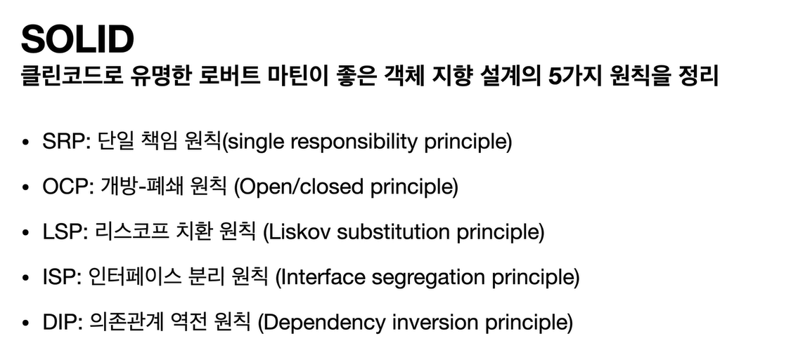

### SRP 단일 책임 원칙
__Single responsibility principle__
- 한 클래스는 하나의 책임만 가져야 한다.
- 하나의 책임이라는 것은 모호하다.
  - 클 수 있고, 작을 수 있다.
  - 문맥과 상황에 따라 다르다.
- __중요한 기준은 변경__ 이다. 변경이 있을 때 파급 효과가 적으면 단일 책임 원칙을 잘 따른 것
- 예) UI 변경, 객체의 생성과 사용을 분리

### OCP 개방-폐쇄 원칙
__Open/closed principle__
- 소프트웨어 요소는 확장에는 열려 있으나 변경에는 닫혀 있어야 한다.
- 확장을 하려면 당연히 기존 코드를 변경해야하지 않을까?
- __다형성__ 을 활용해보자
- 인터페이스를 구현한 새로운 클래스를 하나 만들어서 새로운 기능을 구현
- 지금까지 배운 역할과 구현의 분리를 생각해보자
  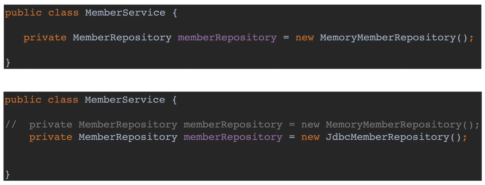
- 분명 다형성을 사용했지만 OCP 원칙을 지킬 수 없다.
- 이 문제를 해결하려면??
- 객체를 생성하고, 연관관계를 맺어주는 별도의 조립, 설정자가 필요하다.

### LSP 리스코프 치환 원칙
__Liskov substitution principle__
- 프로그램의 객체는 프로그램의 정확성을 깨뜨리지 않으면서 하위 타입의 인스턴스로 바꿀 수 있어야 한다
- 다형성에서 하위 클래스는 인터페이스 규약을 다 지켜야 한다는 것, 다형성을 지원하기 위한 원칙, 인터페이스를 구현한 구현체를 믿고 사용하려면, 이 원칙이 필요하다
- 단순히 컴파일에 성공하는 것을 넘어서는 이야기
- 에) 자동차 인터페이스의 엑셀은 앞으로 가라는 기능, 뒤로 가게 구현하면 LSP 위반, 느리더라도 앞으로 가야함

### ISP 인터페이스 분리 원칙
__Interface segregation principle__
- 특정 클라이언트를 위한 인터페이스 여러 개가 범용 인터페이스 하나보다 낫다
- 자동차 인터페이스 -> 운전 인터페이스, 정비 인터페이스로 분리
- 사용자 클라이언트 -> 운전자 클라이언트, 정비사 클라이언트로 분리
- 분리하면 정비 인터페이스 자체가 변해도 운전자 클라이언트에 영향을 주지 않음
- 인터페이스가 명확해지고, 대체 가능성이 높아진다.

### DIP 의존관계 역전 원칙
__Dependency inversion principle__
- 프로그래머는 "추상화에 의존해야지, 구체화에 의존하면 안된다." 의존성 주입은 이 원칙을 따르는 방법 중 하나다
- 쉽게 이야기해서 구현 클래스에 의존하지 말고, 인터페이스에 의존하라는 뜻
- 앞에서 이야기한 __역할(Role)에 의존하게 해야한다는 것과 같다__
- 객체 생성도 클라이언트가 인터페이스에 의존해야 유연하게 구현체를 변경할 수 있다! 구현체에 의존하게 되면 변경이 아주 어려워진다.
- 예) 로미오와 줄리엣 역할에서 로미오 역할을 맡은 원빈이 줄리엣과 호흡을 맞춰야지 줄리엣의 역할을 맡은 김태희와만 호흡을 맞추게 되면 안된다.

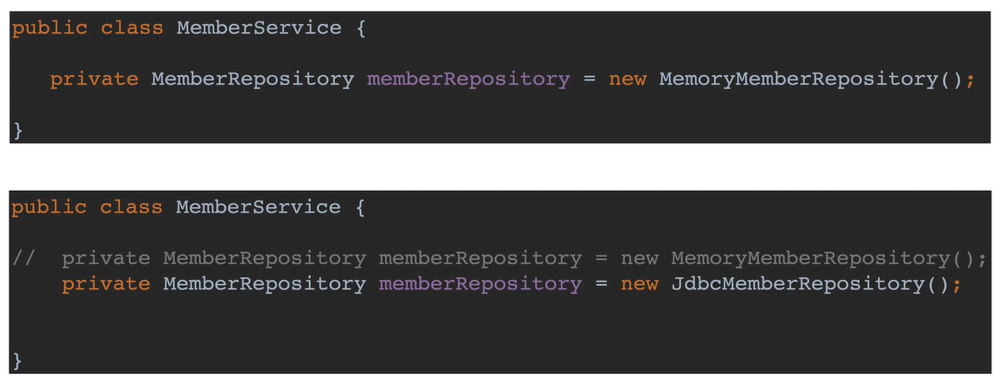
- MemberService는 인터페이스에 의존하지만, 구현 클래스도 동시에 의존한다.
- MemberService 클라이언트가 구현 클래스를 직접 선택(의존)
  - MemberRepository m = new MemoryMemberRepository();
- MemoryMemberRepository에도 의존! -> DIP 위반
- MemberService는 MemberRepository에만 의존해야한다!

### 정리
- 객체 지향의 핵심은 다형성
- 다형성 만으로는 쉽게 부품을 갈아 끼우듯이 개발할 수 없다
- 다형성 만으로는 구현 객체를 변경할 때 클라이언트 코드도 함께 변경된다.
- 다형성 만으로는 OCP, DIP를 지킬 수 없다
- 뭔가 더 필요!!

 

 

## 객체 지향 설계와 스프링

### 스프링 이야기에 왜 객체 지향 이야기가 나오는가?
- 스프링은 다음 기술로 다형성 + OCP, DIP를 가능하게 지원
  - DI(Dependency Injection): 의존관계, 의존성 주입
  - DI 컨테이너 제공
- 클라이언트 코드의 변경 없이 기능 확장
- 쉽게 부품을 교체하듯이 개발

 

 

## 정리
- 모든 설계에 __역할__ 과 __구현__ 을 분리하자.
- 자동차, 공연의 예를 떠올려보자
- 애플리 케이션 설계도 공연을 설계 하듯이 배역만 만들어두고, 배우는 언제든지 __유연__ 하게 __변경__ 할 수 있도록 만드는 것이 좋은 객체 지향 설계다.
- 이상적으로는 모든 설계에 인터페이스를 부여하자

### 실무 고민
- 하지만 인터페이스를 도입하면 추상화라는 비용이 발생한다.
- 기능을 확장할 가능성이 없다면, 구체 클래스를 직접 사용하고, 향후 꼭 필요할 때 리팩터링해서 인터페이스를 도입하는 것도 방법이다.
