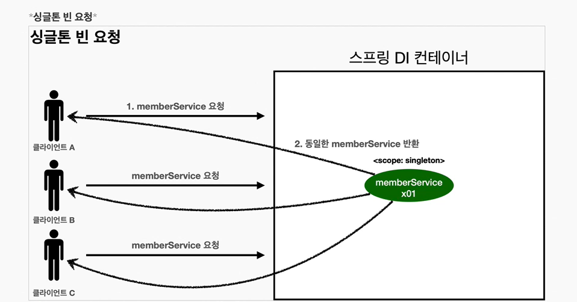
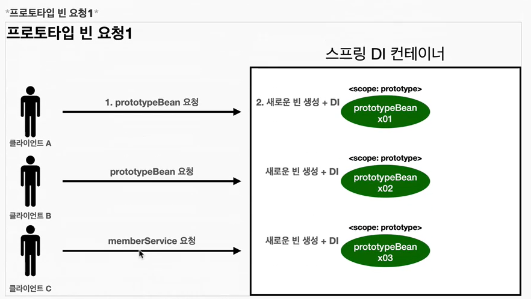
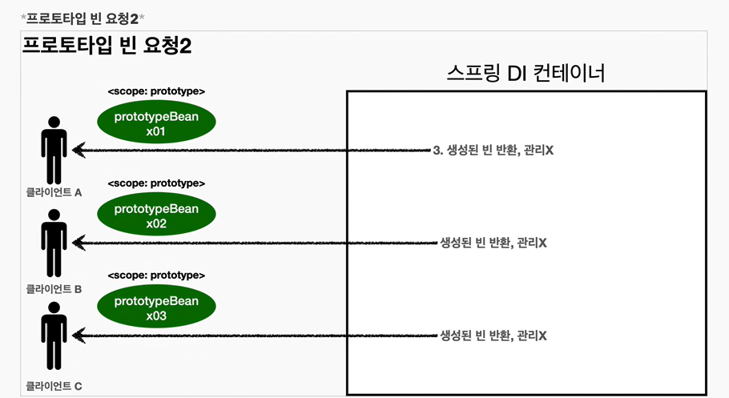
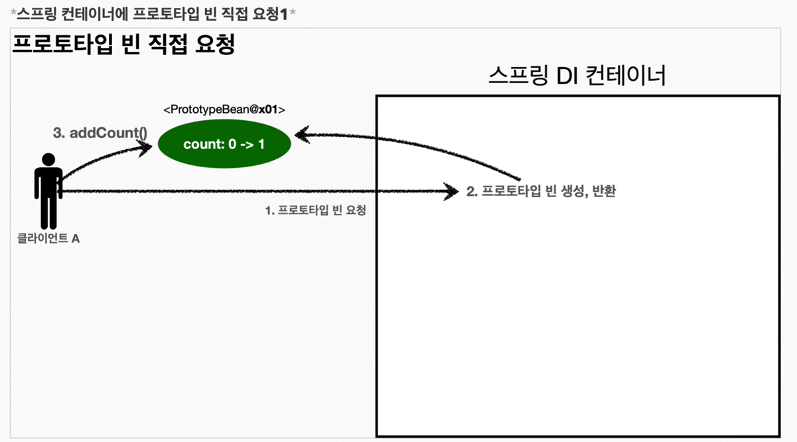
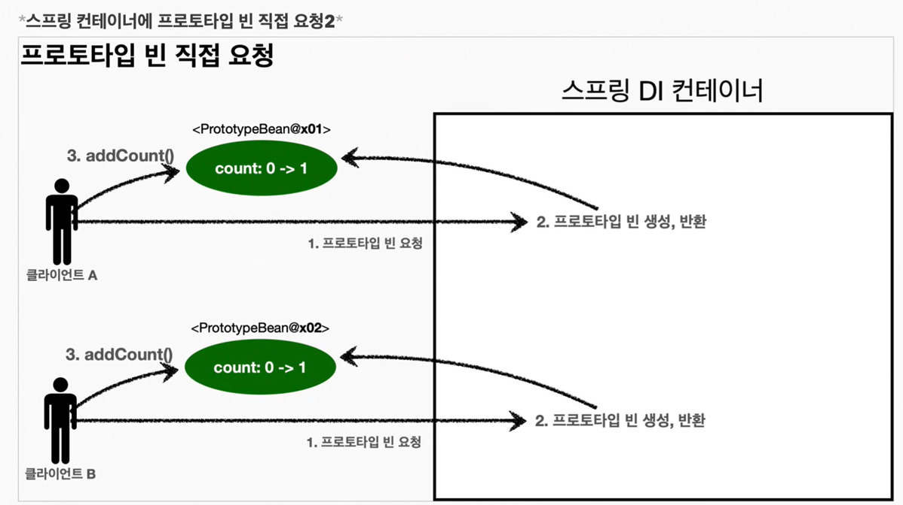
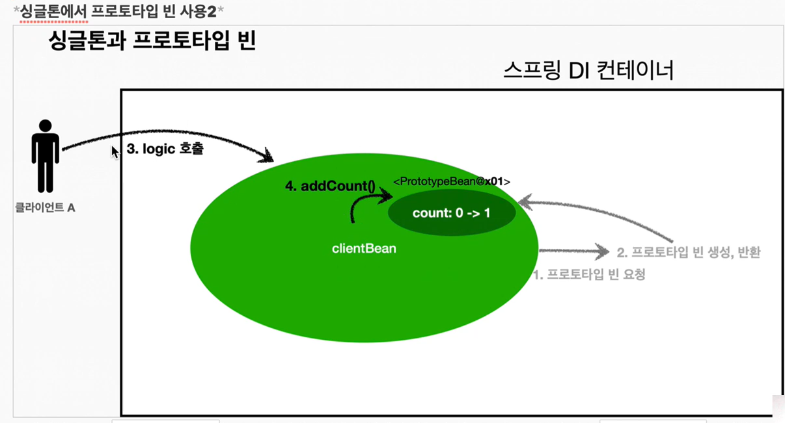
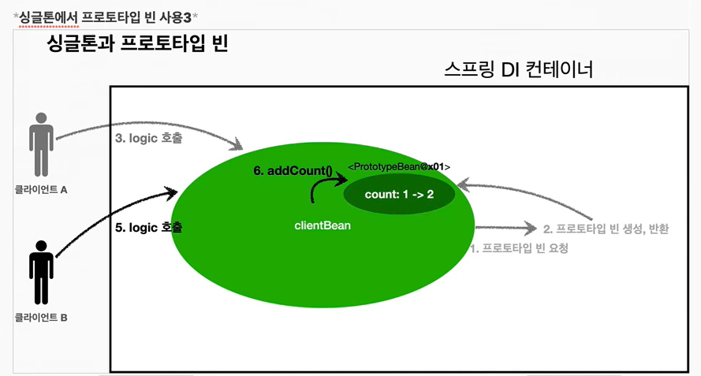

## 목차
- [빈 스코프](#빈-스코프)
  - [빈 스코프란?](#빈-스코프란)
  - [프로토타입 스코프](#프로토타입-스코프)
    - [정리](#정리)
  - [프로토타입 스코프 - 싱글톤 빈과 함께 사용시 문제점](#프로토타입-스코프---싱글톤-빈과-함께-사용시-문제점)
    - [싱글톤 빈에서 프로토 타입 빈 사용](#싱글톤-빈에서-프로토-타입-빈-사용)
  - [프로토타입 스코프 - 싱글톤 빈과 함께 사용시 Provider로 문제 해결](#프로토타입-스코프---싱글톤-빈과-함께-사용시-provider로-문제-해결)
    - [스프링 컨테이너에 요청](#스프링-컨테이너에-요청)
    - [ObjectFactory, ObjectProvider](#objectfactory-objectprovider)

# 빈 스코프

## 빈 스코프란?
지금까지 우리는 스프링 빈이 스프링 컨테이너의 시작과 함께 생성되어서 스프링 컨테이너가 종료될 때까지 유지된다고 학습했다. 이것은 스프링 빈이 기본적으로 싱글톤 스코프로 생성되기 때문이다. 스코프는 번역 그대로 빈이 존재할 수 있는 범위를 뜻한다.

__스프링은 다음과 같은 다양한 스코프를 지원한다__
- 싱글톤 : 기본 스코프, 스프링 컨테이너의 시작과 종료까지 유지되는 가장 넓은 범위의 스코프다.
- 프로토타입 : 스프링 컨테이너는 프로토타입 빈의 생성과 의존관계 주입까지만 관여하고 더는 관리하지 않는 매우 짧은 범위의 스코프이다.
- 웹 관련 스코프
  - request : 웹 요청이 들어오고 나갈때까지 유지되는 스코프이다.
  - session : 웹 세션이 생성되고 종료될 때 까지 유지되는 스코프이다.
  - application : 웹의 서블릿 컨텍스와 같은 범위로 유지되는 스코프이다.


<br>

## 프로토타입 스코프
싱글톤 스코프의 빈을 조회하면 스프링 컨테이너는 항상 같은 인스턴스의 스프링 빈을 반환한다. 반면에 프로토타입 스코프를 스프링 컨테이너에 조회하면 스프링 컨테이너는 항상 새로운 인스턴스를 생성해서 반환한다.



1. 싱글톤 스코프의 빈을 스프링 컨테이너에 요청한다.
2. 스프링 컨테이너는 본인이 관리하는 스프링 빈을 반환한다.
3. 이후에 스프링 컨테이너에 같은 요청이 와도 같은 객체 인스턴스의 스프링 빈을 반환한다.



1. 프로토타입 스코프의 빈을 스프링 컨테이너에 요청한다.
2. 스프링 컨테이너는 이 시점에 프로토타입 빈을 생성하고, 필요한 의존관계를 주입한다.



3. 스프링 컨테이너는 생성한 프로토타입 빈을 클라이언트에 반환한다.
4. 이후에 스프링 컨테이너에 같은 요청이 오면 항상 새로운 프로토타입 빈을 생성해서 반환한다.

### 정리
여기서 핵심은 __스프링 컨테이너는 프로토타입 빈을 생성하고, 의존관계 주입, 초기화까지만 처리한다는 것이다.__ 이후 스프링 컨테이너는 생성된 프로토타입 빈을 관리하지 않는다. 프로토타입 빈을 관리할 책임은 프로토타입 빈을 받은 클라이언트에 있다. 그래서 `@PreDestroy` 같은 종료 메서드가 호출되지 않는다.

- 싱글톤 빈은 스프링 컨테이너 생성 시점에 초기화 메서드가 실행 되지만, 프로토타입 스코프의 빈은 스프링 컨테이너에서 빈을 조회할 때 생성되고, 초기화 메서드도 실행된다.
- 프로토타입 빈을 2번 조회했으므로 완전히 다른 스프링 빈이 생성되고, 초기화도 2번 실행된 것을 확인할 수 있다.
- 싱글톤 빈은 스플이 컨테이너가 관리하기 때문에 스프링 컨테이너가 종료될 때 빈의 종료 메서드가 실행되지만, 프로토타입 빈은 스프링 컨테이너가 생성과 의존관계 주입 그리고 초기화까지만 관여하고, 더는 관리하지 않는다. 따라서 프로토타입 빈은 스프링 컨테이너가 종료될 때 `@PreDestroy` 같은 종료 메서드가 전혀 실행되지 않는다.

__프로토타입 빈 특징 정리__
- 스프링 컨테이너에 요청할 때마다 새로 생성된다.
- 스프링 컨테이너는 프로토타입 빈의 생성과 의존관계 주입 그리고 초기화까지만 관여한다.
- 종료 메서드가 호출되지 않는다.(따로 호출해주어야함)
- 그래서 프로토타입 빈은 프로토타입 빈을 조회한 클라이언트가 관리해야 한다. 종료 메서드에 대한 호출도 클라이언트가 직접 해야한다.

<br>

## 프로토타입 스코프 - 싱글톤 빈과 함께 사용시 문제점
스프링 컨테이너에 프로토타입 스코프의 빈을 요청하면 항상 새로운 객체 인스턴스를 생성해서 반환한다. 하지만 싱글톤 빈과 함께 사용할 때는 의도한 대로 잘 동작하지 않으므로 주의해야 한다.



1. 클라이언트A는 스프링 컨테이너에 프로토타입 빈을 요청한다.
2. 스프링 컨테이너는 프로토타입 빈을 새로 생성해서 반환(*x01*)한다. 해당 빈의 count 필드 값은 0이다.
3. 클라이언트는 조회한 프로토타입 빈에 `addCount()`를 호출하면서 count 필드를 +1 한다.
4. 결과적으로 프로토타입 빈(*x01*)의 count는 1이 된다.



1. 클라이언트B는 스프링 컨테이너에 프로토타입 빈을 요청한다.
2. 스프링 컨테이너는 프로토타입 빈을 새로 생성해서 반환(*x02*)한다. 해당 빈의 count 필드 값은 0이다.
3. 클라이언트는 조회한 프로토타입 빈에 `addCount()`를 호출하면서 count 필드를 +1 한다.
4. 결과적으로 프로토타입 빈(*x02*)의 count는 1이 된다.

### 싱글톤 빈에서 프로토 타입 빈 사용


- `clientBean`은 싱글톤이므로, 보통 스프링 컨테이너 생성 시점에 함께 생성되고, 의존관계 주입도 발생한다.
- 1. `clientBean`은 의존관계 자동 주입을 사용한다. 주입 시점에 스프링 컨테이너에 프로토타입 빈을 요청한다.
- 2. 스프링 컨테이너는 프로토타입 빈을 생성해서 `clientBean`에 반환한다. 프로토타입 빈의 count 필드 값은 0이다.
- 이제 `clientBean`은 프로토타입 빈을 내부 필드에 보관한다.


- 클라이언트A는 `clientBean`을 스프링 컨테이너에 요청해서 받는다. 싱글톤이므로 항상 같은 `clientBean`이 반환된다.
- 3. 클라이언트A는 `clientBean.logic()`을 호출한다.
- 4. `clientBean`은 prototypeBean의 `addCount()`를 호출해서 프로토타입 빈의 count를 증가한다. count 값이 1이된다.



- 클라이언트B는 `clientBean`을 스프링 컨테이너에 요청해서 받는다. 싱글톤이므로 항상 같은 `clientBean`이 반환된다.
- __여기서 중요한 점은, clientBean이 내부에 가지고 있는 프로토타입 빈은 이미 과거에 주입이 끝난 빈이다. 주입 시점에 스프링 컨테이너에 요청해서 프로토타입 빈이 새로 생성이 된 것이지, 사용할 때마다 새로 생성되는 것이 아니다!__
- 5. 클라이언트 B는 `clientBean.logic()`을 호출한다.
- 6. `clientBean`은 prototypeBean의 `addCount()`를 호출해서 프로토타입 빈의 count를 증가한다. 원래 count 값이 1이었으므로 2가 된다.

```java
@Test
    void singletonClientUsePrototype() {
        AnnotationConfigApplicationContext ac = new AnnotationConfigApplicationContext(ClientBean.class, PrototypeBean.class);

        ClientBean clientBean1 = ac.getBean(ClientBean.class);
        int count1 = clientBean1.logic();
        assertThat(count1).isEqualTo(1);

        ClientBean clientBean2 = ac.getBean(ClientBean.class);
        int count2 = clientBean2.logic();
        assertThat(count2).isEqualTo(2);
    }

    @Scope
    static class ClientBean {
        private final PrototypeBean prototypeBean;

        @Autowired
        public ClientBean(PrototypeBean prototypeBean) {
            this.prototypeBean = prototypeBean;
        }

        public int logic() {
            prototypeBean.addCount();
            return prototypeBean.getCount();
        }
    }
}
```

스프링은 일반적으로 싱글톤 빈을 사용하므로, 싱글톤 빈이 프로토타입 빈을 사용하게 된다. 그런데 싱글톤 빈은 생성 시점에만 의존관계 주입을 받기 때문에, 프로토타입 빈이 생성되기는 하지만, 싱글톤 빈과 함께 계속 유지되는 것이 문제다.

아마 프로토타입 빈을 사용한다면, 사용할 때 마다 새로 생성해서 사용하는 것을 원할 것이다.

> 참고: 여러 빈에서 같은 프로토타입 빈을 주입받으면, __주입 받는 시점에 각각 새로운 프로토타입 빈이 생성__ 된다. 예를 들어서 clientA, clientB가 각각 의존관계 주입을 받으면 각각 다른 인스턴스의 프로토타입 빈을 주입 받는다.

<br>

## 프로토타입 스코프 - 싱글톤 빈과 함께 사용시 Provider로 문제 해결
싱글톤 빈과 프로토타입 빈을 함께 사용할 때, 어떻게 하면 사용할 때 마다 항상 새로운 프로토타입 빈을 생성할 수 있을까?

### 스프링 컨테이너에 요청
가장 간단한 방법은 싱글톤 빈이 프로토타입을 사용할 때마다 스프링 컨테이너에 새로 요청하는 것이다.

- 실행해보면 `ac.getBean()`을 통해서 항상 새로운 프로토타입 빈이 생성되는 것을 확인할 수 있다.
- 의존관계를 외부에서 주입(DI) 받는게 아니라 이렇게 직접 필요한 의존관계를 찾는 것을 Dependency Lookup(DL) 의존관계 조회라고 한다.
- 그런데 이렇게 스프링의 애플리케이션 컨텍스트 전체를 주입받게 되면, 스프링 컨테이너에 종속적인 코드가 되고, 단위 테스트도 어려워진다.
- 지금 필요한 기능은 지정한 프로토타입 빈을 컨테이너에서 대신 찾아주는 __DL__ 정도의 기능만 제공하는 무언가가 있으면 된다.

스프링에 다 준비되어있다! ~~스프링 짱!!~~

### ObjectFactory, ObjectProvider
지정한 빈을 컨테이너에서 대신 찾아주는 DL 서비스를 제공하는 것이 바로 `ObjectProvider`이다. 참고로 과거에는 `ObjectFactory`가 있었는데, 여기에 편의 기능을 추가해서 `ObjectProvider`가 만들어졌다.


```java
@Scope
    static class ClientBean {
        @Autowired
        private ObjectProvider<PrototypeBean> prototypeBeanObjetProvider;

        public int logic() {
            PrototypeBean prototypeBean = prototypeBeanObjetProvider.getObject();
            prototypeBean.addCount();
            return prototypeBean.getCount();
        }
    }
```

- 실행해보면 `prototypeBeanProvider.getObject()`를 통해서 항상 새로운 프로토타입 빈이 생성되는 것을 확인할 수 있다.
- `ObjectProvider`의 `getObject()`를 호출하면 내부에서는 스프링 컨테이너를 통해 해당 빈을 찾아서 반환한다.(__DL__)
- 스프링이 제공하는 기능을 사용하지만, 기능이 단순하므로 단위테스트를 만들거나 mock 코드를 만들기는 훨씬 쉬워진다.
- `ObjectProvider`는 지금 딱 필요한 DL 정도의 기능만 제공한다.

__특징__
ObjectFactory : 기능이 단순, 별도의 라이브러리가 필요없음, 스프링에 의존
ObjectProvider : ObjectFactory 상속, 옵션, 스트림 처리 등 편의 기능이 많고, 별도의 라이브러리 필요 없음, 스프링에 의존

__정리__
- 그러면 프로토타입 빈은 언제 사용할까? 매번 사용할때 마다 의존관계 주입이 완료된 새로운 객체가 필요하면 사용하면 된다. 그런데 실무에서 웹 애플리케이션을 개발하다보면, 싱글톤 빈으로 대부분의 문제를 해결할 수 있기 때문에 프로토타입 빈을 직접적으로 사용하는 일은 매우 드물다.
- `ObjectProvider` 등은 프로토타입 뿐만 아니라 DL이 필요한 경우는 언제든지 사용할 수 있다.

