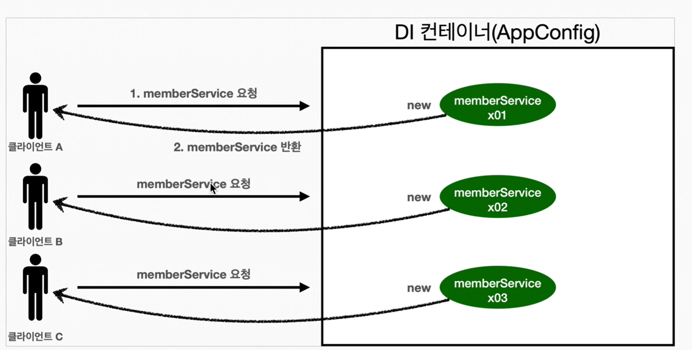
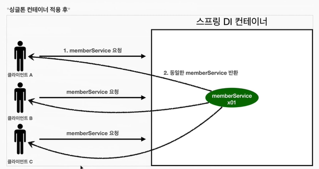
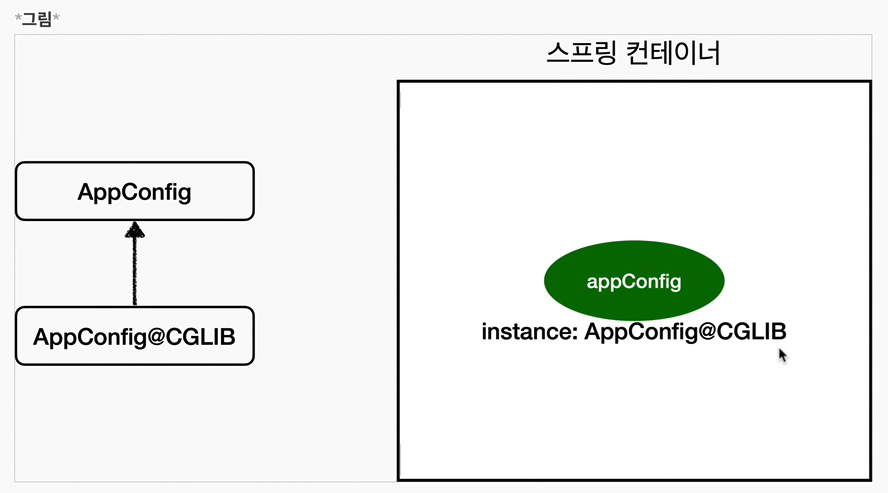
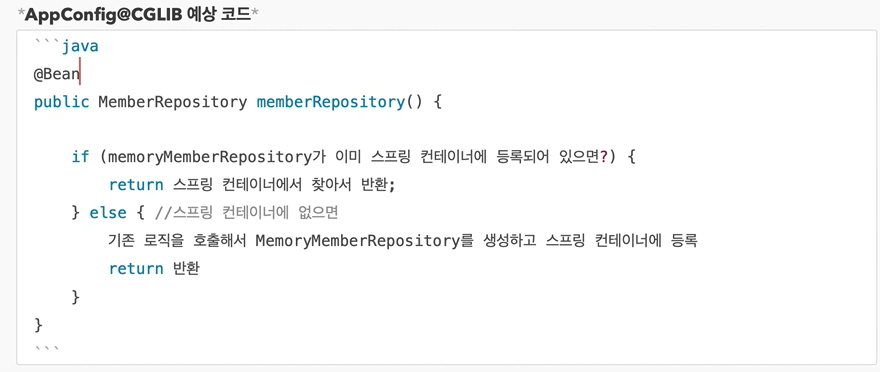

## 목차
- [싱글톤 컨테이너](#싱글톤-컨테이너)
  - [웹 애플리케이션과 싱글톤](#웹-애플리케이션과-싱글톤)
  - [싱글톤 패턴](#싱글톤-패턴)
    - [싱글톤 문제점](#싱글톤-문제점)
  - [싱글톤 컨테이너](#싱글톤-컨테이너-1)
  - [싱글톤 방식의 주의점](#싱글톤-방식의-주의점)
  - [@Configuration과 싱글톤](#configuration과-싱글톤)
  - [@Configuration과 바이트코드 조작의 마법](#configuration과-바이트코드-조작의-마법)
    - [@Configuration을 적용하지 않는다면?](#configuration을-적용하지-않는다면)
    - [정리](#정리)


# 싱글톤 컨테이너

## 웹 애플리케이션과 싱글톤
- 스프링은 태생이 기업용 온라인 서비스 기술을 지원하기 위해 탄생
- 대부분 스프링 애플리케이션은 웹 애플리케이션이지만 웹이 아닌 환경도 개발 가능
- 웹 애플리케이션은 보통 여러 고객이 요청



고객이 3번 요청을 하면 요청이 올때마다 객체를 생성해주어야한다.


```java
    @Test
    @DisplayName("스프링 없는 순수한 DI 컨테이너")
    void pureContainer() {
        AppConfig appConfig = new AppConfig();

        MemberService memberService1 = appConfig.memberService();

        MemberService memberService2 = appConfig.memberService();

        System.out.println("memberService1 = " + memberService1);
        System.out.println("memberService2 = " + memberService2);

        assertThat(memberService1).isNotSameAs(memberService2);
    }
```

- 우리가 만들었던 스프링 없는 순수한 DI 컨테이너인 AppConfig는 요청을 할 때 마다 객체를 새로 생성한다.
- 고객 트래픽이 초당 100이 나오면 초당 100개 객체가 생성되고 소멸된다! -> 메모리 낭비가 심하다.
- 해결방안은 해당 객체가 딱 1개만 생성되고 공유하도록 설계하면 된다. -> 싱글톤 패턴

<br>

## 싱글톤 패턴
- 클래스의 인스턴스가 딱 1개만 생성되는 것을 보장하는 디자인 패턴
  - 내가 실행하고 있는 자바 클래스에서는 하나의 객체만 생성
- 따라서 객체 인스턴스를 2개 이상 생성하지 못하도록 막아야한다.
  - pirvate 생성자 이용!!

```java
public class SingletonService {

    private static final SingletonService instance = new SingletonService();

    public static SingletonService getInstance() {
        return instance;
    }

    private SingletonService() {

    }

    public void logic() {
        System.out.println("싱글톤 객체 로직 호출");
    }
}
```
- static 영역에 객체 instance를 미리 하나 생성해서 올려둔다.
- 이 객체 인스턴스가 필요하면 오직 `getInstance()`메서드를 통해서만 조회할 수 있다. 항상 같은 인스턴스를 반환한다.
- 이 때 객체 인스턴스만 존재해야 하므로, 생성자를 private로 막아서 외부에서 인스턴스가 새로 생성되는 것을 막아야한다.

```java
    @Test
    @DisplayName("싱글톤 패턴을 적용한 객체 사용")
    void singletonServiceTest() {
        SingletonService singletonService1 = SingletonService.getInstance();
        SingletonService singletonService2 = SingletonService.getInstance();

        System.out.println("singletonService1 : " + singletonService1);
        System.out.println("singletonService2 : " + singletonService2);

        assertThat(singletonService1).isSameAs(singletonService2);
    }
```

호출할 때마다 같은 인스턴스를 호출하는 것을 확인할 수 있다.

싱글톤 패턴을 적용하면 고객의 요청이 올 때마다 객체를 생성하는 것이 아니라, 이미 만들어진 객체를 공유해서 효율적으로 사용할 수 있다.

### 싱글톤 문제점
- 싱글톤 패턴을 구현하는 코드 자체가 많이 들어간다
- 의존관계상 클라이언트가 구체 클래스에 의존한다 -> DIP 위반!!
- 클라이언트가 구체 클래스에 의존해서 OCP 원칙을 위반할 가능성이 높다
- 테스트 하기 어렵다
- 내부 속성을 변경하거나 초기화 하기 어렵다
- private 생성자때문에 자식 클래스를 만들기 어렵다
- 유연성이 떨어진다
- 결국 안티패턴으로 불리기도 한다

<br>

## 싱글톤 컨테이너

싱글톤의 문제점을 해결하기 위해 스프링은 싱글톤 컨테이너를 사용

- 스프링 컨테이너는 싱글턴 패턴을 적용하지 않더라도, 객체 인스턴스를 싱글톤으로 관리한다.
  - 컨테이너는 객체를 하나만 생성해서 관리한다.
- 스프링 컨테이너는 싱글톤 컨테이너 역할을 한다. 이렇게 싱글톤 객체를 생성하고 관리하는 기능을 싱글톤 레지스트리라 한다.
- 스프링 컨테이너의 이런 기능 덕분에 싱글턴 패턴의 모든 단점을 해결하면서 객체를 싱글톤으로 유지할 수 있다.
  - 싱글톤 패턴을 위한 지저분한 코드가 들어가지 않아도 된다.
  - DIP, OCP, 테스트, private 생성자로 부터 자유롭게 싱글톤을 사용할 수 있다.


스프링 컨테이너 덕분에 고객의 요청이 올때마다 객체를 생성하는 것이 아닌!
이미 만들어진 객체를 공유해서 효율적으로 재사용할 수 있다.

> 참고 : 스프링의 기본 빈 등록 방식은 싱글톤이지만, 요청할때 마다 새로운 객체를 생성해서 반환하는 기능도 제공한다.

<br>

## 싱글톤 방식의 주의점

- 객체 인스턴스를 하나만 생성해서 공유하는 싱글톤 방식은 여러 클라이언트가 하나의 같은 객체 인스턴스를 공유하기 때문에 싱글톤 객체는 상태를 유지하게 설계하면 안된다.
- 무상태로 설계해야 한다!!!!
  - 특정 클라이언트에 의존적인 필드가 있으면 안된다.
  - 특정 클라이언트가 값을 변경할 수 있는 필드가 있으면 안된다!
  - 가급적 읽기만 가능해야한다.
  - 필드 대신에 자바에서 공유되지 않는 지역변수, 파라미터, ThreadLocal 등을 사용해야한다.
- 스프링 빈의 필드에 공유 값을 설정하면 정말 큰 장애가 발생할 수 있다!!

```java
    @Test
    void statefulServiceSingleton() {
        ApplicationContext ac = new AnnotationConfigApplicationContext(TestConfig.class);
        StatefulService statefulService1 = ac.getBean(StatefulService.class);
        StatefulService statefulService2 = ac.getBean(StatefulService.class);

        //ThreadA: A사용자 10000원 주문
        statefulService1.order("userA", 10000);
        //ThreadB: B사용자 20000원 주문
        statefulService2.order("userB", 20000);

        // A사용자 주문 가격 조회
        int price = statefulService1.getPrice();
        System.out.println("price = " + price);

        assertThat(statefulService1.getPrice()).isEqualTo(20000);
    }

    static class TestConfig {

        @Bean
        public StatefulService statefulService() {
            return new StatefulService();
        }
    }
```
- 실제로는 Thread 사용 X
- ThreadA가 사용자A 코드를 호출하고 ThreadB가 사용자B 코드를 호출한다고 가정
- `StatefulService`의 `price`필드는 공유되는 필드인데, 특정 클라이언트가 해당 값을 변경
- 사용자A의 주문금액은 10000원이 되어야 하는데, 20000원이라는 결과가 나옴
- 스프링 빈은 항상 무상태로 설계하자!!

<br>

## @Configuration과 싱글톤

```java
@Configuration
public class AppConfig {

    @Bean
    public MemberService memberService() {
        return new MemberServiceImpl(memberRepository());
    }

    @Bean
    public OrderService orderService() {
        return new OrderServiceImpl(memberRepository(), discountPolicy());
    }

    @Bean
    public MemberRepository memberRepository() {
        return new MemoryMemberRepository();
    }

    @Bean
    public DiscountPolicy discountPolicy() {
        return new RateDiscountPolicy();
    }
}
```

- `memberService` 빈을 만드는 코드를 보면 `memberRepository()`를 호출한다.
  - 이 메서드를 호출하면 `new MemoryMemberRepository()`를 호출한다.
- `orderService` 빈을 만드는 코드도 동일하게 `memberReposiotry()`를 호출한다.
  -  이 메서드를 호출하면 `new MemoryMemberRepository()`를 호출한다.

결과적으로는 `new MemoryMemberRepository()`가 두 번 생성되면서 싱글톤이 깨지는 것이 아닌가???

```java
    @Test
    void configurationTest() {
        ApplicationContext ac = new AnnotationConfigApplicationContext(AppConfig.class);

        MemberServiceImpl memberService = ac.getBean("memberService", MemberServiceImpl.class);
        OrderServiceImpl orderService = ac.getBean("orderService", OrderServiceImpl.class);
        MemberRepository memberRepository = ac.getBean("memberRepository", MemberRepository.class);

        MemberRepository memberRepository1 = memberService.getMemberRepository();
        MemberRepository memberRepository2 = orderService.getMemberRepository();

        System.out.println("memberService -> memberRepository = " + memberRepository1);
        System.out.println("orderService -> memberRepository = " + memberRepository2);
        System.out.println("memberRepository = " + memberRepository);

        assertThat(memberService.getMemberRepository()).isSameAs(memberRepository);
        assertThat(orderService.getMemberRepository()).isSameAs(memberRepository);
    }
```
모두 같은 인스턴스임을 확인할 수 있다.

<br>

## @Configuration과 바이트코드 조작의 마법
- 스프링 컨테이너는 싱글톤 레지스트리다. 따라서 스프링 빈이 싱글톤이 되도록 보장해주어야한다.
- 스프링은 이를 위해 바이트 코드를 조작하는 라이브러리를 사용한다.

```java
    @Test
    void configurationDeep() {
        ApplicationContext ac = new AnnotationConfigApplicationContext(AppConfig.class);
        AppConfig bean = ac.getBean(AppConfig.class);

        System.out.println("bean = " + bean.getClass());
    }

    // 결과
    bean = class hello.core.AppConfig$$EnhancerBySpringCGLIB$$da84958b
```

순수한 클래스라면 `class hello.core.AppConfig` 처럼 출력되어야 한다.

그런데 뒤에 복잡한 텍스트가 추가된 것을 확인할 수 있다. 이것은 내가 만든 클래스가 아닌 스프링이 CGLIB라는 바이트코드 조작 라이브러리를 사용해서 AppConfig 클래스를 상속받은 임의의 다른 클래스를 만들고, 그 다른 클래스를 스프링 빈으로 등록한 것이다!



내가 만든 AppConfig가 아닌 다른 클래스가 싱글톤이 보장되도록 해준다.




실제 CGLIB는 더욱 복잡하지만 대략적인 흐름은 이렇다.

- @Bean이 붙은 메서드마다 이미 스프링 빈이 존재하면 존재하는 빈을 반환하고, 없으면 생성해서 스프링 빈으로 등록하고 반환하는 코드가 동적으로 만들어진다.
- 덕분에 싱글톤이 보장되는 것이다.

### @Configuration을 적용하지 않는다면?

만약 `@Configuration`을 적용하지 않으면 어떻게 될까?

```java
    bean = class hello.core.AppConfig
```
- AppConfig가 CGLIB 기술 없이 순수한 AppConfig로 스프링 빈에 등록된 것을 확인할 수 있다.
- 따라서 memberRepository의 인스턴스가 3번 호출되면서 모두 주소값이 다른 것을 확인할 수 있다.
- 스프링 컨테이너를 사용하지 않아 스프링 컨테이너가 관리하지 않는다.

### 정리
- @Bean만 사용해도 스프링 빈으로 등록되지만, 싱글톤을 보장하지 않는다.
  - `memberRepository()`처럼 의존관계 주입이 필요해서 메서드를 직접 호출할 때 싱글톤을 보장하지 않는다.
- 스프링 설정 정보는 항상 `@Configuration`을 사용하자!

