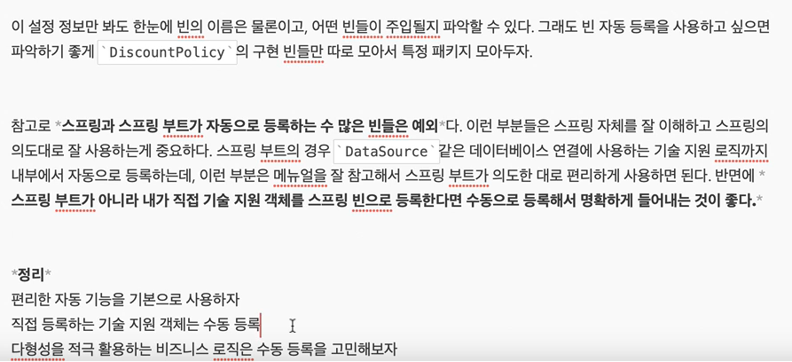

## 목차
- [의존관계 자동 주입](#의존관계-자동-주입)
  - [다양한 의존관계 주입 방법](#다양한-의존관계-주입-방법)
    - [생성자 주입](#생성자-주입)
    - [수정자 주입(setter 주입)](#수정자-주입setter-주입)
    - [필드 주입](#필드-주입)
    - [일반 메서드 주입](#일반-메서드-주입)
  - [옵션 처리](#옵션-처리)
  - [생성자 주입을 선택해라!](#생성자-주입을-선택해라)
    - [정리](#정리)
  - [롬복과 최신 트랜드](#롬복과-최신-트랜드)
    - [정리](#정리-1)
  - [조회 빈이 2개 이상](#조회-빈이-2개-이상)
  - [@Autowired 필드 명, @Quilifier, @Primary](#autowired-필드-명-quilifier-primary)
    - [@Autowired 필드 명 매칭](#autowired-필드-명-매칭)
    - [@Qualifier 사용](#qualifier-사용)
    - [@Primary 사용](#primary-사용)
  - [애노테이션 직접 만들기](#애노테이션-직접-만들기)
  - [조회한 빈이 모두 필요할 때, List, Map](#조회한-빈이-모두-필요할-때-list-map)
  - [자동, 수동의 올바른 실무 운영 기준](#자동-수동의-올바른-실무-운영-기준)

# 의존관계 자동 주입

## 다양한 의존관계 주입 방법

의존관계 주입은 크게 4가지 방법이 있다.
- 생성자 주입
- 수정자 주입(setter 주입)
- 필드 주입
- 일반 메서드 주입

### 생성자 주입
- 이름 그대로 생성자를 통해 의존 관계를 주입받는 방법이다.
- 특징
  - 생성자 호출시점에 딱 1번만 호출되는 것이 보장된다.
  - __불변, 필수__ 의존관계에 사용

```java
@Component
public class OrderServiceImpl implements OrderService {

    private final MemberRepository memberRepository;
    private final DiscountPolicy discountPolicy;

    @Autowired
    public OrderServiceImpl(MemberRepository memberRepository, DiscountPolicy discountPolicy) {
        this.memberRepository = memberRepository;
        this.discountPolicy = discountPolicy;
    }
}
```

__중요__ 스프링 빈일 경우 생성자가 딱 1개 있으면 `@Autowried`를 생략해주어도 자동 주입된다.

### 수정자 주입(setter 주입)
- setter라 불리는 필드의 값을 변경하는 수정자 메서드를 통해서 의존관계를 주입하는 방법
- 특징
  - __선택, 변경__ 가능성이 있는 의존관계에 사용
  - 자바빈 프로퍼티 규약의 수정자 메서드 방식을 사용하는 방법이다.

```java
@Component
public class OrderServiceImpl implements OrderService {

    private MemberRepository memberRepository;
    private DiscountPolicy discountPolicy;
    
    @Autowired
    public void setMemberRepository(MemberRepository memberRepository) {
        this.memberRepository = memberRepository;
    }

    @Autowired
    public void setDiscountPolicy(DiscountPolicy discountPolicy) {
        this.discountPolicy = discountPolicy;
    }
}
```

> 참고 : `@Autowired`의 기본 동작은 주입할 대상이 없으면 오류가 발생한다. 주입할 대상이 없어도 동작하게 하려면 `@Autowired(required = flase)` 로 지정하면 된다.

### 필드 주입
- 이름 그대로 필드에 바로 주입하는 방법이다.
- 특징
  - 코드가 간결해서 많은 개발자들을 유혹하지만 외부에서 변경이 불가능해서 테스트하기 어렵다!
  - DI 프레임워크가 없으면 아무것도 할 수 없다.
  - 사용하지 말자!!
    - 애플리케이션의 실제 코드와 관계 없는 테스트코드
    - 스프링 설정을 목적으로 하는 `@Configuration` 같은 곳에서만 특별한 용도로 사용(스프링에서만 사용할 것이기 때문!!)

```java
@Component
public class OrderServiceImpl implements OrderService {

    @Autowired private final MemberRepository memberRepository;
    @Autowired private final DiscountPolicy discountPolicy;
}
```

### 일반 메서드 주입
- 일반 메서드를 통해 주입받을 수 있다.
- 특징
  - 한번에 여러 필드를 주입 받을 수 있다.
  - 일반적으로 잘 사용하지 않는다.

```java
@Component
public class OrderServiceImpl implements OrderService {

    private final MemberRepository memberRepository;
    private final DiscountPolicy discountPolicy;

    @Autowired
    public void init(MemberRepository memberRepository, DiscountPolicy discountPolicy) {
        this.memberRepository = memberRepository;
        this.discountPolicy = discountPolicy;
    }
}
```

> 참고: 의존관계 자동 주입은 스프링 컨테이너가 관리하는 스프링 빈이어야 동작한다. 스프링 빈이 아닌 `Member` 같은 클래스에서 `@Autowired` 코드를 적용해도 동작하지 않는다!!

<br>

## 옵션 처리
주입할 스프링 빈이 없어도 동작해야 할 때가 있다.
그런데 `@Autowired`만 사용하면 `required` 옵션의 기본값이 `true`로 되어 있어서 자동 주입 대상이 없으면 오류가 발생한다.

- `@Autowired(required=false)` : 자동 주입할 대상이 없으면 수정자 메서드 자체가 호출 안됨
- `org.springframework.lang.@Nullable` : 자동 주입할 대상이 없으면 null이 입력된다.
- `Optional<>` : 자동 주입할 대상이 없으면 `Optional.empty`가 입력된다.


```java
@Autowired(required = false)
    public void setNoBean1(Member noBean1) {
        System.out.println("noBean1 = " + noBean1);
    }

    @Autowired
    public void setNoBean2(@Nullable Member noBean2) {
        System.out.println("noBean2 = " + noBean2);
    }

    @Autowired
    public void setNoBean3(Optional<Member> noBean3) {
        System.out.println("noBean3 = " + noBean3);
    }
```

- Member는 스프링 빈이 아니다.

<br>

## 생성자 주입을 선택해라!
과거에는 수정자 주입과 필드 주입을 많이 사용했지만, 최근에는 스프링을 포함한 DI 프레임워크 대부분이 생성자 주입을 권장한다!

__불변__
- 대부분의 의존관계 주입은 한번 일어나면 애플리케이션 종료시점까지 의존관계를 변경할 일이 없다. 오히려 변하면 안된다!!
- 수정자 주입을 사용하면, set메서드를 public으로 열어두어야 한다.
- 누군가 실수로 변경할 수도 있고, 변경하면 안되는 메서드를 열어두는 것은 좋은 설계 방법이 아니다.
- 생성자 주입은 객체를 생성할 때 딱 1번만 호출되므로 이후에 호출되는 일이 없다. 따라서 불변하다!

### 정리
- 생성자 주입 방식을 선택하는 이유는 여러가지가 있지만, 프레임워크에 의존하지 않고, 순수한 자바 언어의 특징을 잘 살리는 방법이기도 하다.
- 기본으로 생성자 주입을 사용하고, 필수 값이 아닌 경우에는 수정자 주입 방식을 옵션으로 부여하면 된다. 생성자 주입과 수정자 주입을 동시에 사용할 수 있다.
- 항상 생성자 주입을 선택해라! 그리고 가끔 옵션이 필요하면 수정자 주입을 선택해라. 필드 주입은 사용하지 않는게 좋다.

<br>

## 롬복과 최신 트랜드
막상 개발을 하다보면 대부분이 다 불변이고, 그래서 다음과 같이 생성자에 final 키워드를 사용하게 된다.
이를 편하게 하는 방법은 없을까? -> 롬복

- 롬복 라이브러리가 제공하는 `@RequiredArgsConstructor` 기능을 사용하면 final이 붙은 필드를 모아서 생성자를 자동으로 만들어준다.

```java
@Component
@RequiredArgsConstructor
public class OrderServiceImpl implements OrderService {

    private final MemberRepository memberRepository;
    private final DiscountPolicy discountPolicy;
}
```

- 롬복 코드와 이전의 코드는 완전히 동일하다. 롬복이 자바의 애노테이션 프로세서라는 기능을 이용해서 컴파일 시점에 생성자 코드를 자동으로 생성해준다.

### 정리
최근에는 생성자를 딱 1개 두고, `@autowired`를 생략하는 방법을 주로 사용한다. 여기에 Lombok 라이브러리의 `@RequiredArgsConstructor` 함께 사용하면 기능은 다 제공하면서, 코드는 깔끔하게 사용할 수 있다.

<br>

## 조회 빈이 2개 이상
`@Autowired`는 type으로 조회한다.

타입으로 조회하기 때문에, 마치 다음 코드와 유사하게 동작한다. (실제로는 더 많은 기능 제공)
`ac.getBean(DiscountPolicy.class)`

타입으로 조회하면 선택된 빈이 2개 이상일 경우 문제가 발생(어떤 것을 선택??)

예를 들어
DiscountPolicy 의존성을 주입할 때
FixDiscountPolicy와 RateDiscountPolicy 두 클래스 모두 `@Component`를 달게 되면 어떤 것을 주입해야하는지 스프링은 모른다.
따라서 `NoUniqueBeanDefinitionException` 오류가 발생한다.

이 때 하위타입으로 지정할 수도 있지만, 하위 타입으로 지정하는 것은 DIP를 위배하고 유연성이 떨어진다. 그리고 이름만 다르고, 완전히 똑같은 타입의 스프링 빈이 2개 있을 때 해결이 안된다..!
스프링 빈을 수동 등록해서 문제를 해결해도 되지만, 의존 관계 자동 주입을 이용하는 다른 여러가지 방법이 있다.

<br>

## @Autowired 필드 명, @Quilifier, @Primary

조회 대상 빈이 2개 이상일때 해결 방법
- @Autowired 필드 명 매칭
- @Qualifier -> @Qualifier 매칭 -> 빈 이름 매칭
- @Primary 사용

### @Autowired 필드 명 매칭
```java
// 기존 코드
@Autowired
private DiscountPolicy discountPolicy

// 변경 후
@Autowired
private DiscountPolicy rateDiscountPolicy
```

필드 명이 `rateDiscountPolicy`이므로 정상 주입된다.
필드 명 매칭은 먼저 타입 매칭을 시도하고, 그 결과에 여러 빈이 있을 때 추가로 동작하는 기능이다.

__`@Autowired` 매칭 정리__
1. 타입 매칭
2. 타입 매칭의 결과가 2개 이상일 때 필드 명으로 빈 이름 매칭

### @Qualifier 사용
`@Qualifier`는 추가 구분자를 붙여주는 방법이다. 주입시 추가적인 방법을 제공하는 것이지 빈 이름을 변경하는 것은 아니다.

```java
@Qualifier("fixDiscountPolicy")
public class FixDiscountPolicy implements DiscountPolicy {
    ...
}

@Qualifier("mainDiscountPolicy")
public class RateDiscountPolicy implements DiscountPolicy {
    ...
}


public OrderServiceImpl(MemberRepository memberRepository, @Qualifier("mainDiscountPolicy") DiscountPolicy discountPolicy) {
    this.memberRepository = memberRepository;
    this.discountPolicy = discountPolicy;
}
```

`@Qualifier`로 주입할 때 `@Qualifier("mainDiscountPolicy")`를 못찾으면 어떻게 될까?
앞서 말한 `@Autowired` 처럼 mainDiscountPolicy라는 이름의 스프링 빈을 추가로 찾는다.
하지만 `@Qualifier`는 `@Qualifier`를 찾는 용도로만 사용하는게 좋다.

__`@Qualifier` 정리__
1. @Quilifier끼리 매칭
2. 빈 이름 매칭
3. `NoSuchBeanDefinitionException` 예외 발생

### @Primary 사용
`@Primary`는 우선순위를 정하는 방법이다. `@Autowired` 시 여러 빈이 매칭되면 `@Primary`가 우선권을 가진다.

여기까지 보면 `@Primary`와 `@Qualifier` 중에 어떤 것을 사용하면 좋을지 고민이 될 것이다. `@Qualifier`의 단점은 주입 받을 때 다음과 같이 모든 코드에 `@Qualifier`를 붙여주어야 한다.

__`@Primary` `@Qualifier` 활용__
자주 사용하는 스프링 빈과, 가끔 사용하는 스프링 빈 두 개가 있다고 생각한다. 메인 스프링 빈은 `@Primary`를 적용해서 조회하는 곳에서 `@Qualifier` 지정 없이 편리하게 조회하고, 두 번째 빈은 `@Qualifier`를 지정해서 명시적으로 획득하는 방식으로 사용하면 코드를 깔끔하게 유지할 수 있다.

__우선 순위__
`@Primary`는 기본값처럼 동작하는 것이고, `@Qualifier`는 매우 상세하게 동작한다. 이럴 경우 `@Primary`보다 `@Qualifier`가 우선권이 높다.

<br>

## 애노테이션 직접 만들기
`@Qualifier("mainDiscountPolicy")` 이렇게 문자를 적으면 String이기 때문에 컴파일 타입 체크가 안된다. 다음과 같은 애노테이션을 만들어서 문제를 해결할 수 있다.

```java
package hello.core.annotation;

import org.springframework.beans.factory.annotation.Qualifier;

import java.lang.annotation.*;

@Target({ElementType.FIELD, ElementType.METHOD, ElementType.PARAMETER, ElementType.TYPE, ElementType.ANNOTATION_TYPE})
@Retention(RetentionPolicy.RUNTIME)
@Inherited
@Documented
@Qualifier("mainDiscountPolicy")
public @interface MainDiscountPolicy {
}
```

```java

@Component
@MainDiscountPolicy
public class RateDiscountPolicy implements DiscountPolicy {
}
```

```java
    public OrderServiceImpl(MemberRepository memberRepository, @MainDiscountPolicy DiscountPolicy discountPolicy) {
        this.memberRepository = memberRepository;
        this.discountPolicy = discountPolicy;
    }
```

애노테이션에는 상속이라는 개념이 없다. 이렇게 여러 애노테이션을 모아서 사용하는 기능은 스프링이 지원해주는 기능이다. `@Qualifier`뿐만 아니라 다른 애노테이션들도 조합해서 사용할 수 있다.

<br>

## 조회한 빈이 모두 필요할 때, List, Map
의도적으로 정말 해당 타입의 스프링 빈이 다 필요한 경우도 있다.
예를 들어서 할인 서비스를 제공하는데, 클라이언트가 할인의 종류(rate, fix)를 선택할 수 있다고 가정해보자. 스프링을 사용하면 소위 말하는 전략 패턴을 매우 간단하게 구현할 수 있다.

```java
@Test
    void findAllBean() {
        ApplicationContext ac = new AnnotationConfigApplicationContext(AutoAppConfig.class, DiscountService.class);

        DiscountService discountService = ac.getBean(DiscountService.class);
        Member member = new Member(1L, "userA", Grade.VIP);
        int discountPrice = discountService.discount(member, 10000, "FixDiscountPolicy");

        assertThat(discountService).isInstanceOf(DiscountService.class);
        assertThat(discountPrice).isEqualTo(1000);

        int rateDiscountPrice = discountService.discount(member, 20000, "rateDiscountPolicy");
        assertThat(rateDiscountPrice).isEqualTo(2000);
    }

    static class DiscountService {
        private final Map<String, DiscountPolicy> policyMap;
        private final List<DiscountPolicy> policies;

        @Autowired
        public DiscountService(Map<String, DiscountPolicy> policyMap, List<DiscountPolicy> policies) {
            this.policyMap = policyMap;
            this.policies = policies;
            System.out.println("policyMap = " + policyMap);
            System.out.println("policies = " + policies);
        }

        public int discount(Member member, int price, String discountCode) {
            DiscountPolicy discountPolicy = policyMap.get(discountCode);
            return discountPolicy.discount(member, price);
        }
    }
```

__로직 분석__
- DiscountService는 Map으로 모든 `DiscountPolicy`를 주입받는다. 이때 `fixDiscountPolicy`, `rateDiscountPolicy`가 주입된다.
- `distcount()` 메서드는 discountCode로 "fixDiscountPolicy"가 넘어오면 map에서 `fixDiscountPolicy` 스프링 빈을 찾아서 실행한다. 물론 "rateDiscountPolicy"가 넘어오면 `rateDiscountPolicy` 스프링 빈을 찾아서 실행한다.

__주입 분석__
- `Map<String, DiscountPolicy>`: map의 키에 스프링 빈의 이름을 넣어주고, 그 값으로 `DiscountPolicy` 타입으로 조회한 모든 스프링 빈을 담아준다.
- `List<DiscountPolicy>`: `DiscountPolicy` 타입으로 조회한 모든 스프링 빈을 담아준다.
- 만약 해당하는 타입의 스프링 빈이 없으면, 빈 컬렉션이나 Map을 주입한다.

<br>

## 자동, 수동의 올바른 실무 운영 기준


