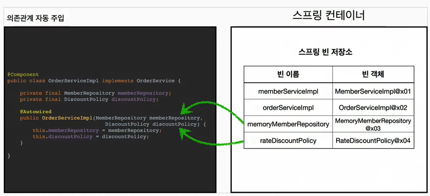

## 목차
- [컴포넌트 스캔](#컴포넌트-스캔)
  - [컴포넌트 스캔과 의존관계 자동 주입 시작하기](#컴포넌트-스캔과-의존관계-자동-주입-시작하기)
    - [컴포넌트 스캔 주입 방법](#컴포넌트-스캔-주입-방법)
  - [탐색 위치와 기본 스캔 대상](#탐색-위치와-기본-스캔-대상)
    - [탐색할 패키지의 시작 위치 지정](#탐색할-패키지의-시작-위치-지정)
    - [컴포넌트 스캔 기본 대상](#컴포넌트-스캔-기본-대상)
  - [필터](#필터)
    - [FilterType 옵션](#filtertype-옵션)
  - [중복 등록과 충돌](#중복-등록과-충돌)
    - [자동 빈 등록 vs 자동 빈 등록](#자동-빈-등록-vs-자동-빈-등록)
    - [수동 빈 등록 vs 자동 빈 등록](#수동-빈-등록-vs-자동-빈-등록)

# 컴포넌트 스캔

## 컴포넌트 스캔과 의존관계 자동 주입 시작하기
- 스프링 빈을 등록할 때는 자바 코드의 @Bean이나 XML <bean> 등을 통해서 설정 정보에 직접 등록할 스프링 빈을 나열했다.
- 스프링 빈이 많아지면 이러한 방법이 어렵다.
- 그래서 스프링은 설정 정보가 없어도 자동으로 스프링 빈을 등록하는 컴포넌트 스캔이라는 기능을 제공한다
- 또한 의존관계도 자동으로 주입하는 `@Autowired`라는 기능도 제공한다.

```java
package hello.core;

import org.springframework.context.annotation.ComponentScan;
import org.springframework.context.annotation.Configuration;
import org.springframework.context.annotation.FilterType;

@Configuration
@ComponentScan(
        excludeFilters = @ComponentScan.Filter(type = FilterType.ANNOTATION, classes = Configuration.class)
)
public class AutoAppConfig {
}
```

- 컴포넌트 스캔을 사용하려면 먼저 `@ComponentScan` 을 설정 정보에 붙여주면 된다
- 기존의 AppConfig와는 다르게 @Bean으로 등록한 클래스가 하나도 없다!

컴포넌트 스캔은 이름 그대로 `@Component` 애노테이션이 붙은 클래스를 스캔해서 스프링 빈으로 등록한다.

> 참고로 `@Configuration`도 `@Component`가 붙여있다.

```java
@Component
public class MemberServiceImpl implements MemberService{

    private final MemberRepository memberRepository;

    @Autowired
    public MemberServiceImpl(MemberRepository memberRepository) {
        this.memberRepository = memberRepository;
    }
```
- 이전 AppConfig 에서는 `@Bean`으로 직접 설정 정보를 작성했고, 의존관계도 직접 명시했다. 이제는 이런 설정 정보 자체가 없기 때문에, 의존 관계 주입도 이 클래스 안에서 해결해야한다
- `@Autowired`는 의존관계를 자동으로 주입해준다

### 컴포넌트 스캔 주입 방법


- `@ComponentScan`은 `@Component`가 붙은 모든 클래스를 스프링 빈으로 등록한다
- 이때 스프링 빈의 기본 이름은 클래스명을 사용하되 맨 앞글자만 소문자를 사용한다
  - 빈 이름 기본 전략: MemberServiceImpl 클래스 -> memberServiceImpl
  - 빈 이름 직접 지정: 만약 스프링 빈의 이름을 직접 지정하고 싶으면 `@Component("memberService")` 식으로 이름을 부여하면 된다


- 생성자에 `@Autowird`를 지정하면, 스프링 컨테이너가 자동으로 해당 스프링 빈을 찾아서 주입한다
- 이때 기본 조회 전략은 타입이 같은 빈을 찾아서 주입한다.
  - `getBean(MemberRepository.class)`와 동일하다고 이해하면 된다


- 생성자의 파라미터가 많아도 다 찾아서 자동으로 주입한다

<br>

## 탐색 위치와 기본 스캔 대상

### 탐색할 패키지의 시작 위치 지정
모든 자바 클래스를 다 컴포넌트 스캔하면 시간이 오래걸리므로 시작 위치를 지정할 수 있다
```java
@ComponentScan(
        basePackages = "hello.core",
)
```

- basePackages: 탐색할 패키지의 시작 위치를 지정한다. 이 패키지를 포함해서 하위 패키지를 모두 탐색한다.
  - `basePackages = {"hello.core", "hello.service"}` 이렇게 여러 시작 위치를 지정할 수도 있다.
- `basePackageClasses`: 지정한 클래스의 패키지를 탐색 시작 위로 지정한다.
- 만약 지정하지 않으면 `@ComponentScan`이 붙은 설정 정보 클래스의 패키지가 시작 위치가 된다.

__권장하는 방법__
패키지 위치를 지정하지 않고, 설정 정보 클래스의 위치를 프로젝트 최상단에 두는 것이다.


### 컴포넌트 스캔 기본 대상
컴포넌트 스캔은 `@Component` 뿐만 아니라 다음과 같은 내용도 추가돌 대상에 포함한다.
- `@Component`: 컴포넌트 스캔에서 사용
- `@Controller`: 스프링 MVC 컨트롤러에서 사용
- `@Service`: 스프링 비즈니스 로직에서 사용
- `@Repository`: 스프링 데이터 접근 계층에서 사용
- `@Configuration`: 스프링 설정 정보에서 사용

해당 클래스 소스 코드를 보면 모두 `@Component`를 포함하고 있는 것을 알 수 있다.

> 참고: 사실 애노테이션은 상속관계라는 것이 없다. 애노테이션이 특정 애노테이션을 들고 있는 것을 인식할 수 있는 것은 자바가 아닌 스프링이 지원하는 기능이다

컴포넌트 스캔의 용도뿐만 아니라 다음 애노테이션이 있으면 스프링은 부가 기능을 수행한다
- `@Controller`: 스프링 MVC 컨트롤러로 인식
- `@Service`: 특별한 처리를 하지 않지만, 개발자들에게 명시적으로 "핵심 비즈니스 로직이 여기있구나" 라고 나타내준다.
- `@Repository`: 스프링 데이터 접근 계층으로 인식하고, 데이터 계층의 예외를 스프링 예외로 변환해준다.
- `@Configuration`: 앞서 보았듯이 스프링 설정 정보로 인식하고, 스프링 빈이 싱글톤을 유지하도록 추가 처리를 한다.

<br>

## 필터
- `includeFilters`: 컴포넌트 스캔 대상을 추가로 지정한다.
- `excludeFilters`: 컴포넌트 스캔에서 제외할 대상을 지정한다.

```java
    @Test
    void filterScan() {
        ApplicationContext ac = new AnnotationConfigApplicationContext(ComponentFilterAppConfig.class);

        BeanA beanA = ac.getBean("beanA", BeanA.class);
        assertThat(beanA).isNotNull();

        assertThatThrownBy(() -> ac.getBean("beanB", BeanB.class))
                .isInstanceOf(NoSuchBeanDefinitionException.class);
    }

    @Configuration
    @ComponentScan(
            includeFilters = @ComponentScan.Filter(type = FilterType.ANNOTATION, classes = MyIncludeComponent.class),
            excludeFilters = @ComponentScan.Filter(type = FilterType.ANNOTATION, classes = MyExcludeComponent.class)
    )
    static class ComponentFilterAppConfig {
    }
```
- `includeFilters`에 `MyIncludeComponent` 애노테이션을 추가해서 BeanA가 스프링 빈에 등록된다.
- `excludeFilters`에 `MyExcludeComponent` 애노테이션을 추가해서 BeanB가 스프링 빈에 등록되지 않는다.

### FilterType 옵션


<br>

## 중복 등록과 충돌
컴포넌트 스캔에서 같은 빈 이름을 등록하면 어떻게 될까?

1. 자동 빈 등록 vs 자동 빈 등록
2. 수동 빈 등록 vs 자동 빈 등록

### 자동 빈 등록 vs 자동 빈 등록
- 컴포넌트 스캔에 의해 자동으로 스프링 빈이 등록되는데, 그 이름이 같은 경우 스프링은 오류를 발생시킨다.
  - `ConflictingBeanDefinitionException` 예외 발생

### 수동 빈 등록 vs 자동 빈 등록
만약 수동 빈 등록과 자동 빈 등록에서 빈 이름이 충돌되면 어떻게 될까?

```java

public class AutoAppConfigTest {

    @Test
    void basicScan() {
        AnnotationConfigApplicationContext ac = new AnnotationConfigApplicationContext(AutoAppConfig.class);

        MemberService memberService = ac.getBean(MemberService.class);
        assertThat(memberService).isInstanceOf(MemberService.class);
    }
}
```

이 경우 수동 빈 등록이 우선권을 가진다.
(수동 빈이 자동 빈을 오버라이딩 해준다)

__수동 빈 등록시 남는 로그__
```java
Overriding bean definition for bean 'memoryMemberRepository' with a different definition: replacing
```

일반적으로 빈 등록이 중복되는 경우는 여러 설정들이 꼬여서 의도하지 않았던 것이 대부분이다! 따라서 최근 스프링 부트에서는 이럴 경우 오류가 나도록 한다.
애매한 상황을 최대한 나오지 않도록 한다
