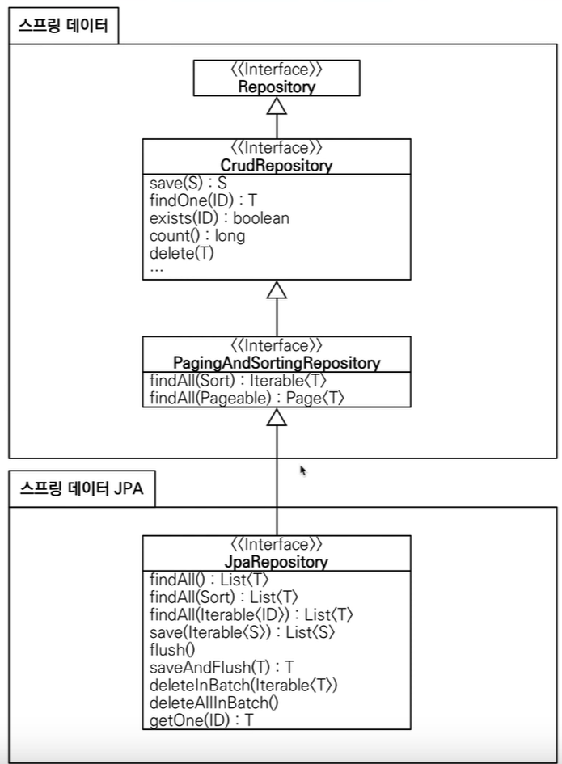

# 스프링 DB 접근 기술

## 스프링 통합 테스트
- `@SpringBootTest` : 스프링 컨테이너와 테스트를 함께 실행한다.
- `@Transactional` : 테스트 케이스에 이 애노테이션이 있으면, 테스트 시작 전에 트랜잭션을 시작하고, 테스트 완료 후에 항상 롤백한다. 이렇게 하면 DB에 데이터가 남지 않으므로 다음 테스트에 영향을 주지 않는다.

 

## 스프링 JdbcTemplate
- 순수 Jdbc와 동일한 환경설정을 하면 된다.
- 스프링 JdbcTemplate과 MyBatis 같은 라이브러리는 JDBC API에서 본 반복 코드를 대부분 제거해준다. 하지만 SQL은 직접 작성해야 한다.

 

## JPA
- JPA는 기존의 반복 코드는 물론이고, 기본적인 SQL도 JPA가 직접 만들어서 실행해준다.
- JPA를 사용하면, SQL과 데이터 중심의 설계에서 객체 중심의 설계로 패러다임을 전환을 할 수 있다.
- JPA를 사용하면 개발 생산성을 크게 높일 수 있다.

 

## 스프링 데이터 JPA
스프링 부트와 JPA만 사용해도 개발생산성이 정말 많이 증가하고, 개발해야할 코드도 확연히 줄어듭니다. 여기에 스프링 데이터 JPA를 사용하면, 기존의 한계를 넘어 마치 마법처럼, 리포지토리에 구현 클래스 없이 인터페이스 만으로 개발을 완료할 수 있습니다. 그리고 반복 개발해온 기본 CRUD 기능도 스프링 데이터 JPA가 모두 제공합니다.
스프링 부트와 JPA라는 기반 위에, 스프링 데이터 JPA라는 환상적인 프레임워크를 더하면 개발이 정말 즐거워집니다. 지금까지 조금이라도 단순하고 반복이라 생각했던 개발 코드들이 확연하게 줄어듭니다. 따라서 개발자는 핵심 비즈니스 로직을 개발하는데, 집중할 수 있습니다.
실무에서 관계형 데이터베이스를 사용한다면 스프링 데이터 JPA는 이제 선택이 아니라 필수 입니다 - 김영한님 말씀

주의 : 스프링 데이터 JPA는 JPA를 편리하게 사용하도록 도와주는 기술입니다. 따라서 JPA를 먼저 학습한 후에 스프링 데이터 JPA를 학습해야 합니다.

### 스프링이 제공하는 메서드들
- 인터페이스를 통한 기본적인 CRUD
- `findByName()`, `findByEmail()` 처럼 메서드 이름만으로 조회 기능 제공
- 페이징 기능 자동 제공

### 참고
실무에서는 JPA와 스프링 데이터 JPA를 기본으로 사용하고, 복잡한 동적 쿼리는 Querydsl이라는 라이브러리를 사용하면 된다. Querydsl을 사용하면 쿼리도 자바 코드로 안전하게 작성할 수 있고, 동적 쿼리도 편리하게 작성할 수 있다. 이 조합으로 해결하기 어려운 쿼리는 JPA가 제공하는 네이티브 쿼리를 사용하거나, 앞서 학습한 스프링 JdbcTemplate를 사용하면 된다.