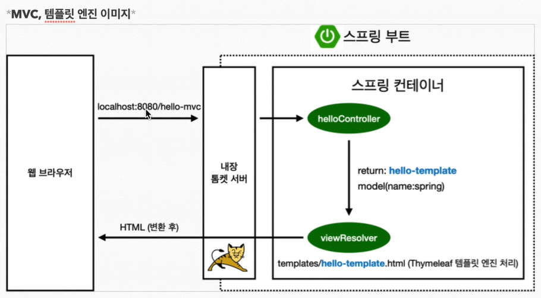
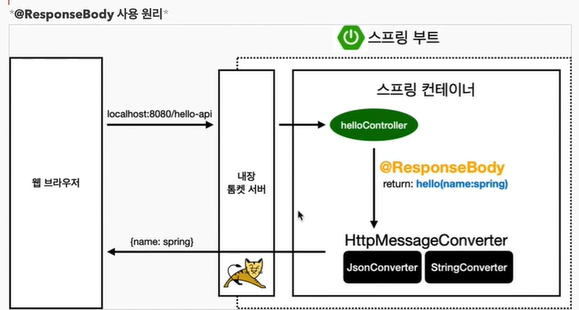

# 목차
- [목차](#목차)
- [스프링 웹 개발 기초](#스프링-웹-개발-기초)
  - [정적 컨텐츠](#정적-컨텐츠)
  - [MVC와 템플릿 엔진](#mvc와-템플릿-엔진)
  - [API](#api)
# 스프링 웹 개발 기초

## 정적 컨텐츠
파일을 웹브라우저에 그대로 전달해주는 것

`resources/static/hello-static.html`
```html
<!DOCTYPE HTML>
<html>
<head>
        <title>static content</title>
        <meta http-equiv="Content-Type" content="text/html; charset=UTF-8" />
</head>
<body>
정적 컨텐츠 입니다.
</body>
</html>
```
`localhost::8080/hello-static.html` 에 전달된다.

<p align="center"></p>

1. 웹브라우저에서 `localhost::8080/hello-static.html`로 접속한다.
2. 내장 톰캣 서버에서 받아 스프링 컨테이너에 넘겨준다.
3. controller에서 hello-static이라는 컨트롤러를 찾아본다. (컨트롤러가 우선순위)
4. 만약 없으면 resources/static/hello-static.html 에서 찾아서 반환한다.

<br>

## MVC와 템플릿 엔진

__MVC : Model, View, Controller__

Controller : 비즈니스 로직과 관련, 내부적인 것을 처리하는데 집중
View : 화면을 그리는데 역량을 집중

Controller
```java
@Controller
public class HelloController {

    @GetMapping("hello-mvc")
    public String helloMvc(@RequestParam("name") String name, Model model) {
        model.addAttribute("name", name);
        return "hello-template";
    }
}
```

View
```html
<html xmlns:th="http://www.thymeleaf.org">
<body>
<p th:text="'hello ' + ${name}">hello! empty</p>
</body>
</html>
```

실행
`localhost::8080/hello-mvc?name=spring`

<p align="center"></p>

1. localhost::8080/hello-mvc?name=spring 실행한다.
2. 내장 톰켓 서버가 받아 스프링 컨테이너에 넘겨준다.
3. Spring은 맵핑되어있는 메서드를 호출한다.
4. return 값 hello-template, model(name:spring)을 넘겨준다.
5. viewResolver가 templates의 hello-template.html을 찾아 HTML로 변환 후 웹브라우저에게 넘겨준다.

<br>

## API

@ResponseBody 문자 반환
```java
@Controller
public class HelloController {

    @GetMapping("hello-string")
    @ResponseBody
    public String helloString(@RequestParam("name") String name) {
        return "hello " + name;
    }
}
```
- `@ResponseBody`를 사용하면 뷰 리졸버`viewResolver`를 사용하지 않음
- 대신에 HTTP의 BODY에 문자 내용을 직접 반환


```java
@Controller
public class HelloController {

    @GetMapping("hello-api")
    @ResponseBody
    public String helloApi(@RequestParam("name") String name) {
        Hello hello = new Hello();
        hello.setName(name);
        return hello;
    }

    static class Hello {
        private String name;

        //get set
    }
}
```
- `@ResponseBody`를 사용하고, 객체를 반환하면 객체가 JSON으로 변환됨

<br>

`localhost::8080/hello-api?name=spring`

<p align="center"></p>

- `@ResponseBody`를 사용
  - HTTP의 BODY에 문자 내용을 직접 반환
  - `viewResolver` 대신에 `HttpMessageConverter`가 동작
  - 기본 문자처리: `StringHttpMessageConverter`
  - 기본 객체처리: `MappingJackson2HttpMessageConverter`
  - byte 처리 등등 기타 여러 HttpMessageConverter가 기본으로 등록되어 있음

참고: 클라이언트의 HTTP Accept 헤더와 서버의 컨트롤러 반환 타입 정보 둘을 조합해서 `HttpMessageConverter`가 선택된다.