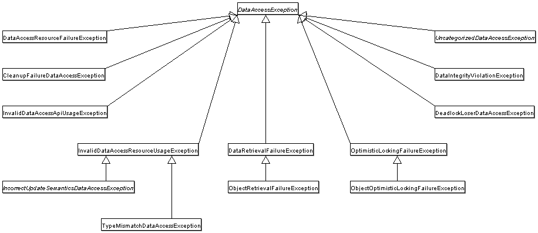

## 목차
- [예외](#예외)
  - [초난감 예외처리](#초난감-예외처리)
    - [무의미하고 무책임한 throws](#무의미하고-무책임한-throws)
  - [예외 종류와 특징](#예외-종류와-특징)
    - [Error](#error)
    - [Exception](#exception)
  - [예외 처리 방법](#예외-처리-방법)
    - [예외 복구](#예외-복구)
    - [예외처리 회피](#예외처리-회피)
    - [예외 전환](#예외-전환)
  - [예외 처리 전략](#예외-처리-전략)
    - [런타임 예외의 보편화](#런타임-예외의-보편화)
    - [애플리케이션 예외](#애플리케이션-예외)
    - [SQLException?](#sqlexception)
  - [JDBC의 한계](#jdbc의-한계)
    - [비표준 SQL](#비표준-sql)
    - [호환성이 없는 SQLException의 DB에러 정보](#호환성이-없는-sqlexception의-db에러-정보)
  - [DB 에러 코드 매핑을 통한 전환](#db-에러-코드-매핑을-통한-전환)
  - [DAO 인터페이스와 DataAccessException 계층 구조](#dao-인터페이스와-dataaccessexception-계층-구조)
  - [DataAccessException 활용 시 주의사항](#dataaccessexception-활용-시-주의사항)
  - [정리](#정리)

# 예외

개발자들이 가장 귀찮아하는 예외!  
정상적인 흐름을 구현하는 것도 힘든데, 예외상황까지 생각하여 처리해야한다는 사실이 참으로 안타깝다... 하지만 예외처리는 없어서는 안될 필수 요소이다.  
토비의 스프링에서는 예외를 어떻게 소개하고 있는지 알아보자!

## 초난감 예외처리
```java
try {
    ...
} catch(SQLException e) {

}

try {
    ...
} catch(SQLException e) {
    System.out.println(e);
    e.printStackTrace();
}
```

위의 코드는 예외가 발생 했을 때 해당 예외를 catch로 잡아주지만 예외에 대해 아무것도 처리해주지 않고 있다. 예외가 발생했는데 그것을 무시하고 계속 진행해버리면 예상치 못한 문제가 생길 수 있다.  
밑의 코드 또한 예외가 발생 했을 때 화면에 출력해주고 있긴 하지만 이 부분도 문제가 있다. 다른 로그 메시지에 묻힐 가능성도 있고, 운영서버에 올라간다면 누군가 계속 모니터링 하고 있지 않는 이상 심각한 폭탄으로 남아있을 것이다.

예외를 처리할 때 반드시 지켜야할 핵심 원칙은 한가지다. __모든 예외는 적절하게 복구되든지 아니면 작업을 중단시키고 운영자 또는 개발자에게 분명히 통보__ 되어야 한다.

### 무의미하고 무책임한 throws
```java
public void method1() throws Exception {
    method2();
}

public void method2() throws Exception {
    method3();
}

public void method3() throws Exception {
    ...
}
```

이러한 코드 또한 나쁜 코드이다. 자신의 예외를 상위로 던져버리면, 상위 메서드는 해당 예외를 처리해야할 의무를 가지게 된다. 상위 메서드가 해당 예외를 처리할 임무가 있다면 괜찮겠지만, 일반적으로 그러지 않는다. 또한 하위 메서드의 예외가 바뀌면 상위 메서드도 바뀌어야한다. ~~매우 불편하구만!~~

<br>

## 예외 종류와 특징

### Error
- java.lang.Error 클래스의 서브클래스들이다.
- 에러는 시스템에 뭔가 비정상적인 상황이 발생했을 경우 사용된다.
- 주로 자바 VM에서 발생시킨다.
- 일반적으로 애플리케이션 로직에서 잡을 수 없다.

### Exception
- java.lang.Exception 클래스와 그 서브클래스로 정의되어있다.
- 개발자들이 만든 애플리케이션 로직 작업 중 발생한다.
- checked와 unchecked로 구분된다.

자세한 것은 [여기](https://github.com/pika96/TIL/blob/master/JAVA/%EC%98%88%EC%99%B8%20%EC%B2%98%EB%A6%AC.md) 참고

<br>

## 예외 처리 방법
예외를 처리하는 일반적인 3가지 방법

### 예외 복구
예외 복구는 예외 상황을 파악하고 문제를 해결해서 정상 상태로 돌려놓는 것이다.

__예시__  
예를 들어, 사용자가 요청한 파일을 읽으려고 시도했는데 해당 파일이 없다거나 다른 문제가 있어 IOException이 발생했다고 생각해보자. 이 때 사용자에게 상황을 알려주고 다른 파일을 이용하도록 안내해서 예외 상황을 처리할 수 있다.  
예외로 인해 기본 작업 흐름이 불가능하면 다른 작업 흐름으로 자연스럽게 유도해주는 것이다. 예외 상황은 다시 정상으로 돌아오고 예외를 복구했다고 볼 수 있다.  

네트워크가 불안한 환경에서 DB 서버에 접속한다고 가정해보자. 이럴 경우 SQLException이 발생할 때 재시도를 함으로써 예외 복구를 할 수 있다.

### 예외처리 회피
예외 처리를 자신이 담당하지 않고 자신을 호출한 쪽으로 던져버리는 것이다.

```java
public void add() throws SQLException {
    try {
        // jdbc API
    } catch (SQLException e) {
        throw e;
    }
}
```

JdbcTemplate이 사용하는 콜백 오브젝트는 메소드 선언을 보면 알겠지만 ResultSet이나 PreparedStatement 등을 이용해서 작업하다 발생하는 SQLException을 자신이 처리하지 않고 템플릿으로 던져버린다. 콜백 오브젝트의 메소드는 모두 throws SQLException이 붙어 있다. SQLException을 처리하는 일은 콜백 오브젝트의 역할이 아니라고 보기 때문이다. 콜백 오브젝트의 메소드는 SQLExcetpion에 대한 예외를 회피하고 템플릿 레벨에서 처리하도록 던져준다. - 토비의 스프링 4장 p.287

예외를 회피하는 것은 그 의도가 분명해야한다.

> 예를 들어, 콜백/템플릿 패턴처럼 긴밀한 관계에 있는 경우엔 다른 객체에게 예외처리 책임을 분명히 지게 하거나, 자신을 사용하는 쪽에서 예외를 다루는게 최선의 방법이기 때문에 사용할 수 있다.  
> 하지만, 무작정 throws를 통해 예외 처리를 회피하는 것은 좋지 않다. 확신이 있을 때에만 사용하자.

### 예외 전환
예외 전환은 발생한 예외를 그대로 넘기는 게 아니라 적절한 예외로 전환해서 던지는 방법이다.

예외 전환은 일반적으로 두가지 목적으로 사용된다.
1. 내부에서 발생한 예외를 그대로 던지는 것이 그 예외 상황에 대한 적절한 의미를 부여해주지 못하는 경우

```java
public void add(User user) throws DuplicateUserIdException, SQLException {
    try {
        // Jdbc API
    } catch(SQLException e) {
        if(e.getErrorCode() == MysqlErrorNumbers.EP_DUP_ENTRY)
            throw DuplicateUserIdException();
        else
            throw e;
    }
}
```

2. 예외를 처리하기 쉽고 단순하게 만들기 위해 포장하는 경우
    - ex) 예외 처리를 강제하는 체크 예외를 런타임 예외로 바꾸는 경우

```java
try {
    OrderHome orderHome = EJBHomeFactory.getInstance().getOrderHome();
    Order order = orderHome.findByPrimaryKey(Integer id);
} catch (NamingException ne) {
    throw new EJBException(ne);
} catch (SQLException se) {
    throw new EJBException(se);
} catch (RemoteException re) {
    throw new EJBException(re);
}
```
- EJB 컴포넌트 코드에서 발생하는 대부분의 체크 예외는 비즈니스 로직으로 볼 때 의미 있는 예외이거나 복구 가능한 예외가 아니다.
- CheckedException이 비즈니스 로직으로 볼 때 의미없거나 복구 가능한 예외가 아닌 경우, 런타임 예외로 감싸 던진다.
  - 런타임 예외이기 때문에 EJB 컴포넌트를 사용하는 다른 EJB나 클라이언트에서 일일이 예외를 잡거나 다시 던지는 수고를 할 필요 없다. -> 복구할 방법이 없기 때문
- 애플리케이션 로직상에서 예외 상황이 발생하는 경우, API가 아닌 애플리케이션 코드에서 의도적으로 던지는 예외이다.
  - 이 때는 checkedException을 사용하여 적절한 대응 및 복구를 진행해야한다.
- 복구 불가능한 예외라면 상위 계층까지 throws로 예외를 불필요하게 전파하지 말고, 런타임 예외로 포장해서 던진다.
  - checkedException을 사용하여 throws를 남발하는 것은 가독성을 낮춘다.
  - 런타임 예외로 포장된 예외는 예외 처리 서비스를 통해 로그를 남기고, 관리자에게는 메일로 통보, 사용자에게는 안내 메시지를 보여주는 방식으로 처리하는게 좋다.

<br>

## 예외 처리 전략
예외를 효과적으로 사용하는 방법을 알아보자!

### 런타임 예외의 보편화
- 일반적으로 체크 예외가 일반적인 예외를 다루고, 언체크 예외는 시스템 장애나 프로그램상의 오류에 사용한다.
- 체크 예외는 catch나 throws를 선언을 강제한다. -> 이는 개발자들에게 짜증을 유발한다.
- 워드와 같은 프로그램(독립형 애플리케이션)은 통제 불가능한 시스템 예외라고 할지라도 애플리케이션의 작업이 중단되지 않고 상황을 복구해야 한다.
  - ex) 파일 열기 기능에서 사용자가 입력한 이름에 해당하는 파일을 찾을 수 없다고 종료시켜버리면 안된다.
- But..! 자바 엔터프라이즈 서버환경은 수 많은 사용자가 동시에 요청을 보내고 각 요청이 독립적인 작업으로 취급된다.
  - 하나의 요청을 처리하는 중에 예외가 발생하면 해당 작업만 중단시키면 된다.
  - 독립형 애플리케이션과 달리 예외가 발생했을 때, 작업을 일시 중지하고 사용자와 바로 커뮤니케이션하면서 예외 상황을 복구할 수 있는 방법이 없다.
  - 예외가 발생하면 해당 요청의 작업을 취소하고 서버 관리자나 개발자에게 통보해주는 편이 낫다.
- 자바 환경이 서버로 이동하면서 checkedException의 활용도가 떨어지고 있다.
  - 대응이 불가능한 checkedException이라면 빨리 런타임 예외로 전환해서 던지는 것이 낫다.(최근 API들도 런타임 예외 사용)

### 애플리케이션 예외
> 애플리케이션 예외  
> 시스템 또는 외부의 예외상황이 원인이 아닌, 애플리케이션 자체의 로직에 의해 의도적으로 발생시키고, 반드시 catch 해서 무엇인가 조치를 취하도록 요구하는 예외

```java
try {
    BigDecimal balance = account.withdraw(amount);
    ...
    // 정상적인 처리 결과를 출력하도록 진행
}
catch(InsufficientBalanceException e) { // 체크 예외
    // InsufficientBalanceException에 담긴 인출 가능한 잔고금액 정보를 가져옴
    BigDecimal availFunds = e.getAvailFunds();
    ...
    // 잔고 부족 안내 메시지를 준비하고 이를 출력하도록 진행
}
```

사용자가 요청한 금액을 은행 계좌에서 출금하는 메소드  
잔고에 따라 예외상황이 발생한다.

### SQLException?

SQLException은 코드 레벨에서 복구 하기 어렵다. 프로그램의 오류 또는 개발자의 부주의, 통제할 수 없는 외부상황(올바르지 않은 SQL 문법, 제약 조건 위반, DB 서버 다운, 네트워크 불안정 등..) 때문이다. 따라서 복구할 수 없다면, 런타임으로 전환하여 처리한다.

스프링 JdbcTemplate는 이 전략을 따르고 있는데, 실제로 JdbcTemplate에서 템플릿과 콜백 안에서 발생하는 모든 SQLException을 런타임 예외인 DataAccessException으로 포장해서 던져준다. 따라서 애플리케이션 단에서 필요한 경우 처리해주면 되고 그외에는 무시해도 좋다.

<br>

## JDBC의 한계

DB들은 모두 다른 API를 가지고 있다. DB가 바뀌게 되면 코드도 바뀐다는 이야기다. JDBC는 이를 위해 DB에 접근하는 방법을 추상화된 API 형태로 정의해놓고 사용한다. 따라서 내부 구현은 각 DB마다 다르겠지만, 개발자들은 JDBC에서 제공해주는 Connection, Statement, ResultSet 등의 표준 인터페이스를 통해 그 기능을 제공해주기 때문에 DB에 상관 없이 JDBC의 API만을 이용하여 개발할 수 있다. 하지만 다음과 같은 두가지 한계를 가지고 있다.

### 비표준 SQL
- 표준 규약이 있기는 하지만 대부분의 DB는 표준을 따르지 않는 비표준 문법과 기능을 제공한다.
  - 비 표준 문법은 해당 DB의 특별한 기능을 사용하거나 최적화된 SQL을 만들 때 유용하기 때문에 사용한다.
- 따라서 이러한 비표준 문법을 사용하게 되면 해당 DB에 종속적이게 된다.
- 해결법은 항상 표준 SQL만 사용하거나, DB 별로 별도의 Dao를 만들거나, SQL을 외부에 독립시켜 DB에 따라 변경해 사용하는 방법이 있다.

### 호환성이 없는 SQLException의 DB에러 정보
- SQLException의 발생 원인이 다양한데, 여기서 문제는 각 DB별로 에러의 종류와 원인이 제각각이다.
- 예외 정보들을 확인하려면 SQLException 안에 담긴 에러 코드와 SQL 상태 정보를 참조해 봐야한다.
  - DB 에러 코드는 벤더사별로 다르게 정의되어 있어, SQLException의 getErrorCode()로 가져올 수 있는 것은 DB별로 모두 다르다.
  - 따라서 mySQL에서 사용하던 에러코드가 오라클 DB로 바뀌면 호환이 안된다는 이야기다.

<br>

## DB 에러 코드 매핑을 통한 전환



JdbcTemplate는 SQLException의 상태 코드를 분석하여 더 구체적인 예외로 전환하는 방식을 사용하였다.  
예를 들면 키 값이 중복돼서 중복 오류가 발생하는 경우 MySQL이라면 1062, 오라클이라면 1, DB2라면 -803이라는 에러 코드를 받게 된다. DB 종류와 상관 없이 하나의 DuplicateKeyException이라는 에러로 통합하여 일관된 예외를 전달 받을 수 있도록 바꾸었다.

- SQL 문법 오류 -> `BadSqlGrammarException`
- DB 커넥션 에러 -> `DataAccessResourceFailureException`
- 데이터 제약조건 위배 -> `DataIntegrityViolationException`
- 중복 키 에러 -> `DuplicatedKeyException`


이외에도 데이터 엑세스 작업 중에 발생할 수 있는 예외 상황을 수십 가지 예외로 분류하고 이를 추상화해 정의한 다양한 예외 클래스를 제공한다.

<br>

## DAO 인터페이스와 DataAccessException 계층 구조

DataAccessException가 만들어진 이유는 JDBC의 SQLException을 전환하는 용도 이외에도 다른 이유가 있다.

- 자바 데이터 엑세스 기술에는 JDBC 외에도 JPA, JDO 등 다양한 기술이 존재한다.
  - 하지만 모든 데이터 엑세스 기술이 던지는 예외가 모두 다르다.
  - 모든 예외를 추상화 시켜놓은 것이 바로 `DataAccessException`
- DAO가 데이터 엑세스 기술로부터 독립적으로 추상화되지 않는다면, DAO는 각 데이터 엑세스 기술(JPA, Hibernate...)에 종속적인 구현이 탄생하게 되고 각 구현을 다르게 해주어야 한다.
- 인터페이스를 구현할 때 모두 다른 예외를 던지므로 메소드 선언이 달라지는 문제점이 생긴다.
```java

// 각각 다른 예외
public void add(User user) throws PersistentException;
public void add(User user) throws HibernateException;
public void add(User user) throws JdoException;


// 예외 합치기 (무책임)
public void add(User user) throws Exception;
```
- 만약 독립적인 추상화된 예외가 없다면, 위와 같이 UserDao 인터페이스는 데이터 엑세스 기술이 가지고 있는 예외에 종속적인 코드를 작성해야한다.

스프링은 자바의 다양한 데이터 엑세스 기술을 사용할 때 발생하는 예외들을 추상화해서 `DataAccessException` 계층구조 안에 정리했다.

- `DataAccessException`은 `SQLException` 을 전환하는 용도로 쓰일 뿐만 아니라, 다른 데이터 엑세스 기술에서 발생하는 예외도 추상화 하고 있다.

```java
public interface UserDao {
    void add(User user);
    User get(String id);
    List<User> getAll();
    void deleteAll();
    int getCount();
}

// UserDao를 통해 구현체를 만들 수 있다.
public class UserDaoJdbc implements UserDao {}
public class UserDaoJpa implements UserDao {}
public class UserDaoHibernate implements UserDao {}
```

<br>

## DataAccessException 활용 시 주의사항
DataAccessException이 기술에 상관없이 어느 정도 추상화된 공통 예외로 변환해주긴 하지만 근본적인 한계 때문에 완벽하다고 기대할 수는 없다.

- 중복키가 발생하는 경우 `DuplicateKeyException`은 아직 JDBC를 이용하는 경우에만 발생한다.
  - SQLException에 담긴 DB의 에러 코드를 바로 해석하는 JDBC의 경우와 달리 JPA나 하이버네이트, JDO 등에서는 각 기술이 재정의한 예외를 가져와 스프링이 최종적으로 `DataAccessException` 으로 변환하는데, DB의 에러 코드와 달리 이런 예외들은 세분화되어 있지 않기 때문이다.

<br>

## 정리
- 예외를 잡아서 아무런 조치를 취하지 않거나 의미 없는 throws 선언을 남발하는 것은 위험하다.
- 예외는 복구하거나 예외처리 오브젝트로 의도적으로 전달하거나 적절한 예외로 전환해야 한다.
- 좀 더 의미 있는 예외로 변경하거나, 불필요한 catch/throws를 피하기 위해 런타임 예외로 포장하는 두 가지 방법의 예외 전환이 있다.
- 복구할 수 없는 예외는 가능한 빨리 런타임 예외로 전환하는 것이 바람직하다.
- 애플리케이션의 로직을 담기 위한 예외는 체크 예외로 만든다.
- JDBC의 SQLException은 대부분 복구할 수 없는 예외이므로 런타임 예외로 포장해야 한다.
- SQLException의 에러 코드는 DB에 종속되기 때문에 DB에 독립적인 예외로 전환될 필요가 있다.
- 스프링은 DataAccessException을 통해 DB에 독립적으로 적용 가능한 추상화된 런타임 예외 계층을 제공한다.
- DAO를 데이터 엑세스 기술에서 독립시키려면 인터페이스 도입과 런타임 예외 전환, 기술에 독립적인 추상화된 예외로 전환이 필요하다.