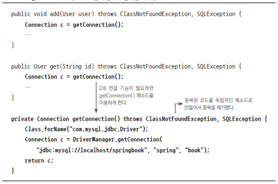
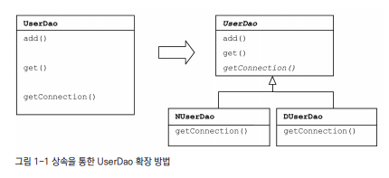
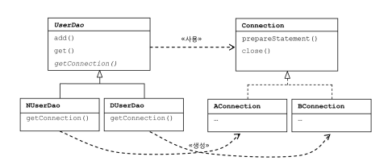
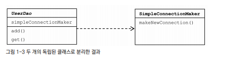
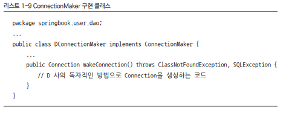
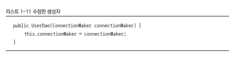
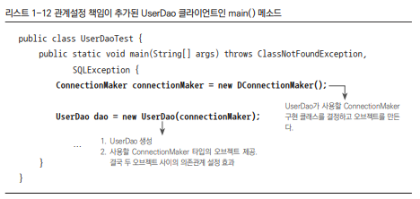

## 목차
- [오브젝트와 의존관계](#오브젝트와-의존관계)
  - [중복 추출](#중복-추출)
  - [DB 커넥션 만들기](#db-커넥션-만들기)
    - [상속을 통한 확장](#상속을-통한-확장)
    - [팩토리 메서드 패턴](#팩토리-메서드-패턴)
  - [DAO의 확장](#dao의-확장)
    - [클래스 분리](#클래스-분리)
    - [인터페이스 도입](#인터페이스-도입)
    - [관계설정 책임의 분리](#관계설정-책임의-분리)
  - [제어의 역전(IoC)](#제어의-역전ioc)
  - [IoC?](#ioc)

# 오브젝트와 의존관계

토비의 스프링 1장은 초난감 DAO부터 하나씩 리팩토링 하는 과정이 매우 친절하고 이해하기 쉬웠다.

## 중복 추출

Connection을 연결하는 중복된 부분을 추출하여 연결 정보가 바뀔 경우 쉽게 리팩토링이 가능하다.

## DB 커넥션 만들기

### 상속을 통한 확장

UserDao를 추상 클래스로 만들고 getConnection 부분을 추상 메서드로 만듬으로써 각 회사가 원하는 DB 연결 방식을 이용하여 UserDao를 사용할 수 있게 되었다.

### 팩토리 메서드 패턴

이러한 방법들은 상속 구조 때문에, 후에 대른 목적으로 UserDao에 상속을 적용하기 힘들다. 또한 상속을 통한 상하위 클래스는 매우 밀접하기 때문에, 슈퍼 클래스의 변경이 있으면 모든 서브 클래스들을 수정해야한다는 단점이 있다.

## DAO의 확장

### 클래스 분리
이번에는 DB 커넥션과 관련된 부분을 서브클래스가 아닌, 아예 별도의 클래스에 담는다. 그리고 이렇게 만든 클래스를 UserDao가 이용하게 하면 된다.

하지만 현재 코드는 UserDao가 바뀔 수 있는 정보, 즉 DB 커넥션을 가져오는 클래스에 대해 너무 많이 알고 있다. 때문에 UserDao가 DB 커넥션을 가져오는 구체적인 방법에 종속되어 버린다. 따라서 DB 커넥션을 가져오는 방법을 자유롭게 확장하기가 힘들어졌다.

### 인터페이스 도입

ConnectionMaker()를 인터페이스로 만들어 N사와 D사에 implements 해주어 구현한다. 이렇게 하면 UserDao를 바꾸지 않아도 N사와 D사의 각각 DB 연결 부분을 바꾸어 줄 수 있다.

 

### 관계설정 책임의 분리
앞선 코드는 UserDao의 생성자 코드를 통해 의존성을 부여한다. 현재 코드는 UserDao 오브젝트와 DConnectionMaker 오브젝트와 관계가 생성된다.

클라이언트는 자기가 UserDao를 사용해야 할 입장이기 때문에 UserDao의 세부 전략이라고도 볼 수 있는 ConnectionMaker의 구현 클래스를 선택하고, 선택한 클래스의 오브젝트를 생성해서 UserDao와 연결해 줄 수 있다.
__기존의 UserDao에서는 생성자에게 이 책임이 있었다.__
하지만 이것은 UserDao의 관심도 아니고 책임도 아니다. 그렇기 때문에 이를 분리 해야한다.

다음과 같이 생성자를 수정하여 관심사를 분리 할 수 있다.

이 관심사는 UserDao 클라이언트에서 추가할 수 있다. new DconnectionMaker() 부분이 클래스를 결정하고 오브젝트를 만드는 부분이다.

 

## 제어의 역전(IoC)

## IoC?
- 프로그램의 제어 흐름 구조를 뒤바꾸는 것
- 기존 개발자 주도 -> Spring 주도
- 기존 프로그래밍은 main부터 시작해서 모든 객체가 능동적으로 자신이 사용할 클래스를 결정
- 객체 지향에서의 IoC -> 객체를 사용하는 책임과 생성하는 책임을 분리하고, 생성하는 책임을 위임하는 것
- 모든 객체는 자신이 사용할 객체를 스스로 선택하지도, 생성하지도 않는다. 심지어 자신이 어디서 만들어지고, 어떻게 쓰일지 모른다. 대신 제어 권한을 특별한 객체(IoC 컨테이너)에 의해 결정되고 만들어진다.
