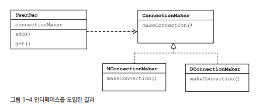

## 목차
- [오브젝트와 의존관계](#오브젝트와-의존관계)
  - [중복 추출](#중복-추출)
  - [DB 커넥션 만들기](#db-커넥션-만들기)
    - [상속을 통한 확장](#상속을-통한-확장)
    - [팩토리 메서드 패턴](#팩토리-메서드-패턴)
  - [DAO의 확장](#dao의-확장)
    - [클래스 분리](#클래스-분리)
    - [인터페이스 도입](#인터페이스-도입)
    - [관계설정 책임의 분리](#관계설정-책임의-분리)
  - [제어의 역전(IoC)](#제어의-역전ioc)
  - [IoC?](#ioc)
  - [스프링의 IoC](#스프링의-ioc)
    - [빈 팩토리 vs 애플리케이션 컨텍스트](#빈-팩토리-vs-애플리케이션-컨텍스트)
    - [애플리케이션 컨텍스트의 동작 방식](#애플리케이션-컨텍스트의-동작-방식)
    - [스프링 IoC의 용어 정리](#스프링-ioc의-용어-정리)
  - [싱글톤 레지스트리와 오브젝트 스코프](#싱글톤-레지스트리와-오브젝트-스코프)
    - [왜 싱글톤으로 만들까?](#왜-싱글톤으로-만들까)
    - [싱글톤의 한계](#싱글톤의-한계)
    - [싱글톤 레지스트리](#싱글톤-레지스트리)
      - [싱글톤 레지스트리 장점](#싱글톤-레지스트리-장점)
      - [싱글톤과 오브젝트의 상태](#싱글톤과-오브젝트의-상태)
    - [의존관계 주입(DI)](#의존관계-주입di)

# 오브젝트와 의존관계

토비의 스프링 1장은 초난감 DAO부터 하나씩 리팩토링 하는 과정이 매우 친절하고 이해하기 쉬웠다.

## 중복 추출

Connection을 연결하는 중복된 부분을 추출하여 연결 정보가 바뀔 경우 쉽게 리팩토링이 가능하다.

## DB 커넥션 만들기

### 상속을 통한 확장

UserDao를 추상 클래스로 만들고 getConnection 부분을 추상 메서드로 만듬으로써 각 회사가 원하는 DB 연결 방식을 이용하여 UserDao를 사용할 수 있게 되었다.

### 팩토리 메서드 패턴

이러한 방법들은 상속 구조 때문에, 후에 대른 목적으로 UserDao에 상속을 적용하기 힘들다. 또한 상속을 통한 상하위 클래스는 매우 밀접하기 때문에, 슈퍼 클래스의 변경이 있으면 모든 서브 클래스들을 수정해야한다는 단점이 있다.

## DAO의 확장

### 클래스 분리
이번에는 DB 커넥션과 관련된 부분을 서브클래스가 아닌, 아예 별도의 클래스에 담는다. 그리고 이렇게 만든 클래스를 UserDao가 이용하게 하면 된다.

하지만 현재 코드는 UserDao가 바뀔 수 있는 정보, 즉 DB 커넥션을 가져오는 클래스에 대해 너무 많이 알고 있다. 때문에 UserDao가 DB 커넥션을 가져오는 구체적인 방법에 종속되어 버린다. 따라서 DB 커넥션을 가져오는 방법을 자유롭게 확장하기가 힘들어졌다.

### 인터페이스 도입

ConnectionMaker()를 인터페이스로 만들어 N사와 D사에 implements 해주어 구현한다. 이렇게 하면 UserDao를 바꾸지 않아도 N사와 D사의 각각 DB 연결 부분을 바꾸어 줄 수 있다.

 

### 관계설정 책임의 분리
앞선 코드는 UserDao의 생성자 코드를 통해 의존성을 부여한다. 현재 코드는 UserDao 오브젝트와 DConnectionMaker 오브젝트와 관계가 생성된다.

클라이언트는 자기가 UserDao를 사용해야 할 입장이기 때문에 UserDao의 세부 전략이라고도 볼 수 있는 ConnectionMaker의 구현 클래스를 선택하고, 선택한 클래스의 오브젝트를 생성해서 UserDao와 연결해 줄 수 있다.
__기존의 UserDao에서는 생성자에게 이 책임이 있었다.__
하지만 이것은 UserDao의 관심도 아니고 책임도 아니다. 그렇기 때문에 이를 분리 해야한다.

다음과 같이 생성자를 수정하여 관심사를 분리 할 수 있다.

이 관심사는 UserDao 클라이언트에서 추가할 수 있다. new DconnectionMaker() 부분이 클래스를 결정하고 오브젝트를 만드는 부분이다.

 

## 제어의 역전(IoC)

## IoC?
- 프로그램의 제어 흐름 구조를 뒤바꾸는 것
- 기존 개발자 주도 -> Spring 주도
- 기존 프로그래밍은 main부터 시작해서 모든 객체가 능동적으로 자신이 사용할 클래스를 결정
- 객체 지향에서의 IoC -> 객체를 사용하는 책임과 생성하는 책임을 분리하고, 생성하는 책임을 위임하는 것
- 모든 객체는 자신이 사용할 객체를 스스로 선택하지도, 생성하지도 않는다. 심지어 자신이 어디서 만들어지고, 어떻게 쓰일지 모른다. 대신 제어 권한을 특별한 객체(IoC 컨테이너)에 의해 결정되고 만들어진다.

## 스프링의 IoC

### 빈 팩토리 vs 애플리케이션 컨텍스트

__빈 팩토리__
스프링에서 빈의 생성과 관계설정 같은 제어를 담당하는 IoC 오브젝트
애플리케이션 컨텍스트보다는 IoC 기본 기능에 초점을 맞춤

__애플리케이션 컨텍스트__
IoC 방식을 따라 만들어진 일종의 빈 팩토리
빈 팩토리 기능 이외에 추가적인 기능이 포함되어 있음
빈 팩토리를 상속받고 있음

### 애플리케이션 컨텍스트의 동작 방식

`@Configuration`이 붙은 DaoFactory를 찾아가 `@Bean`으로 등록되어 있는 userDao()를 가져다 사용한다.

만약 같은 종류의 Bean(?)이라면 어떤 것을 찾아 사용할까??

### 스프링 IoC의 용어 정리
__빈__
- 스프링이 IoC 방식으로 관리하는 오브젝트
- 스프링이 직접 생성과 제어를 담당하는 오브젝트만을 빈이라고 부름

__빈 팩토리__
- 스프링의 IoC를 담당하는 핵심 컨테이너
- 빈을 등록, 생성, 조회 등 부가적으로 빈을 관리하는 기능을 담당
- 일반적으로 빈 팩토리를 바로 사용하지 않고 애플리케이션 컨텍스트를 이용

__애플리케이션 컨텍스트__
- 빈 팩토리를 확장한 IoC 컨테이너
- 빈을 관리하는 빈 팩토리 이외에, 스프링에서 제공하는 애플리케이션 지원 기능을 모두 포함한다

__설정 정보/ 메타정보__
- 스프링의 설정 정보란 애플리케이션 컨텍스트 또는 빈 팩토리가 IoC를 적용하기 위해 사용하는 메타정보를 말한다.

__컨테이너 또는 IoC 컨테이너__
- IoC 방식으로 빈을 관리한다는 의미에서 애플리케이션 컨텍스트나 빈 팩토리를 컨테이너 또는 IoC 컨테이너라고함

 

## 싱글톤 레지스트리와 오브젝트 스코프

애플리케이션 컨텍스트는 싱글톤을 저장하고 관리하는 __싱글톤 레지스트리__ 이다.
스프링은 기본적으로 별다른 설정을 하지 않으면 내부에서 생성하는 빈 오브젝트를 모두 싱글톤으로 만든다.

### 왜 싱글톤으로 만들까?
- 스프링의 적용 대상은 주로 자바 엔터프라이즈 기술을 사용하는 서버 환경이기 때문
- 대규모의 서버 환경에서 서버 하나당 초당 수십에서 수백 번의 요청이 들어옴
- 그때마다 로직을 담당하는 오브젝트를 새로 만들어서 사용하게 되면 너무 많은 오브젝트가 만들어져 과부하가 옴
- 따라서 오브젝트를 하나로 만드는 싱글톤 방식을 사용

### 싱글톤의 한계
- private 생성자를 갖고 있기 때문에 상속할 수 없다
- 싱글톤은 테스트하기가 힘들다
- 서버환경에서는 싱글톤이 하나만 만들어지는 것을 보장하지 못한다
- 싱글톤의 사용은 전역 상태를 만들 수 있기 때문에 바람직하지 못하다

### 싱글톤 레지스트리

스프링이 주로 사용되는 서버 환경상 싱글톤이 필요하지만, 앞서 말한 단점들 때문에 꺼려진다. 스프링은 이러한 단점을 개선하기위해 직접 싱글톤 형태의 오브젝트를 만들고 관리하는 기능을 제공한다. 그것이 바로 __싱글톤 레지스트리__ 다.

~~스프링 만세...~~

#### 싱글톤 레지스트리 장점
- static 메소드와 private 생성자를 사용해야 하는 비정상적인 클래스가 아닌, 평범한 자바 클래스를 싱글톤으로 활용하게 해준다.
- 평범한 자바 클래스라도 IoC 방식의 컨테이너를 사용해서 생성과 관계설정, 사용 등에 대한 제어권을 컨테이너에게 넘기면 손쉽게 싱글톤 방식으로 만들어져 관리할 수 있다.
- 싱글톤 방식으로 사용될 애플리케이션 클래스라도 public 생성자를 가질 수 있다.
- 이에 따라 테스트도 자유롭게 할 수 있다.

#### 싱글톤과 오브젝트의 상태

멀티 스레트 환경에서 싱글톤 사용은 위험하다.
- 상태 정보를 내부에 갖고 있지 않은 무상태 방식으로 만들어져야한다
- 여러 인스턴스 변수를 수정하는 것은 위험(당연!!)
- 읽기 전용이면 문제가 없다

### 의존관계 주입(DI)

__의존관계__

>A가 B에게 의존하고 있다

B가 변경되면 A에 영향을 미친다. 하지만 반대로 A가 변경되도 B에 영향을 미치지 않는다.

- 설계 시점과 코드에는 클래스와 인터페이스 사이의 느슨한 의존관계만 만든다.
- 런타임 시에 구체적인 오브젝트를 제3자(DI 컨테이너)의 도움으로 주입받는다.