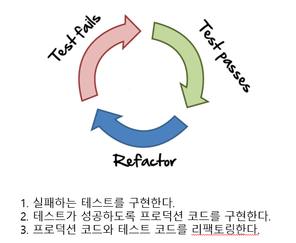
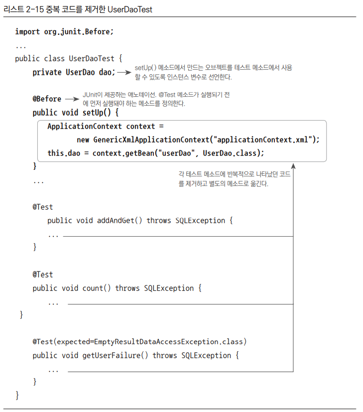
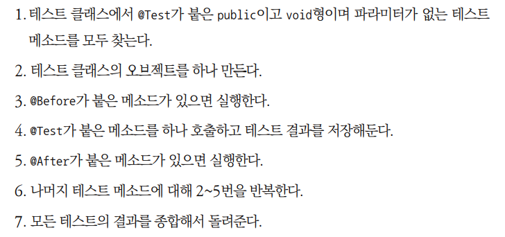
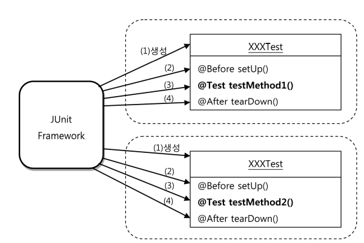

## 목차
- [테스트](#테스트)
  - [UserDaoTest의 특징](#userdaotest의-특징)
    - [웹을 통한 DAO 테스트 방법의 문제점](#웹을-통한-dao-테스트-방법의-문제점)
    - [작은 단위 테스트](#작은-단위-테스트)
    - [자동수행 테스트 코드](#자동수행-테스트-코드)
    - [UserDaoTest의 문제점](#userdaotest의-문제점)
  - [UserDaoTest 개선](#userdaotest-개선)
    - [junit 사용](#junit-사용)
  - [개발자를 위한 테스팅 프레임워크 JUnit](#개발자를-위한-테스팅-프레임워크-junit)
    - [네거티브 테스트](#네거티브-테스트)
  - [테스트 주도 개발(TDD)](#테스트-주도-개발tdd)
  - [테스트 코드 개선(@Before, @After)](#테스트-코드-개선before-after)
  - [스프링 테스트 적용](#스프링-테스트-적용)
    - [테스트를 위한 애플리케이션 컨텍스트 관리](#테스트를-위한-애플리케이션-컨텍스트-관리)
    - [테스트 클래스의 컨텍스트 공유](#테스트-클래스의-컨텍스트-공유)
    - [DirtiesContext](#dirtiescontext)
  - [정리](#정리)

# 테스트

## UserDaoTest의 특징

```java
public class UserDaoTest {
    public static void main(String[] args) throws SQLException {
        ApplicationContext context = new GenericXmlApplicationContext(
        "applicationContext.xml");
        UserDao dao = context.getBean("userDao", UserDao.class); 
        User user = new User();
        user.setId("user");
        user.setName("백기선");
        user.setPassword("married");
        dao.add(user);

        System.out.println(user.getId() + " 등록 성공");
        User user2 = dao.get(user.getId());

        System.out.println(user2.getName());
        System.out.println(user2.getPassword());
        System.out.println(user2.getId() + " 조회 성공");
    }
}
```

현재 테스트는 UserDao를 직접 호출하고, 각 단계의 작업이 에러 없이 끝나면 콘솔에 성공 메시지로 출력해준다.
하지만 사용자가 직접 확인해야하기 때문에 자동화가 되어있지 않아 매우 불편하다.
만약 테스트가 100개가 넘어가게되면 사용자는 일일히 확인해야할 것이다.

### 웹을 통한 DAO 테스트 방법의 문제점
- DAO만을 테스트하기 위해 서비스, 컨트롤러, 웹 프론트 등 구현해야할 부분이 너무나도 많다.
- 만약 테스트를 하는 도중 에러가 나게 되면 어디서 문제가 발생했는지 찾아야하는 수고도 덜어야한다.
  - 이는 DB 연결 방법에 문제가 있을 수도 있고, JDBC API를 잘못 호출해서 일수도 있다.
- 테스트하고 싶은 부분은 DAO인데 다른 계층의 코드와 컴포넌트, 심지어 서버의 설정 상태까지 모두 테스트에 영향을 줄 수 있기 때문에 번거롭다.

### 작은 단위 테스트
우아한테크코스에서 지겹도록 한 단위 테스트가 여기서 나온다. 그만큼 간단하지만 중요한 개념이다.
테스트는 가능하면 가장 작은 단위로 쪼개서 집중해야한다.
- 테스트가 커지게 되면 수행과정이 복잡해진다.
- 만약 에러가 발생하게되면 정확한 원인을 찾기 어려워진다.

단위 테스트가 필요한 이유가 뭘까?
- 개발자가 설계하고 만든 코드가 원래 의도한 대로 동작하는지를 개발자 스스로 빠르게 확인 받기 위해서이다.
- 단위 테스트 자체가 작게 쪼개진 코드의 품질을 보증한다고 생각한다.
- 또한 코드를 변경할 때 기존의 코드에 문제점이 있는지 바로바로 확인할 수 있기 때문에 편리하게 코드 수정 및 확장이 가능하다.
- 단위 테스트보다 더 큰(예컨데 고객입장에서 테스트할 때) 그제서야 버그를 발견하게 된다면, 에러의 위치를 찾기 어려울 것이다. 빠르게 에러 수정을 하기도 어려울 것이다.

### 자동수행 테스트 코드
앞서 말했듯이 테스트 코드는 사용자가 콘솔 로그를 보며 확인하는 것이 아닌,
__프로그램 자체 스스로 테스트의 성공 여부를 판단할 수 있어야한다.__

<br>

### UserDaoTest의 문제점
앞서 테스트 코드의 특징 및 개념들을 살펴보았으니 UserDaoTest의 문제점을 알 수 있을 것이다.

- 수동확인 작업의 번거로움
  - System.out.println()을 통해 테스트의 성공 여부를 출력하고 있다.
  - 이는 사용자가 직접 확인해야하는 불편함이 따른다.
- 실행 작업의 번거로움
  - 현재 main() 메소드에 정의가 되어있는데, 만약 DAO가 수백개가 된다면 main() 또한 수백개가 만들어질 것이다. 이는 매우 번거롭다.

## UserDaoTest 개선
먼저 토비에서는 junit을 사용하기 전 순수한 자바 코드를 통해 테스트 코드를 개선하고 있다.
```java
if (!user.getName().equals(user2.getName())) {
	 System.out.println("테스트 실패 (name)");
}
else if (!user.getPassword().equals(user2.getPassword())) {
	 System.out.println("테스트 실패 (password)");
}
else {
	 System.out.println("조회 테스트 성공");
}
```
우리는 테스트 성공만을 확인해서 기록하면 된다. 앞선 코드보다는 개선되었지만, junit의 편리함을 알고 있는 우리에게는 매우 번거롭다.

### junit 사용
```java
public class UserDaoTest {
    @Test
    public void addAndGet() throws SQLException {
    ApplicationContext context = new GenericXmlApplicationContext("applicationContext.xml");

    UserDao dao = context.getBean("userDao", UserDao.class);
    User user = new User();
    user.setId("gyumee");
    user.setName("박성철");
    user.setPassword("springno1");
    dao.add(user);
    User user2 = dao.get(user.getId());

    assertThat(user2.getName(), is(user.getName()));
    assertThat(user2.getPassword(), is(user.getPassword()));
    }
}
```
이렇게 코드를 바꾸어주면 assertThat을 이용하여 프로그램 스스로 판단을 해준다.
우리는 초록색 줄만 확인하면 된다.

<br>

## 개발자를 위한 테스팅 프레임워크 JUnit
테스트를 개선했지만 아직 부족하다.
현재 DB에 접근해서 user를 추가해주고 있어 만약 2번째 테스트를 돌리게되면 DB가 초기화 되지 않아 에러가 발생할 것이다.
__테스트는 항상 여러번 반복하더라도 동일한 결과를 얻을 수 있어야한다.__

토비의 스프링에서는 먼저 deleteAll() 메서드를 이용해서 초기화를 해준뒤 실행하는 방법을 소개하고 있다. 물론 나쁜 방법은 아니지만, 테스트 실행 이전에 다른 이유로 User 정보가 있게 된다면 테스트는 실패할 것이다. 물론 다른 방법이 있지만, 아직 소개하지 않고 있다.

중요한 점은 __테스트는 항상 여러번 반복하더라도 동일한 결과를 얻을 수 있어야한다.__ 이다.

### 네거티브 테스트
User 정보를 가져올 때 get()을 사용하는데 우리는 get() 또한 테스트를 해주어야 한다.
get()으로 User 정보를 가져올 때, 매번 성공하면 좋겠지만 만약 해당 유저 정보가 없으면 예외를 발생시킬 것이다. 현재 JdbcTemplate를 사용하는 상황에서는 아마 `EmptyResultDataAccessException` 예외가 던져질 것이다.
우리는 테스트를 작성할 때 실패하는 상황의 테스트 또한 작성해야한다.
내가 개인적으로 생각하기에는 성공하는 상황보다 실패하는 상황의 테스트를 작성하는 것이 더욱 더 중요하다.
현재 userDao.get()을 사용할 때 예외는 앞서 말햇듯이 유저 정보가 없을 때 예외가 발생할 것이다.

```java
@Test
    void getTest() {
        assertThatThrownBy(() -> userDao.get("Empty"))
                .isInstanceOf(EmptyResultDataAccessException.class);
    }
```

userDao.get() 같은 메서드일 경우 이와 같이 테스트할 수 있을 것이다.

## 테스트 주도 개발(TDD)
> 테스트 코드를 먼저 만들고, 테스트를 성공하게 해주는 코드를 작성하는 방식의 개발 방법



## 테스트 코드 개선(@Before, @After)
기존 UserDao 코드에서 중복되는 부분이 있다. 애플리케이션 컨텍스트를 만드는 부분과 컨텍스트에서 UserDao를 가져오는 부분이다.

```java
ApplicationContext context = new GenericXmlApplicationContext("applicationContext.xml");
User dao = context.getBean("userDao", UserDao.class);
```

`@Before` 또는 `@After`을 이용해서 중복되는 코드를 제거할 수 있다.

__@Before__

사실 `@Before은` junit4 에서 지원하는 애노테이션이다. 토비에서는 `@Before`를 사용하고 있지만 현재는 junit5를 많이 사용해서 `@Before` 대신 `@BeforeEach`을 많이 사용한다.

__junit에서 테스트를 실행하는 순서__

> 1번에서 junit5는 public을 생략할 수 있다.


위 그림은 테스트 실행 순서를 그림으로 나타낸다.

그림에서 볼 수 있듯이 테스트를 실행할 때마다 새로운 오브젝트를 만든다.
이는 테스트는 __각 테스트가 서로 영향을 주지 않고 독립적으로 실행됨__ 을 확실히 보장해주기 위해 새로운 오브젝트를 만들어 테스트 해준다.

<br>

## 스프링 테스트 적용
```java
@Before
private UserDao dao;

public void setUp() {
    ApplicationContext context = new GenericXmlApplicationContext("applicationContext.xml");
    this.dao = context.getBean("userDao", UserDao.class);
}
```

`@Before` 메서드가 테스트 메서드 개수만큼 반복되기 때문에 애플리케이션 컨텍스트도 세 번 만들어진다.
만약 빈이 많아지고 복잡해지면 애플리케이션 컨텍스트 생성에 적지 않은 시간이 걸릴 수 있다.

테스트는 가능한 독립적으로 매번 새로운 오브젝트를 만들어서 사용하는 것이 원칙이다. 하지만 애플리케이션 컨텍스트처럼 생성에 많은 시간과 자원이 소모되는 경우에는 테스트 전체가 공유하는 오브젝트를 만들기도 한다.
일반적으로 애플리케이션 컨텍스트는 바뀌지 않으므로 한 번만 만들고 여러 테스트를 공유해서 사용해도 된다.
그렇다면 어떤 방식으로 한 번만 만들 수 있을까? static 필드에 애플리케이션 컨텍스트를 저장해두어 사용하면 어떨까? JUnit에서는 `@BeforeClass`(JUnit5에서는 `@BeforeAll`)를 지원하고 있다. 하지만 이보다는 스프링에서 직접 제공하는 기능을 사용해보자
> 테스트를 하다가 가끔 애플리케이션 컨텍스트 내부 빈 설정이 바뀔 때도 있다. 이럴 경우 @DirtiesContext를 필요로 한다.

### 테스트를 위한 애플리케이션 컨텍스트 관리
```java
ApplicationContext context = new GenericXmlApplicationContext("applicationContext.xml");
```
현재 `@Before`에 있는 ApplicationContext 넣어주는 부분을 제거한다.
```java
@RunWith(SpringJUnit4ClassRunner.class) // JUnit5 에서 ExtendWith로 변경
@ContextConfiguration(locations="/applicationContext.xml")
public class UserDaoTest {
    @Autowired
    private ApplicationContext context;
}
```

그다음 `@RunWith`와 `@ContextConfiguration` 애노테이션을 다음과 같이 넣어준다.
이렇게 하면 static 필드에 선언할 필요 없이 각 테스트마다 동일한 Application Context를 사용할 수 있다.

### 테스트 클래스의 컨텍스트 공유
다른 테스트 클래스 또한 하나의 컨텍스트를 공유할 수 있다.

```java
@RunWith(SpringJUnit4ClassRunner.class)
@ContextConfiguration(locations="/applicationContext.xml")
public class UserDaoTest { .. }

@RunWith(SpringJUnit4ClassRunner.class)
@ContextConfiguration(locations="/applicationContext.xml")
public class GroupDaoTest { .. }
```

### DirtiesContext
모든 테스트가 하나의 애플리케이션 컨텍스트를 공유하고 있을 때, 만약 애플리케이션 컨텍스트가 변경되면 어떻게 할까? 변경된 시점으로 부터 후의 테스트에 문제가 생기게 될 것이다.
`@DirtiesContext` 애노테이션을 추가하게 되면, 해당 클래스의 테스트에서 애플리케이션 컨텍스트의 상태를 변경한다는 것을 알려준다. 이 때 테스트 컨텍스트는 애플리케이션 컨텍스트 공유를 허용하지 않는다. 테스트 메서드를 수행하고 나면 매번 새로운 애플케이션 컨텍스트를 만들어서 다음 테스트가 사용하게 해준다.

> 메소드 레벨의 @DirtiesContext 사용하기
@DirtiesContext는 클래스에만 적용할 수 있는 건 아니다. 하나의 메소드에서만 컨텍스트 상태를 변경한다면 메소드 레벨에 @DirtiesContext를 붙여주는 편이 낫다. 해당 메소드의 실행이 끝나고 나면 이후에 진행되는 테스트를 위해 변경된 애플리케이션 컨텍스트는 폐기되고 새로운 애플리케이션 컨텍스트가 만들어진다.

<br>

## 정리
- 테스트는 자동화돼야 하고, 빠르게 실행할 수 있어야 한다.
- main() 테스트 대신 JUnit 프레임 워크를 이용한 테스트 작성이 편리하다.
- 테스트 결과는 일관성이 있어야ㅎ 한다. 코드의 변경 없이 환경이나 테스트 실행 순서에 따라서 결과가 달라지면 안 된다.
- 테스트는 포괄적으로 작성해야 한다. 충분한 검증을 하지 않는 테스트는 없는 것보다 나쁠 수 있다.
- 코드 작성과 테스트 수행 간격이 짧을 수록 효과적이다.
- 테스트하기 쉬운 코드가 좋은 코드다.
- 테스트를 먼저 만들고 테스트를 성공시키는 코드를 만들어가는 테스트 주도 개발 방법도 유용하다.
- 테스트 코드도 애플리케이션 코드와 마찬가지로 적절한 리팩토링이 필요하다.
- @Before, @After를 사용해서 테스트 메소드들의 공통 준비 작업과 정리 작업을 처리할 수 있다.
- 스프링 테스트 컨텍스트 프레임워크를 이용하면 테스트 성능을 향상시킬 수 있다.
- 동일한 설정파일을 사용하는 테스트는 하나의 애플리케이션 컨텍스트를 공유한다.
- @Autowired를 사용하면 컨텍스트의 빈을 테스트 오브젝트에 DI 할 수 있다.
- 기술의 사용 방법을 익히고 이해를 돕기 위해 학습 테스트를 작성하자.
- 오류가 발견될 경우 그에 대한 버그 테스트를 만들어두면 유용하다.

