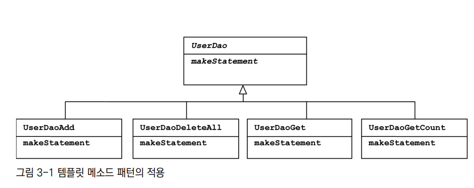
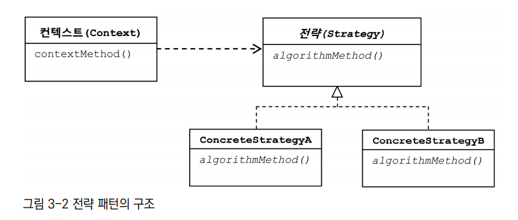
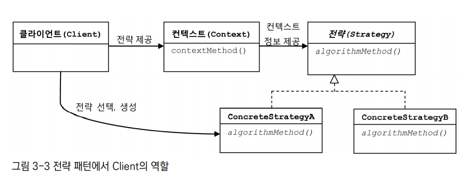
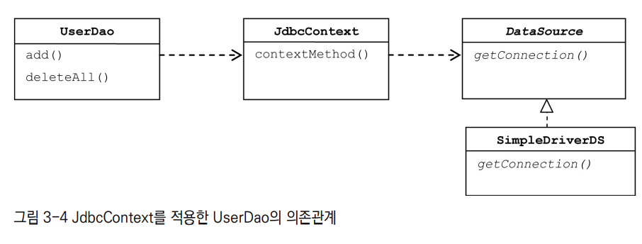
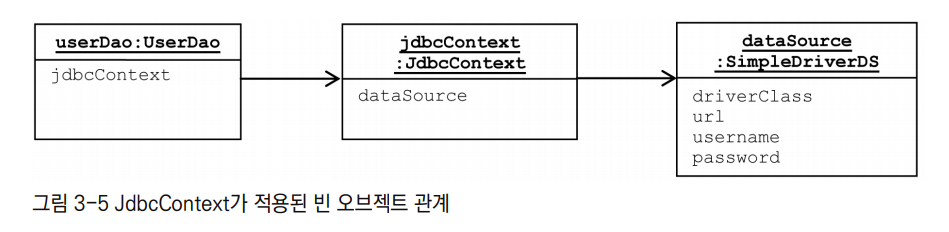
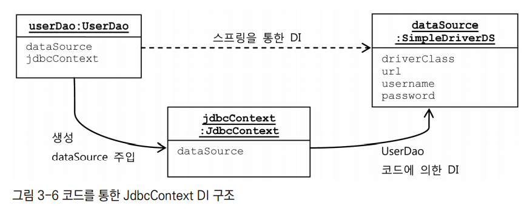
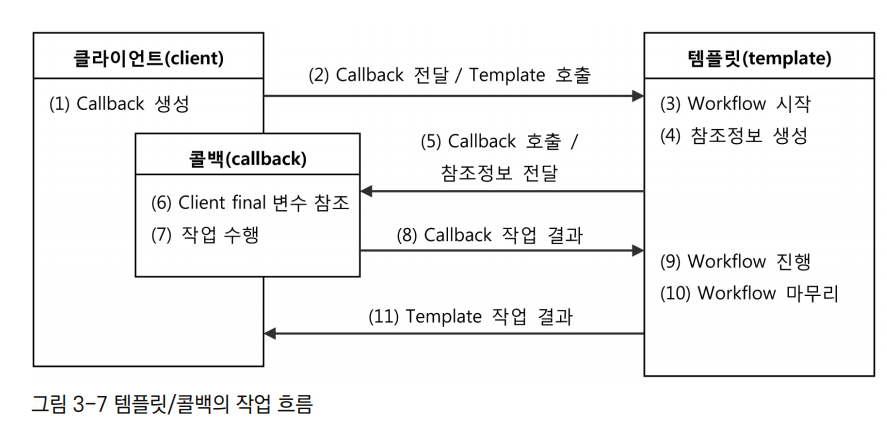
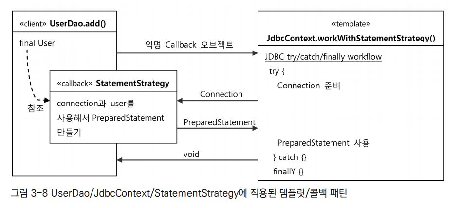
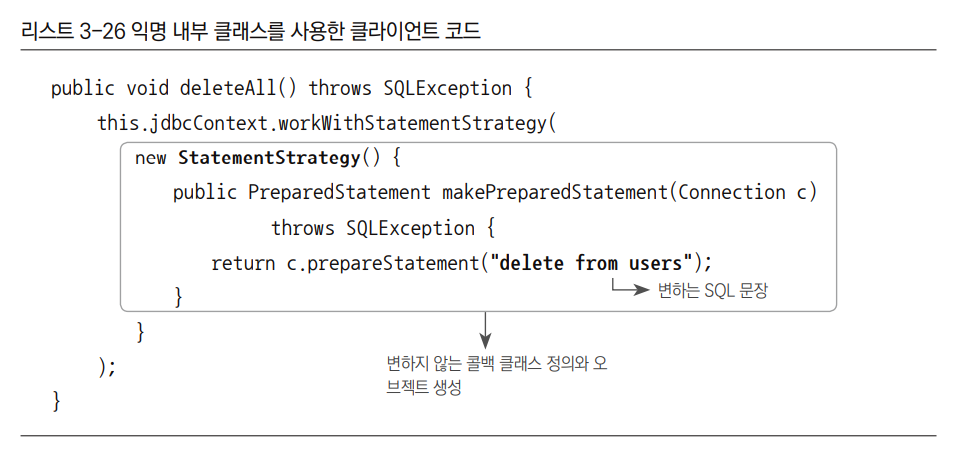
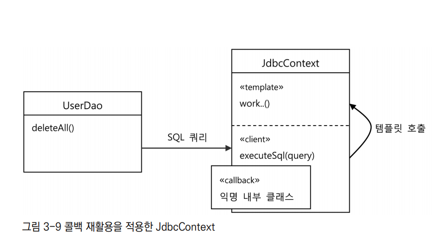

## 목차
- [템플릿](#템플릿)
  - [다시 보는 초난감 DAO](#다시-보는-초난감-dao)
    - [안전하지 않은 DAO](#안전하지-않은-dao)
    - [안전한 DAO](#안전한-dao)
  - [템플릿 메소드 패턴의 적용](#템플릿-메소드-패턴의-적용)
  - [전략 패턴의 적용](#전략-패턴의-적용)
  - [DI 적용을 위한 클라이언트/컨텍스트 분리](#di-적용을-위한-클라이언트컨텍스트-분리)
  - [로컬 클래스 적용](#로컬-클래스-적용)
  - [익명 내부 클래스](#익명-내부-클래스)
  - [컨텍스트와 DI](#컨텍스트와-di)
    - [JdbcContext 분리](#jdbccontext-분리)
    - [빈 의존관계 변경](#빈-의존관계-변경)
    - [스프링 빈으로 DI](#스프링-빈으로-di)
    - [코드를 이용하는 수동 DI](#코드를-이용하는-수동-di)
  - [템플릿과 콜백](#템플릿과-콜백)
    - [콜백의 분리와 재활용](#콜백의-분리와-재활용)
  - [JdbcTemplate](#jdbctemplate)
  - [정리](#정리)

# 템플릿
> 변경이 거의 일어나지 않으며 일정한 패턴으로 유지되는 특성을 가진 부분을 자유롭게 변경되는 성질을 가진 부분으로부터 독립시켜서 효과적으로 활용할 수 있도록 하는 방법

## 다시 보는 초난감 DAO

### 안전하지 않은 DAO

```java
public void deleteAll() throws SQLException {
        Connection c = connectionMaker.makeNewConnection();

        // 예외 발생시 메소드 실행 중지
        PreparedStatement ps = c.prepareStatement("delete from users");
        ps.executeUpdate();
        
        ps.close();
        c.close();
    }
```

PreparedStatement를 처리하는 도중 오류가 발생하게 되면 해당 메서드는 중단된다.
이럴 경우 close는 실행되지 않고 메서드는 중단되는데 이 때 반환해주지 않은 커넥션들때문에 문제가 생길 수 있다.
이를 try-catch를 이용해서 안전하게 만들 수 있다.

### 안전한 DAO
```java
public void deleteAll() throws SQLException {

        Connection c = null;
        PreparedStatement ps = null;
        try {
            c = connectionMaker.makeNewConnection();
            ps = c.prepareStatement("delete from users");
            ps.executeUpdate();
        } catch (SQLException e) {
            throw e;
        } finally {
            if (ps != null) {
                try {
                    ps.close();
                } catch (SQLException e) {

                }
            }
            if (c != null) {
                try {
                    c.close();
                } catch (SQLException e) {

                }
            }
        }
    }
```

try-catch를 이용해서 안전한 코드를 만들었다.
다른 UserDao 코드 또한 try-catch를 사용하여 안전한 코드를 만들 수 있다.
하지만 이 코드가 정말 좋다고 말할 수 있을까?
일단 한눈에 봐도 중복되는 try/catch/finally 블록을 볼 수 있다.
이 부분을 템플릿 패턴을 이용해서 개선할 수 있다.

<br>

## 템플릿 메소드 패턴의 적용
- 변하지 않는 부분과 변하는 부분을 분리하여 코드를 개선시킬 수 있다.
- 변하지 않는 부분은 슈퍼클래스에 두고, 변하는 부분은 추상 메소드로 정의해두어 서브 클래스에서 오버라이드하여 새롭게 정의한다.

```java
abstract protected PreparedStatement makeStatement(Connection c) throws
SQLException;
```

```java
public class UserDaoDeleteAll extends UserDao {
    protected PreparedStatement makeStatement(Connection c) throws SQLException {
        PreparedStatement ps = c.prepareStatement("delete from users");
        return ps;
    }
}
```

이렇게 하면 변하는 부분을 상속을 통해 따로 분리하여 자유롭게 확장할 수 있다. 하지만 기능을 확장할 때마다 클래스를 만들어주어야한다는 너무나도 불편한 단점이 있다.



또한 확장 구조가 이미 클래스를 설계하는 시점에서 고정되어 버린다.

<br>

## 전략 패턴의 적용
앞선 템플릿 메서드 패턴의 단점을 보완하기 위해 전략 패턴을 사용해보자.


```java
public interface StatementStrategy {
    PreparedStatement makePreparedStatement(Connection c) throws SQLException;
}
```

```java
public void deleteAll() throws ClassNotFoundException, SQLException {

        Connection c = null;
        PreparedStatement ps = null;
        try {
            c = connectionMaker.makeNewConnection();

            StatementStrategy strategy = new DeleteAllStatement();
            ps = strategy.makePreparedStatement(c);
            ps.executeUpdate();
        } catch (SQLException e)
```

- 오브젝트를 둘로 분리하고 클래스 레벨에서는 인터페이스를 통해 의존하게 만들었다.
- 전략 패턴은 확장에 해당하는 변하는 부분을 별도의 클래스로 만들어 추상화된 인터페이스를 통해 위임하는 방식이다.
- 템플릿 메서드보다 유연하고 확장성이 뛰어나다.

<br>

## DI 적용을 위한 클라이언트/컨텍스트 분리
전략 패턴은 필요에 따라 컨텍스트는 그대로 유지되면서(OCP의 폐쇄 원칙) 전략을 바꿔쓸 수 있다(OCP의 개방원칙)는 것인데, 이미 구체적인 전략 클래스 DeleteAllStatement를 사용하도록 고정되어 있다.
컨텍스트가 StatementStrategy 인터페이스뿐 아니라 구현 클래스인 DeleteAllStatement를 직접 알고 있다는 것은 안된다.
우리는 이를 분리 시켜주어야한다.



```java
public void jdbcContextWithStatementStrategy(StatementStrategy stmt) throws ClassNotFoundException, SQLException {
        Connection c = null;
        PreparedStatement ps = null;

        try {
            c = connectionMaker.makeNewConnection();

            ps = stmt.makePreparedStatement(c);

            ps.executeUpdate();
        } catch (SQLException e) {
            throw e;
        } finally {
            if (ps != null) { try { ps.close(); } catch (SQLException e) {} }
            if (c != null) { try { c.close(); } catch (SQLException e) {} }
        }
    }
```

```java
public void deleteAll() SQLException {
    StatementStrategy strategy = new DeleteAllStatement();
    jdbcContextWithStatementStrategy(strategy);
}
```

분리한 메소드는 컨텍스트의 핵심적인 내용을 잘 담고 있다.
전략타입만 받아 공통부분인 try/catch/finally 구조로 만들어진 컨텍스트 내에서 작업을 수행한다.
실제로 deleteAll에서는 전략 오브젝트를 만들고 컨텍스트를 호출하는 책임만 가지고 있다.
현재 클래스는 아직 분리되지 않았지만, 의존관계와 책임으로 볼 때 클라이언트와 컨텍스트가 잘 분리되어 있다.

<br>

## 로컬 클래스 적용
__개선해야할 점__
- 현재 구조는 DAO 메소드마다 새로운 StatementStrategy 구현 클래스를 만들어야한다는 단점이 있다.
- DAO 메소드에서 StatementStrategy에 전달할 부가적인 정보가 있는 경우, 오브젝트를 전달받는 생성자와 이를 저장해둘 인스턴스 변수를 번거롭게 만들어야 한다는 단점이 있다.

클래스 파일이 많아지는 문제는 로컬 클래스를 이용해서 간단히 해결할 수 있다
> __중첩 클래스의 종류__
다른 클래스 내부에 정의되는 클래스를 중첩 클래스(nested class)라고 한다. 중첩 클래스는 독립적으로 오브젝트로 만들어질 수 있는 스태틱 클래스(static class)와 자신이 정의된 클래스의 오브젝트 안에서만 만들어질 수 있는 내부 클래스(inner class)로 구분된다.
내부 클래스는 다시 범위(scope)에 따라 세 가지로 구분된다. 멤버 필드처럼 오브젝트 레벨에 정의되는 멤버 내부 클래스(member inner class)와 메소드 레벨에 정의되는 로컬 클래스(local class), 그리고 이름을 갖지 않는 익명 내부 클래스(anonymous inner class)다. 익명 내부 클래스의 범위는 선언된 위치에 따라서 다르다.

```java
public void add(final User user) throws ClassNotFoundException, SQLException {

        class AddStatement implements StatementStrategy {

            @Override
            public PreparedStatement makePreparedStatement(Connection c) throws SQLException {
                PreparedStatement ps = c.prepareStatement(
                        "insert into users(id, name, password) values(?,?,?)");
                ps.setString(1, user.getId());
                ps.setString(2, user.getName());
                ps.setString(3, user.getPassword());

                return ps;
            }
        }

        StatementStrategy strategy = new AddStatement();
        jdbcContextWithStatementStrategy(strategy);
    }
```

- AddStatement 클래스를 로컬 클래스로서 add() 메소드 안에 집어 넣었다.
- AddStatement 클래스는 add() 메소드에서만 쓰이니 바로 정의해서 쓰는 것도 나쁘지 않다.
- add() 메소드 안에서 PreparedStatement 생성 로직을 함께 볼 수 있으니 코드를 이해하기도 좋다.
- 메소드마다 추가해야 했던 클래스 파일을 줄일 수 있다.

<br>

## 익명 내부 클래스
> __익명 내부 클래스__
익명 내부 클래스(anonymous inner class)는 이름을 갖지 않는 클래스다. 클래스 선언과 오브젝트 생성이 결합된 형태로 만들어지며, 상속할 클래스나 구현할 인터페이스를 생성자 대신 사용해서 다음과 같은 형태로 만들어 사용한다. 클래스를 재사용할 필요가 없고, 구현한 인터페이스 타입으로만 사용할 경우에 유용하다. 
new 인터페이스이름() { 클래스 본문 };

```java
jdbcContextWithStatementStrategy(new StatementStrategy() {
            @Override
            public PreparedStatement makePreparedStatement(Connection c) throws SQLException {
                PreparedStatement ps = c.prepareStatement(
                        "insert into users(id, name, password) values(?,?,?)");
                ps.setString(1, user.getId());
                ps.setString(2, user.getName());
                ps.setString(3, user.getPassword());

                return ps;
            }
        });
```

- 익명 내부 클래스는 선언과 동시에 오브젝트를 생성한다.
- 익명 내부 클래스를 통해 더욱 간단하게 코드를 리팩토링 할 수 있다.

<br>

## 컨텍스트와 DI

### JdbcContext 분리
- 현재 jdbcContextWithStatementStrategy() 메소드는 UserDao에 속해있다.
- JDBC의 일반적인 작업 흐름을 담고 있는 jdbcContextWithStatementStrategy()는 다른 DAO에서도 사용 가능하다.
- 다른 DAO 에서도 사용 할 수 있도록 UserDao 클래스 밖으로 독립시킨다.

```java
public class JdbcContext {
    private final DataSource dataSource;

    public JdbcContext(DataSource dataSource) {
        this.dataSource = dataSource;
    }

    public void workWithStatementStrategy(StatementStrategy stmt) throws SQLException {
        Connection c = null;
        PreparedStatement ps = null;

        try {
            c = this.dataSource.getConnection();

            ps = stmt.makePreparedStatement(c);

            ps.executeUpdate();
        } catch (SQLException e) {
            throw e;
        } finally {
            if (ps != null) { try { ps.close(); } catch (SQLException e) {} }
            if (c != null) { try { c.close(); } catch (SQLException e) {} }
        }
    }

    public DataSource getDataSource() {
        return dataSource;
    }
}
```

```java
public class UserDao {

    private JdbcContext jdbcContext;

    public UserDao(JdbcContext jdbcContext) {
        this.jdbcContext = jdbcContext;
    }
}
```

- UserDao가 JdbcContext를 DI 받아 사용한다
- JdbcContext는 DataSource를 DI 받아 사용한다.

### 빈 의존관계 변경
- 현재 UserDao는 JdbcContext에 의존하고 있다.
- 하지만 JdbcContext는 인터페이스인 DataSource와는 달리 구체 클래스다.
- 스프링의 DI는 기본적으로 인터페이스를 사이에 두고 의존 클래스를 바꿔서 사용하는 것이 목적이다.
- JdbcContext가 인터페이스로 이루어져있지 않지만, Spring을 통해 UserDao에게 JdbcContext를 외부에서 주입하기 때문에 DI라고 볼 수 있다.
- 구현 방법이 바뀔 가능성은 없기 때문에 UserDao와 JdbcContext는 인터페이스를 사이에 두지 않고 DI를 적용하는 특별한 구조가 되었다.



스프링의 빈 설정은 클래스 레벨이 아니라 런타임 레벨에서 이루어진다.
기존에는 userDao 빈이 dataSource 빈을 직접 의존했지만, 이제는 jdbcContext 빈이 그 사이에 끼게 된다.



### 스프링 빈으로 DI
인터페이스를 사용하지 않고 DI를 적용하는 것은 문제가 있지 않을까?
스프링 DI의 기본 의도에 맞게 JdbcContext의 메소드를 인터페이스로 구현해야하는 것이 아닐까?
토비에서는 꼭 그럴 필요 없다고 말한다.
의존주입 개념을 따르면 인터페이스를 사이에 두어 클래스 레벨에서 의존관계가 고정되지 않게하고, 런타임 시에 의존할 오브젝트와의 관계를 주입해주는 것이 맞다.
그렇기 때문에 인터페이스를 사용하지 않았다면 온전한 DI로 볼 수 없다.
하지만 스프링 DI는 넓게 보자면 객체의 생성과 관계 설정을 외부로 위임하는 IoC라는 개념을 포괄한다.
그런 의미에서 JdbcContext는 DI의 기본을 따르고 있다고 볼 수 있다.
__JdbcContext를 UserDao와 DI 구조로 만들어야 할 이유__
- JdbcContext가 스프링 컨테이너의 싱글톤 레지스트리에서 관리되는 싱글톤 빈이 되기 때문
  - 내부에서 dataSource라는 인스턴스 변수는 있지만, 이는 읽기전용이므로 바뀌지 않는다.
- JdbcContext가 DI를 통해 다른 빈에 의존하기 때문이다.
  - JdbcContext는 dataSource를 통해 주입받고 있는데, DI를 위해서는 주입되는 오브젝트와 받는 오브젝트 둘다 스프링 빈에 등록되어야한다.

그렇다면 왜 인터페이스를 사용하지 않았을까?
인터페이스가 없다는건 UserDao와 JdbcContext가 매우 긴밀한 관계를 가지고 강하게 결합되어 있다는 의미다. UserDao는 항상 JdbcContext 클래스와 함께 사용돼야 한다.
비록 클래스는 구분되어 있지만 이 둘은 강한 응집도를 갖고 있어 인터페이스로 굳이 구현하지 않아도 된다.

### 코드를 이용하는 수동 DI
스프링 빈으로 등록하는 UserDao에 DI 하는 대신 UserDao 내부에서 직접 DI를 적용하는 방법



- 스프링 설정파일에 userDao와 dataSource 두 개만 빈으로 정의한다.
- 그리고 userDao 빈에 DataSource 타입 프로퍼티를 지정해서 dataSource 빈을 주입받도록 한다.
- userDao는 JdbcContext 오브젝트를 만들면서 DI 받은 DataSource 오브젝트를 JdbcContext에 주입해준다.

```java
public class UserDao {

    private JdbcContext jdbcContext;

    public UserDao(DataSource dataSource) {
        this.jdbcContext = new JdbcContext(dataSource);
    }
}
```

```java
@Configuration
public class DaoFactory {

    @Bean
    public UserDao userDao() {
        return new UserDao(dataSource());
    }

    @Bean
    public DataSource dataSource() {
        DriverManagerDataSource dataSource = new DriverManagerDataSource();
        dataSource.setDriverClassName("org.h2.Driver");
        dataSource.setUrl("jdbc:h2:tcp://localhost/~/test");
        dataSource.setUsername("sa");
        dataSource.setPassword("");

        return dataSource;
    }
}
```

굳이 인터페이스를 두지 않아도 될만큼 긴밀한 DAO 클래스와 JdbcContext를 따로 빈으로 분리하지 않고 내부에서 직접 만들어 사용하면서도 다른 오브젝트에 대한 DI를 적용할 수 있다는 점이다.

__스프링 빈 DI vs 수동 DI__
- 스프링 빈 DI
  - 인터페이스와 사용하지 않는 클래스와의 의존관계지만 스프링의 DI를 이용하기 위해 빈으로 등록해서 사용하는 방법
    - 오브젝트 사이의 실제 의존관계가 설정 파일에 명확하게 드러난다.
    - DI의 근본적인 원칙에 부합하지 않는 구체적인 클래스와의 관계가 설정에 직접 노출된다는 단점
- 수동 DI
  - DAO의 코드를 이용해 수동으로 DI
    - JdbcContext가 UserDao의 내부에서 만들어지고 사용되면서 관계가 외부에 드러내지 않는다.
    - JdbcContext를 여러 오브젝트가 사용하더라도 싱글톤으로 만들 수 없고, DI 작업을 위한 부가적인 코드가 필요하다는 단점

<br>

## 템플릿과 콜백
> 템플릿
템플릿(template)은 어떤 목적을 위해 미리 만들어둔 모양이 있는 틀을 가리킨다. 학생들이 도형을 그릴 때 사용하는 도형자 또는 모양자가 바로 템플릿이다. 프로그래밍에서는 고정된 틀 안에 바꿀 수 있는 부분을 넣어서 사용하는 경우에 템플릿이라고 부른다. JSP는 TML이라는 고정된 부분에 EL과 스크립릿이라는 변하는 부분을 넣은 일종의 템플릿 파일이다. 템플릿 메소드 패턴은 고정된 틀의 로직을 가진 템플릿 메소드를 슈퍼클래스에 두고, 바뀌는 부분을 서브클래스의 메소드에 두는 구조로 이뤄진다.

> 콜백
콜백(callback)은 실행되는 것을 목적으로 다른 오브젝트의 메소드에 전달되는 오브젝트를 말한다. 파라미터로 전달되지만 값을 참조하기 위한 것이 아니라 특정 로직을 담은 메소드를 실행시키기 위해 사용한다. 자바에선 메소드 자체를 파라미터로 전달할 방법은 없기 때문에 메소드가 담긴 오브젝트를 전달해야 한다. 그래서 펑셔널 오브젝트(functional object)라고도 한다.



__JdbcContext에 적용된 템플릿/콜백__


### 콜백의 분리와 재활용


기존 코드에서 변하는 부분은 SQL문장뿐이고, PreparedStatement 메소드를 만드는 부분은 그대로이다.

```java
public void deleteAll() throws ClassNotFoundException, SQLException {
        this.jdbcContext.executeSql("delete from users");
    }
}
```
```java
public void executeSql(final String query) throws SQLException {
        workWithStatementStrategy(new StatementStrategy() {
            @Override
            public PreparedStatement makePreparedStatement(Connection c) throws SQLException {
                PreparedStatement ps = c.prepareStatement("delete from users");
                return ps;
            }
        });
    }
```

바뀌지 않는 모든 부분을 빼내어 executeSql() 메소드를 만들었다.
이제 Dao 메서드에서는 SQL만 executeSql() 메소드에 넘겨주기만 하면 된다.



기존의 익명 클래스의 사용으로 조금 복잡해 보였던 클라이언트 메소드가 깔끔해졌다.
JdbcContet안에 클라이언트와 템플릿, 콜백이 모두 함께 공존하면서 동작하는 구조가 되었다.

<br>

## JdbcTemplate

__JdbcTemplate 적용__

```java
private JdbcTemplate jdbcTemplate;

    public UserDao(DataSource dataSource) {
        this.jdbcTemplate = new JdbcTemplate(dataSource);
    }

    /*
     * User 추가
     */
    public void add(final User user) {
        this.jdbcTemplate.update("insert into users(id, name, password) values(?,?,?)",
                user.getId(), user.getName(), user.getPassword());
    }

    /*
     * User 정보 가져오기
     */
    public User get(String id) {
        return this.jdbcTemplate.queryForObject("select * from users where id = ?",
                (rs, rn) -> new User(
                        rs.getString("id"),
                        rs.getString("name"),
                        rs.getString("password")
                )
                ,id);
    }

    /*
     * User 삭제
     */
    public void delete(String id) {
        this.jdbcTemplate.update("delete from users where id = ?");
    }

    /*
     * User 정보 초기화
     */
    public void deleteAll() {
        this.jdbcTemplate.update("delete from users");
    }

    public int getCount() {
        return this.jdbcTemplate.queryForObject("select count(*) from users", Integer.class);
    }
}
```

- UserDao에는 User 정보를 DB에 넣거나 가져오거나 조작하는 방법에 대한 핵심적인 로직만 담겨 있다. (SQL문)
- 반면 JDBC API를 사용하는 방식, 예외처리, 리소스의 반납, DB 연결 등은 모두 JdbcTemplate에게 있다. 따라서 여기서 변경이 일어난다고 해서 UserDao 코드에는 아무런 영향을 주지 않는다.

<br>

## 정리
- JDBC와 같은 예외가 발생할 가능성이 있으며 공유 리소스의 반환이 필요한 코드는 반드시 try/catch/finally 블록으로 관리해야 한다.
- 일정한 작업 흐름이 반복되면서 그 중 일부 기능만 바뀌는 코드가 존재한다면 전략 패턴을 적용한다. 바뀌지 않는 부분은 컨텍스트로, 바뀌는 부분은 전략으로 만들고 인터페이스를 통해 유연하게 전략을 변경할 수 있도록 구성한다.
- 같은 애플리케이션 안에서 여러 가지 종류의 전략을 다이내믹하게 구성하고 사용해야 한다면 컨텍스트를 이용하는 클라이언트 메소드에서 직접 전략을 정의하고 제공하게 만든다.
- 클라이언트 메소드 안에 익명 내부 클래스를 사용해서 전략 오브젝트를 구현하면 코드도 간결해지고 메소드의 정보를 직접 사용할 수 있어서 편리하다.
- 컨텍스트가 하나 이상의 클라이언트 오브젝트에서 사용된다면 클래스를 분리해서 공유하도록 만든다.
- 컨텍스트는 별도의 빈으로 등록해서 DI 받거나 클라이언트 클래스에서 직접 생성해서 사용한다. 클래스 내부에서 컨텍스트를 사용할 때 컨텍스트가 의존하는 외부의 오브젝트가 있다면 코드를 이용해서 직접 DI 해줄 수 있다.
- 단일 전략 메소드를 갖는 전략 패턴이면서 익명 내부 클래스를 사용해서 매번 전략을 새로 만들어 사용하고, 컨텍스트 호출과 동시에 전략 DI를 수행하는 방식을 템플릿/콜백 패턴이라고 한다.
- 콜백의 코드에도 일정한 패턴이 반복된다면 콜백을 템플릿에 넣고 재활용하는 것이 편리하다.
- 템플릿과 콜백의 타입이 다양하게 바뀔 수 있다면 제네릭스를 이용한다.
- 스프링 JDBC 코드 작성을 위해 JdbcTemplate을 기반으로 하는 다양한 템플릿과 콜백을 제공한다.
- 템플릿은 한 번에 하나 이상의 콜백을 사용할 수도 있고, 하나의 콜백을 여러 번 호출할 수도 있다.
- 템플릿/콜백을 설계할 때는 템플릿과 콜백 사이에 주고받는 정보에 관심을 둬야 한다.

