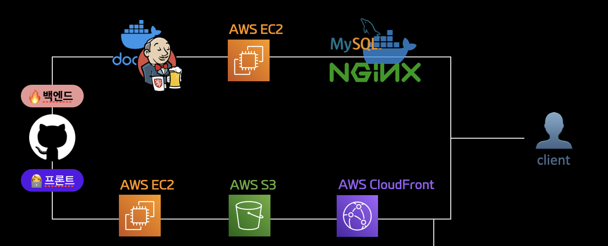

## 목차
- [CDN](#cdn)
  - [CDN이란?](#cdn이란)
  - [주절주절에서 CDN 사용 목적](#주절주절에서-cdn-사용-목적)
  - [참고자료](#참고자료)

# CDN

## CDN이란?

CDN(Content delivery network)은 말 그대로 컨텐츠를 전달해주는 네트워크이다. CDN 컨텐츠를 전달해주는 물리적인 서버가 사용자와 지리적으로 가까운 곳에 위치하여 전송속도를 높인다.  

CDN의 간단한 예시로는 한국에 있는 사용자가 미국에 있는 업체의 웹사이트를 보고 싶다고 가정을 하겠습니다. 이 웹사이트는 미국 LA에 호스팅 되어있는데 한국에서 미국 LA까지 요청을 보내어 웹사이트를 받아온다면 로딩시간은 엄청나게 길어질 것입니다. 따라서 CDN은 이러한 문제를 해결하기 위해 해당 웹사이트 컨텐츠를 캐싱하여 전세계 여러곳에 캐싱합니다. 따라서 사용자가 요청했을 때 지리적으로 가장 가까운 곳에서 컨텐츠를 받음으로써 지연시간을 줄일 수 있습니다.

CDN을 자체로 웹을 호스팅 할 수는 없다. 다만 웹의 컨텐츠를 캐싱하여 호스팅하는 웹을 대신하여 전송해서 웹의 성능을 개선한다.

## 주절주절에서 CDN 사용 목적

이번 주절주절 프로젝트에서는 Amazon CloudFront을 사용하여 CDN 서비스를 이용하였다.  
다만 앞서 얘기한 전송속도를 높이기 위해서 사용한 것은 아니다. S3 리소스에 접근할 때 보안적 이슈 때문에 직접 접근하지 못하지 못하는 이슈가 있었다. 따라서 CloudFront를 통해 S3에 우회하여 접근하기 위해 CDN을 사용하였다.  
(S3에는 프론트 서버와 이미지 파일이 저장되어있음)

## 참고자료
- https://www.akamai.com/ko/our-thinking/cdn/what-is-a-cdn