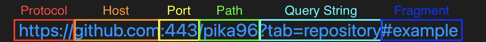
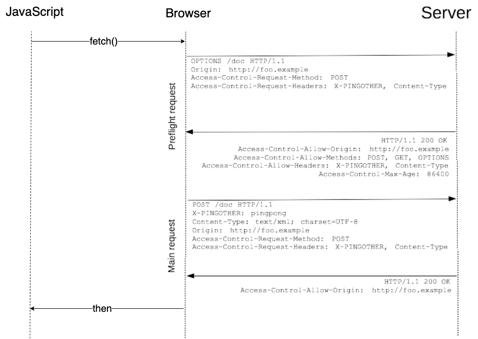
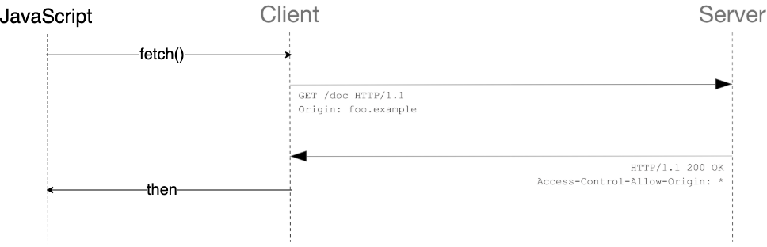

## 목차
- [CORS](#cors)
  - [CORS 나오게 된 배경](#cors-나오게-된-배경)
  - [출처(Origin)](#출처origin)
    - [예시](#예시)
  - [SOP(Same Origin Policy)](#sopsame-origin-policy)
  - [CORS (Cross Origin Resource Sharing)](#cors-cross-origin-resource-sharing)
    - [CORS 동작 시나리오](#cors-동작-시나리오)
  - [스프링에서 CORS 설정](#스프링에서-cors-설정)
    - [@CrossOrigin](#crossorigin)
    - [전역 설정](#전역-설정)
  - [미션 관련 이슈](#미션-관련-이슈)
  - [참고 자료](#참고-자료)

# CORS
프론트와 협업미션을 진행하면서 아래와 같은 에러를 만나보았다.


처음 보는 에러라 당황했는데 알고보니 되게 유명한, 그러니까 웹 개발자라면 필수로 알아야할 CORS 예외라고 한다.  
CORS(Cross-Origin Resource Sharing)는 직역하면 교차 출처 리소스 공유라고 해석이 된다. 사실 이 말만 들어서는 잘 모르겠다. 사실 뜻은 다른 출처 간의 리소스를 공유할 때 생기는 문제라고 한다. 한번 자세히 알아보자!

<br>

## CORS 나오게 된 배경
- 기존의 웹 생태계에서는 서버 사이드 랜더링(SSL) 방식을 사용하여, 하나의 도메인(출처)에서 모든 정보를 조합해 내보내는 방식을 사용했다.
- 허나, 웹 기술의 발전으로 단순히 문서를 제공하는 형태가 아닌 애플리케이션을 만들고, 자바 스크립트에서 비동기 요청이 가능하게 되었다.
  - ex) 날씨 위젯 API 서버
- 따라서 이러한 일을 처리하기 위해 하나의 도메인(같은 출처)가 아닌 여러 개의 서버(다른 출처)에 요청할 일이 생겼다.
- 무분별하게 다른 출처와 정보를 주고 받는 것은 위험하므로 다른 출처를 막는 SOP 정책이 등장하게 되었다.
- 하지만 다른 출처의 리소스는 사용하는 것은 필요하므로 이를 가능하게 해주는 CORS가 등장하게 되었다.

<br>

## 출처(Origin)


URL은 하나의 문자열처럼 보이지만 다음과 같이 세부적으로 나눌 수 있다.  
이 때, 출처는 Protocol, Host, Port까지 모두 합친 것을 의미한다. 참고로 포트는 http - :80, https - :443과 같이 기본 포트 번호가 정해져 있기 때문에 생략이 가능하다.  
이처럼 다른 출처라는 의미는 Protocol, Host, Port 셋 중 하나가 다르다는 것을 의미한다.

### 예시
__http://localhost와 동일 출처는?__

1. https://localhost
2. http://localhost:80
3. http://127.0.0.1
4. http://localhost/api/cors

정답은 2, 4번  
1번은 Protocol인 https, http이 다르다.
2번은 http 포트는 80번이고, 포트는 생략이 가능하므로 같은 출처이다.
3번은 실제로 127.0.0.1과 localhost는 같은 것을 뜻하지만, 웹 브라우저에서는 String value로 비교하기 때문에 다른 출처이다.
4번은 /api/cors가 추가되었지만, Protocal, Host, Port가 모두 같으므로 같은 출처라고 볼 수 있다.

<br>

## SOP(Same Origin Policy)
> 다른 출처의 리소스를 사용하는 것에 대한 제한 방식

SOP는 지난 2011년, RFC 6454에서 처음 등장한 보안 정책으로 말 그대로 “같은 출처에서만 리소스를 공유할 수 있다”라는 규칙을 가진 정책이다.  
하지만 다른 출처에서도 리소스를 공유해야할 일이 생기자, CORS 정책을 만들어 만약 해당 정책을 지킨다면 허용할 수 있도록 바뀌었다.

왜 SOP 같은 정책을 만들어 다른 출처의 리소스를 사용하는 것을 막아놓았을까?  
왜 이러한 불편한 정책으로 개발자들을 괴롭히는 것일까?

사실 다른 출처 간에 통신을 허용하게 되면 굉장히 위험한 상황이 발생하게 될 것이다.  
만약 SOP 정책이 없다고 가정해보자!  
예를 들어, 만약 해커가 사용자의 토큰을 가지고 자신의 스크립트를 이용하여 http://hacker.ck(다른 출처)로 요청한다면 해당 서버에서는 아무런 의심없이 요청 정보를 넘겨줄 것이다.  
그렇기 때문에 우리가 불편하게만 느껴졌던 SOP 정책이 필요한 것이다.

<br>

## CORS (Cross Origin Resource Sharing)
- 다른 출처의 접근 제한을 조건만 만족하면 접근할 수 있는 권한을 부여하는 정책  
- 다른 출처의 리소스를 불러오려면 올바른 CORS 응답을 받아야 한다.

### CORS 동작 시나리오
기본적으로 CORS는 3가지 시나리오로 동작한다.
- Preflight Request
- Simple Request
- Credentialed Request

__Preflight Request__

Preflight 요청은 본 요청을 보내기 전 예비 요청을 보내 CORS 권한을 확인한다.  
굳이 예비 요청을 만들어 서버에 2번 요청을 보내는 이유는 다음과 같다.
- 본 요청에 CORS 설정을 실어서 보낸다고 가정하자.
- 만약 CORS를 모르는 서버라면 모든 요청을 처리한 후 브라우저에게 CORS 에러를 보낼 것이다.
- 그렇게 되면 CORS를 받는 순간 에러를 처리하면 늦는다.
- Get이라면 다행이지만, Post, Delete 등 서버의 자원을 바꾸는 요청이라면 원래는 거부되어야 했을 동작이 이미 완료가 된 것이다.
- 이러한 이유로 먼저 예비 요청을 보내고 본 요청을 보낸다.



브라우저는 본 요청 전 예비 요청으로 HTTP 요청을 `OPTION` 메소드로 요청을 한다.
- `Access-Control-Request-Method` : 본 요청에서 어떠한 종류의 메서드를 사용할지 알려주는 속성(여기서는 Post)
- `Access-Control-Request-Headers` : 본 요청에서 어떤 Header를 사용할지 알려주는 속성(여기서는 X-PINGOTHER, Content-Type)

서버에서 Preflight 요청을 처리하게 되면 응답을 반환한다.
- `Access-Control-Allow-Origin` : 서버에 접근 가능한 출처
- `Access-Control-Allow-Method` : 서버에 접근 가능한 HTTP 메서드
- `Access-Control-Allow-Headers` : 서버에 접근 가능한 HTTP 헤더

__동작 순서__
1. 본 요청을 보내기 전 `OPTION` 메소드로 예비 요청을 보낸다.
2. 예비 요청에는 `Origin`, `Access-Control-Request-Method`, `Access-Control-Request-Headers`가 포함되어 있다.
3. 서버에서는 해당 요청을 받아 접근 가능한 Origin, Method, Headers를 반환한다.
  - 이 때 서버는 요청에 대한 값만 반환하지 CORS에 대한 부분을 판단하지 않는다.
  - CORS 허가는 서버에서 받은 요청으로부터 브라우저에서 판단한다.
  - 예비 요청에 대한 응답이 200(성공)으로 왔다고 해도, 여기서의 성공은 요청에 대한 성공이지, CORS에 대한 성공은 아니다.
  - 따라서 해당 요청이 성공하든 실패하든 (실패하면 당연히 CORS 실패), CORS에 대한 성공은 아직 알 수 없으며, 이는 브라우저에서 관리한다.
4. 브라우저는 서버로부터 받은 응답으로 CORS에 대한 판단을 한다.
5. 만약 CORS 문제가 발생하지 않으면 본 요청을 보내고, 문제가 발생하면 에러를 발생시킨다.

__Simple Request__  



Simple Request (단순 요청)은 Preflight 요청과 다르게 예비 요청을 보내지 않고 바로 서버에게 본 요청을 보낸다.

서버는 이에 대한 응답의 헤더에 Access-Control-Allow-Origin과 같은 값을 보내주면, 브라우저에서 CORS 정책 위반 여부를 검사하는 방식.

쉽게 보면, Preflight 요청과 Simple 요청의 시나리오는 예비 요청의 존재 유무만 다를 뿐 비슷하다.

단, Simple 요청은 3가지 조건을 충족해야한다.

1. 요청의 메소드는 `GET`, `HEAD`, `POST` 중 하나여야 한다.
2. `Accept`, `Accept-Language`, `Content-Language`, `Content-Type`, `DPR`, `Downlink`, `Save-Data`, `Viewport-Width`, `Width`를 제외한 헤더를 사용하면 안된다.
3. 만약 `Content-Type`를 사용하는 경우에는 `application/x-www-form-urlencoded`, `multipart/form-data`, `text/plain`만 허용된다.

사실 이 조건들은 생각보다 까다롭다..  
심지어 사용자 인증에 사용되는 `Authorization`부터 안된다.  
내가 생각하기에는 거의 사용되지 않을 것 같다! ~~뇌피셜~~

__Credentialed Request__  
인증 관련 헤더를 포함할 때 사용하는 요청이다.

클라이언트 측  
```java
fetch('https://github.com/pika96/TIL', {
  credentials: 'include', // Credentials 옵션 변경!
});
```
credentials : include

서버 측  
Access-Control-Allow-Credentials : true  
(Access-Control-Allow-Origin : * 는 안됨! 정확한 정보를 표기해주어야함!)

<br>

## 스프링에서 CORS 설정
간단하게 스프링에서 코드로 어떻게 CORS를 설정하는 지 알아보자.

### @CrossOrigin
```java
@RestController
@CrossOrigin(origins = "*", allowedHeaders = "*")
public class Controller {
}
```
- @CrossOrigin 애노테이션을 사용하여 해당 클래스 또는 메서드에 오는 요청에 대해 설정해줄 수 있다.

### 전역 설정
```java
public class Config implements WebMvcConfigurer {
    @Override
    public void addCorsMappings(CorsRegistry registry) {
        registry.addMapping("/**").allowedMethods("*").allowedOriginPatterns(allowOrigin);
    }
}
```
- `WebMvcConfigurer` 인터페이스를 사용하여 `addCorsMappings()` 메서드를 오버라이딩하여 설정해준다.
- 모든 Controller에 전역으로 설정해줄 수 있다.

## 미션 관련 이슈

지하철 노선도 미션을 진행하던 도중 CORS 설정을 해주었는데도 불구하고 `401 Unauthorized`가 발생했던 적이 있다. 사실 결론부터 말하자면 CORS와는 상관없지만 CORS 때문에 생긴 에러였다.  
코드는 다음과 같다.
```java
@Override
public boolean preHandle(HttpServletRequest request, HttpServletResponse response, Object handler) {

    if (request.getMethod().equals(HttpMethod.OPTIONS.name())) {
        return true;
    }

    String accessToken = request.getHeader("Authorization");

    if (accessToken == null) {
        throw new SubwayCustomException(AuthException.NOT_EXIST_TOKEN_EXCEPTION);
    }

    String extractor = AuthorizationExtractor.extract(request);
    if (!jwtTokenProvider.validateToken(extractor)) {
        throw new SubwayCustomException(AuthException.INVALID_TOKEN_EXCEPTION);
    }

    return true;
}
```
위의 코드는 인터셉터 중 preHandle 메서드이다. 로그인을 할 경우 토큰이 없거나 유효하지 않으면 preHandle에서 해당 요청을 끊어주게 된다.  
postman으로 할 때는 정상으로 작동했지만 실제 브라우저 환경에서는 에러가 나는 것을 확인하였다. 이는 preflight 요청 때문에 발생하였는데 먼저 보내는 예비 요청에 토큰이 없어서 발생한 문제였다. 따라서 예비 요청은 `OPTION` 메소드로 들어오기 때문에 preHandle에서 토큰이 없어도 `OPTION` 요청은 그냥 지나갈 수 있도록 true를 반환해주었다.

<br>

## 참고 자료
- https://evan-moon.github.io/2020/05/21/about-cors/
- https://developer.mozilla.org/ko/docs/Web/HTTP/CORS
- https://www.youtube.com/watch?v=yTzAjidyyqs
- https://www.youtube.com/watch?v=-2TgkKYmJt4&t=1237s
