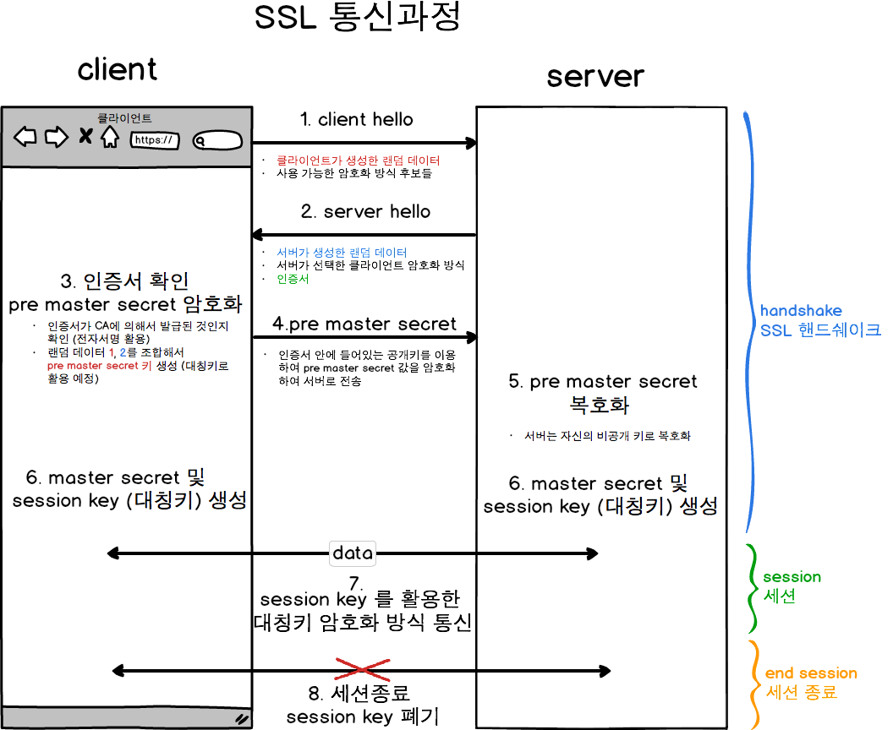

## 목차
- [HTTPS 동작원리](#https-동작원리)
  - [HTTPS란?](#https란)
  - [CA](#ca)
  - [SSL 동작 과정](#ssl-동작-과정)
  - [참고 자료](#참고-자료)

# HTTPS 동작원리

## HTTPS란?
> HTTPS는 SSL을 이용한 HTTP 통신 방식이다.

HTTP: Hyper Text Transfer Protocol
> HTTP는 말 그대로 Hyper Text를 전송하기 위해 만든 프로토콜이다.  
> 클라이언트와 서버 사이의 요청/응답 프로토콜이다.  
> HTTP는 암호화하지 않은 통신이기 때문에 취약하다.  
> 따라서 이것을 보완하기 위해 나온 것이 HTTPS

## CA
- CA(Certificate authority)
- __공인된 기관__ 에서 Server가 믿을 수 있는 서버인지 보증하는 SSL 인증서를 발급한다.

## SSL 동작 과정

1. Client Hello: 클라이언트가 먼저 서버에 접속한다.
   - 클라이언트(브라우저)가 사용할 암호화 기법
   - 클라이언트(브라우저)가 생성한 임의의 난수
   - 이전에 SSL 핸드셰이킹을 했다면, 기존의 세션을 세션을 재활용하기 위해 세션 키 전송
2. Server Hello: 서버는 클라이언트 요청에 응답하면서, 다음 정보를 제공한다.
   - 클라이언트가 사용 가능한 암호화 기법 중 서버가 지원하고 선택한 암호화 방식
   - 서버의 공개키가 담긴 SSL 인증서, 인증서는 CA의 비밀키로 암호화되어 발급된 상태
   - 서버가 생성한 임의의 난수
3. 인증서 검증 및 대칭키 생성
   - 클라이언트는 서버로부터 받은 인증서가 믿을만한(CA로 발급했는지) 인증서인지 확인하기위해 클라이언트에 저장된 CA의 공개키로 인증서 검증
   - 클라이언트는 클라이언트가 생성한 난수와 서버가 생성한 난수를 합쳐 pre master secret이라는 대칭키를 만든다.
   - pre master secret은 서버와 클라이언트 통신에서 암호화에 사용할 대칭키
4. pre master secret 대칭키를 서버에 전송한다.
   - 해당 대칭키는 서버의 공개키로 암호화하여 전송한다.
   - 서버의 공개키는 SSL 인증서에 들어있음
5. 서버 pre master secret 수신 및 복호화
   - 서버는 자신의 개인키로 pre master secret을 복호화해서 알아낸다.
6. master secret과 session key 생성
   - 서버와 클라이언트는 premaster secret -> master secret -> session key
   - 일련의 과정을 거쳐 client는 session key라는 공통 대칭키를 가지게 된다.
7. 대칭키를 통한 데이터 통신
   - 서버와 클라이언트는 대칭키를 통해 session key를 이용하여 데이터를 암호화해서 전송한다.
8. 세션 종료 및 session key 폐기
   - 데이터 전송이 끝나몀ㄴ SSL통신이 끝났음을 알려준다.
   - HTTPS 통신이 완료되는 시점에 서로에게 공유된 session key를 폐기

## 참고 자료
- https://velog.io/@moonyoung/HTTPS%EC%9D%98-%EC%9B%90%EB%A6%AC
- https://xrabcde.github.io/csstudy-https/