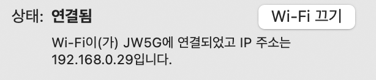
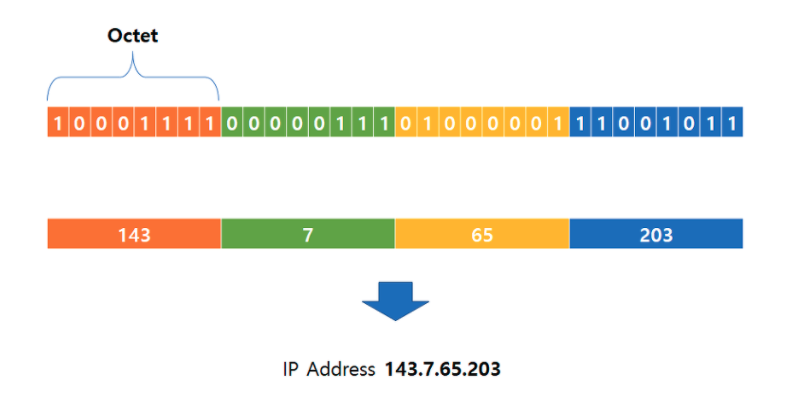
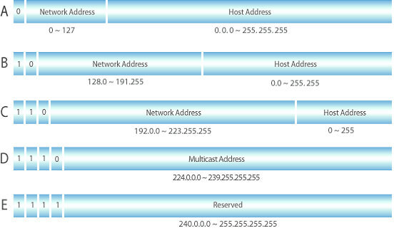

## 목차
- [IP 주소와 서브넷 마스크](#ip-주소와-서브넷-마스크)
  - [IP 주소](#ip-주소)
    - [IPv4](#ipv4)
  - [IP주소 클래스](#ip주소-클래스)
  - [네트워크 주소](#네트워크-주소)
  - [브로드 캐스트](#브로드-캐스트)
  - [게이트 웨이](#게이트-웨이)
  - [서브넷 마스크](#서브넷-마스크)
    - [서브네팅](#서브네팅)
    - [서브넷 마스크](#서브넷-마스크-1)
  - [참고 자료](#참고-자료)

# IP 주소와 서브넷 마스크

## IP 주소
> IP 주소  
> 네트워크 환경에서 컴퓨터간 통신을 하기 위해 각 컴퓨터에 부여된 네트워크 상 주소

그림에 보이는 __192.168.0.29__ 가 IP 주소이다

### IPv4
__192.168.0.29__ 는 IPv4 주소이다. IPv4 주소는 32비트 길이의 식별자로 0.0.0.0 ~ 255.255.255.255까지의 숫자 조합으로 이루어져있다.

> 참고  
> IPv6도 있다.  
> IPv6는 IPv4의 개수(약 43억개)가 고갈됨에 따라 확장시킨 IP 주소이다.

실제로 IP 주소는 32자리 2진수로 표현되어있다. 숫자가 255인 것도 2^8(0~255) 이기 때문이다.

IP 주소는 4개의 Octet으로 구성되어 있다.
하나의 Octet은 2진수로 구성되어있는데 이를 10진수로 표현한 것이 우리가 일반적으로 아는 IP 주소이다.

## IP주소 클래스
> IP 주소 클래스는 하나의 IP주소에서 네트워크 영역과 호스트 영역을 나누는 방법이다

IP 주소 클래스는 A, B, C, D, E 로 이루어져 있다.

A Class : 0 ~ 127 (0.0.0.0 ~ 127.255.255.255)  
B Class : 128 ~ 191 (128.0.0.0 ~ 191.255.255.255)  
C Class : 192 ~ 223 (192.0.0.0 ~ 223.255.255.255)  
D Class : 224 ~ 239 (224.0.0.0 ~ 239.255.255.255)  
E Class : 240 ~ 255 (240.0.0.0. ~ 255.255.255.255)  

하지만 일반적으로 A, B, C가 널리 쓰이며 D, E 클래스는 멀티캐스트용, 연구용으로 사용한다.

__A 클래스__
A 클래스는 하나의 네트워크가 가질 수 있는 호스트 수가 제일 많은 클래스이다.  
IP 주소를 32자리 2진수로 표현했을 때 맨 앞자리 수가 항상 0인 경우가 A 클래스이다.  
2진수: 0xxx xxxx. xxxx xxxx. xxxx xxxx. xxxx xxxx  
10진수: 0.0.0.0 ~ 127.255.255.255  
호스트는 x.0.0.0 ~ x.255.255.255 까지 가질 수 있다.(x는 네트워크, 네트워크와 브로드캐스트 주소 제외하면 -2)  

__B 클래스__
B 클래스는 IP 주소를 32자리 2진수로 표현 했을 때 10으로 시작한다.  
2진수: 10xx xxxx. xxxx xxxx. xxxx xxxx. xxxx xxxx  
10진수: 128.0.0.0 ~ 191.255.255.255
호스트는 x.x.0.0 ~ x.x.255.255 까지 가질 수 있다.(x는 네트워크, 네트워크와 브로드캐스트 주소 제외하면 -2)  

__C 클래스__
C 클래스는 IP 주소를 32자리 2진수로 표현 했을 때 110으로 시작한다.
2진수: 110x xxxx. xxxx xxxx. xxxx xxxx. xxxx xxxx  
10진수: 192.0.0.0 ~ 223.255.255.255
호스트는 x.x.x.0 ~ x.x.x.255 까지 가질 수 있다.(x는 네트워크, 네트워크와 브로드캐스트 주소 제외하면 -2)  

## 네트워크 주소
네트워크 주소란 일반적으로 하나의 네트워크를 통칭하기 위해 사용하는 주소이다.

C 클래스 하나로 특정 네트워크를 구성하려고 할 경우 네트워크 주소가 192.168.1.0 이라고 하면 이 네트워크에 속하는 주소들은 192.168.1.0부터 192.168.1.255까지가 이에 속하게 된다.  
일반적으로 네트워크 주소는 해당 네트워크의 맨 첫번째 IP 주소를 이용해 표시한다.

## 브로드 캐스트
브로드 캐스트주소란 특정 네트워크에 속하는 모든 호스트들이 듣게되는 주소이다. 네트워크와는 반대로 특정 네트워크의 맨 마지막 주소를 브로드캐스트 주소로 사용한다.  

C 클래스 하나로 특정 네트워크를 구성하였고 네트워크 주소가 192.168.2.0 이라고 한다면 브로드캐스트주소는 192.168.2.255가 된다.

## 게이트 웨이
게이트웨이란 서로 다른 네트워크를 연결해주는 역할을 하는 특정 장비나 특정 호스트를 의미한다. 가장 일반적으로 사용되는 장비로는 라우터이다.

## 서브넷 마스크

### 서브네팅
> 서브네팅이란 네트워크 관리자가 네트워크 성능을 향상시키기 위해, 자원을 효율적으로 분배하는 것  
> 자원을 효율적으로 분배한다는 것은 네트워크영역과 호스트 영역을 분할하는 것

__같은 네트워크 영역__
하나의 IP는 네트워크 + 호스트 부분으로 이루어져 있다. IP 끼리 통신하기 위해서는 네트워크 영역이 같아야하며, 호스트 IP는 달라야한다. 만약 다른 네트워크 영역과 통신하기 위해서는 라우터나 게이트웨이 같은 통신 장비를 통해 통신해야한다. 다만, 이러한 네트워크 장비 없이 통신할 수 있는 영역을 우리는 브로드 캐스트 도메인이라고 한다.  
예를 들어 192.168.0.3과 192.168.0.4를 보면 192.168.0은 네트워크 영역이고 3, 4는 호스트 IP 이다. 이를 해석하자면 192.168.0 이라는 네트워크 영역에서 서로 통신할 수 있는 3, 4가 존재한다고 생각하면 된다.

<!-- ### 서브넷 마스크
서브 네팅을 하기 위해서는 서브넷 마스크가 필요하다. 서브넷 마스크는  -->

기본 게이트웨이, 서브넷 마스크, 브로드 캐스트, 네트워크 주소 00000, 11111

## 참고 자료
- https://limkydev.tistory.com/168
- https://hyoje420.tistory.com/10
- https://zitto15.tistory.com/21
- https://limkydev.tistory.com/166