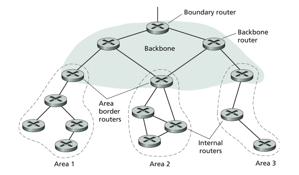

## 목차
- [라우터](#라우터)
  - [라우터란](#라우터란)
  - [라우터의 목적지 학습 방법](#라우터의-목적지-학습-방법)
  - [라우팅 프로토콜](#라우팅-프로토콜)
    - [RIP](#rip)
    - [OSPF](#ospf)
    - [BGP](#bgp)
  - [라우터의 동작방식](#라우터의-동작방식)
  - [라우팅 테이블](#라우팅-테이블)
  - [참고 자료](#참고-자료)

# 라우터

## 라우터란

라우터는 OSI 7계층에서 네트워크 계층에 포함되는 기기이다.  
논리적으로 분리된 망, 혹은 물리적으로 분리된 망 사이를 지나가야 하는 패킷들에게 경로를 뽑아 자기가 아는 최상의 경로를 찾아낸 뒤, 다른 망으로 패킷을 보내주는 역할을 하는 기계

> 라우팅  
> 패킷을 전송하기 위해 송신측에서 목적지까지의 경로를 정하고 정해진 경로를 따라 패킷을 전달하는 과정

 

## 라우터의 목적지 학습 방법

__Connected__
자신과 물리적으로 직접 연결되어 있는 장비의 IP 주소를 자동으로 알아온다. 이 때 IP는 네트워크 주소로 라우팅 테이블에 저장된다.  

__Static__
관리자가 직접 라우팅 경로를 선택해서 보내는 설정  
- 관리자가 데이터가 전송될 경로를 직접 설정하므로 경로관리에 가장 효율적이다.
- 라우터 추가, 변경, 회선 등 자동인지가 불가능하다.
- 네트워크 변화에 대한 대처가 느리다.
- 단일 경로에 적합하다.

__Dynamic__
각 라우터들이 갖고 있는 정보를 서로에게 공유하여 라우팅 테이블에 저장한다. 주시적으로 최적경로를 계산하여 라우팅 테이블의 정보를 유지하는 방식이다.  
- 네트워크 변화에 대한 대처가 빠르다.
- 프로토콜을 올리면 스스로 경로를 선택할 수 있도록 해준다.
- 다중 경로에 적합하며, RIP, IGRP, EIGRP, OSPF가 있다.
- 주기적으로 경로를 계산해야하므로 리소스 소비량(CPU 사용량)이 많아진다.

## 라우팅 프로토콜
> 라우팅 프로토콜은 패킷이 목적지까지 가는 방법을 결정해주는 프로토콜이다. RIP, OSPF, IGRP, BGP 등이 있다.

### RIP

> 등장 배경  
> RIP는 처음에 제록스사의 XNS에서 사용하기 위한 라우팅 프로토콜로 개발되었다. 후에 RIP는 BSD버전 UNIX의 TCP/IP 프로토콜 환경에서 "routed"라는 프로세스 형태로 구현되면서 일반에 널리 알려지게 되었으며, RFC 1058로 인터넷의 표준 라우팅 프로토콜로서 받아들여졌다.  
> RIP가 일반에 빠르게 적용될수 있었던 원인으로는 RIP가 가지고 있는 간단성과 견고함 때문인데, 당시의 인터넷 상황이 이와 같이 구현이 쉽고 견고한 라우팅 프로토콜의 등장을 요구했기 때문이다.

RIP에서는 거리값으로 각 경유 네트워크에 1이란 값을 부여하는데 이를 홉(Hop)이라고 한다. 즉 어떤 목적지까지의 홉이 2라면, 그 목적지까지 가기 위해서는 2개의 네트워크를 경유해야한다.  
RIP 프로토콜은 Hop 카운트가 가장 적은 경로를 택하여 라우팅하는 프로토콜로, Routing Table에 인접 라우터 정보를 저장하여 경로를 결정한다.  
RIP는 단순 htop을 Count 하여 경로를 결정하기 때문에 해당 경로의 네트워크 속도는 판단하지 않는다. 때문에 비효율적인 경로로 패킷을 전달할 가능성이 있다.

### OSPF
> 등장 배경  
> 1980년대 중반에 RIP가 더 이상 대규모의 이질적인 망 사이의 라우팅을 수행하기에는 한계에 이르자 IETF에서는 SPF 알고리즘에 기반한 인터넷에 적용하기 위한 IP 네트워크용 라우팅 알고리즘을 개발하게 되었고 이의 결과로 OSPF가 탄생하게 되었다.

OSPF는 최단 경로 우선 프로토콜이다. 최저 cost(최소 시간) 경로를 최적 라우팅 경로로 결정하는 것이다.

- 내부 라우터 (Internal Router)
  - 어떤 한 AREA에 속한 망에 직접 접속한 라우터를 말하며, 백본 망에 접속한 라우터도 이 범주에 속한다.
- AREA 경계 라우터 (Area Border Router)
  - AREA와 백몬 방을 연결시ㅕ주는 라우터를 말하며, 이 라우터는 접속된 AREA에 대한 경로 정보를 요약하여 백본 망에 전달하면 백본 망을 통해 이 정보가 다른 AREA 경계 라우터에게 분배된다.
- 백본 라우터 (Backbone Router)
  - 백본 망에 젖ㅂ속한 모든 라우터를 말하며, 여기에는 AREA 경계 라우터 및 백본 망에 속한 내부 라우터가 포함된다.
- AS 경계 라우터 (AS Boundary Router)
  - 다른 AS에 속한 라우터와 경로 정보를 주고 받는 라우터를 말하며, 이러한 경로 정보는 AS 외부 경로로서 전 AS에 전달된다. 이러한 AS 경계 라우터에 대한 경로는 AS에 속한 모든 라우터에 알려지게 된다.

OSPF는 HEELO 패킷을 보내 인접 라우터들을 찾는다. OSPF 라우터 간에 공유하는 라우터 ID를 통하여 헬로 패킷을 전송하게 되는데, 이 때 브로드캐스트가 아닌 멀티캐스트 주소로 전송한다.

### BGP

> 등장 배경  
> 도메인간의 라우팅 프로토콜로서 인터넷에서 초기에는 EGP가 사용되었다. 그러나 인터넷이 확장될수록 라우팅 순환이 생기는 등의 심각한 문제들이 발생하여 이를 해결하기 위해 BGP가 등장하게 되었으며, 현재에는 EGP가 BGP 혹은 IDRP로 대체되고 있는 상황이다.

BGP는 외부 라우팅 프로토콜(EGP)로 AS(관리 도메인)와 AS간 사용되는 라우팅 프로토콜이다. 정해진 정책에 의하여 최적 라우팅 경로를 수립하며, 경로 벡터 방식의 라우팅 프로토콜로 다른 IGP 보다 컨버전스는 느리지만 대용량의 라우팅 정보를 교환할 수 있는 프로토콜이다.

 

## 라우터의 동작방식
라우터는 패킷의 전송경로를 결정하기 위해 랜테이블, 네트워크테이블, 라우팅테이블을 사용한다. 라우터는 위의 3가지 테이블을 관리함으로써 다른 네트워크에 연결된 장치들을 비롯하여 네트워크에 연결된 모든 장치들의 주소를 인식하고 이것을 바탕으로 패킷의 전송경로를 결정한다.  
동일 네트워크 상에 있는 장치로 패킷을 보낼 때 라우터에서는 아래 순서를 매번 거친다.

1. 랜 테이블 검사를 한다. 이곳에서는 패캣의 목적지가 같은 네트워크에 있는지 아니면 다른 네트워크에 있는지를 확인한다.
2. 네트워크 테이블을 검사하여 패킷을 전달할 네트워크 주소를 찾아낸다.
3. 라우팅 테이블을 검색하여 가장 적합한 경로를 찾아내서 패킷을 보낸다.

- 랜테이블
  - 랜테이블은 라우터에 연결되어 있는 랜 세그먼트 내 장치의 주소를 관리하고 있으며 필터링작업에 사용된다.
- 네트워크 테이블
  - 네트워크상의 모든 라우터의 주소를 보관하며 패킷의 수신지 라우터를 식별하는데 사용된다.
- 라우팅 테이블
  - 각각의 라우터에 구축되어 있으며 각 경로에 대한 정보를 유지하고 있어서 다른 세그먼트로 전송되는 패킷의 가장 효율적인 경로를 결정하는데 사용된다.

__라우팅 구동 순서__
1. 전송받은 패킷의 헤더에 포함된 Destination Address와 Routing Table 내에 정보를 비교
2. Destination 네트워크까지 패킷을 확실히 전달하기 위해 자신이 가지고 있는 어떤 interface에서 패킷을 보내면 좋을까 판단
3. 만일 자신의 Routing Table에 일치하는 정보가 없을 경우, 패킷을 파기
- 가장 큰 전제조건은 Routing Table상의 목적지 정보가 있어야한다.
- Routing Table이 비어있다면 학습시켜야한다

## 라우팅 테이블

 

## 참고 자료
- https://namu.wiki/w/%EB%9D%BC%EC%9A%B0%ED%84%B0
- https://velog.io/@hidaehyunlee/IP-%EB%9D%BC%EC%9A%B0%ED%8C%85routing-%EB%8F%99%EC%9E%91-%EA%B3%BC%EC%A0%95
- https://mindstation.tistory.com/172
- https://m.blog.naver.com/PostView.naver?isHttpsRedirect=true&blogId=thescream&logNo=169756315